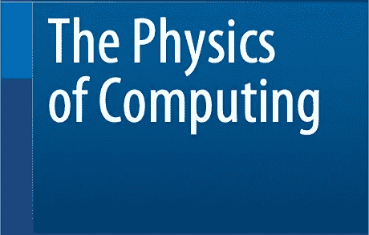
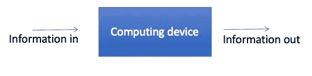
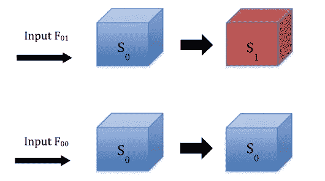

# 这就是为什么兰道尔是错的

> 原文：<https://medium.com/geekculture/thats-why-landauer-was-wrong-e663794e504e?source=collection_archive---------22----------------------->

(计算的物理学应该被重新考虑)

Rolf Landauer(1927–1999)在 1961 年发表了一篇论文，这篇论文深深地影响了计算社区，并将香农信息理论置于一个新的角度(R. Landauer，*计算过程中的耗散和发热*)。IBM 研发中心。 **5** ，183–191，1961)。

在这篇论文中，兰道尔通过使用信息的概念引入了应用于数字计算设备的*逻辑不可逆性*的概念。兰道尔写道:

"*如果一个设备的输出没有唯一定义输入*，我们称这个设备为逻辑不可逆设备。"

根据这个定义，计算设备理想地表示为输入-输出设备，一些逻辑值进入设备，一些逻辑值离开设备。

Figure 1

能够采用逻辑值的输入和输出端子的特征在于它们携带的信息量(见图 1)。典型地，它们在每个终端携带一个比特。作为一个例子，在一个普通的或门，我们有两个输入端和一个输出端，因此我们有两个位输入和一个位输出。在这种情况下，确保逻辑可逆性的必要条件是输入的数量不大于输出的数量。“或”门是典型的不可逆逻辑门，“与”、“与非”和“或非”也是如此。另一方面，非门(一个输入和一个输出)是一个逻辑可逆门，因为从输出端的逻辑状态总是有可能重建输入端的逻辑状态。

在同一篇文章中，兰道尔写道:

"*我们认为，展现逻辑不可逆性的设备对于计算是必不可少的*。"

从某种意义上说，是的，只要我们继续使用传统的逻辑门。然而，正如兰道尔和不久之后的查尔斯·贝内特(当时在 IBM)所展示的那样，所有的计算也可以由完全可逆的逻辑门完成。上世纪 80 年代初，爱德华·弗雷德金和托马索·托弗利已经提出了这种门的例子。

最后，兰道尔补充道:

*“我们认为，逻辑不可逆性反过来又意味着物理不可逆性，而后者又伴随着耗散效应。”*

毫无疑问，这是兰道尔正在宣称的最深远的结果。根据这种说法，一个逻辑上不可逆的装置在不消耗能量的情况下是无法进行物理操作的，因为耗散效应是不可避免的。Landauer 的信念源于这样一种想法，即输入和输出之间信息的减少，一种有时被称为“信息擦除”的操作，必然与体现这种装置的物理系统中物理熵的减少有关。

如果这种说法是正确的，它可能会对未来计算机的发展产生相关的后果，因为它为计算过程中需要消耗多少能量建立了非零下限，从而构成了制造越来越高效的计算机的潜在瓶颈。

逻辑不可逆和物理不可逆之间的联系一直是一个非常漫长和有争议的辩论的中心，没有摆脱误解和疏忽。我们认为，在这方面，兰道尔是错误的:逻辑不可逆并不意味着物理不可逆，为了明确这一点，我们做了一个实验，其结果已于 2016 年发表(M.López Suárez，I.Neri，L.Gammaitoni，Sub-kbt micro-electro mechanical reversible logic gate。纳特。Commun。7、12068、2016)。实验表明，用机械悬臂梁制成的逻辑不可逆门可以在室温下工作，损耗可以忽略不计，并且远低于预期的朗道极限。

此外，我们观察到，尽管在信息论框架中非常流行，但是 Landauer 采用的概念方法与根据热力学建立的计算设备的典型物理模型没有直接联系。

Figure 2

事实上，计算是给定物理系统在外力作用下状态变化的结果(见图 2)。根据 Landauer 的说法，承载信息的自由度由系统的状态 Si 和输入力来表示，而在热力学图中，熵(即状态变量)的变化只与系统本身相关，力不考虑任何熵贡献。

虽然香农信息和吉布斯熵具有相同的形式方面，但它们并不相同。第一个是与消息概率相关的数学量，而第二个与物理系统中微观状态的概率相关。虽然前者与消息的物理性质无关，但后者是物理系统本身性质的直接结果。因此，根据热力学第二原理，吉布斯熵与能量交换的方式有关，而香农信息与此无关，这样的结论似乎很自然。

> 进一步的细节，请查看:L. Gammaitoni，计算物理学，Springer，2021。国际标准书号:978–3–030–87108–6