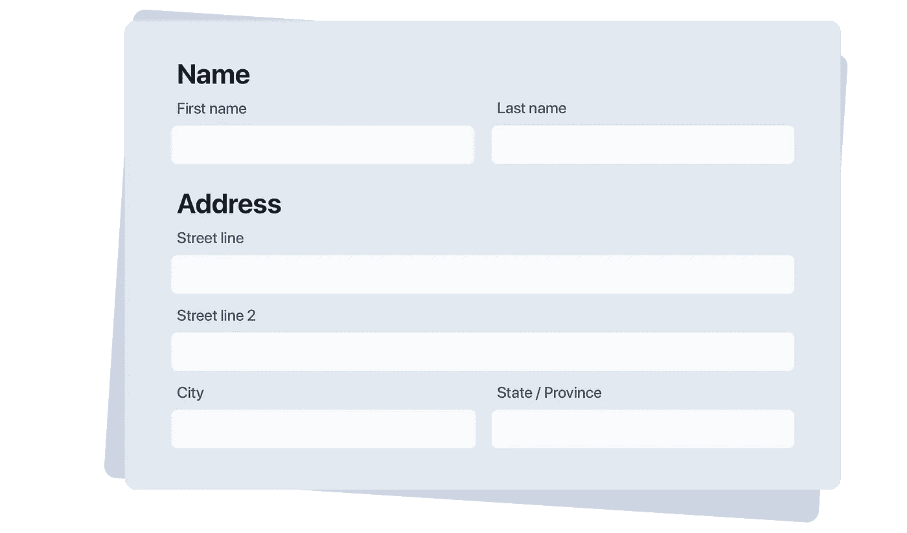

# React 中管理表单的最佳设计模式

> 原文：<https://medium.com/geekculture/the-1-best-design-pattern-for-managing-forms-in-react-87ae825c98f4?source=collection_archive---------0----------------------->

## 反应设计模式

## 以及这种设计模式如何减少开发时间&让混乱的表单成为过去。

Ughh…为什么 React 中的表单代码总是变得如此混乱？