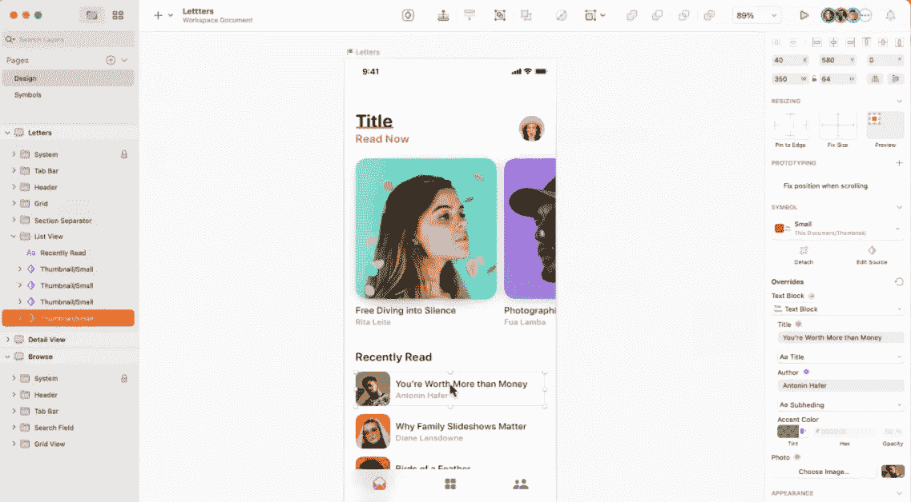
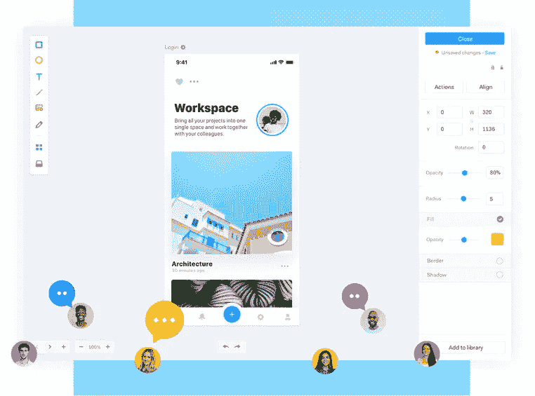
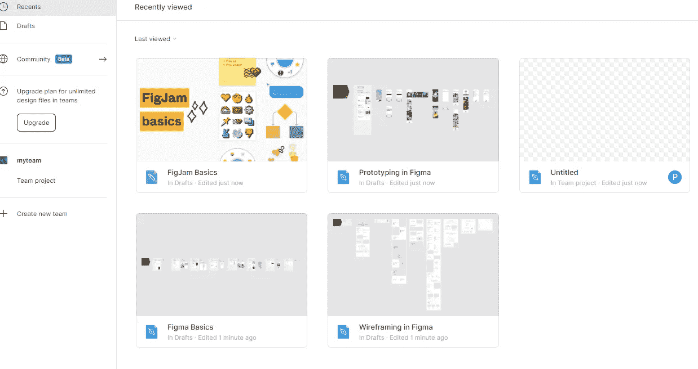
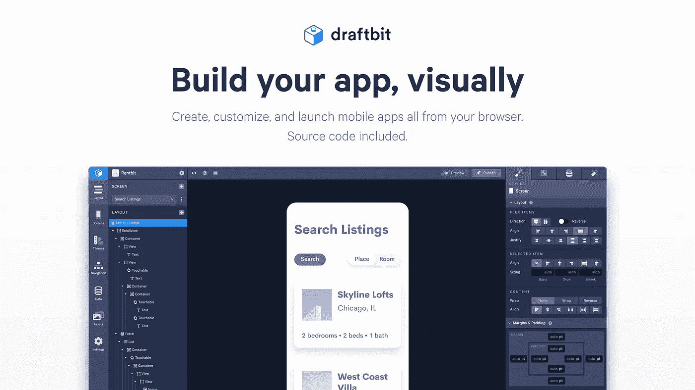
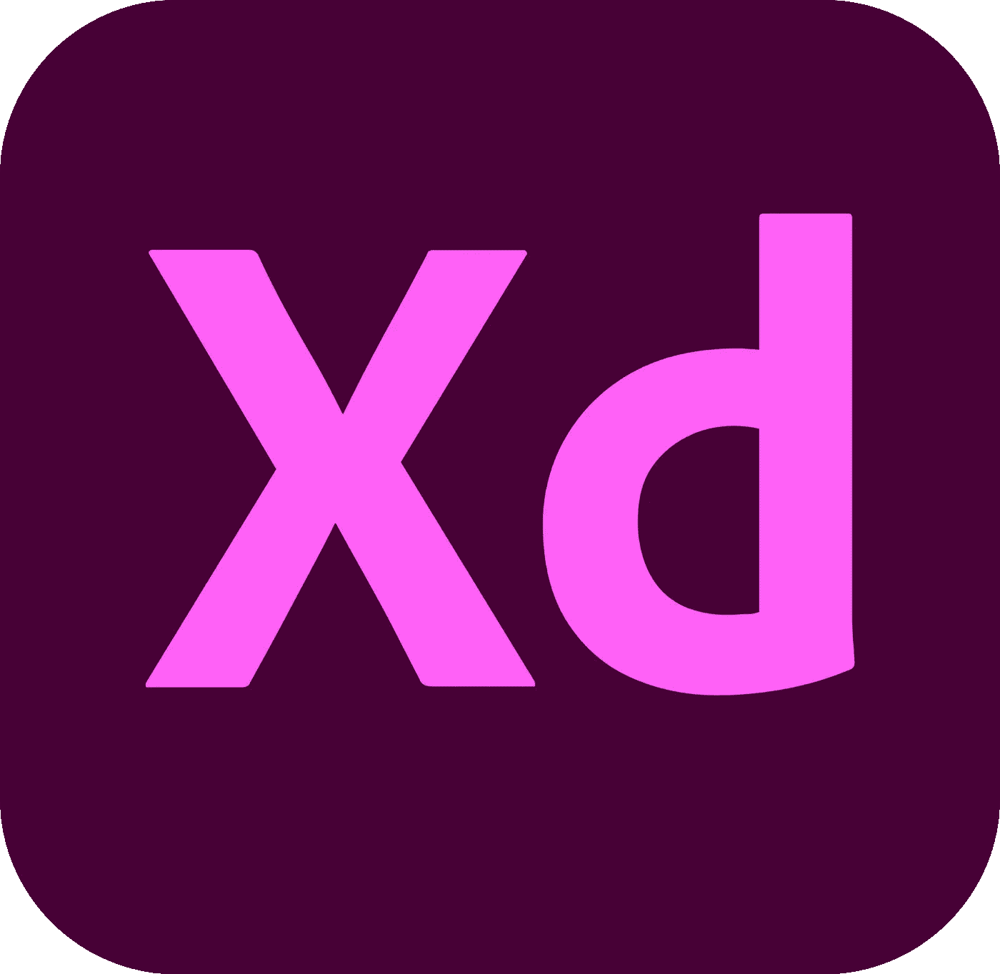
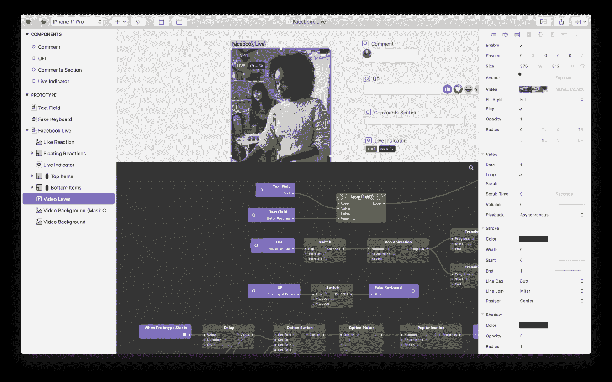
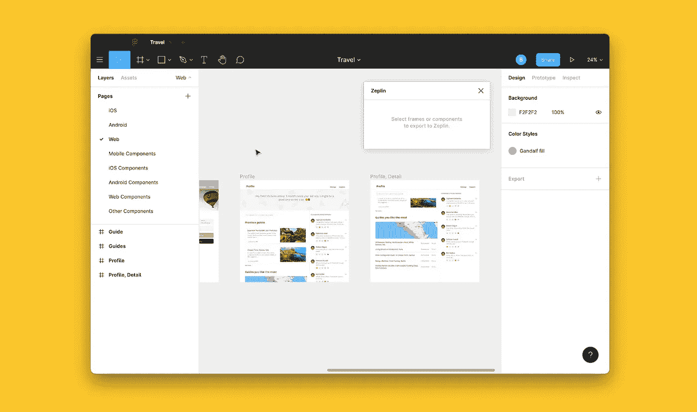
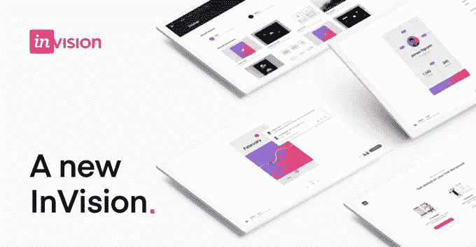
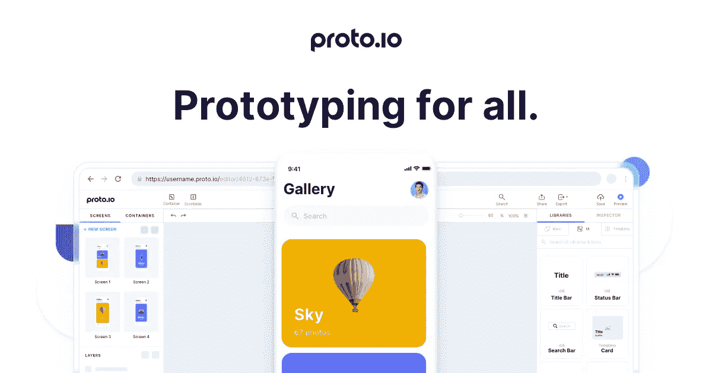
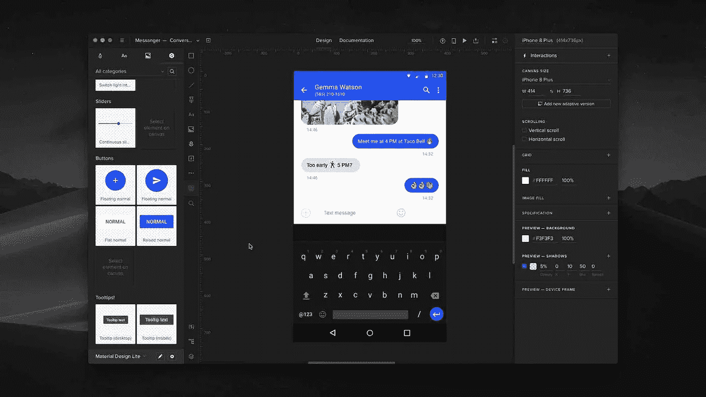

# 2021 年移动应用开发者的 10 大最佳设计工具

> 原文：<https://medium.com/geekculture/the-10-best-design-tools-for-mobile-app-creators-in-2021-7624b35fb567?source=collection_archive---------12----------------------->

如今，由于全球移动应用的快速增长，对移动应用有着巨大的需求。有许多移动应用程序可以执行几乎任何任务。然而，并不是每个应用都能得到用户应有的关注。让你的移动应用程序获得大量下载的秘密是拥有引人注目的设计、效率和与许多平台的兼容性。

UI 设计是移动应用程序开发项目的主要阶段之一，移动设计人员通常使用原型设计。移动应用程序设计工具在行业中获得了巨大的欢迎，因为设计师可以从正确的工具中受益，以加快 UI 设计任务。它们为应用程序开发人员提供了许多功能，可以更快、更容易地设计直观的用户界面。

本文将讨论 2021 年创建移动应用的一些最佳设计工具。我们将讨论它们的可视化设计特性、对定制的支持以及集成。最后，我们将了解每种工具的定价计划。

# 1.素描

[Sketch](https://www.sketch.com/) 是一款优秀的基于矢量的设计工具，专为 Macbooks 的现代 app 设计而开发。Sketch 作为一种设计工具的优势之一是其用户友好的布局，即使是新手应用程序设计者也能很快上手。

Sketch 的可定制网格和调整大小工具允许您缩放设计以适合您的屏幕。此外，Sketch 允许您通过创建可重用的组件来扩展您的应用程序设计。它的智能布局允许你自动调整大小以适应他们的内容。您可以在组件视图中查看您的所有组件，这使您可以在一个地方组织所有内容。

Sketch 支持实时协作和与他人共享您的作品。关于 Sketch 的一个很酷的事情是，它有助于创建可以在合作者之间共享的设计组件库。它还附带了许多插件和集成，让您可以构建更强大的移动应用程序。

# 定价

*   入门——每个编辑每月 9 美元，30 天免费试用
*   商业-只提供按年计费，需要至少 25 名编辑

# 2.漫威应用程序

如果你想快速构建一个手机应用程序的原型并与他人分享，漫威应用程序将是一个不错的选择。它允许您从其他设计平台(如 Sketch、Photoshop 和 illustrator)同步设计，并支持各种屏幕，如桌面、iPhone、iPad、Apple TV、Apple Watch 和 Android 设备。

该工具提供了几个设计特性，如内置交互以添加逼真的动画、创建组件、嵌入视频等。此外，它还提供对数百万张库存照片和其他流行集成的访问，如 Dropbox Paper、微软团队、YouTube 和 Atlassian 吉拉，以更快地构建优秀的应用程序。

# 定价

*   免费订阅
*   大约每月 12 美元，按年计费
*   团队—每月 42 美元，按年计费

# 3.菲格玛

Figma 是一款基于浏览器的设计工具，类似于 Sketch，可以很好地与大多数网络浏览器和平台兼容，包括 MacBooks、Windows PCs、Linux，甚至 Chromebooks。像许多其他工具一样，Figma 也支持协作设计，由于其有用的协作编辑特性，这要容易得多。它提供了一个完全可定制的移动 UI 套件来简化您的设计工作流程。

Figma 的一个很酷的地方是它的在线白板，允许设计师添加便签和进行在线设计演示。其可搜索和可共享的资产帮助您构建可重用的设计库和组件，以增强整个应用程序的设计一致性。Figma 支持与第三方平台的多种集成。还有几个 Figma 附加组件，如 Atlassian 的 JIRAs' [Figma 附加组件](https://marketplace.atlassian.com/vendors/1214930/figma)，它使开发人员、质量工程师和产品负责人能够与设计师的模型保持同步。

# 定价

免费订阅

专业-每个编辑 12 美元，按年计费或每月 15 美元

团队——每位编辑每年收费 45 美元，或每月 15 美元

# 4.Draftbit

[Draftbit](https://draftbit.com/) 是一款基于浏览器的可视化开发工具，提供了一个为 iOS 和 Android 构建原生移动应用的平台。它集成了许多可视化设计功能，并提供了许多 UI 组件来从头开始设计任何移动应用程序。此外，它提供了构建您自己的组件并在整个应用程序中重用它们的灵活性。在你构建的时候，Draftbit 会创建开源代码，你可以完全下载。你可以将 Draftbit 视为设计者和代码之间的桥梁，而不是纯粹的设计工具。

Draftbit 提供移动应用的实时预览，支持一系列定制，包括使用定制源代码的能力。Draftbit 最好的 UI 设计特性之一是复杂的导航器，你可以用选项卡和屏幕堆栈来构建。这个工具允许协作设计。此外，它使您能够连接外部数据库，集成第三方平台，并快速将构建的应用程序部署到 web 上。

# 定价

*   入门——每月 19 美元，14 天免费试用
*   专业——每月 99 美元
*   企业—定制价格，具有许多高级功能

# 5.Adobe 体验设计(XD)

Adobe XD 是一个直观的设计工具，提供了许多独特的功能来设计 iOS 应用程序。它有一个优秀的用户友好的用户界面，帮助新手手机设计师快速掌握东西。此外，它还支持设计 3d 应用程序，让你可以在空间中移动和旋转物体。此工具还允许您创建组件，并使用状态在所有设计中即时应用对这些组件的更改。

重复网格是 Adobe XD 的另一个直观而有用的设计功能，它将一个元素变成一组重复的组件。因此，为你的移动应用程序设计照片库和产品列表等功能非常快速和简单。

最重要的是，Adobe XD 允许您从 Illustrator、Photoshop 和 Sketch 导入设计和图形。它提供了几个 UI 套件，包括用于 iOS、iPad、macOS 和 watchOS 的 Apple UI 设计，您可以使用它们来启动您的设计。

# 定价

*   免费试用
*   XD 单一应用——每月 13.14 美元
*   所有应用——每月 69.72 美元

# 6.折纸工作室 3

[Origami Studio 3](https://origami.design/) 是一款来自脸书的免费设计工具，可以用来创建快速直观的移动应用程序设计。Origami 3 是这个工具的最新版本，它包含了几个有用的功能。它允许你从 Photoshop、Figma 和 Sketch 等其他工具导入设计，并构建原生的 iOS 和 Android 应用。您可以使用它的画布来构建带有交互的动态布局，并且可以进一步将其与补丁编辑器相结合来构建更强大的交互。

Origami Studio 3 的最佳功能之一是照片库，它使您能够从 iPhone 的相机胶卷或 macOS 上的照片库中检索图像和视频，以创建基于照片的布局。音频计量是另一个很酷的功能，可以让你从音乐或视频中创建可视化效果。您可以访问陀螺仪信息来创建设备运动，它还允许您访问 GPS 数据来添加地图功能。

# 定价

自由的

# 7.泽普林

[Zeplin](https://zeplin.io/) 是另一款协作设计工具，具有用户友好和量身定制的布局，用于设计 iOS 和 Android 应用。它的全局样式指南允许您在一个集中的位置用颜色、文本样式和组件来组织您的设计。

该工具允许您将 Figma、Sketch、Adobe XD 和 Photoshop 中的最终设计导入 Zeplin，并在设计师进行设计时为开发人员锁定设计。您还可以与 Slack、吉拉、Teams、VS Code 和 Trello 等平台集成，实现更强大的协作设计。这种协作性使得 Zeplin 可以被所有参与移动应用开发的成员访问，包括产品经理、质量工程师等非设计人员。，并在设计过程中获得他们的即时反馈。

# 定价

*   免费计划
*   团队——12 个项目每月 6 美元
*   组织——每月 12 美元，无限制项目
*   企业—定制价格

# 8.视觉

[InVision](https://www.invisionapp.com/) 是另一个强大的工具，它为设计移动应用原型提供了一个非常有吸引力的现代设计布局。它有几个设计特点，如热点，互动，动画，过渡等。，让你在几分钟内设计出一款手机 app。像许多其他设计工具一样，它也允许您从其他工具(如 Sketch 和 Photoshop)导入工作。

InVision 还因其出色的协作设计功能而广受欢迎，它使设计师能够集思广益，集思广益。InVision Design System Manager 是连接设计和代码的组件，设计人员可以通过直观的设计更智能地工作。

# 定价

*   免费计划
*   专业版——每月 7.95 美元
*   企业—定制价格

# 9.原始 io

[Proto.io](https://proto.io/) 由于其易于使用的设计特点，对于初学者来说是一个很好的设计工具。它让设计者无需编码就可以将组件拖放到界面上。此外，它还提供了 250 多个 UI 组件、1000 多个可定制的模板以及大量的动画图标、图像和声音效果。

这个工具的一个很酷的设计特性是微型动画来构建小动画，这让你可以设计具有不同效果的高级动画。它还允许您从 Photoshop、Adobe XD 和 Sketch 导入设计，并且它的注释功能使您能够在设计时获得反馈。

# 定价

价格是每月和每年支付

*   自由职业者——24 美元
*   创业——40 美元
*   代理-80 美元
*   公司——160 美元

# 10.UXPin

[UXPin](https://www.uxpin.com/) 是另一款 UI 设计和原型制作工具，它提供了构建生产就绪的移动应用设计所需的一切。如果使用草图，可以将草图设计导入 UXPin。UXPin mirror 可让您通过扫描二维码在移动设备上轻松预览您的设计，无需通过 USB 连接或使用 Wi-Fi。

UXPin 还通过提供设计共享和反馈收集工具来支持简单的协作。UXPin 的组件库允许您创建一组颜色、样式和资源，其合并技术允许使用不同版本的设计元素进行设计。

# 定价

每个计划包括一个免费试用，每个编辑和每月。

UXPin 合并

*   创业——112 美元
*   公司-149 美元
*   企业合并—自定义价格

UXPin 标准

*   基本-24 美元
*   高级-39 美元
*   专业——83 美元
*   企业—定制价格

# 结论

上面描述的移动应用程序设计工具附带了几个有用的功能，使应用程序设计人员的生活更加轻松。几乎所有这些都支持协作设计、从其他平台导入设计以及许多第三方集成。然而，在选择最适合您需求的工具时，首先了解您的需求是非常重要的。