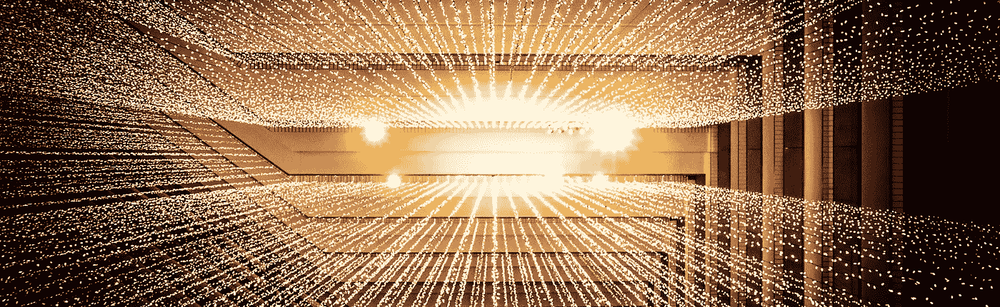

# 互联网的 13 个主服务器

> 原文：<https://medium.com/geekculture/the-13-master-servers-of-internet-97c4bb800943?source=collection_archive---------7----------------------->

## 互联网真正依靠 13 台服务器。怎么可能呢？

Photo by [Joshua Sortino](https://unsplash.com/@sortino?utm_source=unsplash&utm_medium=referral&utm_content=creditCopyText) on [Unsplash](https://unsplash.com/images/nature/earth?utm_source=unsplash&utm_medium=referral&utm_content=creditCopyText)

这是几年前我问自己的一个问题:是否有像“主服务器”这样的东西控制着整个互联网？这是一个典型的问题，不是每个人都会问，但是我们都想知道答案和解释。尤其是当答案是**是**的时候。