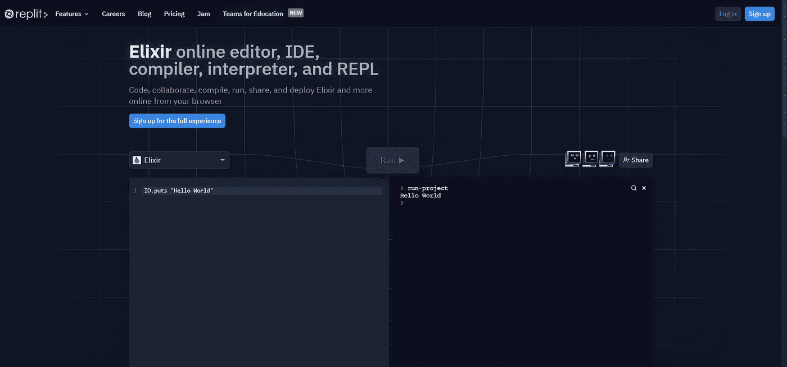

# 你需要阅读 80%的灵丹妙药代码的 20%的灵丹妙药语法。

> 原文：<https://medium.com/geekculture/the-20-of-elixir-syntax-you-need-to-read-80-of-elixir-code-30d827eab939?source=collection_archive---------4----------------------->

> 最常见的灵丹妙药语法的快速备忘单。

这是一个使用帕累托法则(80/20 法则)来处理你将会遇到的最常见的灵丹妙药语法的简要指南。如果你想要一个速成班或快速复习常见的灵丹妙药的概念，那么这篇文章是给你的。

# 长生不老药

> Elixir 是一种动态的函数式语言，用于构建可伸缩和可维护的应用程序。
> 
> Elixir 利用 Erlang VM，该 VM 以运行低延迟、分布式和容错系统而闻名。Elixir 已成功应用于 web 开发、嵌入式软件、数据接收和多媒体处理等多个行业。
> 
> [——https://elixir-lang.org/](https://elixir-lang.org/)

# 长生不老药入门

如果您已经知道如何运行酏剂代码，请跳过这一节，转到数据类型。

通过执行以下命令，您可以选择使用 Repl(一个在线代码编辑器)来运行 elixir。ex 文件或交互式 Elixir (iex)环境中。

## 使用 Repl

如果您想快速开始使用 elixir，您可以使用网站在基于 web 的代码编辑器中运行 Elixir 代码。

*   打开[药剂回复](https://replit.com/languages/elixir)
*   通过在编辑器中键入以下内容并按 Run，确保它能够正常工作。

```
IO.puts “Hello World”
```

它应该是这样的:



## 在你的电脑上运行仙丹

您也可以将 elixir 安装到您的计算机上，然后运行 Elixir 文件(。ex)直接。

*   [如果你还没有长生不老药的话，安装它](https://elixir-lang.org/install.html)
*   创建一个名为 test.ex 的新文件
*   在文件中写入以下内容:

```
IO.puts “Hello World”
```

*   在您的终端文件夹中放入您的文件，运行

```
elixir test.ex
```

您可能使用了不同的编辑器，但它应该是这样的:


## 使用交互式 Elixir (iex)环境。

您可以打开交互式 Elixir 环境来试验 Elixir 代码。你的机器上必须已经安装了[药剂](https://elixir-lang.org/install.html)。

在 Mac 和 Linux 上运行:

```
# On Mac and Linux run:
iex
# On Windows run:
iex.bat
```

# 数据类型

在 Elixir 中，通常会遇到以下数据类型:

# 变量

变量允许您存储在整个应用程序中引用的数据。在 Elixir 中，可以这样定义变量:

```
my_integer = 4
my_float = 4.0
my_string = "Hello"
```

Elixir 中的变量使用 snake_case。变量可以存储任何数据类型；它不限于上面的例子。

# 评论

酏剂使用中的注释#。仙丹没有多行评论。

```
# comments can be on their own line
5 + 5 # or after your code on the same line.
# but not before, because everything after the # is a comment 5 + 5
```

# 线

elixir 中的字符串是写在双引号""之间的一系列 Unicode 字符。

## 在字符串中写双引号

您可以使用反斜杠\

```
"a string with \"double quotes\""
```

## 字符串串联(添加字符串)

```
"Brooklin" <> " " <> "Myers" # "Brooklin Myers"
```

## 字符串插值

可以使用#{}在字符串内部执行仙丹代码。

```
name = "Brooklin"
"Hi #{name}" # Hi Brooklin
"What is 5 + 4? #{5 + 4}." # What is 5 + 4? 9.
```

## [字符串模块](https://hexdocs.pm/elixir/1.12/String.html#content)

您可以使用内置的[字符串](https://hexdocs.pm/elixir/1.12/String.html#content)模块访问与字符串相关的功能。

# 整数和浮点

Elixir 提供了多种机制来操作整数和浮点数。

## 算术运算符

算术运算符允许你操作数字。

```
# plus (+)
5 + 5 # 10
# minus (-)
5 - 5 # 0
# multiply (*)
5 * 5 # 25
# divide (/)
5 / 5 # 1
```

## 整数函数

Elixir 提供了 rem 和 div 函数来处理整数除法和余数。

```
rem(5, 4) # 1
rem(10, 6) # 4
div(3, 2) # 1 (normally 1.5 with divide /)
div(1, 2) # 0 (normally 0.5 with divide /)
div(8, 3) # 2 (normally 2.6666 with divide /)
```

# 布尔运算

布尔值是真/假值。

## 和，或者，不是

仅用于比较布尔值:

```
true and true # true
true and false # false
true or false # true
false or false # false
false or not false # true
true and not true # false
```

# 比较运算符

比较运算符用于比较值。它们通常用于比较整数和浮点数，但也可以用于比较其他数据类型以进行排序。

## 正好等于===

```
5 === 5   # true
5 === 5.0 # false
4 === 5   # false
4 === "4" # false
```

## 等于==

```
5 == 5   # true
5 == 5.0 # true
4 == "4" # false, equals still checks type unlike some languages.
```

## 不完全相等！==

```
5 !== 5   # false
5 !== 5.0 # true
4 !== 5   # true
```

## 不等于！=

```
5 != 5   # false
5 != 5.0 # false
5 != 4   # true
```

## 大于>

```
4 > 5 # false
5 > 5 # false
6 > 5 # true
```

## 不到<

```
4 < 5 # true
5 < 5 # false
6 < 5 # false
```

## greater than or equal (> =)

```
4 >= 5 # false
5 >= 5 # true
6 >= 5 # true
```

## 小于或等于≤

```
4 <= 5 # true
5 <= 5 # true
6 <= 5 # false
```

## 值比较:or (||)，and (&&)，not(！)

您可以用它来比较任何数据类型。除了 false 和 nil 之外的任何值都将被评估为 true。这意味着即使是 0 也将被评估为真。重要的是要记住返回值不是布尔值。返回值是评估的实际值。

```
1 && 1           # 1
1 && false       # false
1 || false       # 1
nil || false     # false
false || !nil    # true
1 && "hey"       # "hey"
"hey" && 1       # 1
"hey" || "hello" # "hey"
```

# 原子

原子是常量，其值是它们自己的名字。它们通常用于表示对您的应用程序很重要的不同值。它们通常用于处理操作的状态，例如:ok 和:error。

```
:ok
```

真、假和零都是原子，Elixir 允许您跳过前导冒号(:)。

```
:true === true   # true
:false === false # true
:nil === nil     # true
```

# 目录

Elixir 中的列表是作为链表实现的。链表以选定的顺序保存零个、一个或多个元素。

## 用++和-加减列表

## [列表模块](https://hexdocs.pm/elixir/1.12/List.html#content)

您可以使用内置的[列表](https://hexdocs.pm/elixir/1.12/List.html#content)模块访问与列表相关的功能。

灵药列表是链表，所以可以访问头部(列表的第一个元素)和尾部(列表的其余部分)

# 元组

当您希望存储固定数量的元素时，请使用元组。当您想要循环访问元素时，不要使用元组，因为它不支持枚举操作。

元组的一个常见用途是以预期的顺序存储已知的值。例如，您可能有一个用户{姓名、年龄、城市}的元组

```
{"Brooklin", 23, "Montreal"}
```

## [元组模块](https://hexdocs.pm/elixir/1.12/Tuple.html#content)

您可以使用内置的[元组](https://hexdocs.pm/elixir/1.12/Tuple.html#content)模块来访问元组相关的功能。

# 地图

映射是 Elixir 中的一种键值数据结构。与键值列表不同，映射中的键必须是唯一的。

## 点符号

您可以使用点符号来访问地图值。

```
my_map = %{"key" => "value"}
my_map.key # value
```

点符号会抛出非现有键错误

```
map.non_existing_key **** (KeyError) key :non_existing_key not found in: %{"key" => "value"}**
```

## [地图模块](https://hexdocs.pm/elixir/1.12/Map.html#content)

您可以使用内置的[地图](https://hexdocs.pm/elixir/1.12/Map.html#content)模块访问地图相关功能。

例如，您可以通过使用 Map.get 来避免上面的 non_existing_key 错误:

## 地图更新语法

您可以使用特殊的语法来更新映射键。您只能更新现有的密钥。

# [Enum 模块](https://hexdocs.pm/elixir/1.12/Enum.html#content)

当迭代数据(通常是列表)时，可以使用 Elixir 提供的[枚举模块](https://hexdocs.pm/elixir/1.12/Enum.html#content)。列表、范围和映射都与[枚举模块](https://hexdocs.pm/elixir/1.12/Enum.html#content)一起工作。

# 条件语句

条件语句用于应用程序中的分支逻辑。

## if/else

## 除非/否则

## 第三的

三元组是 if/else 语句的简便速记。

## 情况

case 接受一个值，并根据该值在 case 语句中执行不同的路径。将其他语言中的 case 语句与 switch-case 语句联系起来可能会有所帮助。

## case 语句中的变量

您可以使用变量来表示 case 参数中的值。参见本例中的 n:

## cond

cond 执行第一个真条件的代码。这很像 case，除了不是计算单个值并执行与该值匹配的路径，而是可以定义各种条件，这使得这个条件语句更加通用，但可能会牺牲清晰度。

# 模块和功能

模块提供了一种组织程序行为的方法。例如，您可能有一个带有 say_hello 函数的问候模块来返回“hello”。

## 如何创建模块和函数

你会注意到模块是大写的，函数是 snake_case。

## 调用函数

```
Greeting.say_hello() # Hello
```

## 从同一个模块内部调用函数

从同一个模块内部调用函数时，不必引用该模块。所以 Greeting.say_hello 变成了 say_hello。

## 不同参数的函数

Elixir 的一个非常酷的特性是将两个同名但参数不同的函数视为两个不同的函数。例如，Greeting.say_hello 函数可以称为 say_hello/0。0，因为它没有任何参数。

## 返回布尔值的函数应以问号(？)

## 默认参数

Elixir 支持使用\\

## 括号是可选的

当你认为括号增加了代码的清晰性时，就使用它，否则就不要使用它！

## 使用 when 处理带上下文的函数

你可以用 when 语法来表示在特定条件下应该发生什么。

函数的顺序很重要，因为第一个为真的函数总是先运行。这里有一个当与错误的函数顺序一起使用时的例子。

# 重用模块

Elixir 提供了在项目中重用模块的指令。

需要注意的是，Elixir 是一种编译语言。通常使用名为 [mix](https://elixir-lang.org/getting-started/mix-otp/introduction-to-mix.html) 的工具进行编译。所以不像 Javascript 或 Ruby 这样的语言，你不需要将一个文件导入到另一个文件中。相反，模块是一起编译的，可以从任何。项目中的 ex 文件。

## 别名

别名允许您将一个模块导入到另一个模块中，并使用不同的名称访问它。这通常用于更方便地访问嵌套模块。

## 进口

导入用于方便地访问其他模块的功能。

例如，下面是如何从 IO 模块访问 puts/1 函数。

## 使用

使用允许您将功能从一个模块注入到另一个模块中。

最初，您最常使用…使用…😅使用第三方的模块。例如，要用 ExUnit 框架编写测试，您将使用 ExUnit。案例模块

使用是一个相当复杂的话题，如果你在早期就能从表面上理解它就足够了。如需进一步阅读，请参见[精英学校使用指南](https://elixirschool.com/en/lessons/basics/modules/#use)或[阅读文档](https://elixir-lang.org/getting-started/alias-require-and-import.html#use)。

# 管

Elixir 允许您使用管道语法(| >)将函数的返回值传递给另一个函数

# 模式匹配

在 Elixir 中，=符号被称为匹配运算符。它对简单值的赋值很有用，也可以析构更复杂的数据类型。

```
{name, age, city} = {"Brooklin", 23, "Montreal"} # using a tuple
[a, b, c] = [1, 2, 3] # using a list
[head | tail] = [1, 2, 3] # you saw this before with lists
```

## 匹配错误

如果你的析构和右边的值不匹配，你会得到一个匹配错误

```
{a, b, c} **=** {:hello, "world"}
****** (MatchError) no match of right hand side value: {:hello, "world"}
```

# 结论

希望这篇文章能帮助你快速熟悉一些最重要的灵丹妙药。

为了保持文章简洁，我省略了很多内容。要了解更多，药剂文档是一个很好的起点。

如果您注意到任何不准确之处，或者如果您认为我应该介绍一些其他的灵丹妙药语法，请发表评论。你将会帮助我和所有阅读这篇文章的人！如果你喜欢这篇文章，请考虑鼓掌或关注我更多的教育编程文章。