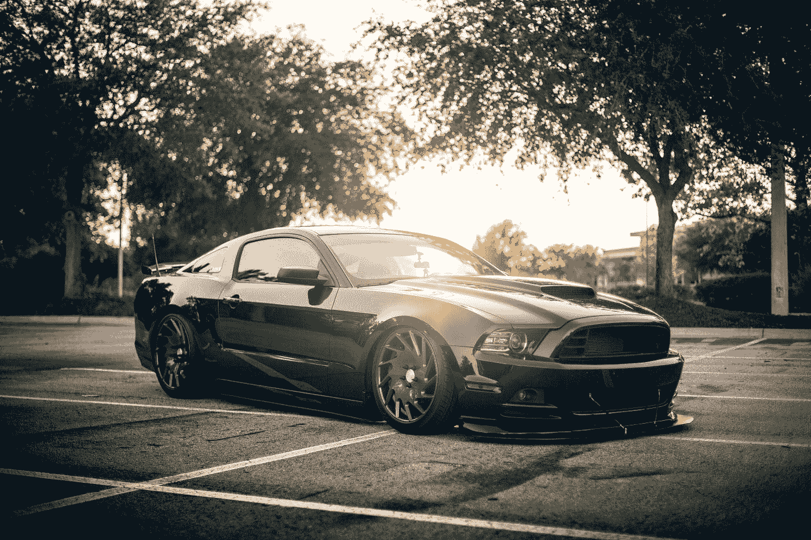

# 2030 年自动驾驶汽车理论！！

> 原文：<https://medium.com/geekculture/the-2030-self-driving-car-theory-ba1e18ceb097?source=collection_archive---------16----------------------->

汽车制造商正在花费数十亿美元开发自动驾驶汽车，但他们做了正确的选择吗？根据麦肯锡的 Kersten Heineke 和 Philipp Kampshoff 的说法，2030 年美国的自动驾驶汽车市场可能价值近 8000 亿美元。

Photo by [Lance Asper](https://unsplash.com/@lance_asper?utm_source=medium&utm_medium=referral) on [Unsplash](https://unsplash.com?utm_source=medium&utm_medium=referral)

汽车制造商正在大力投资 AV 技术
汽车制造商正在大力投资 AV 技术，包括人工智能…