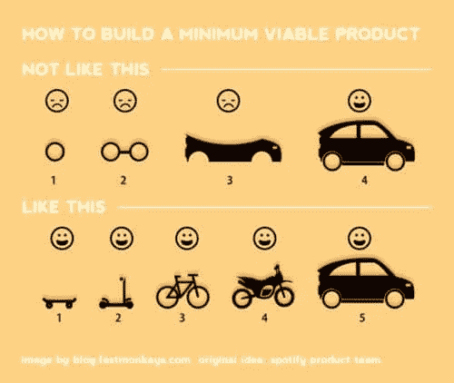

# 最低生存产品 20 周年:发生了什么？

> 原文：<https://medium.com/geekculture/the-20th-anniversary-of-the-minimum-viable-product-what-happened-d2a8290d09f2?source=collection_archive---------18----------------------->

[Slideshare](https://www.slideshare.net/jmspool/designing-delight-into-mvps-r10-1up)

## 自 2001 年以来有 7 次迭代。它仍然很强劲

最小可行产品(MVP)将于 2021 年迎来 20 周年纪念。这个概念是弗兰克·罗宾逊在 2001 年提出的。Steve Blank 在 2005 年用客户开发方法对此进行了扩展。2011 年，Eric Reis 在他的书《精益…