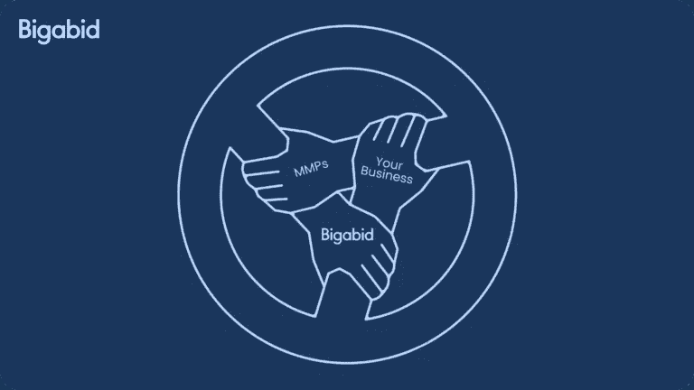

# 应用程序开发人员重新定位的 4 个轴心

> 原文：<https://medium.com/geekculture/the-4-axes-of-retargeting-for-app-developers-683458182c7d?source=collection_archive---------15----------------------->

Photo by [Mario Calvo](https://unsplash.com/@mariocalvo?utm_source=unsplash&utm_medium=referral&utm_content=creditCopyText) on [Unsplash](https://unsplash.com/s/photos/ads?utm_source=unsplash&utm_medium=referral&utm_content=creditCopyText)

几年前，我的团队接受了重新定位的挑战。那时候，它远没有今天这么普遍。这使我们能够采取一些新颖的方法，这些方法如今正在取得成效。与我们的设计合作伙伴一起，我们解决了许多主要围绕以下四个主轴出现的问题:

1.  确定最有价值的目标用户群以及何时开始瞄准他们
2.  衡量活动(增量实验、不同细分市场的不同 KPI 等。)
3.  利用针对不同细分市场的定制消息和特别优惠来创建和测试创意
4.  技术集成(MMPs、受众工具、深度链接等。)

在本文中，我们将逐一解决这些问题，并揭示我们提供的解决方案。

## 确定最有价值的目标用户群以及何时开始瞄准他们

首先，我们研究和分析客户 CRM，以准确确定 NNR(自然回报率)或不同用户群的闲置天数(无应用打开的天数)，或与活动目标和应用性质相关的各种其他细分方法。然后，我们将应用程序中的用户划分为不同的细分市场，并根据现实世界中的流数据，为每个群体提供触达分析以及该群体的建议 KPI。

有关重定目标中用户细分的更多信息，请查看成功重定目标的 4 大支柱。

Photo by [Chris Liverani](https://unsplash.com/@chrisliverani?utm_source=unsplash&utm_medium=referral&utm_content=creditCopyText) on [Unsplash](https://unsplash.com/s/photos/analysis?utm_source=unsplash&utm_medium=referral&utm_content=creditCopyText)

我们已经建立了一个强大的数据集成管道，能够近乎实时地处理来自应用程序的事件。该引擎为我们提供了无与伦比的能力，根据数百种不同的功能对您的用户进行细分，以便为我们不断更新和刷新的算法数据提供服务，从而获得最大的结果。

了解更多关于[实时数据分析的信息。](https://www.bigabid.com/real-time-data-analysis/)

## 衡量活动(增量实验、不同细分市场的不同 KPI 等。)

我们与我们的团队定期召开会议，以便在活动开始后提供报告和有价值的见解。这种会议是互利的。然后，我们提供了一个增量影响测量框架，并进行实验设计和分析。

了解更多有关我们如何在[增量价值中衡量增量的信息。](https://www.bigabid.com/incremental-value/)

## 利用针对不同细分市场的定制消息和特别优惠来创建和测试创意

我的团队已经建立了一个 A/B 测试系统，能够同时运行数百个实验，以提供关于创意和处理对任何小组的影响大小和统计意义的答案。

在[的 5 个成功重新定位的技巧中，了解更多关于我们重新定位广告](https://www.bigabid.com/5-tips-for-successful-retargeting-ads-in-gaming/)的方法。

## 技术集成(MMP、受众工具、深度链接等。)

我们的 CS 团队已经积累了与众多客户打交道的经验，这些客户已经成功加入所有主要的 MMP。我们在整个过程中通力合作，确保您不会重复我们在开发和创新过程中犯下的任何错误。

点击了解我们如何与 MMPs [合作。](https://www.bigabid.com/partnering-with-privacy-mmps-and-ios-15/)

这些重要的工具是对我们已经非常强大的 ML(机器学习)架构的补充，该架构负责我们 100%的媒体购买。我们算法中的一些关键特征是:

*   关于用户是谁的特征。比如他们对什么感兴趣，他们对不同类型的游戏有多大热情，用户是否是广告盲，以及他们对哪种广告类型的反应最好等等。
*   广告所处环境的特征——广告是可点击的，甚至是可视的吗？广告在视觉上吸引人吗？用户能否在其当前环境中安装应用程序等。
*   围绕自然收益率的特征；我们只想锁定那些自然返回应用程序的概率较低的用户。我们有一个模型来预测用户在没有治疗的情况下返回应用程序的可能性。然后，我们优化了在向用户显示广告和不显示广告的情况下返回应用程序的机会差异。通过这样做，我们优化了活动的增值。

## 结论

我们的重新定位实践在相对较短的时间内得到了完善，尽管我们比大多数竞争对手有更多的时间，因为我们在它变得更加广泛之前开发了这个过程。在经历了事物发展的速度之后，我们期待着继续以驱动力和不可动摇的透明度引领重新定位技术。

阅读我们在[透明合作中的核心价值观。](https://www.bigabid.com/partnering-with-transparency/)

透明度不仅体现在与我们的客户和合作伙伴分享见解和改进方面，还体现在与我们未来的潜在客户和整个移动广告行业分享见解和改进方面，因此才有了这样的文章。正是我们对技术的信心让我们变得如此透明。来成为我们重新定位成功的一部分。