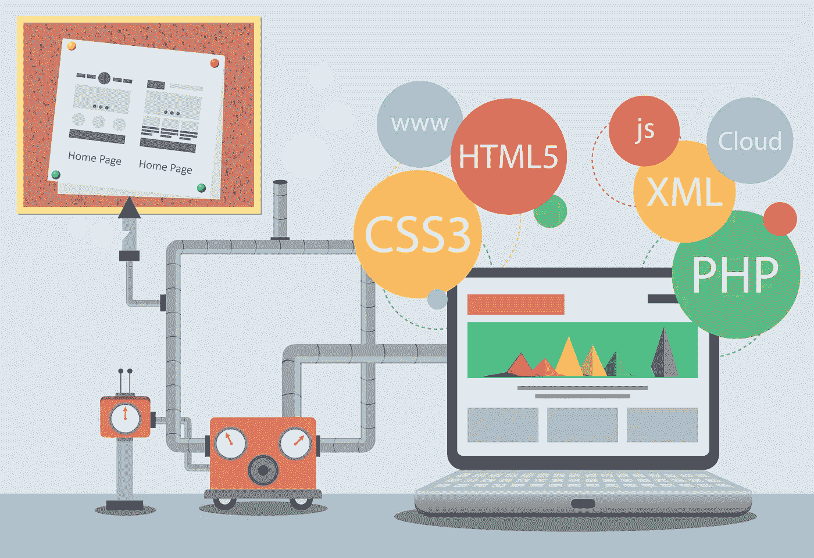

# 免费网站建设的 4 个最佳工具

> 原文：<https://medium.com/geekculture/the-4-best-tools-for-building-websites-for-free-9e3588a992b2?source=collection_archive---------9----------------------->

## 你应该知道什么？

[Building Websites](https://www.google.com/url?sa=i&url=https%3A%2F%2Fhostimul.com%2Fblog%2Fhow-to-quickly-build-a-website&psig=AOvVaw2VgCrBQPoGuef1X3JDZ9v6&ust=1668167398487000&source=images&cd=vfe&ved=0CBAQjRxqFwoTCOidwPzFo_sCFQAAAAAdAAAAABAI)

任何人都认为建立网站就像进入一个充满坑和陷阱的黑暗洞穴，但这并不适用于那些使用开源工具来建立专业网站的人，这些网站易于使用，设计独特，与手机兼容，对搜索引擎友好，就像那些通过…