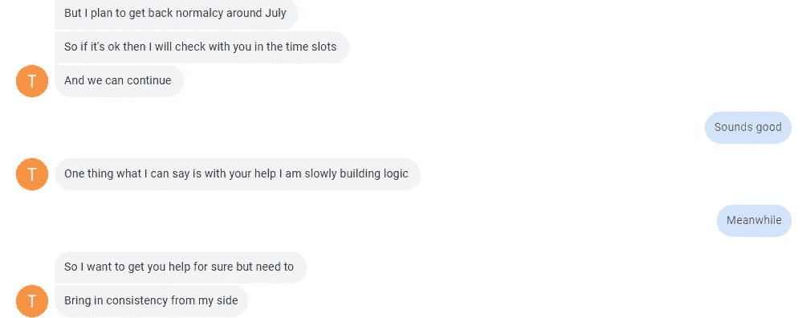
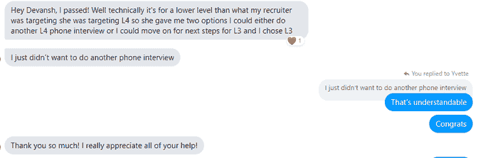

# 我的学生用来最大化 Leetcode 问题并赢得 FAANG 面试的 4 步法

> 原文：<https://medium.com/geekculture/the-4-step-method-my-students-use-to-maximize-leetcode-problems-and-ace-their-faang-interviews-2d5e0a6b1538?source=collection_archive---------2----------------------->

## 古代大师发明的超级秘法

为了帮助我了解您[请填写此调查(匿名)](https://forms.gle/7MfQmKhEhyBTMDUD7)

除了我的机器学习研究，我还参与辅导人们通过技术面试。联系我的人有两种类型。

1.  他们是努力完成课程的学生。这是最多样化的群体，他们要求我帮助从编码到数学、机器学习或理论计算机科学(他们没有与有限自动机作斗争)的一切。
2.  职场人士。这些人在科技领域从事全职工作。他们已经决定要么过渡到软件开发(就像我的学生 T2，他从前端开发开始后就在脸书找到了一份软件开发工作)，要么就是职业生涯中期的专业人士，只想在技术面试中表现出色。这些都是工作繁忙的专业人士，他们需要温习概念和/或仅仅温习他们的技术面试。我和有 20 年行业经验的人一起工作过。

这两个群体有非常不同的需求。然而，两组人都表达了解决 Leetcode 问题的困难(以及当他们解决问题时从错误中学习)。以我的经验来看，这来自于低效地使用 Leetcode/HackerRank 等。他们通常在这个问题上花 1-1.5 个小时。然后他们放弃，看解决方案。他们重复这个过程。这很好，但这缺少了一个关键的因素。反馈。在本文的其余部分，我将详细说明这个成分是什么，为什么它很重要，以及如何整合它。以我帮助别人的经验为基础。

Can’t wait to get back to working with you.

你为什么要听我的？这是和一个学生 J. J 的短信交流。J .是一个有 15 年工作经验的专业人士，他甚至为简单的中等水平的 Leetcode 问题而挣扎。我们断断续续在一起工作了 2 个月。由于她忙碌的个人生活，她不能投入很多时间练习，甚至经常不得不取消我们预定的课程。到目前为止，我们要休息一段时间，因为 J 要处理一些个人事务。然而，在那段时间里，她已经能够提高自己解决问题的能力。在我们一起工作之前，她对尝试编码面试问题感到绝望。现在，用她的话说，她正在“慢慢建立逻辑”。我将在本文后面提供更多的例子。现在我已经提供了工作证明，让我们继续。这是另一个学生给出的声明，他们钉在谷歌屏幕上。

These kind words are always appreciated

# 第一步:非常非常仔细地阅读问题

这似乎是一个显而易见的步骤。但它对你从问题中学习的能力起着至关重要的作用。当你阅读问题时，你需要做几件事。突出你认为重要的问题领域。记下你认为重要的短语，以及它们可能暗示的数据结构/算法。这一步最终将非常重要，你将从解决方案中学到东西。通过这样做，我们可以看到你是否错过了思考某些话题。我们还可以看到你是否倾向于多次思考某些结构(我有一个学生，每当出现字符串问题时，他就思考尝试。结果喜忧参半)。

# 第二步:解决问题

我通常让我的学生在一个问题上花大约一个小时-一个半小时。这可能看起来很多，因为编码面试问题通常是 30-45-60 分钟。但是在这里，我们的目标是在有问题的领域练习。所以我们可以稍微超过时间限制。为了模拟时间紧迫的压力，我们也做了许多模拟面试。这里的目标是真正理解问题的细微差别。所以多花点时间没关系。

在解决这个问题时，我建议大声思考。这让你在解决问题的时候有了交流想法的想法。思考时大声说出来的好处已经被很好的证明了。

# 步骤 3:检查解决方案

这一步也极其关键。还记得你在第一步做的所有思考吗？这就是它发挥作用的地方。看解决方案。他们使用了什么样的数据结构。有没有你漏掉的特定算法？有什么可以暗示他们使用的步骤吗？解决方案在哪些方面偏离了你的想法？这样的对比学习应该是你的目标。它会帮助你了解你错过了哪些领域。

这一步的目标不仅仅是看到解决方案。这是为了了解您在获得解决方案的过程中错过了什么。这可以帮助你在特定的领域做出努力。

# 第四步:替代解决方案

这是一个被人们忽视的步骤。然而，在决策过程中，这可能是“几乎”和“是”的区别。即使你有最优的解决方案，我也会花一些时间去探索替代方案。我们能减少空间使用吗(即使时间复杂度增加)？我们可以使用其他数据结构/以另一种方式来组织这个问题吗？我们还有什么其他方法可以解决它？

这自然会让你在面试中养成探索取舍的习惯(一个展示你知识的好机会)。当你陷入困境时，这也是一项有用的技能。我给学生们的建议是，当他们被一个问题困住时，要勇敢面对。他们想开始探索其他方法和其他有前景的解决方案。记住。低效的解决方案比没有解决方案好得多。

Just like a shotgun, it can be useful exploring many possible solutions quickly when stuck

# 关闭

希望这篇文章为你提供了一个有用的框架，告诉你如何解决 Leetcode 问题并从中获益。你会注意到，用这种方法，你在一个问题上花费的时间会比一般情况下多得多(在开始的时候)。这是可以预料的。作为初学者，有这方面的指导很重要。虽然你不可能一天解决 10 个问题(甚至 5-6 个)，但你会很快看到结果。不相信我(你说是我就很受伤)？这里有一个我的学生的例子，她是一个前端开发人员，没有计算机科学方面的经验(当我们开始的时候，她甚至不知道递归)。她参加了脸书软件开发职位的面试。我们一起工作了 4 个月。这就是结果。

这个方法管用。这将让你最大限度地练习 Leetcode。一两道高质量的练习题，比做 10 道题而不从中吸取教训要有价值得多。

为了我辅导的一个玩笑

此外，请随意订阅我的时事通讯。这里我分解了各种技术相关的东西，包括各种编码面试问题。这是一个很好的方法来确保你可以从我的技巧中学到东西，如果你不能承诺辅导的话。它在我的子栈上:[https://devanshacc.substack.com/](https://devanshacc.substack.com/)

# 向我伸出手

如果那篇文章(或推荐)让你有兴趣联系我，那么这一部分就是为你准备的。你可以在任何平台上联系我，或者查看我的其他内容。如果你想讨论家教，发短信给我。

机器学习领域重要更新的免费每周总结(赞助)-【https://lnkd.in/gCFTuivn 

查看我在 Medium 上的其他文章。:【https://rb.gy/zn1aiu 

我的 YouTube:[https://rb.gy/88iwdd](https://rb.gy/88iwdd)

在 LinkedIn 上联系我。我们来连线:[https://rb.gy/m5ok2y](https://rb.gy/f7ltuj)

我的 insta gram:[https://rb.gy/gmvuy9](https://rb.gy/gmvuy9)

我的推特:[https://twitter.com/Machine01776819](https://twitter.com/Machine01776819)

我的子任务:[https://devanshacc.substack.com/](https://devanshacc.substack.com/)

twitch 现场对话:[https://rb.gy/zlhk9y](https://rb.gy/zlhk9y)

获得罗宾汉的免费股票:[https://join.robinhood.com/fnud75](https://www.youtube.com/redirect?redir_token=QUFFLUhqa0xDdC1jTW9nSU91WXlCSFhEVkJ0emJvN1FaUXxBQ3Jtc0ttWkRObUdfem1DZzIyZElfcXVZNGlVNE1xSUc4aVhSVkxBVGtHMWpmei1lWWVKNzlDUXVJR24ydHBtWG1PSXNaMlBMWDQycnlIVXNMYjJZWjdXcHNZQWNnaFBnQUhCV2dNVERQajFLTTVNMV9NVnA3UQ%3D%3D&q=https%3A%2F%2Fjoin.robinhood.com%2Ffnud75&v=WAYRtSj0ces&event=video_description)