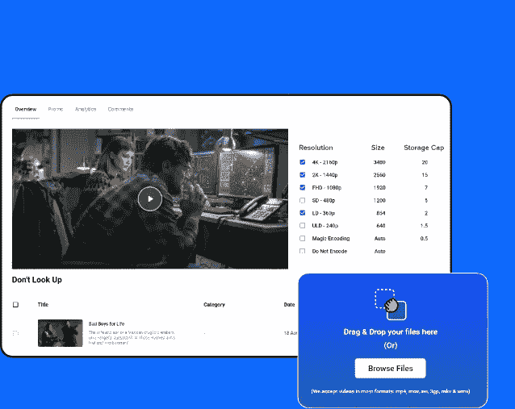
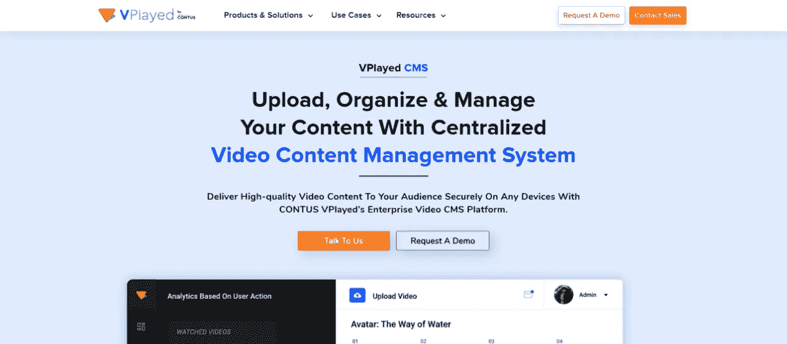
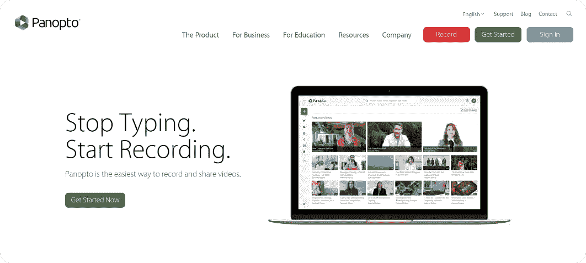
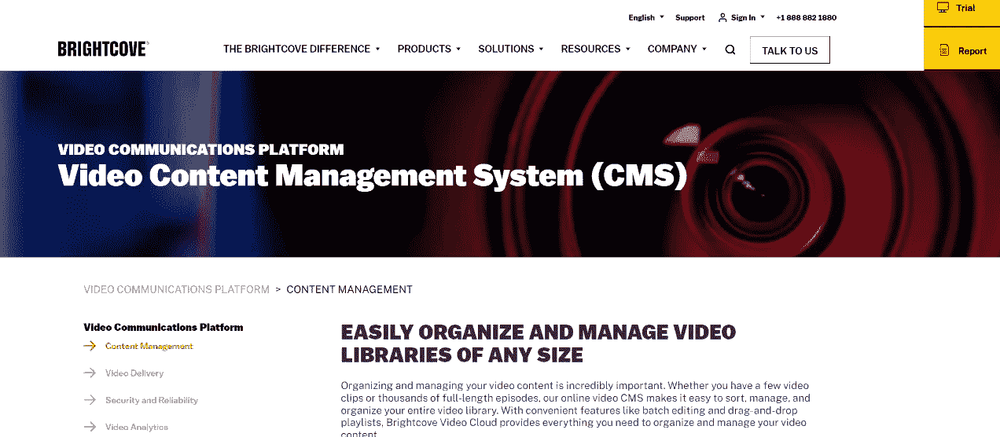
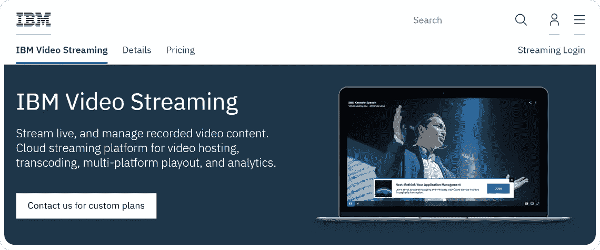
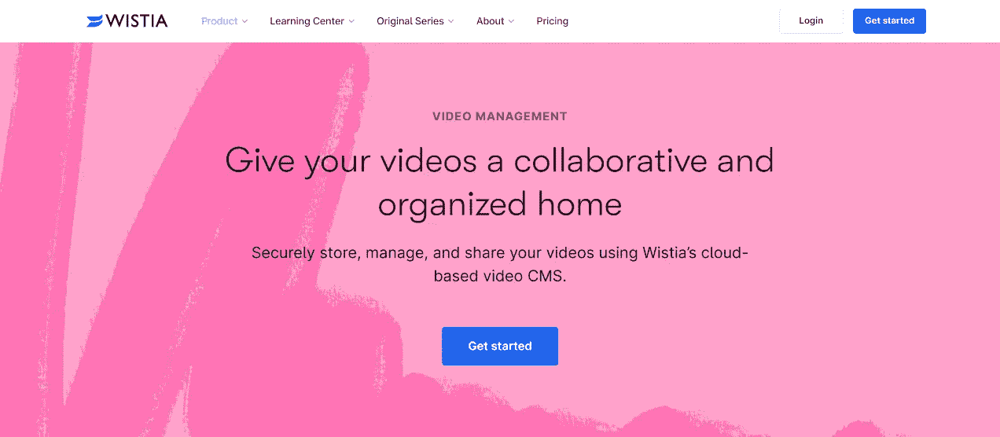

# 2023 年 5 大最佳视频内容管理系统(CMS)

> 原文：<https://medium.com/geekculture/the-5-best-video-content-management-systems-cms-in-2023-ec1b0bc1b4a0?source=collection_archive---------10----------------------->

如今，视频是一种重要的参与方式。它们不仅仅是娱乐的来源，而且现在被许多企业认为是与顾客联系的最有效的手段。企业正在利用视频进行培训、指导、产品更新、会议和视频营销。这就是为什么对视频内容管理系统的需求正在上升。

所以，如果你想了解更多关于[视频内容管理系统](https://www.vplayed.com/video-content-management-system.php) (CMS)，以及如何为你的企业选择最佳的视频内容 CMS，这个博客将帮助你度过难关。

# **什么是视频内容管理系统？**

内容管理系统(CMS)是一个软件，方便那些有网站的人添加新的内容，管理现有的视频，共享和更新他们网站上的视频。这一切不需要太多的技术知识，使用一个视频 CMS 就可以完成。这是一个让用户组织、分发、存储在线视频并从中获利的平台。

视频 CMS 还提供安全的视频托管设施、用户友好的界面和许多其他功能，以增强视频内容发布者的能力。

# **如何选择视频内容管理系统？**

使用视频内容管理系统有其自身的挑战。存储空间不足，优化视频内容管理软件以使其能够在手机和其他设备上工作，详细的数据分析是这些挑战中的一部分。

一个好的视频内容管理系统能够解决这些痛点，让用户有一个流畅的工作体验。在众多的 CMS 系统中，每个 CMS 都有不同程度的视频管理能力。这里列出了高端视频内容管理系统的一些重要特性。

*   **超大储物空间**

视频通常较大，并消耗大量存储空间。随着视频的大小和质量变得更好，视频的大小变得更大。一个好的 CMS 是由一个企业视频托管服务构成的，它有能力在第三方服务器上存储和上传你的所有视频。

*   **无中断流式传输**

顶级 CMS 可以在所有设备上流畅地传输视频内容，不会出现中断。CMS 应该优化各种设备上的流媒体体验，还应该检测用户的互联网连接质量，以相应地微调视频质量。

*   **隐私和安全**

YouTube 是一个很好的视频营销平台，但它是一个公共讲台。CMS 应具有管理私人和有限访问视频内容的功能，如培训视频和会议记录。一个好的内容管理系统能够保证安全观看，并防止未经授权访问您的视频。

*   **高级搜索**

每一个视频 CMS 的基本目标是有条不紊地你的视频和流过程。ace CMS 将具有增强的搜索功能，让您可以通过文件名、标题或任何输入的元数据来搜索视频。

*   **API 集成**

当你需要大量的定制选择时，最好寻找一个拥有完整平台 API 的 CMS 来完全控制你的视频内容。一个完整的平台 API 允许你添加尽可能多的功能到你的**视频内容管理**平台。

*   **视频库动作**

视频库迁移是 CMS 毫不费力地从一个平台迁移到另一个平台的能力。您可能需要将所有视频内容迁移到不同的 CMS。为了简化这一点，请在您的 CMS 中寻找一个无障碍迁移功能。

*   **流媒体直播**

CMS 还提供会议、网络研讨会、产品发布会和其他现场活动的直播。你的 CMS 应该有保存视频的功能，在会议结束后。

*   **视频分析**

视频分析可以追踪许多关于你的视频表现的事实。这有助于塑造你的视频策略。分析功能可以告诉多少人观看了视频，观看的持续时间，视频的一部分是最受欢迎的，等等。CMS 还可以添加额外的分析功能，以获得更多见解。

*   **编码和转码**

原始视频需要优化和压缩，以便在各种设备上流畅播放。这就是为什么，视频编码和转码功能成为必然。一个高质量的视频内容管理系统将提供这些服务。

*   **白标球员**

对于视频出版商来说，找到一个贴有白色标签的内容管理系统对于建立强大的品牌形象至关重要，这是一项艰巨的工作。一个白标视频 CMS，是一个可以提供一个完全可品牌化的域名或一个符合你的品牌个性的域名。因此，对于强大的定制选择白色标签的视频 CMS。

*   **货币化设施**

你的 CMS 应该给你多种有效的货币化工具的选择。AVOD、SVOD 和 TVOD 是目前主要的**视频货币化**模式，您的 CMS 必须具备将这些模式集成到您的视频平台的特性和功能。

# **最适合您流媒体业务的 5 个视频内容管理平台列表**

## **1。** [**VPlayed**](https://www.vplayed.com/video-content-management-system.php)

CONTUS VPlayed 是领先的视频流平台，提供企业级视频内容管理系统，为广播公司提供丰富的独家功能。他们的 CMS 架构旨在满足 OTT 业务需求和内容管理需求。它有一个高端视频点播平台，可以维护一个视频库，该视频库有多种内容管理选项和工具。

**特性**

智能上传

使用其高级 CMS 进行批量导入和导出

拖放式视频调度

用户友好的 CMS 仪表板

多文件格式支持

强大的营销和视频分析

元数据管理

白色标签

## **2。** **潘诺托**

Panopto 在线视频内容管理系统最适合内部教育相关的使用。Panopto 的 CMS 可以管理您的视频资产的安全性和规模。由于 LMSs、CMSs 和 CRMs 不是专门为视频管理而设计的，并且会降低您的网络速度，因此 Panopto 与所有这些内部系统集成，以便您可以管理您的视频。但是 Panopto 在外部视频流功能方面落后，并且没有定制选项。

**特性**

视频云托管和云安全

针对用户设备的视频转码视频优化。

监控内容性能的视频分析。

自适应比特率流式传输，实现更好的流式传输

## **3。布莱特科夫**

Brightcove 有一个基于云的视频 CMS 解决方案。用户可以通过手机和网络浏览器上传、修改和分发视频。它以用户友好和高级安全特性而闻名，在 CMS 中优先考虑组织。然而，对于小企业和个人来说，根据地理位置来安排视频时间有点昂贵。

**特性**

一步到位的“快速发布”。

内容的自动分组

视频云模型

嵌入式视频的深入分析，额外的集成是必要的

元数据搜索

## **4。IBM 云视频**

这是一个完全集成的，可扩展的和用户友好的视频内容管理系统。它可以直播，也可以提供点播视频流服务。它使用像人工智能这样的最新技术来提供先进和准确的服务。它使用基于云的平台，向开发者提供视频 API 和视频插件，以便他们可以将 CMS 集成到自己的平台中。

**功能**

实时分析

通过人工智能自动为视频添加字幕

[视频货币化](https://www.vplayed.com/video-monetization-platform.php)和广告插入

自定义元数据以改进搜索

在外部网站上轻松嵌入视频

**5。Wistia**

Wistia 旨在更好地营销视频内容。内容创作者可以利用其交互式工具和控制，从其营销活动和详细的见解中获得最大收益。它还使用基于云的视频存储，并为营销应用程序提供创新集成。

**特性**

完全可定制

快速和轻量级上传

优化视频以获得 SEO 优势

内容绩效分析

带密码保护的视频托管

## **结论**

希望这个博客是一个关于视频内容管理系统的讨论。我们了解了视频 CMS、它们的理想特性，以及市场上可用的 [**最佳视频 CMS** 平台](https://blog.contus.com/video-content-management-system/)。这将帮助您根据业务需求进行个性化分析，了解哪一种适合您的业务。

视频内容管理是一项艰巨的任务，但有了明智选择，可靠的视频 CMS 软件，它变得容易。一个错误的 CMS 会导致日常商业活动中的许多小故障。除了上述所有高级功能外，重要的是您的解决方案提供商是一个白标玩家。Vplayed by CONTUS 是一家值得信赖的全球领导者，它使用未来级技术，并通过其[企业 CMS 解决方案](https://www.apptha.com/blog/enterprise-video-content-management/)提供高质量视频。正确的视频内容管理系统将是一个重大的飞跃，为您的业务，所以思考你的决定适时。