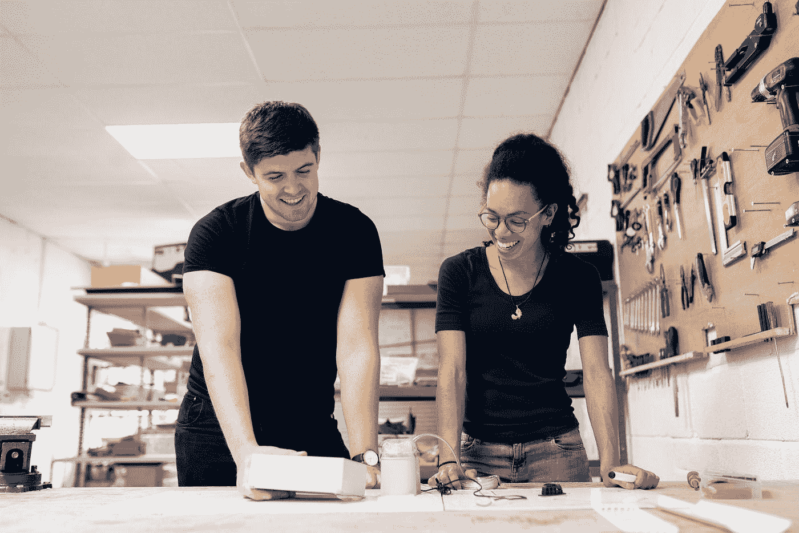

# 软件工程师的 5 种不同原型

> 原文：<https://medium.com/geekculture/the-5-different-archetypes-of-software-engineers-2bedbe9502e1?source=collection_archive---------2----------------------->

你是哪一个？

Photo by [ThisisEngineering RAEng](https://unsplash.com/@thisisengineering?utm_source=medium&utm_medium=referral) on [Unsplash](https://unsplash.com?utm_source=medium&utm_medium=referral)

做一名软件工程师很复杂，有时还很奇怪(和一名软件工程师生活在一起会更奇怪——看看我女朋友写的这篇文章)。和他们一起工作会很复杂，很难理解。

这篇文章的灵感来自贝恩和公司的[未来世界的六个员工原型](https://www.bain.com/insights/what-type-of-worker-are-you-future-of-work-report-interactive/)。我以为这是一个…