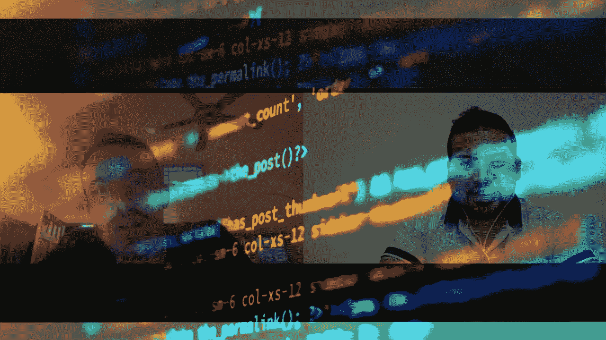

# 成为伟大软件工程师的 5 个基本特征

> 原文：<https://medium.com/geekculture/the-5-essential-characteristics-that-make-a-great-software-engineer-94c25f7004da?source=collection_archive---------35----------------------->

## 根据 Will Sentence——一位杰出的成功工程师和企业家

Provided by the author

在做了几年网站开发人员后，我问自己。一个伟大的真正的软件工程师的基本特征是什么——是的，是软件工程师，而不是 web 开发人员。