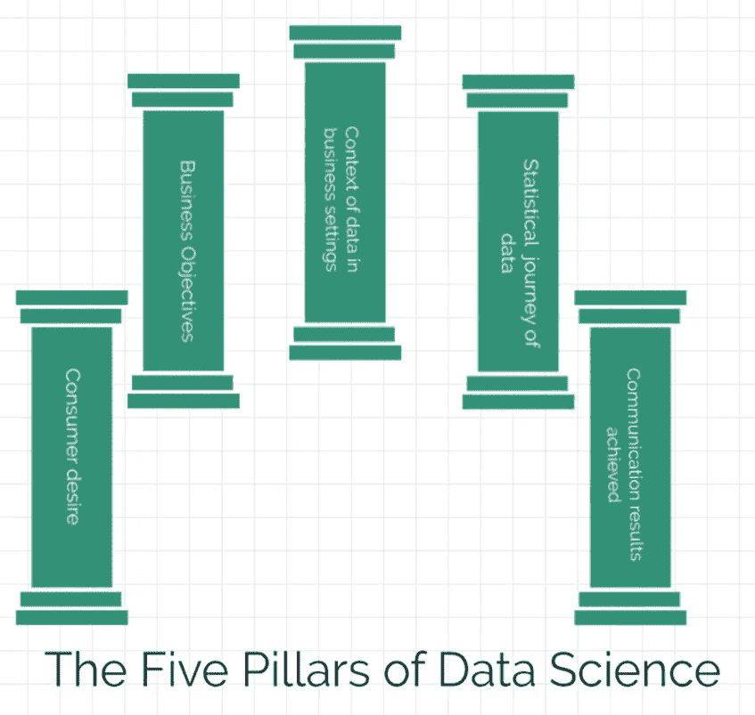

# 数据科学的五大支柱

> 原文：<https://medium.com/geekculture/the-5-pillars-of-data-science-cb2c61864ede?source=collection_archive---------12----------------------->

*Photo Designed BY SABAH SHAHED*

# 1.消费者欲望

[https://muirbury.com/modern-consumer-and-the-opportunity/](https://muirbury.com/modern-consumer-and-the-opportunity/)

我们必须始终首先考虑我们的数据科学项目将如何让我们的利益相关者受益。

如果我们建立一个机器学习模型来预测消费者流失，它将帮助组织确定哪些消费者正在离开和将要离开，以及他们为什么离开。因此，他们可以建立商业策略来留住他们，令人惊讶的是，大多数关于消费者流失的机器学习模型甚至几乎无法触及哪些消费者将离开，而只能知道有多少可能离开。而在具有高级算法程序的深度学习模型中，有可能解决这个问题。

# 2.商业目标

Source : Kaylan City blogspot

我们需要评估企业计划从中实现什么。他们是否需要使用数据预测来构建:

*   预测工具。
*   预算工具。
*   应用程序编程接口，用于评估所有即将到来的销售预测，并将其合并到他们的在线工作工具中，以进行数据驱动的决策。
*   一个业务用例网站，用于检查对所有订单量和新客户流失和收购的预测。
*   或者，他们是否需要它作为他们为实现当年业务目标所做决策的一次性答案。

在每一种情况下，数据科学家、ML 工程师都必须与合适的技术人才合作，如网络开发人员、领域专家，甚至是简单的数据管理专家，以执行和部署最终服务。

# 3.商业环境中的数据环境。

# /*我们如何处理 28389 32923 和 9020 */

我们需要首先理解数据及其在业务中存在的逻辑。

> “在业务的任何模型创建过程或机器学习框架设计中，业务中数据的敏锐度和敏锐度是最重要的。”**阿马尔·贾姆希德(作者)**

精明意味着日常操作有多少是基于数据的，例如在医院中几乎 100%是基于数据的，医院在诊断患者时必须查看血液报告和遗传史等统计因素，而在小规模食品制造商中，只有其销售依赖于数据分析和预测，而其制造不那么依赖于数据分析和预测，除非是大规模公司。

**敏锐度**此处暗示业务对投资公司 5%置信区间等数据的敏感程度可能不会被视为大问题，因为它仅暗示利润下降 5%的可能性，因为它只处理可以在以后随着市场升值收回的资金。虽然医院中 5%的置信区间是一个非常严重的问题，因为它意味着比假设的多 5%的患者死亡机会，这可能导致他们的经济损失、法律问题和工作士气低落。

我们还必须查看存储数据的基础架构，例如，如果企业将数据保存在电子表格中，那么它是为了低成本维护还是为了制表视图和员工理解而保存，以及它是否通过手动导入或工具导出(如从 **google analytics、firebase 等导出)来生成数据**。

因为提供特定产品或服务的每个企业都有不同的数据要求。

*   比如软件公司，他们直接将产品的所有数据放在他们的**集成开发环境**中，他们可以将其导出为 HTML 格式，上传到他们的员工网站上，或者导出为 excel 格式，与其他部门共享。
*   对于食品制造商和消费品公司来说，他们的主要数据存储是表格形式，存储在电子表格中以便所有人理解，甚至在新数据输入时，将 excel 表格与预算工具自动更新链接起来。

这些是每个行业和公司数据管理设置的几个例子。

**4。数据的统计之旅**

Source: Dreaming Andy- Fotolia

在获得客户数据后。

我们首先需要检查数据集

*   异常和错误，以确保我们的分析和预测尽可能准确。
*   显然没有 100%的可能性，因为数据在进入我们的访问之前，在整个业务流程中都会受到某种程度的操纵，例如某些库存经理可能会输入错误的值，而这些值会被存储在数据库中数百万个其他条目中而不被注意到。

然后，我们必须将数据可视化，并了解数据的哪些特征是重要的，这样，在水果销售数据的情况下，提供数据整体视图并可用于预测水果价格的重要特征将是水果价格、水果销售、水果数量和水果类别。

由于计算算法只能读取数字数据，我们经常需要应用编码算法将水果类别等分类值转换为数字。

在我们应用预测机器学习或深度学习算法之前，我们必须重新审视每一步，看看我们这边是否没有出错。

# 5.交流取得的成果。

> /*你亲爱的价值 900 万美元的现金*/

这通常是最困难的部分，因为听众由背景和思维方式迥异的人组成，他们不可能每次都得到单独的照顾。

所以我们必须想出一个每个人都能理解的故事叙述，不管他们的思维方式或背景如何。

如果我们试图用这样的技术术语和先进的数学计算来解释一个数据故事，那么只有具有这些行业背景的人才能理解它。

我们必须确保我们的每一位观众都明白我们在说什么，这样他们才会采纳我们的解决方案。

如果我们用基本术语来解释，甚至有些人会不明白我们想说什么。

我们必须思考一些观众中的每一个人都可以涉及的东西，这样的东西可以是每个人赖以生存的食物。

Authors Picture

如果我们将我们的机器学习预测解释为一个咖啡馆菜单，它可以显示我们将从咖啡馆的选定项目中点什么，有时也可以显示我们不能点的错误项目。如果解释说我们的机器学习模型有 98%的准确率，那么我们必须解释说，当我们一天去咖啡馆 10 次，其中 10 次中有 9 次，我们作为机器学习模型设计的智能菜单将在总共 10 次中有 9 次正确预测我们点的东西。