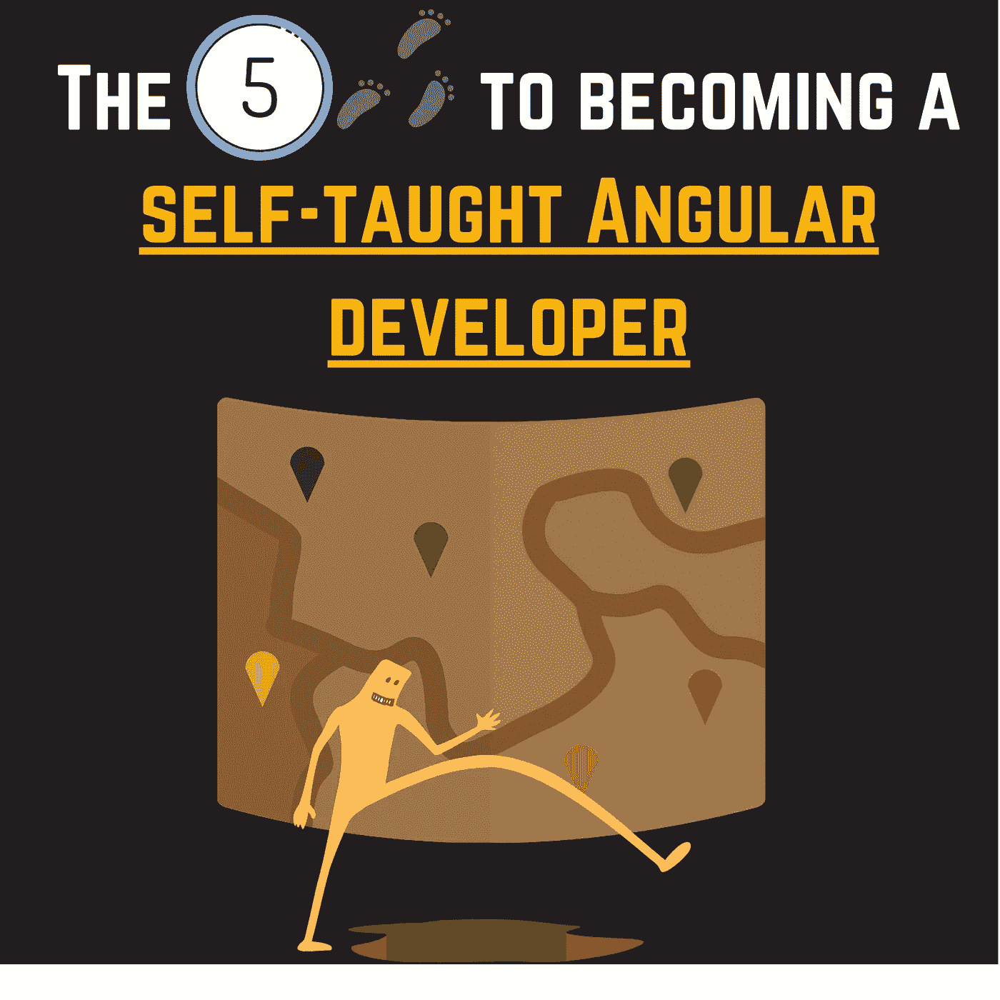

# 成为自学成才的角度开发者的 5 个步骤

> 原文：<https://medium.com/geekculture/the-5-steps-to-becoming-a-self-taught-angular-developer-8f887c72884f?source=collection_archive---------5----------------------->

## 如何成为一个有角的开发者？

By FAM

Angular 对开发人员来说似乎有点挑战性，因为它是一个框架，要成为 Angular 开发人员需要学习很多东西。我经历过这个。React 非常容易学习，每个人都可以马上开始学习 React。然而，有角度的…