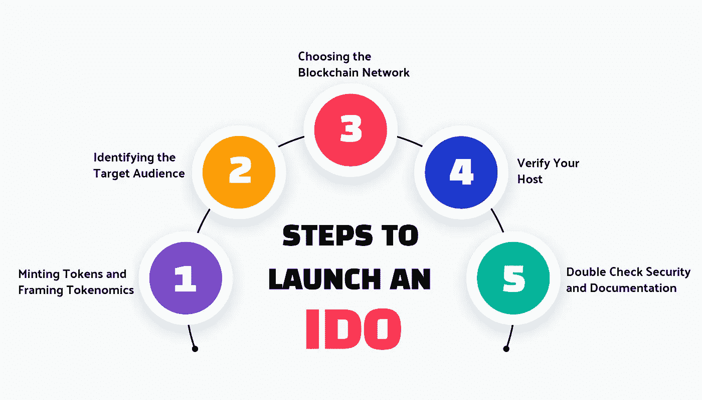

# 启动 IDO 的 5 个步骤—2023 年完整指南

> 原文：<https://medium.com/geekculture/the-5-steps-to-launch-an-ido-complete-guide-fc61a3d45dcc?source=collection_archive---------17----------------------->

The 5 Steps to Launch an IDO — Complete Guide

近年来，由于在密码领域的应用，众筹再次流行起来。尽管多年来加密筹资一直是一种规范，但在一些机制因其性质而臭名昭著之后，该行业陷入了困境，几乎为零的监管导致了首次硬币发行(ico)的消亡，过度监管对首次交易所发行(ieo)产生了影响。此类事件发生在 2017 年 ICO 热潮之后，当时该机制被视为新创业梦想的救世主。2019 年晚些时候，[**【IDOs(首次公开募股)**](https://bit.ly/3Q0drNE) 曾承诺重振筹款界的希望，此后一直表现出色。让我们看看为一个商业项目启动 IDO 的步骤。

# **1。铸造代币和构造代币组学**

创建 IDO 的第一步是铸造/创建项目的本地令牌并形成令牌经济，在 [**Web3 世界**](https://bit.ly/3zyE2fC) 中更好地称为令牌经济学。IDO 令牌可以使用令牌标准(如 ERC-20)轻松创建，开发人员需要集成令牌的特征。令牌组学在决定项目流程中起着至关重要的作用。您必须考虑诸如可预测性、盈利性、可持续性和稳定性等因素，这些因素应该列在项目白皮书中。

# **2。确定目标受众**

确定令牌流将为您提供确定目标受众的摘要。在设定你的受众时，照顾将长期参与项目的投资者是至关重要的，因为 IDO 项目至少需要一个社区，直到他们可以在 Web3 中建立自己的基地。虽然你可以努力产生宣传和兴趣，但你必须确保社区的大部分人和你在一起，无论外部发生什么。

# **3。选择区块链网络**

今天，几乎所有的区块链都支持 IDO 筹款，这就需要在安排你的发射前仔细看看每一个的优点。您还应该注意，并不一定要在与 IDO 相同的区块链上启动该项目，但是请注意，如果您在天然气密集型网络上 [**启动令牌**](https://bit.ly/3Q0drNE) ，您的用户可能会遇到问题。您还应该确保网络支持互操作性，这可以通过区块链网桥来实现。

# **4。验证您的主机**

IDO 令牌可以从在 [**DeFi world**](https://bit.ly/3b9F8Fa) 中流行的叫做 launchpads 的平台上发射。由于 IDOs 首次推出才几年，因此只有少数几个发射台是长期存在的，而其他一些发射台则是分散加密交换的扩展。除了声誉之外，选择 launchpad 还有很多标准需要考虑，包括营销支持、服务费、项目历史等等。

# **5。仔细检查安全和文件**

完成 IDO 令牌发布的初始工作后，检查您的令牌的安全性和文档非常重要。这两个因素在这场运动取得巨大成功的过程中发挥了巨大作用。就安全性而言，您可以测试代码的缺陷并立即排除故障。在检查项目文档时，有必要检查 Web3 项目所需的所有基本信息是否都在其中。

## 结论

虽然为您的 Web3 项目启动 IDO 令牌看起来像步骤一样简单，但其中涉及大量需要专业帮助的工作。为了及时获得此类支持，建议您与经验丰富的 IDO token 开发公司 合作，该公司在创建 I do token 并将其上市的所有方面都具有专业知识。