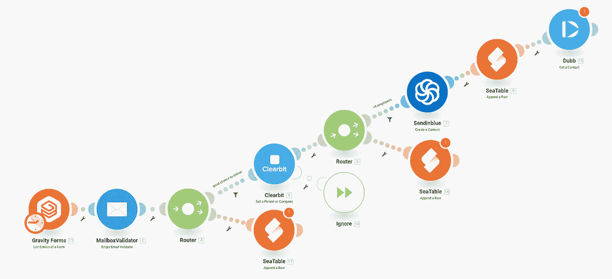
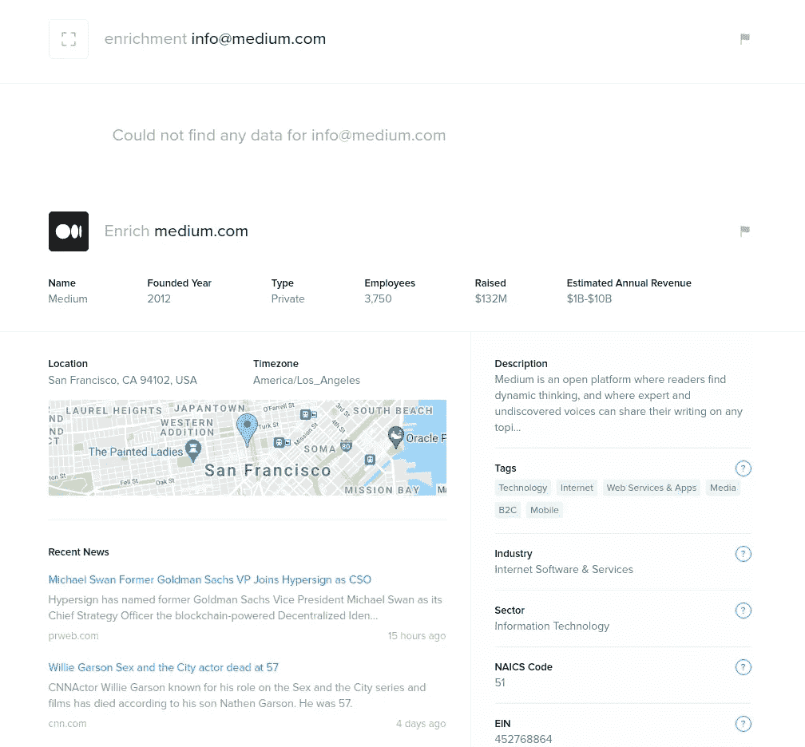

# 80/20 法则不是自然法则

> 原文：<https://medium.com/geekculture/the-80-20-rule-is-not-a-law-of-nature-89690e6dc8e0?source=collection_archive---------27----------------------->

## 自动化您的销售线索分类，关注真正重要的客户。

> 你公司 80%的销售额来自 20%的客户。

你有没有想过 80/20 法则是否是自然法则？为什么每个人都是这样？想象一下，如果你只有这 20%的客户，你会有多成功？

这篇文章是关于营销自动化的，它允许你自动筛选出那些真正有潜力的潜在客户。这种自动化可以在几分钟内完成，然后在后台运行，无需任何手动干预。既然你没有干预的可能性，你就不会冒重新陷入旧习惯和处理太多小客户的风险。

# 使用 Integromat 自动进行导联分类

Complete automation built within Integromat

这种自动化通过几个软件组件的合理组合展现了它的威力。其核心是[integra mat](https://integromat.com)自动化平台，该平台结合了其他三种云服务来提供所需的联系。Integromat 只需要一个电子邮件地址作为自动化的起点。例如，这可以来自网站注册表，或者通过其他方式提供。在这个例子中，我假设一个 WordPress 网站的[重力形式](https://gravityforms.com)。然而，可选地， [JotForm](https://www.jotform.com) 或谷歌表单也可以作为输入。

## 验证输入

第一步是将电子邮件地址传递给 [MailboxValidator](https://www.mailboxvalidator.com/) 服务。例如，该服务检查这是否是有效的电子邮件地址，该电子邮件地址是否来自典型的免费提供商，如 Gmail、雅虎或 Outlook.com，并确定指示该电子邮件地址质量的 [mailboxvalidator_score](https://www.mailboxvalidator.com/api-single-validation) 。这种验证的目的很简单。你的电子邮件越多，你在这一步的预选就越严格。如果你有数百个注册，你应该只关注高分的邮件。Gmail、Outlook 和雅虎的邮件地址应该直接整理出来。

## 丰富电子邮件地址，了解您的客户

下一步是将电子邮件地址传递给 [Clearbit](https://clearbit.com/) 。这项服务试图根据电子邮件地址来识别个人或公司。如果 Clearbit 可以根据电子邮件域识别一家公司，它会返回公司名称、地址、成立日期、员工人数、收入、Alexa siterank 和所有社交媒体渠道等信息。例如，下图显示了 info@medium.com 的结果。谁也无法确定，但 clearbit 马上就认出了这家公司。

Clearbit results for info@medium.com

现在，您可以使用 Integromat 中的过滤器来确定哪些公司与关注相关。你应该以这样一种方式来设计过滤器，即你真的只识别相关的公司，而不会同时陷入太多的后续工作中。例如，您可以按员工人数进行筛选。或者，您可以指定只返回管理职位的人员。另一种方法是年销售量。您决定哪个指标与您相关，以及您想要做多少跟进。

## 保存所有销售线索信息并开始跟进

您需要做的最后一件事是保存您现在已经确定的联系人，以便您可以开始并跟踪您的跟进流程。保存所有联系人的最简单方法是使用在线电子表格[座位](https://seatable.io)。在 SeaTable 中，你创建一个表，并在那里存储你从 Clearbit 获得的所有信息。然后，您可以根据需要扩展此表，记录您的后续活动，如电话、电子邮件或个人会议。这样，您和您的团队将始终跟踪您的后续行动。

# 扩展您的营销自动化

当然，这并不是可能性的终结。例如，您还可以将电子邮件地址交给 [Sendinblue](https://sendinblue.com/) 或 ActiveCampaign，直接启动电子邮件自动化。或者，您可以考虑通过 [Dubb](https://dubb.com/) 向您的新联系人发送个人视频消息。这完全取决于你想如何吸引或联系你的客户。

这种使用 Integromat 的自动线索分类可以在不到一个小时的时间内完成。但是，即使您需要额外的时间来设计合适的过滤器，这个工作流程也会立即对您有很大的帮助。自动化将使你的生活更轻松，并为你节省大量时间，帮助你只识别那些你真正应该投入更多时间的相关人员或公司。

如果你需要[更多的灵感](https://seatable.io/en/6-marketingprozesse-die-man-mit-integromat-automatisieren-sollte/)，Integromat 还可以帮助你准备每周的团队会议，或者监控关于你公司的每份出版物的新闻。