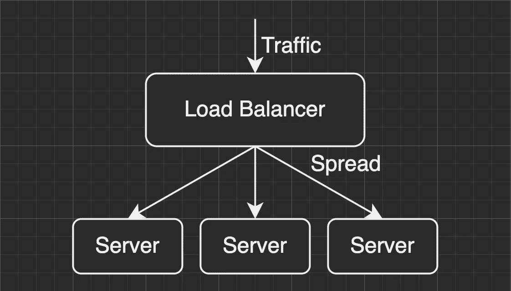

# 负载平衡的高级挑战

> 原文：<https://medium.com/geekculture/the-advanced-challenge-of-load-balancing-6f6ef5f36ec4?source=collection_archive---------29----------------------->

## 并非所有流量都可以任意路由。

虽然承担了成熟服务的责任，但是单个服务器可能无法处理所有的工作负载。这是由于三个主要考虑因素:性能、可用性和经济性。

为了很好地处理过量的流量，增加处理请求的能力是必要的，这可以通过纵向扩展或横向扩展来实现。

Photo by [Piret Ilver](https://unsplash.com/@saltsup) on Unsplash

然而，机器故障时有发生，使用顶级规格机器的成本可能无法承受。在大多数情况下，将工作量平均分配给多个普通员工听起来是一个更可行的解决方案。

这看起来很自然…对吗？

> 是的，但实际上不是。

该架构适用于大多数无状态 API，但是这个新添加的“ **Spread** ”行为为其他有状态交互增加了一些不确定性。

# 会议

任何让服务器存储“状态”的技术都会导致它们之间不同的逻辑行为，这可能与上面的一般负载平衡架构相冲突。

在 web 服务上使用会话是一个典型的例子。

受限于 HTTP 协议的无状态设计，为了让用户在每次操作时都有连续性，在服务器端存储了一定时间段内的上下文信息，如登录状态、购物车等。

就像现实世界里的外卖一样。顾客在柜台点餐后可以获得一个号码牌，当饭菜准备好了，他们可以拿着号码牌取餐。

Photo by [Brooke Cagle](https://unsplash.com/@brookecagle) on Unsplash

对于顾客来说，点餐和取餐是两个独立的步骤，但具有连续的逻辑，这是因为柜台已经存储了他们是谁以及他们点了什么的数据，并且可以通过他们提供的车牌进行检索。

## 粘性会话

嗯，大多数时候，号码牌只能在同一个商店使用，我们不能拿着在 A 店得到的号码牌去 B 店吃饭。

这个原则在 web 服务上也是一样的，因为会话数据可能是不共享的。解决这个问题有两个主要方向:

1.  在所有具有外部存储(例如 Redis 集群)的 web 服务器之间共享会话数据
2.  强制将来自同一客户端的所有请求调度到同一服务器。

第一个稍微复杂一点，超出了本文的范围，在这里我将重点讨论第二个解决方案。

维护客户端和 web 服务器之间的映射关系可以帮助我们将每个客户端转发到它们上次连接的同一服务器，该服务器当前为它们处理会话上下文。

这可以通过来自客户端的各种标识符来实现，如 IP 地址和 cookies。许多知名的负载平衡解决方案通过不同的方法提供了这一选项，如 AWS NLB/ALB、GCP 云负载平衡器和 CNCF 的 Envoy。

Photo by [Benedetta Pacelli](https://unsplash.com/@bibipace) on Unsplash

但是，启用粘滞会话选项相当于添加一个可能与流量平衡相冲突的硬性规则。例如，在处理大量具有相同 IP 地址的客户端请求时，基于 IP 的粘性会话可能不是一个好的选择，因为它可能会导致部分服务器工作负载过重。

# WebSocket

在现代软件服务中，有很多情况需要实时更新信息，比如股市交易、网络游戏、聊天室等。

使用由客户端发送的周期性请求驱动的轮询策略听起来不经济，我们需要为每个请求支付 TCP 连接的成本，并且很可能没有要更新的信息。

采用全双工通信的 WebSocket 是一个值得尝试的解决方案。它允许服务器端主动向客户端推送消息，有效地避免了无意义的请求。

然而，在第一次请求之后，客户机和服务器之间的长期连接将被保持…

> 我们实际上是在平衡连接，而不是工作负载。

> 这有什么问题吗？

主要风险是工作负载不能在多台机器之间适当分配:

*   不同的连接同时有不同的工作量
    对于聊天软件服务器来说，有很多好友的用户可能会比没有好友的用户有高得多的连接工作量(好难过……)。
*   相同的连接在不同的时间有不同的工作负载
    一个明显的例子是游戏服务器，尤其是大型开放世界 RPG。当一个角色在市场中浏览和交易物品时，所需的数据传输可能相对较小，但由于很多角色在激战中频繁移动和施放技能，工作量可能会在瞬间急剧增加。

Photo by [Chanhee Lee](https://unsplash.com/@cha_ra_cha_chan) on Unsplash

为了避免单个服务器承载过多的工作负载，有两个主要方向可以解决这个问题:

1.  降低集群扩展触发器的度量值上限
2.  通过重新连接重塑流量

## 降低集群扩展触发器的度量值上限

假设经过一段时间的观察和统计，我们发现同一组 WebSocket 连接在高峰时段的工作量大约是平时的两倍，那么我们可以做一些简单的计算:

*   将 70%的资源使用设置为横向扩展触发器是非常危险的，常见的流量波动很容易使服务器过载。
*   将 50%的资源使用率设置为横向扩展触发器可能是一个很好的选择，从过去的经验来看，每台服务器在超过 99%的时间里都不会耗尽资源。
*   将 30%的资源使用率设置为横向扩展触发器似乎不太经济，超过一半的资源在非高峰时段处于闲置状态。

这只是一个简单的例子，很容易解释，这个策略高度依赖于你的服务的流量形状和业务性质。

Photo by [Marcus Castro](https://unsplash.com/@marcuscastro) on Unsplash

如果服务只在节假日遇到流量高峰，我们绝对可以在工作日设置 70%的资源使用量为上限，只在节假日前增加触发的敏感度。

老实说，我不建议将这种做法作为长期解决方案。虽然这种方法相对简单，并能立竿见影，但并没有从根本上解决工作负载不均衡的问题，反而使设备成本增长更快。

## 通过重新连接重塑流量

另一个更可靠的做法是通过重新连接来重塑所有流量。在一定程度上克服了长期连接的均衡失败，但也给用户体验和服务弹性带来了新的挑战。

> 每一次重新连接不仅是一次机会，也是一次风险。

重新连接的时机是一个关键问题，它对负载平衡的有效性和用户体验有非常直接的影响。以下是几种常用的策略:

> **定期重新连接**

这是最直观的方法之一，通过适当的时间间隔设置，几乎可以保证工作负载均衡的有效性。不幸的是，这一硬性规则的强力可能会破坏客户在使用服务时的体验。

Photo by [JOHN TOWNER](https://unsplash.com/@heytowner) on Unsplash

产品经理可以很容易地列出不应该被打断的情况:

*   用户在购物时没有意识到预算控制
*   用户正在填写采购订单所需的信息
*   用户在电子竞技游戏中玩玩家对玩家(PVP)竞技场
*   用户正在玩一种每轮都有时间限制的纸牌游戏，目前正在倒计时

毫无疑问，当用户期望流畅的操作时打扰他们是很糟糕的。

> **选择合适的时机重新联系**

既然可以梳理出很多不适合重新连接的情况，那么另一方面也可能存在一些适合的。更确切的说，我们可以利用好用户可以接受并期待等待的时刻:

*   开始在社交应用上观看新的直播
*   请求大量数据或下载文件
*   在开放世界角色扮演游戏中的不同地图间传送

当用户准备等待时，他不太在乎多等一会儿，他们甚至不会注意到你在偷偷重新连接。即使重连不幸失败，也不会中断持续运行，不会产生太大的负面影响。

# 包裹

良好的用户体验往往被视为圣杯，为了实现各种产品想象，其背后的技术和策略总是惊人的。

我希望我在负载平衡架构和策略方面的经验分享可以帮助您在未来很好地处理软件工程中的挑战:)