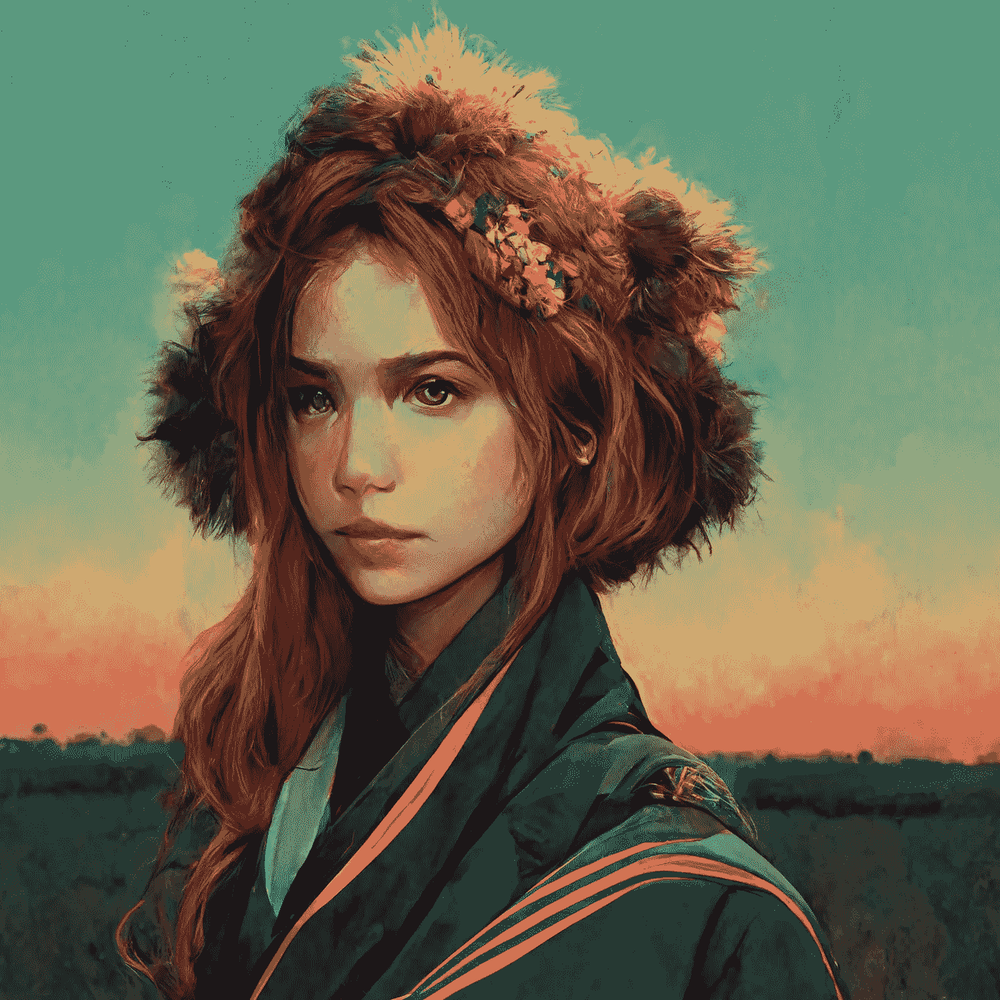
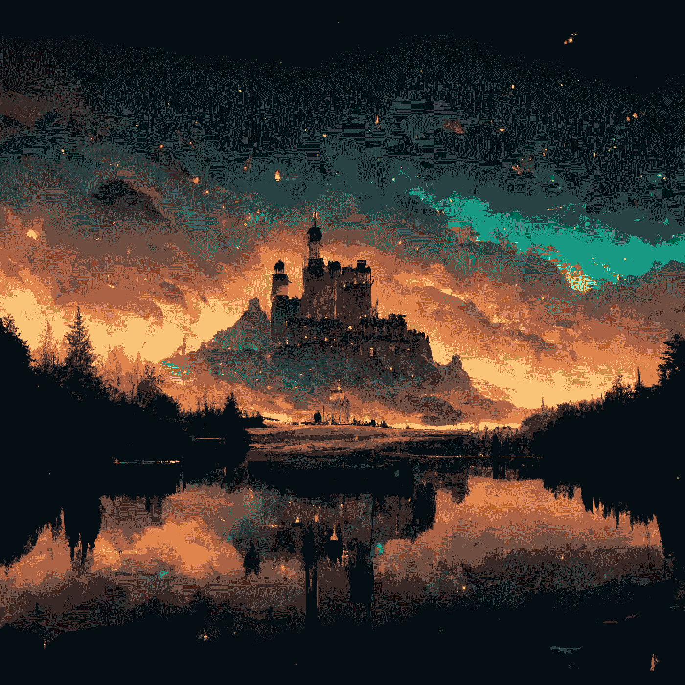
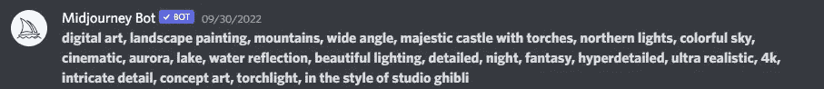
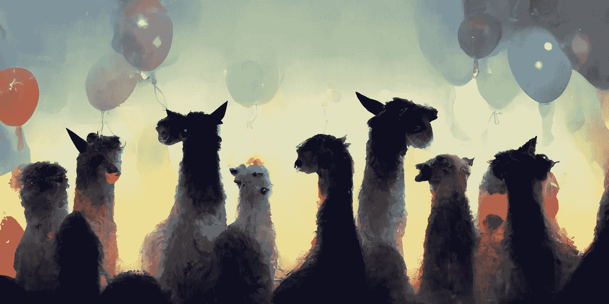
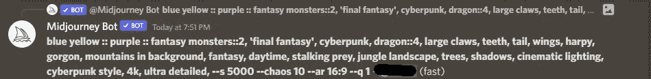
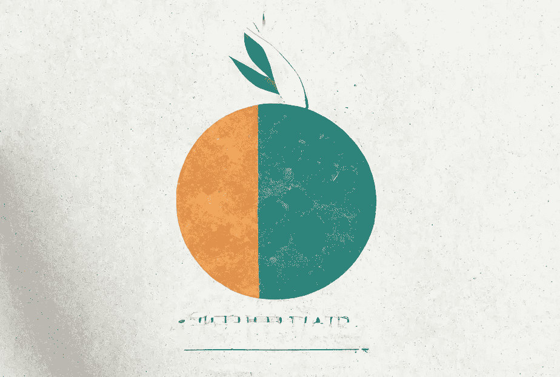
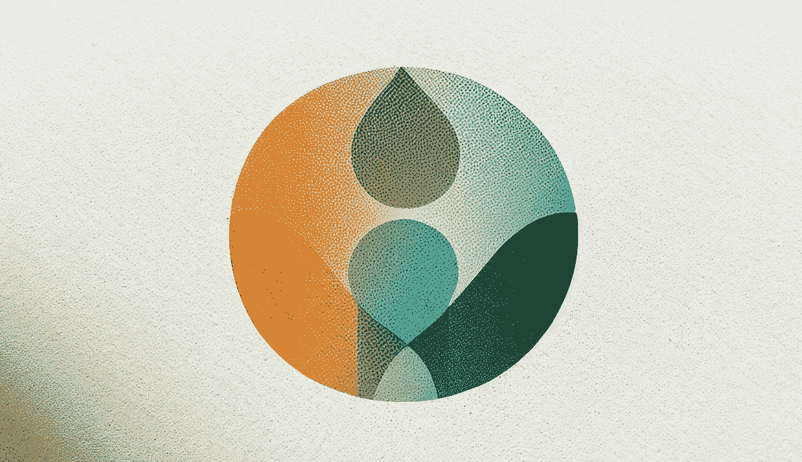
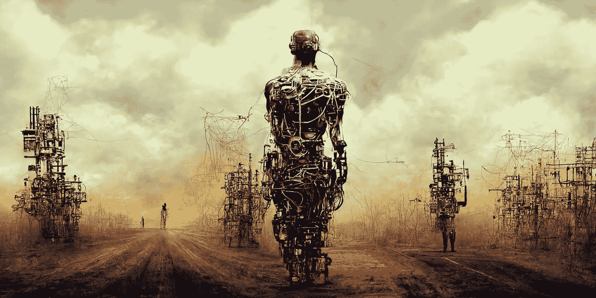
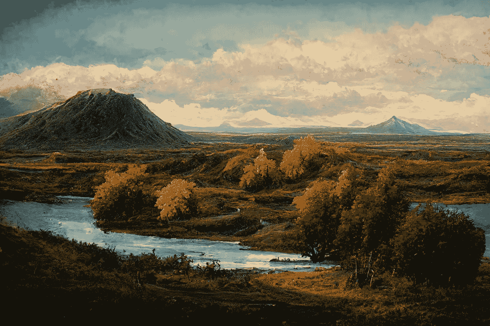
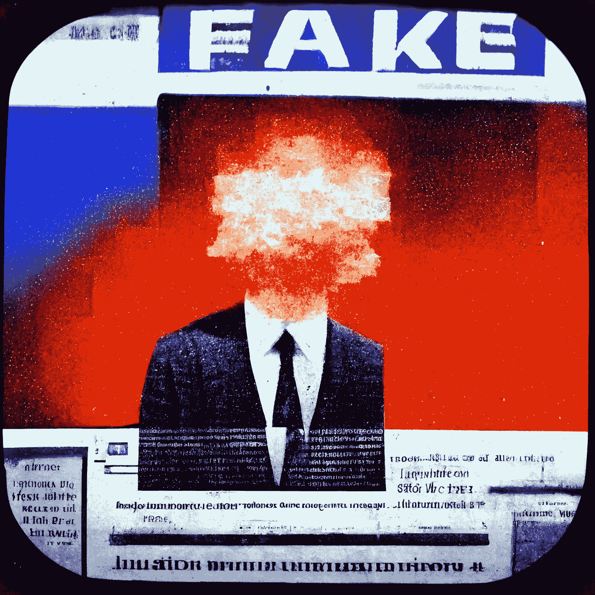

# 人工智能艺术革命:艺术家的未来是什么？

> 原文：<https://medium.com/geekculture/the-ai-art-revolution-161631d6d85f?source=collection_archive---------1----------------------->

## 随着新工具的出现，艺术家的未来变得不确定但充满希望。

Picture: Me via [Midjourney](https://www.midjourney.com/home/)

第一次听说 AI 美术软件的时候，我并没有太多的期待。绘制详细的艺术品(无论是否是数字的)是一项重大的时间投资，需要爱和耐心——我认为人工智能肯定不会接近模仿人类艺术家的技能和创造力。5 分钟后，在试用了一款名为 Midjourney 的人工智能艺术软件后，我得到了以下结果:

My first creation with [Midjourney](https://www.midjourney.com/home/)

太令人激动了。我不仅被照片的细节和质量震惊了，还被它所花费的时间、金钱和专业知识震惊了。这相当于一个经验丰富的数字艺术家至少一整天的工作，只有那时我才意识到这不仅仅是一个好玩的工具，这将是一件大事。在这里，我将讨论什么是人工智能艺术，它是如何产生的，人工智能艺术的一些利弊，以及它对艺术未来的影响。

**什么是 AI 艺术？**

在目前的形式下，人工智能艺术正在使用一种经过训练的人工智能算法从文本提示中生成艺术品。你描述你想让人工智能做什么，它会突突前进一分钟，然后给你一张图像。

My first text prompt for [Midjourney](https://www.midjourney.com/home/)

本文中使用的几乎所有图像都是由一个名为 [Midjourney](https://www.midjourney.com/home/) 的人工智能生成的，但也有许多其他人工智能艺术程序，如 [DALL。E2](https://openai.com/dall-e-2/) ， [DALL。E mini](https://dallemini.com/) 、[稳定扩散](https://stablediffusionweb.com/)和 [NightCafé](https://creator.nightcafe.studio/) 。这些只是其中的一部分——我建议免费试用一些，亲身感受一下它们的能力。

**AI 艺术是如何创作的？**

让我们看看魔法是如何实现的。简而言之，他们在网络上搜索数以亿计的图片，这些图片与给定的描述相匹配，使用标题和替代文本来帮助它“理解”你所描述的内容。它利用这一点创建了一个包含数百种特征的库——比如事物有多少红色、圆形和光泽。这建立了它对事物外观的“理解”，所以当你在生日聚会上要求一群羊驼时，它大致明白你的意思。最后，它采用一组随机像素，然后通过使用它对您的文本提示的“理解”一遍又一遍地细化像素来生成一个全新的图像，直到它交付您的作品:

Me via [Midjourney](https://www.midjourney.com/home/) — ‘a group of llamas at a birthday party’

Vox 在这里做了更好的解释，只用了几分钟:

Video: [Vox](https://www.youtube.com/c/Vox)

解释这一点的意义在于，AI art 不会复制任何一个人的艺术作品——它使用它们来建立一个总体的“理解”(或知识)，然后生成像素，直到它与它认为图片应该具有的所有特征保持一致。这个过程部分是随机的，所以你永远不会得到两次相同的图像——每件艺术品都是独一无二的。

**有多容易，多贵？**

如果你尝试过上面提到的人工智能程序，你会发现制作一些非常不错的艺术作品是相当容易的，充满了丰富的风景、建筑和创造力的细节。一旦你更深入地了解它，你会发现使用提示来生成更好的图像是很有深度的——这就是所谓的“提示制作”。

An example of a more complicated text prompt I used

学习一个人工智能的所有怪癖，以及如何最好地与它交流，将会给你带来比新手用户明显更好的结果，所以这个过程中肯定涉及到一些技能——但不可否认的是，即使是新手也可以非常快地提供显著的结果。

至于价格，我目前有 Midjourney 的标准 30 美元/月计划，但许多都是免费的或提供免费试用，所以临时用户可以很容易地找到很好的软件，只需很少的费用或根本不需要费用。

# **艺术家会被淘汰吗？**

人工智能艺术引发的最大担忧是它将如何影响艺术家——特别是数字艺术家和平面设计师——现在有一个免费而简单的工具可以生成优秀的艺术品。本能的反应是规定艺术家将很快不再被需要，因为人工智能将能够更快更便宜地完成它，而不会牺牲质量。然而，我认为更有可能发生的是，艺术家的工作会略有变化，但会有更多的*工作给艺术家，以及更多的艺术家——让我来解释为什么。*

Quick logos I made via [Midjourney](https://www.midjourney.com/home/)

**首先我们来谈谈 AI 艺术是如何降低准入门槛的，以及为什么这是一件如此好的事情。人工智能艺术提供的成本和可访问性在创意领域是无与伦比的，这意味着它几乎可以在任何时间为任何人提供。你小时候喜欢创作艺术，但成年后却没有时间或金钱去追求你的激情吗？也许你买不起昂贵的绘图板和功能强大的计算机来运行绘图程序，或者在一次事故中失去了手指，或者天生就没有手。好吧，现在你可以在任何情况下创造艺术了！看到不同的提示和参数如何改变最终结果是一件非常有趣的事情，你可以通过生成无数的变化和调整提示，迅速投入几个小时来完善一些你最喜欢的图像。**

**“但那不是真正的艺术”**一个愤怒的声音叫道——**“那只是让计算机替你做而已”**。人们很容易将人工智能艺术斥为“太容易”、“欺骗”或“不恰当的艺术”，但这回避了一个问题——艺术到底是什么？如果它在美学上令人愉悦，让你感到快乐，或者给另一个人的生活增加价值和意义，为什么它不应该是艺术呢？你必须直接参与多少创作过程，才能称之为艺术？

**艺术和非艺术的界限在哪里？**

Picture: Me via [Midjourney](https://www.midjourney.com/home/)

> 随着人工智能模型的发展，这些模型可以生成非常令人信服地模仿人类文本、视觉或音乐创作的内容，我们对艺术的许多传统以及当代的理论和实践理解可能会受到挑战。

目前关于人工智能有很多骚动，但许多数字人文专家，如 Eva Cetinic 和 James She 承认，随着他们的能力迅速提高，人工智能在绘画、音乐和文学创作中发挥不可或缺的作用可能会成为常态。

许多人认为用户没有自己制作主题是不公平的——但是摄影师呢，他们通常也不自己制作场景。那些捕捉美丽的风景，调整焦点、亮度、饱和度、构图和其他一系列指标来交付惊人结果的人不是艺术家吗，因为他们自己没有创造乡村？在一个关于人工智能艺术的播客中，有人谈到他们的祖母喜欢拍摄树叶版画并将其镶在玻璃框中——我们会因为他们没有创造这个主题而取消这种艺术的资格吗？肯定不是！同样，就像摄影师使用他们的相机制作艺术，音乐家使用他们的乐器(特别是那些使用数字工具的)，动画师使用他们的动画软件一样，数字艺术家也有理由使用 Midjourney 这样的人工智能软件。

**过去，当照相机发明时，那些毕生致力于巧妙地画脸的肖像艺术家们一片哗然，**同样，许多人会想要保护他们如此努力工作的工艺——这是可以理解的。将有一部分人会受到人工智能艺术的负面影响，但更多的人将受益于更少的障碍来创造性地表达自己。当数码相机出现时，拥有昂贵的暗室和设备的摄影师嘲笑“嗯，任何人都认为他们现在可以成为摄影师”，人工智能艺术也有这样的趋势。这是真的。现在任何人都可以成为艺术家*，这是好事。*

# **艺人的角色会有怎样的变化？**

更多的创造性表达是好的，但我们对艺术家的理解将会改变——艺术家和设计师 Rob Sheridan 认为，他们可能更接近艺术策展人，而不是专注于画笔或钢笔的技术技能。可能仍然需要一些绘画技巧，但艺术的未来将涉及一个通过调整参数来选择、调整和精炼艺术品的重要过程——非常类似于摄影师的过程。

例如，如果一个项目的气氛需要更加黑暗和紧张，那么你可以在某些调色板上增加更多的强调，改变场景的照明方式，并从专门研究类似主题的艺术家那里获得灵感。即使在这些早期阶段，如果你知道正确的命令，你也可以对图像的特定部分进行大量的控制——而且这只会随着时间的推移而变得更好。在未来的迭代中，经过特定数据集(例如，冰岛的风景)训练的人工智能助手可能能够在你绘制时提供实时改进，根据你希望场景描绘的情绪，以你自己的风格填充单调乏味的细节，如草或树叶。

My autumnal Icelandic landscape via [Midjourney](https://www.midjourney.com/home/)

这与我们目前对“艺术家”的理解非常不同，但这正是它如此令人兴奋的原因。能够更容易地制作高质量作品的新可能性意味着一个全职游戏艺术家团队可以为视频游戏制作整个世界，而不仅仅是少数可探索的领域。想要创建自己的游戏的个人将拥有他们需要的所有工具来创建身临其境的体验，而无需辞去工作或在项目上花费 3 年时间。人们将有更多的时间来探索更多的想法，因为只需花很少的时间来测试一座被毁的修道院、导水管或祭坛是否最符合你的设想。对于有预算和期限的公司来说尤其如此——**时间是你可以尝试的事情数量的真正约束，限制了创造力的进程。**

鉴于人工智能艺术的时间节省和效率，人们对未来需要的艺术家数量表示担忧，特别是在游戏行业。难道我们不能雇佣更少的人来做同样多的工作吗？我强烈认为，如果公司将人工智能应用到他们的创作过程中，他们会希望针对特定的艺术风格，在特定的数据集上训练他们自己的定制人工智能，这是一个需要艺术家的过程——而使用这种训练有素的人工智能将需要更多的艺术家。雇佣艺术家的行业界限也将被打破——例如，大型游戏开发公司不太可能采取雇佣更少人员和制作平庸游戏的节约措施，而其他公司花费相同或更多，并通过更广阔的世界和令人难以置信的艺术风格来击败他们。

为了进一步说明，Techdirt 播客解释说，当游戏刚开始时，很少有人致力于开发游戏艺术——你根本无法用技术做那么多。一旦计算机生成图像(CGI)成为主流，从事游戏艺术的人数就会激增，因为它从基本的 2D 场景发展到小型 3D 世界，再到你可以在闲暇时探索的整个星系。**同样，人工智能艺术可能会增加而不是减少对艺术家的需求，因为这项技术将支持潜力的巨大飞跃。**

最后，值得注意的是，尽管人工智能提供了许多承诺，但传统艺术仍有可能持续一段时间——毕竟，数码相机并没有让传统艺术家过时。人工智能艺术技术远非完美，许多人不允许诸如显式提示或显式图像之类的事情，因为关于 deepfakes 的非常现实的问题，以及像假新闻这样的非显式(但仍然非常有害)内容的问题。一旦我们可以生成任何场景的真实 AI 图像——甚至视频——我们对媒体的信任程度将受到严重质疑。如果你还不相信从这篇文章中区分人工智能艺术和人类艺术有多难，一项调查显示 [75%的时候人们认为由名为 AICAN 的自主人工智能生成的图像(甚至不是由人类提示的)是由人类艺术家制作的。我们还有一些时间来考虑如何解决这些问题，但随着人工智能的飞速发展，这个窗口正在迅速关闭。](https://www.proquest.com/docview/2190341785?OpenUrlRefId=info:xri/sid:primo&accountid=14693)

Picture: Me via [Midjourney](https://www.midjourney.com/home/)

进一步的问题出现在所有权和版权方面。以特定艺术家的风格创作艺术，而他们却没有因此获得荣誉，这公平吗？考虑到人工智能如何创造全新的东西，以及任何人都可以选择模仿另一位艺术家的风格，我认为版权是一个较小的问题。另一方面，所有权更复杂。人工智能艺术是一个内在的协作过程，有用户的提示，也有创建代码的工程师和整个系统的作者。没有一方可以合理地被认为创造了这件艺术品，那么著作权应该如何分配呢？目前，它是给使用人工智能软件的用户的——但我们只是在辩论的初级阶段。

抛开道德问题和不良后果不谈，我相信人工智能艺术提供了革新艺术的可能性，并向更具创造力的头脑敞开大门。不管你是否支持，这项技术已经存在，而且很可能会继续存在。谷歌有自己的版本，名为“Imagen ”,正在开发中，还有脸书自己的“场景制作”。[人工智能艺术已经在拍卖会上卖出了几十万美元](https://www.theguardian.com/artanddesign/shortcuts/2018/oct/26/call-that-art-can-a-computer-be-a-painter)，一些行业如股票图像已经认识到这些工具的潜力，并在他们的网站上禁止它们，这是他们目前和未来能力的证明。

**我期待人工智能艺术如何帮助人们前所未有地发现、创造和表达自己。**游戏开发行业可以充分利用这项技术，而且很难说其他哪些领域可能会受到影响——如果有一种方法可以利用人工智能艺术生成，那么没有比现在更好的时间开始学习了。

**来源**

作为一名业余艺术家和哲学家，我对人工智能艺术有着个人兴趣，我研究了各种播客来吸收我的想法，其中最全面的无疑是我强烈推荐的 [Techdirt 的](https://www.techdirt.com/2022/09/13/techdirt-podcast-episode-329-is-ai-art-the-end-for-artists/#comments)。我还协助管理一个推广数字艺术家的大型 Instagram 账户(@ digiartique)，亲眼目睹了随着艺术家从传统技术转型，这种技术得到了广泛而迅速的接受。所有其他来源在提到的地方都有链接。

Techdirt — Is AI Art The End For Artists?

詹姆斯是一名大学生，对社会问题、气候变化和哲学充满热情。如果您喜欢您所阅读的内容， [*请在此订阅*](/subscribe/@jamesroywood) *，以便在他发布新内容时第一个更新。*