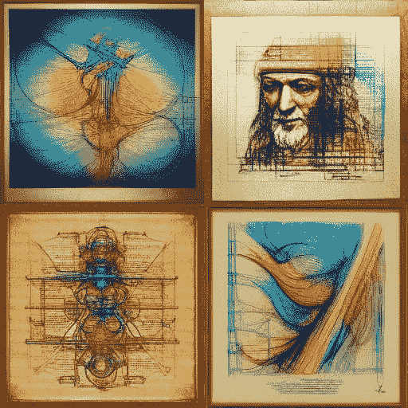

# 物联网中的人工智能:为什么它们的融合很重要

> 原文：<https://medium.com/geekculture/the-ai-in-the-internet-of-things-iot-why-their-convergence-matters-66caa2f0ac5f?source=collection_archive---------13----------------------->

人工智能和物联网的融合是完美的匹配:它是什么，为什么它很重要，它们如何一起工作，要素和应用

Created by [the Author](/@AnilTilbe), drawings of artificial intelligence

我敢打赌，你会同意或听到有人说“物联网”是当今最令人困惑的话题之一。