# 光探测器在 Unity 中的惊人力量

> 原文：<https://medium.com/geekculture/the-amazing-power-of-light-probes-in-unity-a03c5ac3b643?source=collection_archive---------9----------------------->

**目的**:展示 **Unity** 中**动态游戏对象**上**光探头**的惊人威力。

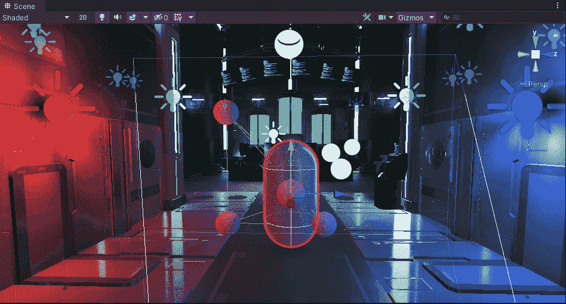

## Unity 中的光探头是什么？

**光探头**的**主要用途**之一是**为我们**场景**中的**动态移动物体**提供高质量的照明**。这是如何通过**捕捉**并使用**烘焙****照明信息**来实现的**这是通过**在你的**场景中的**空白空间**传递的。**它能够通过构建**光探头**到**光探头**光探头**光探头**和**暗探头**区域的**点阵来完成这一点。**光探头**要求**周围的静态元件**将**的光线**投射到**动态物体**上。例如，当玩家在场景中移动时，我们可以选择使用墙壁、地板和天花板来动态地将光线投射到玩家身上。**

## 让我们在场景中设置灯光探头

在你的**层级**窗口中**合一，** *右键→灯→灯探针组*。你现在应该看到这个**类型**的**框**，我们将从**检查器**中**编辑**:

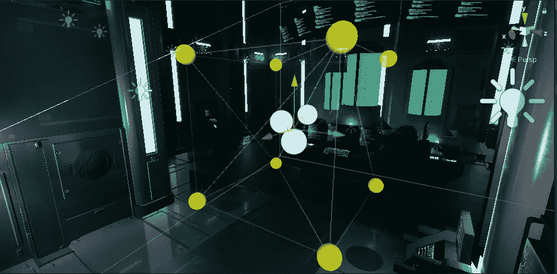

Initial Light Probes in Scene view

从这里，让我们点击'**编辑光探头** ' **框**，然后我们可以按'**选择所有** ' → ' **复制选择的**'。我们将**移动**这些**新的 8 个光探头** **到****现有的**上面，这样我们就能把**靠近**车顶**:**

**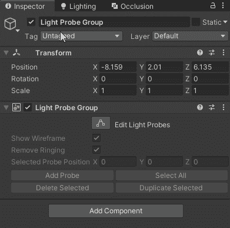**

**Inspector for Light Probe Group game object**

**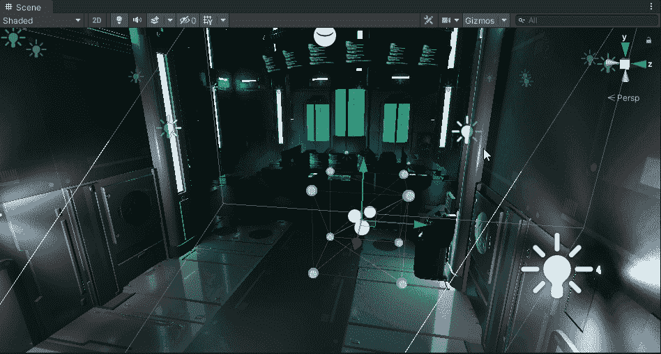**

**Duplicating Light Probes in Scene view**

**然后我将**复制**所有这些**光探头**并开始**为**房间**建造**整个格子**。最终结果可能如下所示:****

**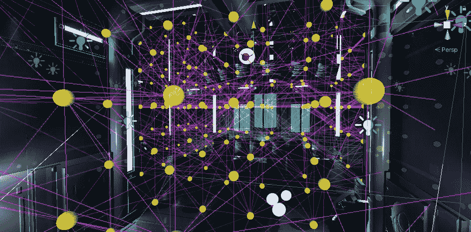**

**Scene view — Probably have way too many setup, but you get the point!**

**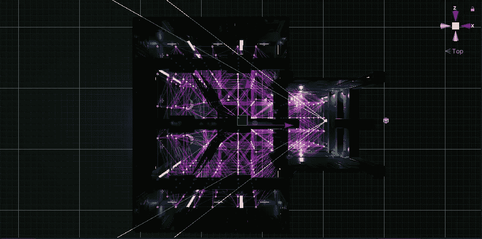**

**Top down view**

**现在让我们在**场景**中选择一些**静态元素**，我们将使用它们来动态投射**光线**。在这种情况下，我将使用我的**地板**、**墙壁**和**天花板**和**勾选**检查器**中的**静态**框中的**:**

**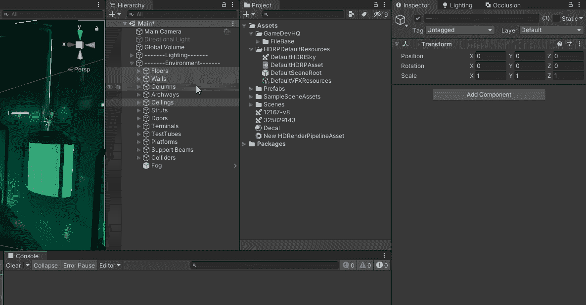**

**这将为这些**静态游戏对象**启动**烘焙**过程。**

**让我们在**场景**中添加一个**原始太空舱**，这样我们就可以移动它来观察**光探测器的工作。****

**如果此时你正在**场景**周围**移动**你的**胶囊**但是你的**光探头**只有**黑**，那么**极有可能**你的**灯**没有**设定**为**烤**。所以让我们把这个**换成**看看有什么变化:**

**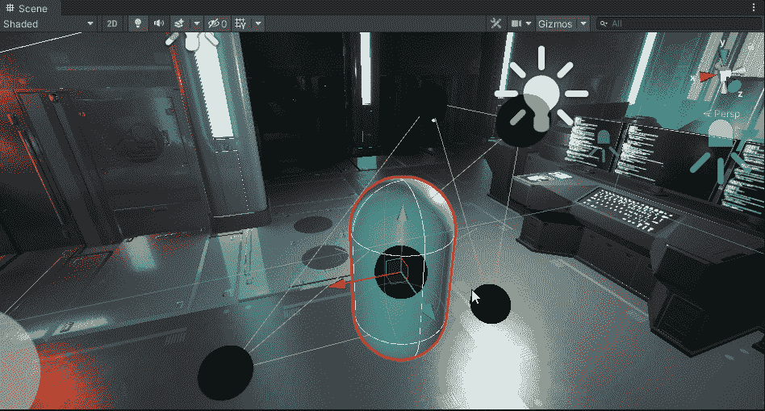**

**Using Realtime Point Lights**

**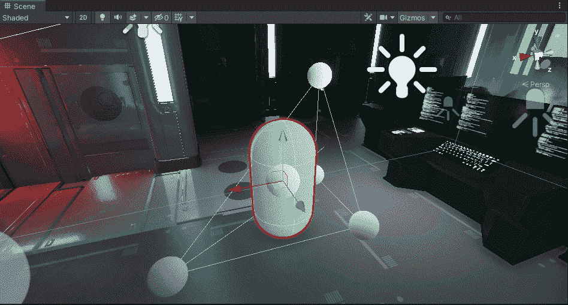**

**Using Baked Point Lights**

**成功！但是正如你所看到的，我们现在有了**和**白光探头**的不同颜色**。这是由于**照明**在**暗**和**亮区域**。当我们**移动**时，你周围的**玩家**也可以看到，它在不断地**寻找 **4 个最近的光** **探测器** ( *形成一个四面体体积*)和**使用** **这些**到**光本身**基于这些。****

**这些**光探头**知道有**颜色从这些**表面**反弹**并且这个**照明信息**被**存储在这些**光探头**内**以便当**玩家**接近**它们**时，它将根据**这个信息**开始**自己照明****

****

**现在让我们继续并关闭我们的'**灯光探针组**'**来查看**灯光**在**动态对象**上的**差异:******

****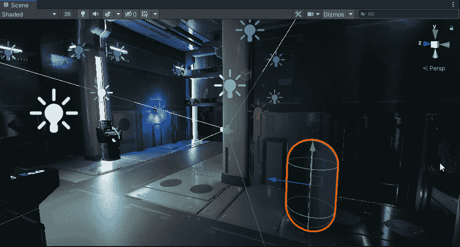********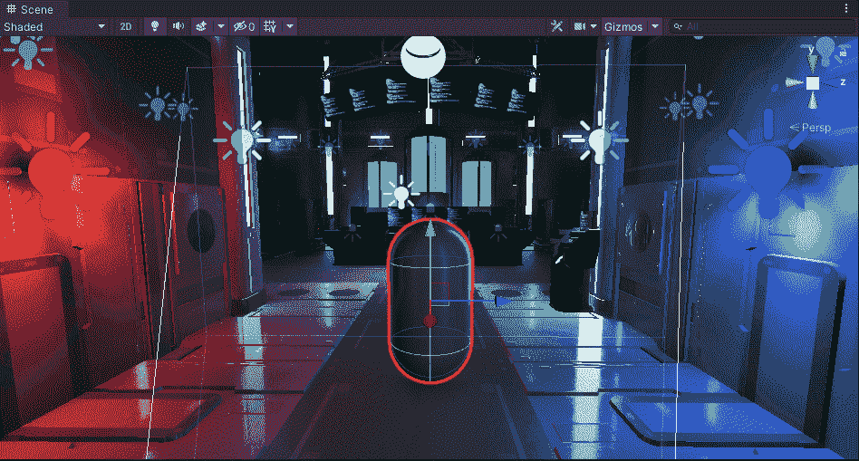****

****我绝对会在我未来的游戏中尽可能使用**光探测器**，这是惊人的不同！****