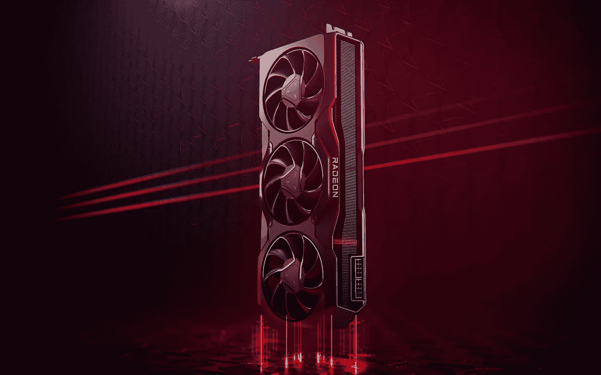

# AMD 镭龙 7000 系列是电脑游戏玩家真正需要的

> 原文：<https://medium.com/geekculture/the-amd-radeon-7000-series-is-what-pc-gamers-actually-need-7103b7cb0d55?source=collection_archive---------1----------------------->

## 红队正在走一条不同于绿队的道路，这很可能是更好的道路

AMD unveiled its latest graphics cards and the choices it made may have changed the rules of the game for nVidia after all. (Image: AMD)

AMD 信守承诺，推出了镭龙系列显卡的最新成员，宣布了 RX 7900 XTX 和 RX 7900 XT，这两款产品都基于其新兴的 RDNA3 架构。许多人已经…