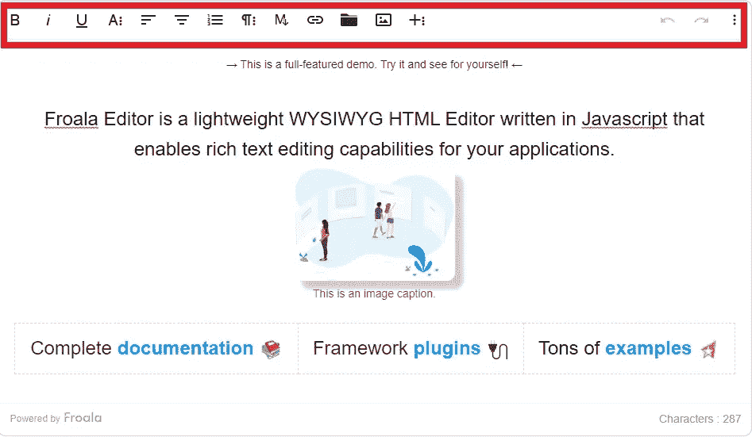
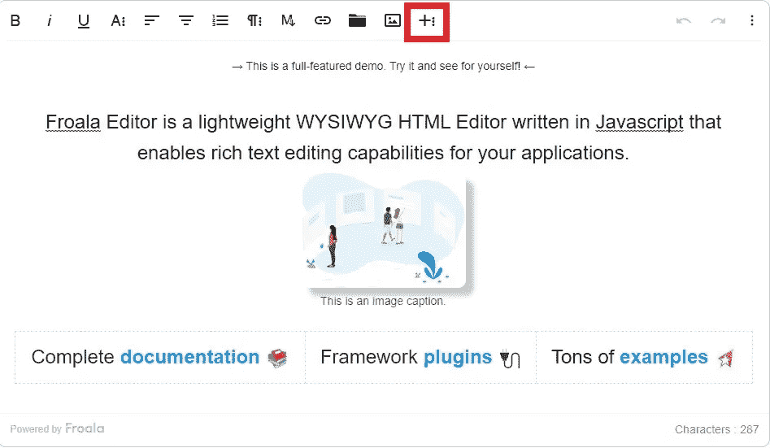
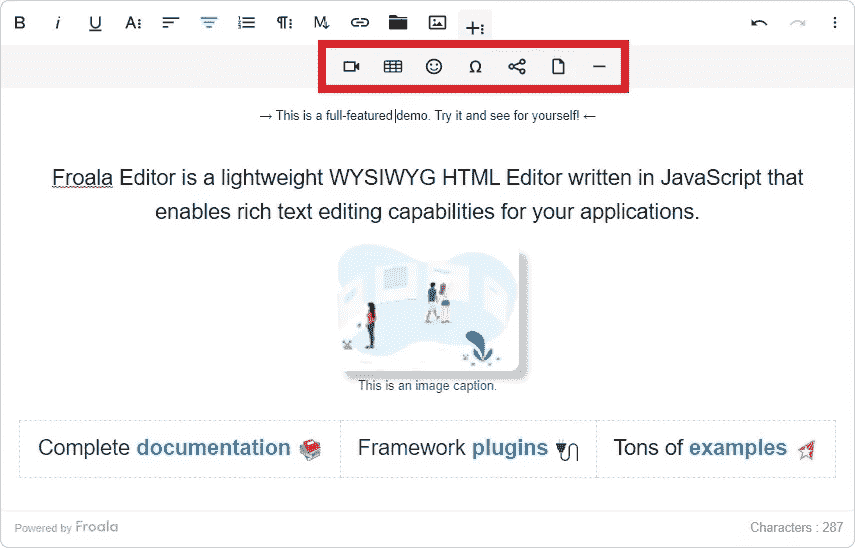
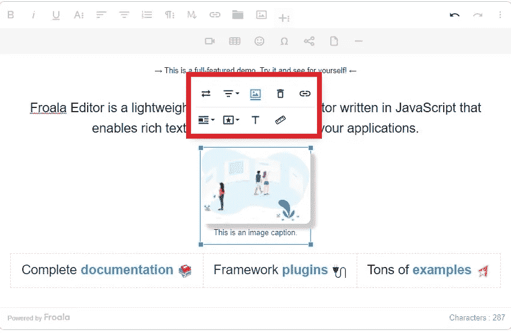
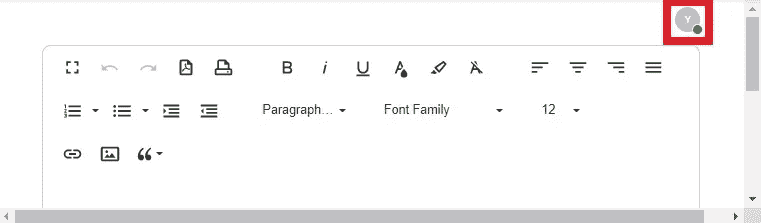

# 一个优秀富文本编辑器的剖析

> 原文：<https://medium.com/geekculture/the-anatomy-of-a-great-rich-text-editor-58b74b5ccbd5?source=collection_archive---------13----------------------->


Photo by [Kira auf der Heide](https://unsplash.com/@kadh?utm_source=unsplash&utm_medium=referral&utm_content=creditCopyText) on [Unsplash](https://unsplash.com/s/photos/anatomy?utm_source=unsplash&utm_medium=referral&utm_content=creditCopyText)

富文本编辑器允许您毫不费力地编辑内容。只需点击几下，您就可以更改格式、插入图像和添加链接。它可以显著提高你的工作效率。

网上有很多类似的工具。但是哪个是最好的选择呢？一个伟大的富文本编辑器的结构是什么？在这篇文章中，你会找到细节。

# 什么是富文本编辑器？

富文本编辑器是一种方便地添加和格式化内容的工具。它允许你在不写代码的情况下包含图片、链接、视频和其他组件。

使用富文本编辑器不需要技术知识，非常容易。结果，它在世界范围内大受欢迎。

# 一个伟大的富文本编辑器有什么特点？

*   易于使用的界面:一个伟大的富文本编辑器带有一个用户友好的界面。它可以让你轻松找到所有必要的工具。它可以帮助您快速编辑内容，提高您的工作效率。
*   **快速格式化:**最好的文本编辑器可以让你立即格式化内容。您可以简单地选择文本并选择想要应用的格式选项。因此，您可以毫不费力地编辑内容。
*   **响应式设计:**响应式设计使富文本编辑器可以通过所有现代设备轻松访问。它使您能够随时随地创建和编辑内容。
*   **出色的性能:**最好的富文本编辑器超快。它不会让你因为长时间的加载而沮丧。它利用多种优化方法来提供最佳性能。
*   **可扩展:**最好的文本编辑器，让你方便的集成第三方工具。因此，您可以轻松地扩展功能。

# 谁是 2022 年最好的富文本编辑器之一？

2022 年最好的富文本编辑器之一是 [Froala](https://froala.com) 。这是一个用 JavaScript 编写的轻量级网络编辑工具，设计简洁。您会喜欢使用它，因为 Froala 允许您毫不费力地更改您的内容。

*   直观的 UI 设计提供了出色的编辑体验
*   非常容易集成到网站和网络应用程序中
*   重量轻，速度超快
*   为第三方工具提供简单的集成，包括 WProofreader 拼写和语法检查插件
*   响应式设计允许您在所有现代设备上编辑内容，包括台式机、笔记本电脑和智能手机

# Froala 能给我提供毫不费力的编辑体验吗？

Froala 带有用户友好的界面。它可以让你快速找到所有的编辑工具。你不必到处寻找必要的功能。

您可以在工具栏中找到所有工具。看一看它。



如您所见，有几个富文本编辑特性。您可以插入降价、链接和图像。另外，还可以添加图片。如果您需要更多富文本编辑功能，请点击 **+** 图标。



现在，您可以添加视频、表格、表情、水平线和特殊字符。此外，您可以嵌入网址和上传文件。



Froala 给你一个轻松的编辑体验。让我们来看一个实际的例子。每当你点击图像，各种编辑选项就会出现在它的上面。



从这里，您可以对齐或替换图像。您可以应用不同的样式，如阴影和边框。此外，它允许您添加替代文本，这是至关重要的搜索引擎优化迅速。

正如你所看到的，Froala 使得编辑内容变得非常容易。你只需要选择组件。适当的编辑选项将立即出现。没有复杂性。它为您提供了轻松的编辑体验。

# 它支持实时协作功能吗？

Froala 允许您使用 Codox 工具进行协作。因此，您可以与多个协作者实时编辑内容。

您可以在编辑器的右上角看到活动协作者的列表。



通过实时协作，您可以立即看到编辑姓名的内容变化。因此，您可以毫不费力地跟踪同事所做的所有修改。

将 [Codox 整合到 Froala](https://froala.com/wysiwyg-editor/examples/codox-real-time-editing) 的过程非常简单。

# 我可以轻松地将它集成到我的 web 应用程序中吗？

Froala 支持多种编程语言，包括 JavaScript。您可以将它快速实现到您的 web 应用程序中。你只需要遵循以下步骤:

# 如何将它集成到我的 JavaScript web 应用程序中？

1.  首先，你必须找到你的 HTML 文件。然后为 Froala 创建一个容器。

```
<div id="froala-editor"></div>
```

1.  接下来，打开你的 CSS 文件。您必须添加“link rel”属性来包含所有的 Froala 编辑器插件。

```
<link rel="stylesheet" href="../css/froala_editor.pkgd.min.css">
```

1.  然后转到您的 JavaScript 文件并添加这些行。

```
<!-- Include all Editor plugins JS files. -->
<script type="text/javascript" src="../js/froala_editor.pkgd.min.js"></script><!-- Include PDF export JS lib. -->
<script type="text/javascript" src="https://raw.githack.com/eKoopmans/html2pdf/master/dist/html2pdf.bundle.js"></script><script>
  new FroalaEditor('div#froala-editor', {
    documentReady: false
  })
</script>
```

注意**文档就绪**被设置为**假**。因此，Froala 将作为一个富文本编辑器工作。将 **documentReady** 设置为 **true** 将会把它变成一个在线文档编辑器，就像 Google Docs 一样。

这就是如何在 JavaScript web 应用程序中实现 Froala 的方法。如您所见，这个过程非常简单。没有复杂性。因此，您可以快速完成集成过程。

# 文档:对用户友好吗？

Froala 带有直观的文档。它详细解释了所有的特性。你不必徘徊在谷歌上寻找深入的解释。

文档很容易理解。你不会面临任何理解它的问题。

文档详细解释了集成过程。通过遵循它，您可以毫不费力地将 Froala 实现到您的 web 应用程序中。

此外，它还提供了集成第三方工具的分步指南。它们使您能够快速增强富文本编辑器的功能。

总的来说，文档是全面的，非常容易理解。它可以让你的生活轻松很多。

# 它是否符合您的编辑要求和预算？

Froala 有三种计划:基本版、专业版和企业版。基本计划支持一个产品和三个领域。

如果需要无限域支持，可以选择 Pro 计划。但是，它不允许您在多个产品中使用富文本编辑器。

如果您需要无限的域和产品支持，您必须使用企业计划。它提供了几个关键优势，包括再发行/OEM 支持。

因此，您可以将 Froala 包含在您的网站未使用的产品中。

通过利用该工具的资源，您可以显著增强编辑器的功能。此外，它非常容易集成到 web 应用程序中。