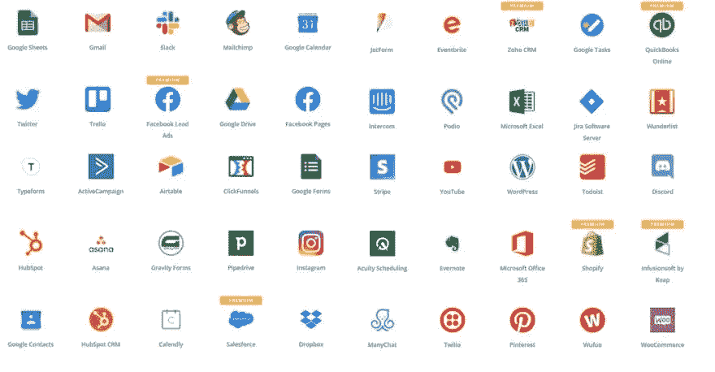
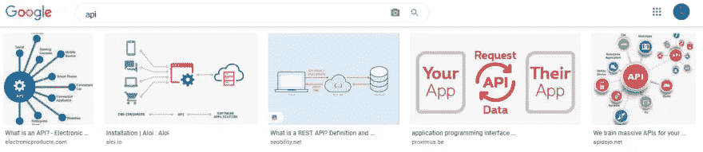
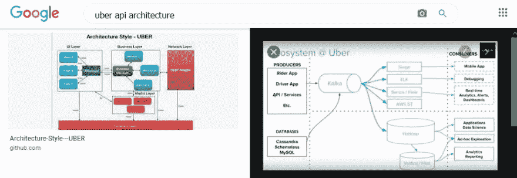
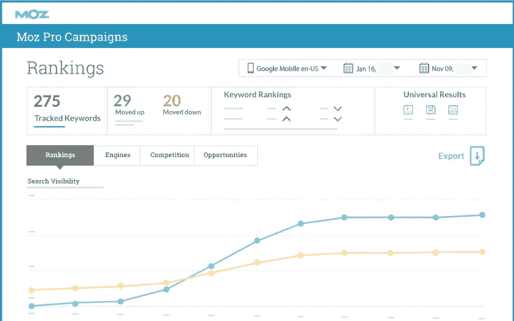
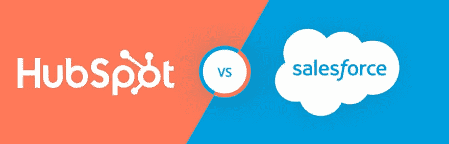
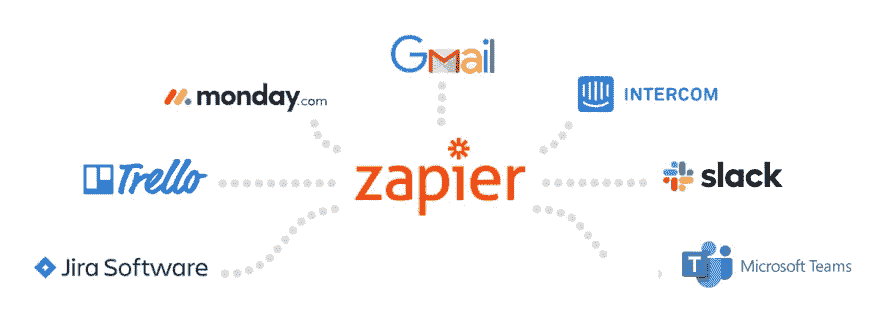
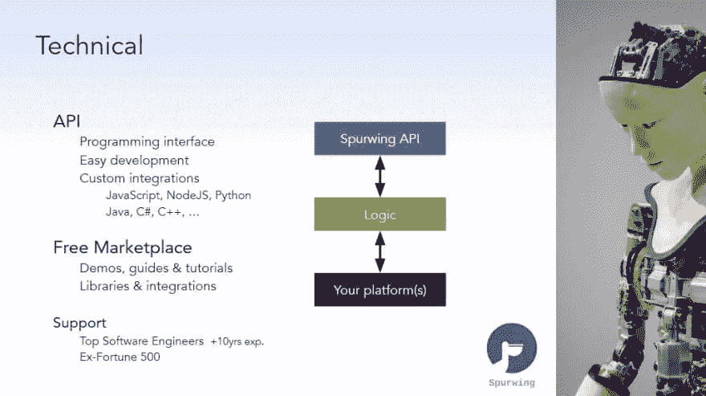

# API 经济

> 原文：<https://medium.com/geekculture/the-api-economy-2ea9d3e10d72?source=collection_archive---------20----------------------->

> API 经济的突然出现引人入胜。

自从应用程序出现以来，应用程序编程接口(API)就一直是应用程序开发世界的重要组成部分，但它们从来没有像今天这样有价值(至少在金钱上)。

在我们日益数字化的全球经济中，各公司都在寻找他们能够找到的任何竞争优势，以提升他们的服务，提高他们的效率，并提供更无缝、更强大的解决方案。

现在，公司比以往任何时候都更加依赖 API 来大幅扩展自己的应用程序的功能，寻找新的方法将不同的解决方案“挂钩”在一起，以比以往更快的速度创建更强大、功能更丰富的应用程序。

这推动了对 API 的需求，引发了一个全新的“API 经济”，这在几年前几乎没有人能够预测到。

# 新兴 API 经济的快速概述

T 他在技术世界的新前沿 API 经济正在改变企业利用这些系统成长和扩展的方式。

以优步这样的科技公司为例。

对使这家独角兽科技公司成为可能的技术的一瞥将显示 API 的价值和重要性。所使用的系统的很大一部分(在面向消费者的方面以及内部)都是建立在 API 的基础上的，这些 API 从一系列完全不同的应用程序中提取数据和功能，有点像是拼凑起来的。

这使得公司能够比过去更快地生产产品和提供服务。

它还允许企业比以往任何时候都更快地扩展，通过 API 添加新功能、新能力和新服务来快速迭代，如果每次考虑新功能都必须从头开始，那么实现这些 API 将需要更长的时间(和更多的资金)。

这种新的 API 经济最令人兴奋的事情是，我们现在才开始看到 API 如何打开一个选择的世界，同时使技术社区变得更加动态。

> 我们已经超级连接的世界只会通过这个 API 基础设施的出现变得更加连接！

# 当今市场上顶级 API 的分类

## 电子邮件营销— [MailChimp](https://mailchimp.com/)

电子邮件营销在当今竞争激烈的商业领域非常重要，没有人比 MailChimp 的人更容易将电子邮件营销整合到您的业务中。

利用 MailChimp API 就像生成您自己的自定义 API 密钥一样简单，将 MailChimp 功能和您通过该电子邮件营销平台收集的数据绑定到其他应用程序中。

有了这一功能，将 MailChimp 平台与定制的分析工具、受众管理解决方案捆绑在一起，甚至只是开发更智能的表格来收集联系信息，都变得轻而易举。

## 沟通— [不和谐](https://discord.com/)和[懈怠](https://slack.com)

沟通在今天是绝对必要的，尤其是现在远程工作的概念已经成为主流。

当你的团队不在同一个物理空间时，找到一种方法让他们保持内部联系是当今商业成功的一大难题，Discord 和 Slack 等工具有助于实现这一点。

与此同时，设法将这些工具集成到员工门户或后端(举例来说)有助于将所有东西放在一个集中的位置，并且更容易管理。有了他们的 API，这变得几乎毫不费力。

## SEO 营销— [SeoMoz](https://moz.com/) 和 [SerpAPI](https://serpapi.com/)

推动数字平台的流量是当今成功的重要组成部分，但建立成功的搜索引擎优化活动不可避免地涉及查看原始 SEO 数据，正确地分析它，然后根据这些信息优化您的活动。

这两个 SEO 营销平台通过其 API 为您提供了深入的信息和数据，这些信息可以合并到您的其他营销工具中，以便为您的搜索引擎优化活动提供更深入的见解、更好的分析和更快速的优化和迭代。

## CRM — [Salesforce](https://www.salesforce.com/) 和 [HubSpot](https://www.hubspot.com/)

如今，客户关系管理(CRM)工具几乎是必备的，尤其是如果你正在使用哪怕是稍微复杂一点的销售渠道，将完全陌生的人变成付费客户和(理想情况下)回头客。

然而，CRM 保存的信息在各种不同的应用程序中非常有用，这正是这两个平台提供的 API 所能做到的。

例如，使用 MailChimp 将 CRM 功能整合到您的电子邮件营销系统中，可以帮助您为每个潜在客户或客户自动执行大量跟进流程——这只是一个例子！

## 实时聊天— [对讲机](https://www.intercom.com/)和[发送鸟](https://sendbird.com/)

想象一下，您的实时聊天支持团队能够在提供客户服务和支持的同时，快速、轻松地访问 CRM 信息、内部基于知识的文档和库存管理系统，所有这些都在一个统一的系统中通过这些 API 实现。

最重要的是，能够直接从实时聊天中提取信息并将其存储在 CRM 中(或使用它来定制电子邮件营销活动),与使用这些信息的其他公司相比，可以给企业带来巨大的竞争优势。

## API 自动化— [扎皮尔](https://zapier.com/)

API 本身就足够强大，但是能够根据不同的“触发器”在各种不同的程序和应用程序之间自动执行独特的工作流，这将使事情更上一层楼。

Zapier 一直是 API 经济出现的巨大推动力，他引入了使自动化工作流几乎毫不费力的 API。

现在可以在一个应用程序中创建触发事件，通过 API 来强制跨各种其他应用程序的操作，而无需个人独立触发这些 API 事件。

例如，让我们想象一个新的销售线索通过您的 MailChimp 电子邮件营销活动而来。

Zapier 立即从该电子邮件回复中提取数据和信息，并将其移动到您的 Salesforce CRM 中，进而安排针对该联系人的跟进电子邮件营销活动，同时在 Google Calendar 中设置日历提醒，以便您直接通过电话跟进。

所有这一切都发生在眨眼之间，这要归功于不同的应用程序与 Zapier 这样的平台之间的平稳集成！

## 预约调度 API — [鞭策](https://www.spurwing.io/)和 [Cronofy](https://www.cronofy.com/)

日历管理和日程安排可以被整合到不同的软件设置和应用程序中的方式有很多，从使用这些 API 来更好地管理他们的预约的医疗诊所到使用它们来更好地管理他们的交易流程的销售人员(这只是冰山一角)。

想了解更多关于 Spurwing 的信息，或者想观看现场演示，请联系今天在[https://www.spurwing.io/](https://www.spurwing.io/)举办的活动

# 结束语

W 当你进入正题时，API 正在帮助显著加速我们数字世界中新服务和新解决方案的开发。

每次开发人员想要解决问题时，不必从头开始构建功能，API 创建了一条“捷径”，不仅节省了时间和金钱，而且通常从一开始就提供了比开发人员自己构建的解决方案更好的解决方案(至少最初是这样)。

然而，最令人难以置信的是，API 经济才刚刚开始。API 的未来是令人难以置信的光明和令人兴奋的！