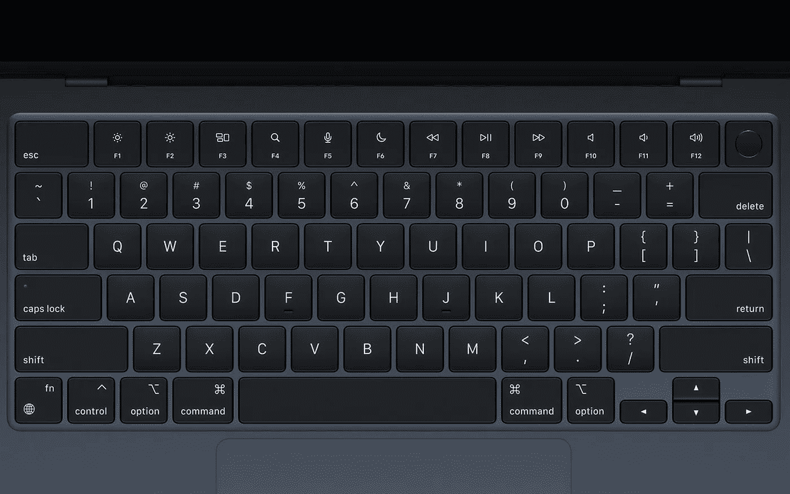

# 苹果 M2 是一个半步前进…这很好

> 原文：<https://medium.com/geekculture/the-apple-m2-is-a-half-step-forward-and-thats-ok-15884fbd29f2?source=collection_archive---------1----------------------->

## 新的芯片对于新的 MacBook Air 来说非常有意义，但对于新的 MacBook Pro 来说就不那么有意义了——为什么会这样呢？

Apple unveiled its latest processor, the M2, but — more importantly — it also unveiled the perfect product built around it: the new MacBook Air, out next month. (Image: Apple)

正如人们普遍预期的那样，苹果选择在今年的 WWDC 上展示其处理器家族的下一个成员:M2 也是许多人或多或少都在期待的，因为它是基于…