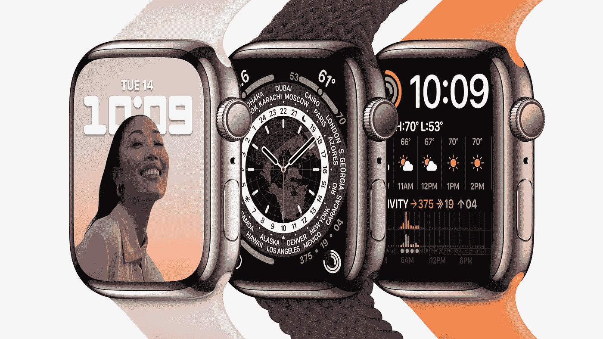
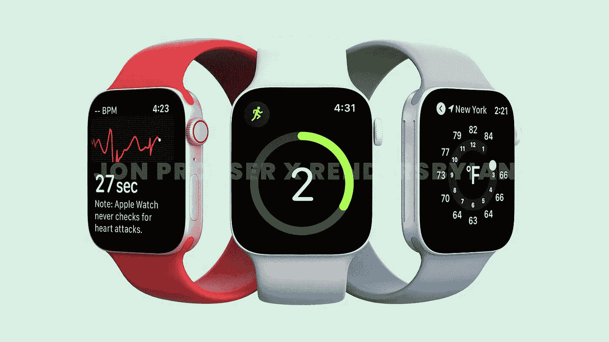
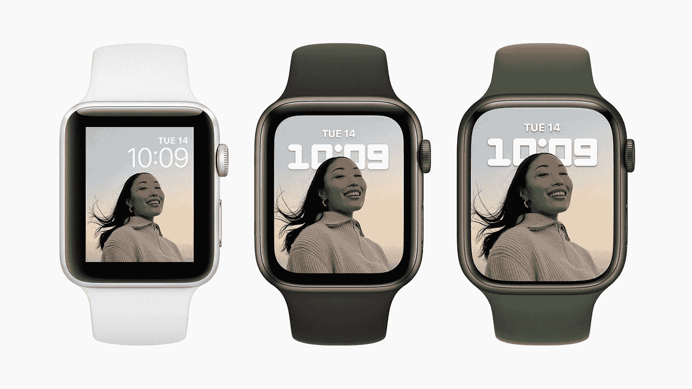
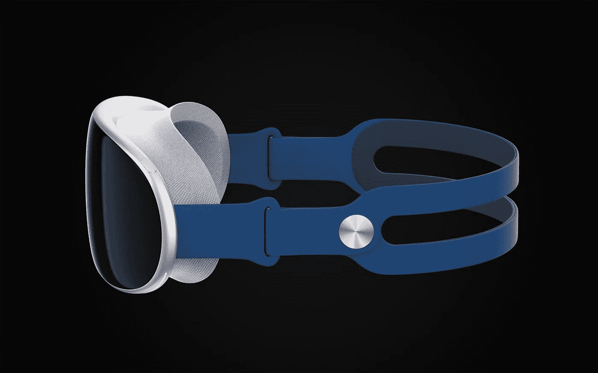

# 苹果手表和未来。

> 原文：<https://medium.com/geekculture/the-apple-watch-and-what-comes-next-3948ab40c0b0?source=collection_archive---------12----------------------->

苹果健身追踪的下一阶段。

**Apple Watch Series 7**

去年苹果发布了 Apple Watch Series 7，令所有人惊讶的是，它并没有之前报道过的全新设计。

它有着一如既往的弯曲侧面，但略显光滑，显示屏大了 20%，这一微小的变化意味着 Apple Watch 自系列 4 以来几乎保持了相同的形状和设计。

那么接下来呢？苹果将何去何从？

**设计**

这是一个棘手的问题，新闻媒体去年认为我们会得到一个更符合最新 iPhone 和 iPad 设计的整体重新设计。

**iPhone 13 flat edge industrial design.**

最终，它只是一个更大的显示器和更多的曲线。这是相当令人震惊的，让许多人想知道为什么这个重新设计的模型没有发生，事实是，除了苹果公司没有人知道，它可能已经被完全废弃。

**Leaked Apple Watch Series 7 redesign from 2021** | [Jon Prosser](https://www.frontpagetech.com/2021/05/19/exclusive-first-look-at-apple-watch-series-7-redesign/)

今年，关于 Apple Watch Series 8 的泄露相当安静，我们唯一的消息是我们将获得 3 种不同的型号。

sport(铝)、edition(不锈钢或钛)和一款新的耐用户外型手表，这款手表可能由坚硬的塑料制成，可用于徒步旅行、爬山、体力劳动，甚至可能只是孩子四处摔打。

我个人不认为我们会在 2022 年得到传闻中的重新设计，我相信苹果放弃了平边设计，因为它可能感觉不太好，尖角看起来像划痕和凹痕磁铁。

我们有一天会看到类似的设计，但边缘更光滑，有助于防止刮擦和划痕，但更大的扬声器和更亮的显示屏也可能在未来 2 年内更新。

然而，2024 年的 10 系列或 X 系列很可能会再次获得更大的显示屏，因为苹果开始进一步远离矩形显示屏，转向更弯曲的形状，但不是全圆形。

**传感器**

据报道，苹果公司正在研究一种在苹果手表中跟踪血糖的方法，这将有助于用户检测或监控糖尿病。

这将是一个巨大的功能，并将使 Apple watch 成为糖尿病患者的必备设备，但我个人认为 2022 年这种传感器的出现还为时过早，预计这一惊人功能最早将于 2023 年出现。

去年还有一份来自[彭博](https://www.bloomberg.com/news/articles/2021-06-14/apple-plans-faster-watch-future-temperature-and-glucose-sensors?sref=HrWXCALa)的报告称，苹果也在研发一种皮肤温度传感器，这可能有助于生育计划。

**未来**

正如我之前提到的，将会有 3 种不同的模式，这将是未来的发展方向。传闻已久，苹果正在开发一款面向儿童的低成本机型，但我认为这实际上将是今年推出的 series 8 active watch。

**Apple Watch evolution**

Apple Watch 的未来看起来更加光明，它是一个非常棒的健康追踪器，series 7 在未来几年中有一个非常棒的显示屏。由于更大的显示屏，增加了一个滑动键盘，也使手表成为一个更实用的电子邮件或信息设备，减少了对 iPhone 的依赖。

***Concept render based on leaked information*** *by* [*Ian Zelbo*](https://rendersbyian.com/appleview)

随着苹果也在开发 VR/AR 耳机，我们也可能会看到 Apple Watch 作为设备的某种控制配件发挥作用。

预计一些泄漏开始浮出水面在未来几个月，因为设计系列 8 将已经完成生产和测试。