# 拱廊打败了他们。

> 原文：<https://medium.com/geekculture/the-arcade-beat-em-up-revival-3cdb0e9439e0?source=collection_archive---------10----------------------->

《忍者神龟》和《街头霸王》让怀旧之情再次泛滥。

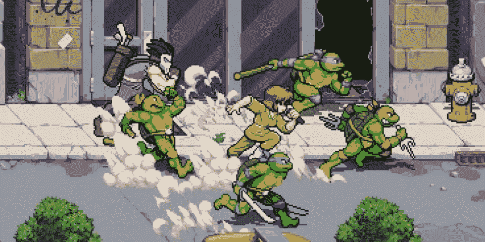

去年，我谈到了经典街机游戏《T2》《T3》在被冷落了几十年后如何复兴，随着《愤怒的街道 4》、《真人快打 11》和《河城女孩》将这种类型带到了现代游戏机上。

现在，随着我们进入 2022 年下半年，我们宣布了许多支持在线合作的新游戏，这种类型感觉好像真的回来了。

**忍者神龟:粉碎机的复仇**

这是对自 90 年代初以来就没有出现过的街机侧滚 beat 'em ups(有时被称为侧滚 beat 'em ups)经典风格的回归，并延续了超级任天堂最著名和最受欢迎的游戏之一 **TMNT IV:海龟时代**。

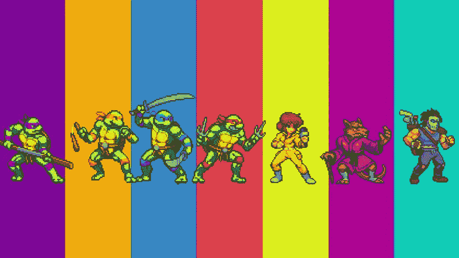

**7 characters to choose from in Shredder’s Revenge.**

由去年推出《愤怒的街道 4》的**致敬游戏**和 **Dotemu** 发布的《施莱德的复仇》确实是你喜爱并伴随其成长的游戏的一个伟大的现代化版本。

对于那些记得有 4 名玩家在街机上玩海龟或原版街机游戏的人来说，6 名玩家在线合作真的很有趣。

有 7 个角色可供选择也是一个不错的选择，这是我们在任何 TMNT 游戏中从未有过的，从四只海龟中选择，April，Splinter 或 Casey Jones。

当你玩这个游戏时，你会忍不住微笑，虽然这种类型有重复的习惯，但这个游戏真的让你对复活节彩蛋感兴趣，动力移动进展和 6 人在线支持已经改变了这种类型的游戏。

这款游戏将真正让聚光灯回到 beat 'em ups 上，这是一个现代复古组合，完美地完成了 Sonic Mania，并配有 Tee Lopes 的惊人[配乐。](https://open.spotify.com/album/2RjhOXOFZVg0apz7YdCYxM?si=ih5wqjAXTd-22FBjXS8bAg)

Shredder 的复仇现在已经在 PS4 和 PS5，Xbox/Game Pass，Switch 和 PC 上推出。

**TMNT:Cowabunga 系列**

这在最近的 Playstation state of play 活动中是一个巨大的惊喜，这是 Konami 经典 TMNT 游戏的完整重制高清集合。作为一个在原版首次发行时就播放了所有原版的人，这是我多年来一直想要的。

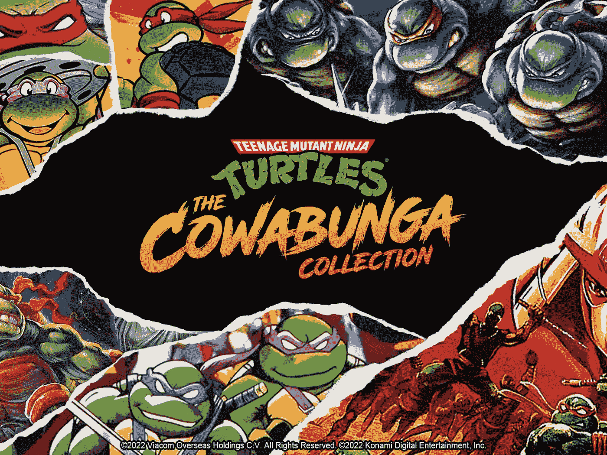

此收藏中包含的完整游戏列表。

*   **忍者神龟(街机)**
*   **忍者神龟:时光之龟(街机)**
*   **忍者神龟(NES)**
*   **忍者神龟 II:街机游戏(NES)**
*   **忍者神龟 III:曼哈顿计划(NES)**
*   **忍者神龟 IV:时光之龟(超级任天堂)**
*   **忍者神龟:格斗锦标赛(NES)**
*   **忍者神龟:格斗锦标赛(超级任天堂)**
*   **忍者神龟:超级石劫案(世嘉创世纪)**
*   **忍者神龟:格斗大赛(世嘉创世纪)**
*   **忍者神龟:脚族的陨落(Game Boy)**
*   **忍者神龟 II:从下水道回来(Game Boy)**
*   **忍者神龟 III:激进营救(Game Boy)**

该系列还在线支持 4 款游戏，其中包括两款街机游戏、锦标赛格斗(SNES 版)和 Hyperstone Heist。

我不会讲太多的细节，正如我在之前的文章中提到的，我详细地讲述了这些游戏是多么受欢迎，但是 GameBoy 游戏是一个非常值得玩的游戏，我真的不希望看到这些游戏回归。

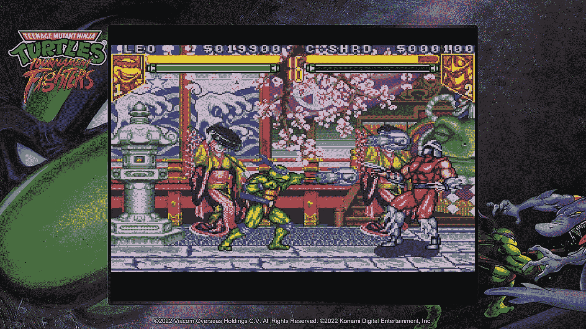

该系列将具有保存和倒带功能，这样你可以随时返回到你保存的位置，或者在玩游戏时出错时倒带，这意味着我可能最终会击败 NES 游戏的水下级别。

我个人最喜欢的是街机游戏，时间之龟(超级任天堂)，Hyperstone Heist，锦标赛战士(超级任天堂)和激进救援。

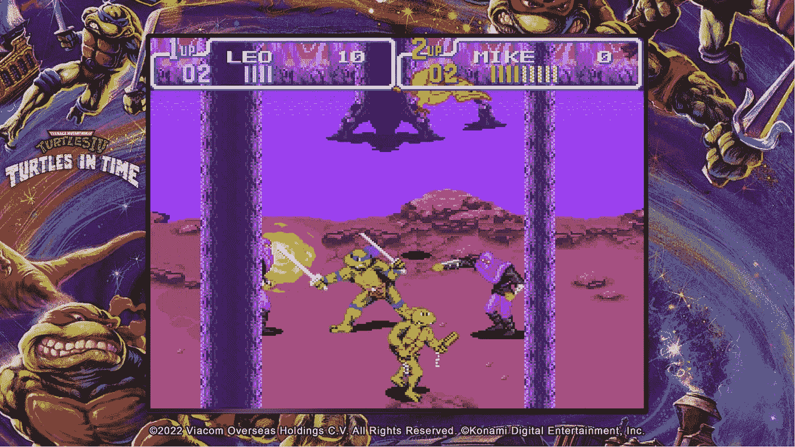

我觉得这款游戏被 Konami 完美地安排在了怀旧的浪潮中，这种浪潮是最近的 beat ' em up 游戏，尤其是 Shredder 的复仇给我们带来的大肆宣传。

Cowabunga 系列将于 2022 年夏末推出。

**街头霸王 6**

**传奇**游戏系列带着第六部回归，这次是新的设计和动画，新的开放世界模式，这次可以在所有平台上使用。

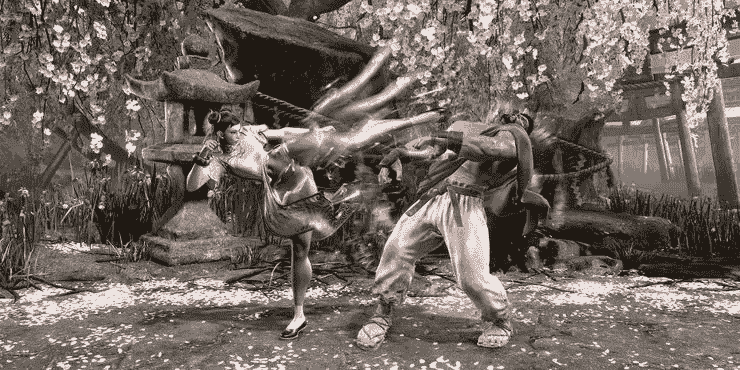

游戏的新世界旅游模式显示了一个单人游戏的故事，故事发生在大都会的街道、小巷和屋顶上。这种游戏模式似乎从**侠盗猎车手**或**铁拳**等游戏中借鉴了元素，并为卡普空提供了工具，以更多细节讲述更亲密的战斗游戏故事，而不是依赖无聊的过场动画。

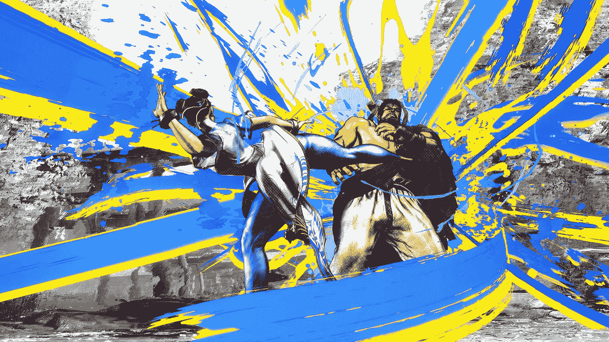

**New designs and visuals.**

这使得 SF6 成为该系列迄今为止最令人身临其境的作品，并赋予角色更多的个性和细节。

关于这款游戏的其他信息还不太清楚，包括完整的名单或在线模式，但我们应该预计它会在 2023 年的某个时候发布，我相信一旦我们有了更多的细节，炒作就会开始。

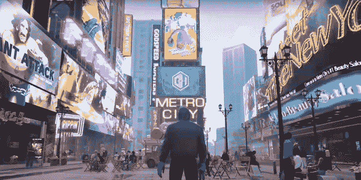

**SF6 World Tour gameplay.**

就个人而言，我很期待这一款，因为我不喜欢 SF5，并发现它有所欠缺。看起来一些真正的努力已经进入了 SF6，新的动画看起来令人震惊的事实让我对我们可能在游戏中看到的其他东西感到兴奋。

街头霸王 2 是标志性的，可能是有史以来最伟大的打斗类型游戏，所以我总是不公平地评价续集，但我知道我们应该对现代游戏有更多的期待。

**江城女孩 2**

这个系列一直是一个无声的打击，这样一个有趣，明亮和动作包装的复古风格游戏设置在 90 年代，第三次跟进从河城女孩零和河城女孩更经典的殴打他们了冒险与现代扭曲类似于施莱德的复仇。

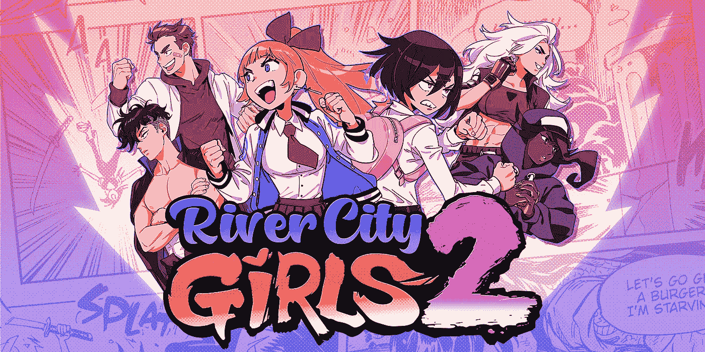

**River City Girls Zero** 是该系列第一次在日本以外的地方上映，因为它最初是 1994 年的一部超级家庭电影。最近，它被重新制作并重新命名为世界其他地方，2019 年的续集名为**河城女孩**是一个伟大的现代作品，也是我对该系列的第一次介绍。

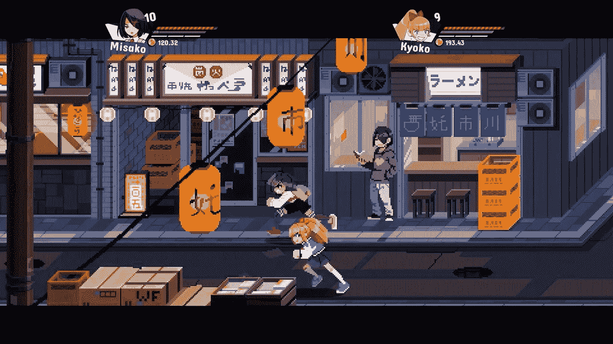

这些类型的游戏非常适合 Switch，但显然在所有游戏机上都很棒，我只是喜欢在任天堂系统上玩这些类型游戏的复古感觉，复古的图形对游戏机来说很难征税。

我喜欢你从这个游戏系列中获得的 90 年代日本氛围、明亮的色彩和音乐，看起来**河城女孩 2** 将会通过一些有趣的 90 年代复活节彩蛋和新的游戏体验继续下去。

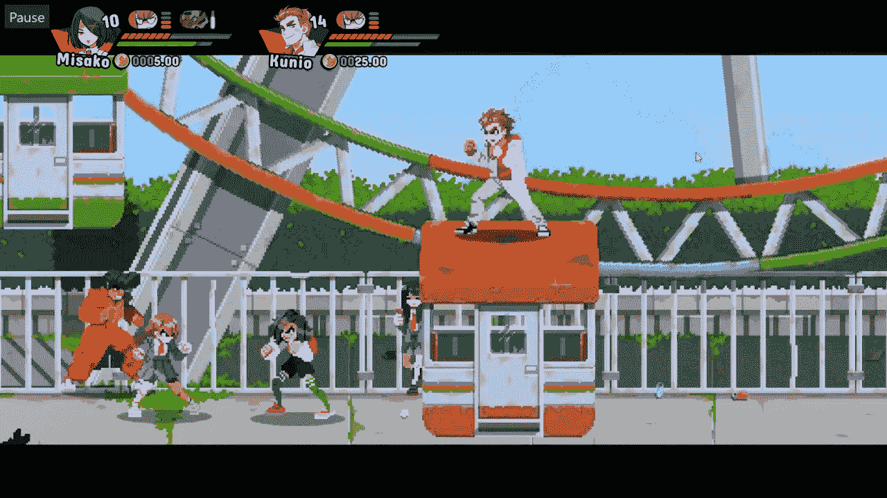

漫画过场总是做得很好，给你一个比 90 年代更详细的故事。有 6 个角色可供选择，与前两个游戏相比，这给了你更多的选择和游戏体验。

《河城女孩 2》将于 2022 年夏天上映。

**多元宇宙**

我名单上的最后一个游戏要小心了，这个条目来自华纳兄弟，我会把它描述为粉碎兄弟和堡垒之夜的混合。

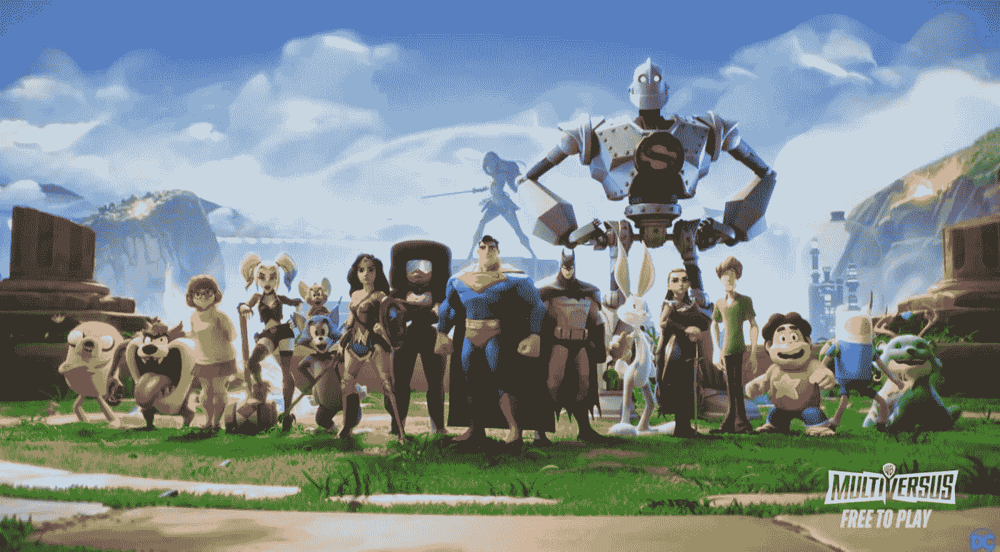

**Crazy line up!**

这款免费游戏的主角来自华纳兄弟传媒，如蝙蝠侠、超人、兔八哥、汤姆和杰瑞、权力的游戏艾莉亚，甚至还有来自史酷比的维尔玛。

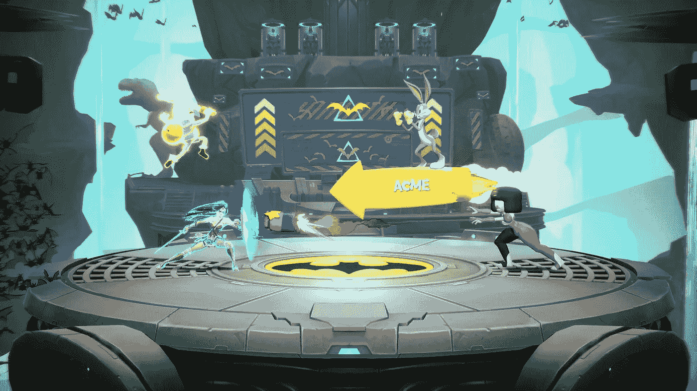

也有传言说，更多的角色将来自华纳兄弟目录之外的属性，如哥斯拉，里克和莫蒂，陌生人，乐高，火影忍者，真人快打，街头霸王，甚至可能是漫威的角色。

这里的想法似乎类似于堡垒之夜，任何角色去哪里，你都可以和你最喜欢的电视、游戏、电影或漫画明星一起玩，在 4 人 Smash Bros 类型的 beat ' up 中，你可以在游戏商店中购买它们。

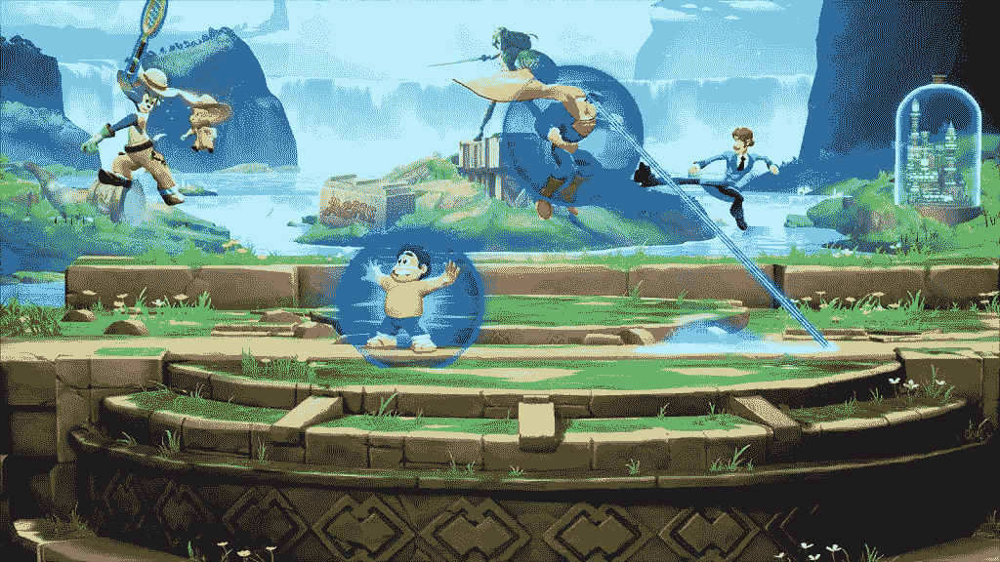

这整个游戏看起来很疯狂，但从好的方面来说，早期测试人员称赞了这款游戏，但公开发行将在今年某个时候进行。

我喜欢允许来自各行各业媒体的斗士进入竞技场的想法，但我只是希望他们继续增加足够的东西来让这个游戏继续下去，但随着可能的赛季战斗通行证的传言，华纳兄弟可能会在他们的手中击中。

总的来说，beat 'em up 流派现在处于一个很好的位置，Shredder 的复仇获得了好评，Streets of Rage 4 和 Super Smash Bros Ultimate 仍然表现良好，并且正在为 Street Fighter 6，MultiVersus 和 Cowabunga Collection 进行宣传。复兴现在正在发生，作为一个有幸在家里和游戏厅第一次体验它的人，我希望我们能得到一些使用现代游戏机的新的动态游戏和一些使用家庭友好的复古风格的游戏。

我迫不及待地想看看在接下来的几年里，随着新真人快打、新漫威格斗游戏以及忍者神龟的 DLC 的出现，我们还会得到什么。