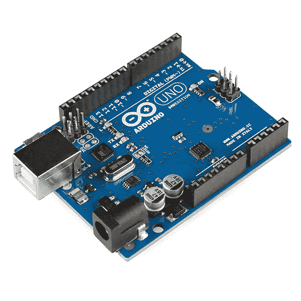
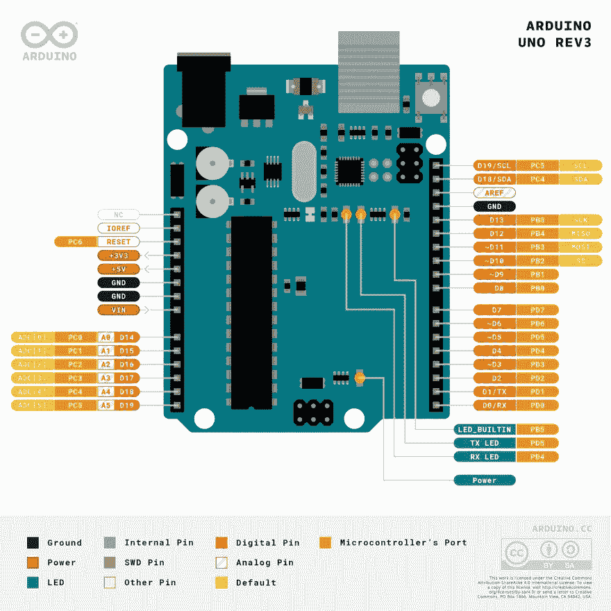

# Arduino 微控制器:硬件和 GPIO 功能

> 原文：<https://medium.com/geekculture/the-arduino-microcontroller-hardware-and-gpio-functions-1bcf542d7379?source=collection_archive---------8----------------------->

当我开始创建一个机器人的项目时，我对所需的计算机硬件只有一个模糊的概念。阅读其他机器人项目，提到 Arduino 和 Raspberry Pi。两者都是重要的计算机，但用途非常不同。在我的微控制器博客系列中，我想调查 Arduino，Raspberry PI，它们的硬件功能和连接选项。

Arduino 是一个真正的自己动手项目的干将。自 2012 年成立以来，它已经为无数业余爱好者的项目提供了平台，从家用电器、IOT 到机器人。存在不同的硬件版本，但最常见的是经典的 Arduino Uno Rev3。

本文详细介绍了 Arduino Uno 的硬件、GPIO 引脚和支持的连接协议。

*本文原载于* [*我的博客*](https://admantium.com/blog/micro02_arduino/) 。

# Arduino Uno Rev 3 / Arduino Nano

*来源:*【wikipedia.org】

*Arduino Uno Rev 3 具有以下硬件:*

*微控制器:ATmega328P / ATmega328P
闪存:32KB
SRAM:2KB
EEPROM:1KB
时钟速度:16MhZ
GPIO: 20 (14 个数字，6 个模拟)*

# *数字引脚*

*Arduino 有 14 个数字引脚，可用作输入或输出引脚。*

# *数字输入*

*默认情况下，所有数字引脚都配置为输出引脚。然而，它们可以用方法`setPinMode(pinNumber, mode)`显式配置，其中模式可以是`INPUT`或`INPUT_PULLUP`。*

*输入状态——根据电压转换为真/假——是`HIGH`和`LOW`。要获得状态，使用方法`digitalRed(pinNumber)`。模式`INPUT_PULLUP`反转`HIGH`和`LOW`的值，电线的接收端应接地。*

# *数字输出*

*要输出数字信号，需要使用`pinMode(pinNumer, OUTPUT)`方法配置引脚。要写入一个值，方法`digitalWrite(pinNumber, Value)`，其中 value 是`HIGH`或`LOW`。*

# *模拟引脚*

*Arduino 有 6 个模拟引脚。*

# *模拟输入*

*输入模式也是模拟引脚的默认行为。Arduino 板使用 10 位模数转换器，提供 0 到 1023 的值。这些引脚可以用`setPinMode(pinNumber, mode)`明确配置。通过`analogRead(pinNumber`，可以读取当前信号值。如果锁定模式设置为`INPUT_PULLUP`，获得的值将受到影响。*

# *模拟输出*

*由于 Arduino 板卡没有数模转换器，模拟引脚只能配置为带`setPinMode(pinNumber, OUTPUT)`的数字输出引脚，其中引脚号以`A`为前缀。*

# *GPIO 功能*

**

**来源:* [*Arduino 商店*](https://store.arduino.cc/usa/arduino-uno-rev3)*

*Arduino 通过其引脚提供以下功能:*

*   *PWM: [脉宽调制](https://en.wikipedia.org/wiki/Pulse-width_modulation)是一种信号技术，在这种技术中，数字信号以一定的频率在高电平和低电平两种状态之间快速切换。引脚 3、5、6、9、10、11 可用于 PWM。Arduinos 以 1000Hz 的 32P 时钟速率覆盖可用的调制模式*
*   *UART:数字引脚 0 (RX)和 DP 1 TX 可用于直接连接两个器件。 [UART 协议](https://en.wikipedia.org/wiki/Universal_asynchronous_receiver-transmitter)创建一个串行连接，数据异步传输，数据与一根线上的时钟信号同步。从技术上讲，UART 连接也可以通过 USB 端口建立，Arduino 有一个内置的串行到 USB 转换器。*
*   *I2C:SCL 和 SDA 引脚可用于将 Arduino 连接到 I2C 总线。 [I2C 协议](https://en.wikipedia.org/wiki/I%C2%B2C)也创建串行连接，但支持多达 128 个设备的多个服务器/客户端连接。该协议是标准化的，但是存在具有不同命令子集的不同实现。通信流通常由服务器发起:主动向客户机轮询新数据。*
*   *SPI:[SPI 协议](https://en.wikipedia.org/wiki/Serial_Peripheral_Interface)是一个服务器和几个客户端之间的同步串行通信，双方都可以主动发送数据。SPI 是与传感器接口的常用协议。Arduino 为两种不同的 SPI 总线提供引脚:专用 ICSP 引脚和 DP 10 至 13*

# *引脚类型*

*除了所解释的协议，还有另一类引脚:中断引脚。在正常的、不间断的程序流程中，Arduino 不间断地运行它的程序。当一个中断引脚变为有效时，该程序流停止以调用一个中断处理程序。要使用此功能，需要对引脚进行显式编程*

*最后一种引脚是中断引脚，它们允许输入信号优先于微控制器的当前功能。用`attachInterrupt(vectorNumber, callbackFunction, CHANGE)`定义中断。`vectorNumber`引用 Arduinos 内存中的特殊空间，当这个内存改变时，回调函数被执行。只有引脚 2 和 3 可以配置为中断引脚。*

# *结论*

*Arduino 是许多 DIY 项目的既定工作平台。尽管它已经有将近 10 年的历史了，但它是通用的、快速的、廉价的，并且有一个庞大的库目录来连接许多不同类型的硬件。本文详细介绍了 Arduino 的 GPIO 引脚:它的数字和模拟引脚，如何设置和读取数据，以及它支持的协议。在下一篇文章中，我将研究树莓 Pi 的 GPIO。*