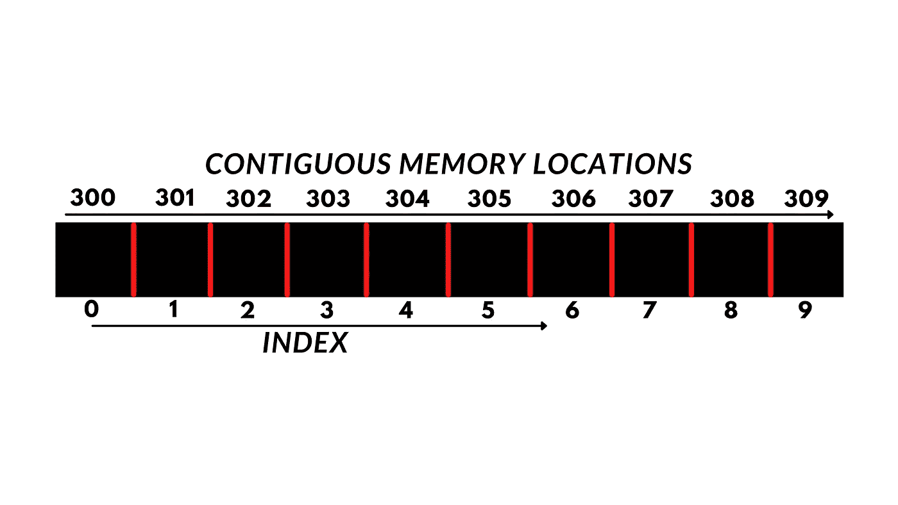

# 解释的数组数据结构

> 原文：<https://medium.com/geekculture/the-array-data-structure-explained-b8eb4c5d1f7a?source=collection_archive---------15----------------------->

## 学习笔记:Python 数据结构和算法

Image by Author

## 概观

数组序列数据结构是所有语言中最常用的。它也是最简单的数据结构，可以定义为元素的集合，每个元素存储在连续的内存位置，每个数据元素可以使用其索引号随机访问。