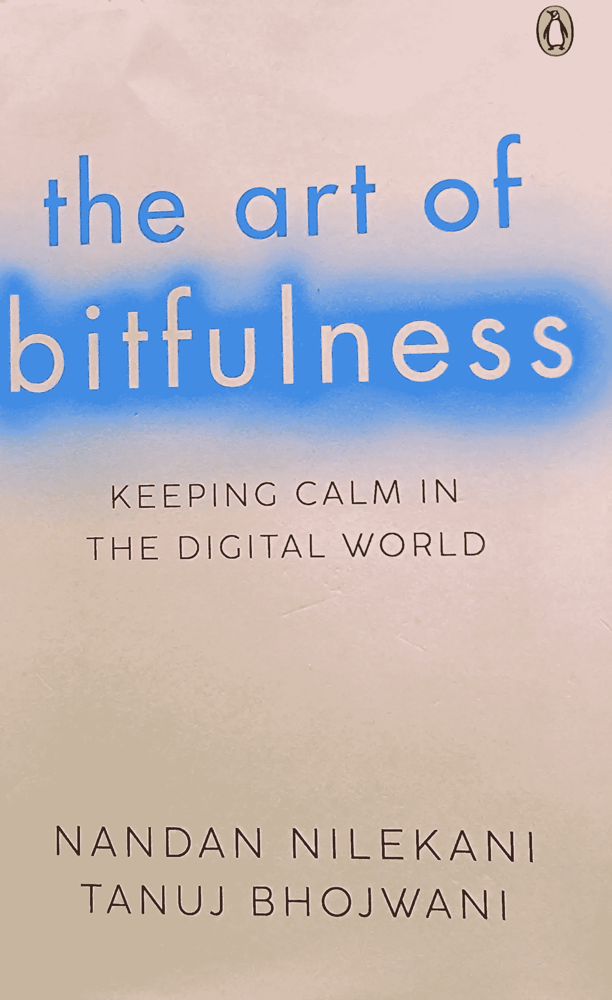

# “比特饱满”的艺术

> 原文：<https://medium.com/geekculture/the-art-of-bitfullness-ff22a9b2e65a?source=collection_archive---------10----------------------->

***思绪与笔记……***

Image by Author

**比特的艺术**——这个标题发人深省。内容更是如此。这是一本由**南丹·尼勒卡尼**(印孚瑟斯科技有限公司创始人兼董事长)和**塔努杰·博瓦尼**(iSPIRIT 基金会研究员)合著的书。我觉得这是我们这个时代最相关的书籍之一。我们每个人都被小工具和数字应用所包围。这些工具和技术是…