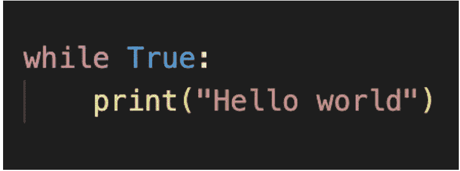
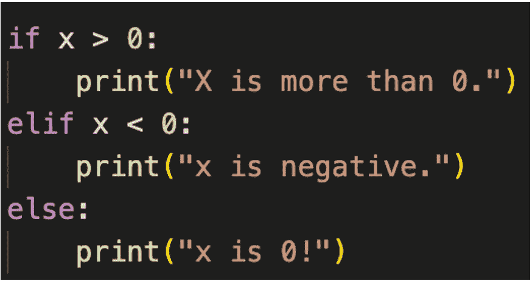
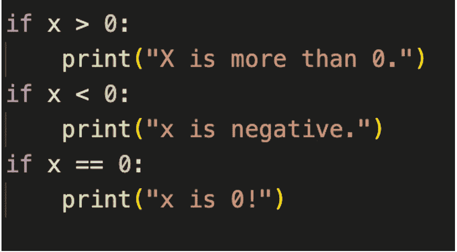

# 计算思维的艺术

> 原文：<https://medium.com/geekculture/the-art-of-computational-thinking-c8a3b58bed8f?source=collection_archive---------43----------------------->

当我提到自己是一名软件开发人员时，我正在和老朋友聊天。总会有一个特别的问题冒出来。你是如何掌握和学习这么多种语言的？很多面试者喜欢问“你懂什么编程语言？”或者沿着这样的路线。这个问题很大程度上反映了招聘经理或者 HR 部门的认识。

问题应该是:你的计算思维有多好？因为，优秀编程的关键更依赖于关键概念，如数据结构和设计模式，而不是语言本身。事实是，如果你在这些概念和原则上很强，你可以在一周左右的时间里学会任何语言。(这解释了为什么高级开发人员仍然在寻找基本语法:)

但是计算思维到底是什么？我希望这篇文章能有所启发，满足你的好奇心。在我们进入计算思维的概念之前，让我们讨论一下编程语言。需要注意的两个重要概念。

1.语义和 2。语法。

语义指的是句子的意思，即你希望计算机执行的内容背后的想法。语法是指你必须遵守的一套语法规则。

放在像英语这样的人类语言中。语义相当于句子的潜在意义。句法相当于语言的语法，很像主谓一致。这解释了为什么你需要有强大的基础来构建你的语法。换句话说，你必须知道基本的概念和逻辑来为计算机构建指令以完成你的任务。这个概念和逻辑几乎对所有编程逻辑都是通用的。对于每种编码语言，构建这些基本概念的实际实现可能有所不同，但是逻辑基本上是相同的。这就是语言文档(相当于人类语言意义上的字典)如此重要的原因。作为一个学习新的编码语言的程序员，你只需要查找文档来形成你的代码。

如果你还在质疑什么是 heck，这是我在上面一直提到的基本概念。也许在介绍了两个简单而重要的计算思维概念后，它会变得更加清晰。

我将使用 python 3 语言作为媒介，因为它可能是最简单的语言，因为它的可读性很高。

# **概念 1:**

**循环**

Simple While loop.

*语义学*

当一个操作需要重复几次时，就使用循环。通常在检查了某些条件后。执行循环的一种方法是通过“while loop”构造。关键字“True”是表示真实条件的常数。“True”关键字可以替换为其他变量，以允许相应地修改条件。当条件为“真”时，将执行 while 循环中的指令。在上面显示的代码中，只要条件为真，print()函数就会重复执行。print()函数在你的控制台中打印出一行显示“Hello World”(让黑客看起来很酷的黑框)。怎么知道函数名为“print()”？嗯，一个简单的查找文件在 https://docs.python.org/3/。

*语法*

接下来是语法部分。“真”后面的“ **:** ”是必需的，因为语言是这么说的。“print”前的缩进表示该指令是 while 循环的一部分。其他语言使用括号“{}”。又开始迷茫了？查阅文档以确保语法正确！你可以用英语来比喻你必须考虑“我是”和“你是”之间的关系。什么时候用“am”，什么时候用“are”。

另一种类型的循环称为“for”循环，其中循环的次数是预先确定的，而不是等待给定条件得到满足。

**概念二:**

**控制流程**

Simple decision making process using if-elif-else code

*语义*

这就是你的决策发挥作用的地方。当编写这样的控制流代码时，有许多方法可以达到相同的结果。在其他语言中，我可以写一个“switch”语句，或者我可以像下面这样使用“嵌套 if”。

Decision making process using nested ifs

最佳代码编写的最佳实践是另一个关于优化的故事，需要更深入地了解计算领域的编译器。

*语法*

语法非常类似于带有“:”和缩进的 while 循环。还有数学语法需要注意。“==”是变量之间的比较。“=”用于赋值。">"，"

# Conclusion

So, you would have realized that I’ve mentioned checking the documentation many times throughout the article. Well, that’s because it’s literally the bible for programming! What stays the same is the underlying idea and concept behind it like loops, control statements, math algorithms, and creativity in problem-solving.
学习如何混合搭配这些概念既是艺术也是科学。你必须有创造力，跳出框框去思考，用你现有的限制来解决你的问题。

计算思维是一门艺术，它展示了如何通过对细节的极度关注来创造一个解决方案。我希望读完这篇文章后，你能学会更多地欣赏计算思维！感谢您的阅读。

如果你住在新加坡并且对学习编码感兴趣。欢迎报名参加 [UpNext](http://upnext.codes) 的课程！