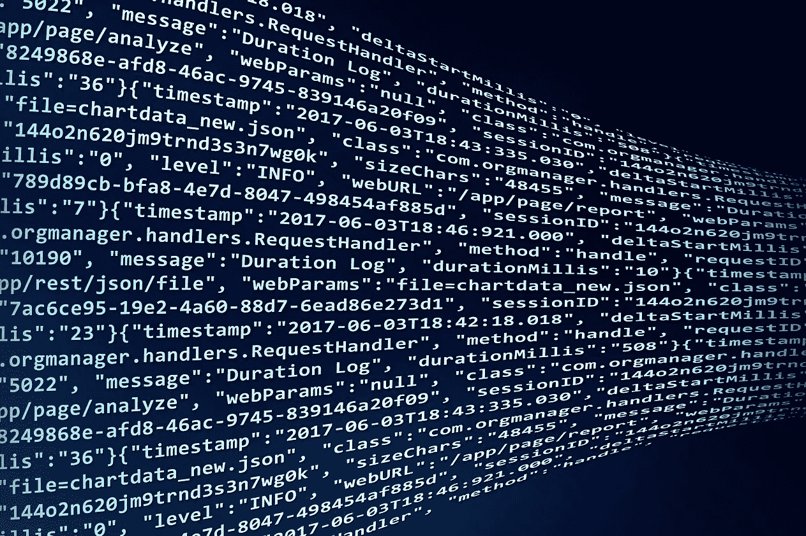

# 密码学术语汇编

> 原文：<https://medium.com/geekculture/the-art-of-cryptography-11e4fadb8665?source=collection_archive---------0----------------------->

你有没有想过，敏感数据在通过互联网传输时，有多少是安全的？每天都有许多政府和私人组织的网站遭到黑客攻击，黑客可以访问他们的敏感数据。最近，黑客窃取了 3000 万脸书账户的访问密钥。如果你是他们中的一员呢？他们可以登录你的账户，发表任何他们喜欢的东西。

在当今世界，安全只是一种幻想，网络攻击每天都在增加，有必要研究最佳实践来防止有人在没有您的背景的情况下访问您的信息。但主要问题是，科技界如何与这些攻击赛跑，以防止它们获取你的个人数据，这很重要…

密码学，它是一门书写和解决密码的艺术，也是网络安全的主要概念之一，用来保护你的信息安全。数据的保密性取决于加密代码的好坏，而加密技术是一个海洋，如果你不知道如何浏览它，你的全部数据可能都会受到损害。在本文中，我将讨论加密功能，从简单的散列到高级的 TLS & SSL 和其他加密方法。

**哈希:**

哈希是一个为数据生成唯一编号的过程，它因不同的数据或文件而异。黑客使用一个潜在密码列表(可能有几百到一百万)，并自动获取匹配的密码并登录到用户帐户。哈希对于防止字典攻击非常有用。例如，在网站中，通常密码不会以纯文本保存，而是保存密码的哈希值，这样，如果数据库遭到破坏，黑客只能获得密码的哈希值。

**腌制:**

Salting 是一种技术，在对密码进行哈希运算之前，会在密码中添加一个随机字符串，从而产生一个不同的哈希。它防止彩虹攻击，在彩虹攻击中，黑客使用散列密码列表，而不是检查普通值。如果哈希的长度增加，破解的难度也会增加。

**数字签名:**

当你通过一个渠道发送信息时，原始数据有可能被改变。数字签名用于检查数据在通道中是否被更改。数据和密钥的组合哈希一起发送，在接收方，另一方做相反的事情生成数据和密钥的组合哈希，并将其与发送方哈希进行匹配。如果它们不匹配，这意味着原始数据在传输过程中被篡改，接收方再次向发送方请求数据。

**加密:**

当你通过网络发送信息时，有必要对信息进行加密，这样中间任何人都不能读取或访问它。保护数据时有两种类型的加密。一般来说，加密的数据称为密文。

**对称加密:**

[**AES**](https://en.wikipedia.org/wiki/Advanced_Encryption_Standard) (高级加密标准)加密是对称加密最好的例子之一。在这种方法中，数据用密钥和 IV 对加密，要解密数据，我们必须使用相同的密钥和 IV 对。AES 加密有不同的模式，例如，CBC、ECB、CTR、OCB 和 CFB。

[**CBC**](https://en.wikipedia.org/wiki/Block_cipher_mode_of_operation)(Chipper Block Chaining)是众所周知且使用最多的算法之一，其中每一位都用前一位加密，这就是为什么它被称为密码区块链。

**非对称加密:**

在这种加密中，数据用公钥加密，该公钥可以与任何人共享，并且只能用匹配的私钥解密。非对称加密难以破解，但会降低性能。为了获得最佳性能，应该同时使用对称和非对称加密。

SSL(安全套接字层)证书中使用非对称加密，其中使用 RSA 加密，证书中的公钥可用，发送到服务器的数据用该公钥加密，并将在服务器中用私钥解密。有一种称为 TSL(传输安全层)的高级技术，在传输层对数据进行加密。对于电子邮件和 IP 电话，MIME 和 IP-sec 加密技术用于数据认证、完整性和加密。

**杂项:**

还有许多其他类型的网络攻击，黑客会间接地试图获取目标数据。黑客攻击加密数据的物理设备，并通过分析各种参数，如设备的功耗和设备发出的电磁波或设备发出的光，或通过分析它们的声学特征。有很多方法可以防止他们简单地增加算法的长度来完全隔离物理设备。

黑客是编程的杰作，如果你不知道它是如何发生的，就会有人破坏你的安全，利用弱点，窃取你的数据。快乐编码:)