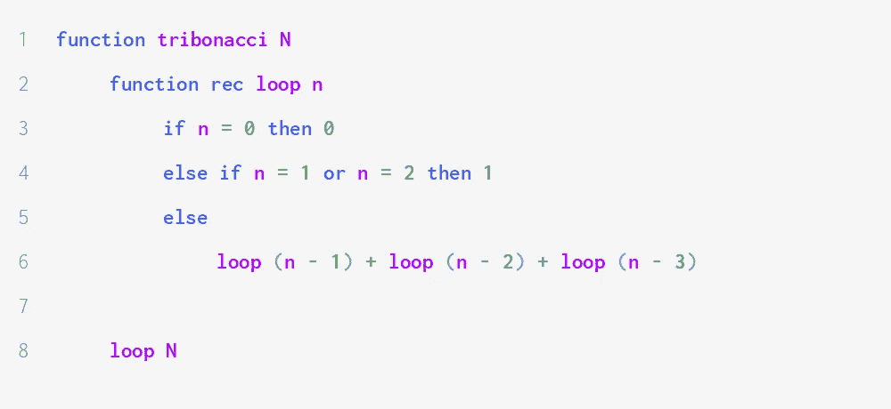
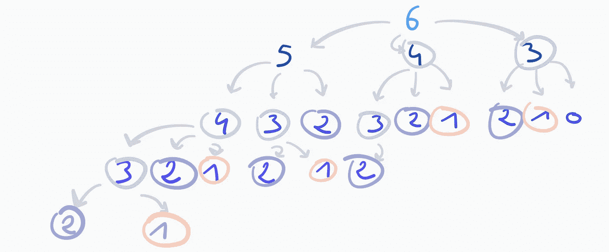
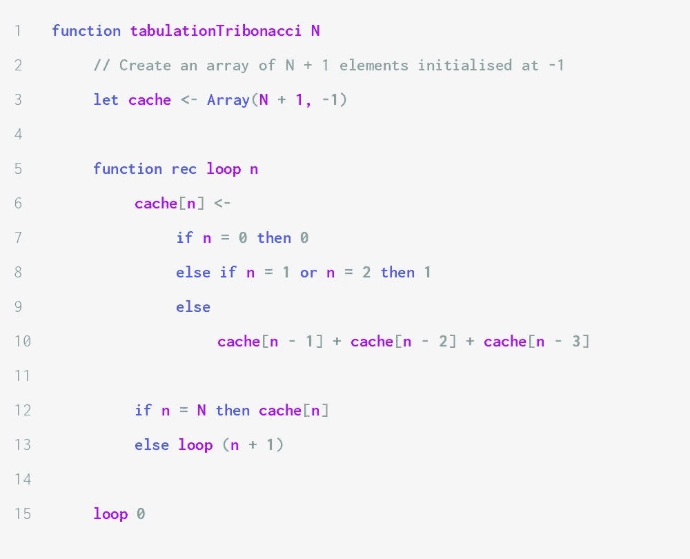
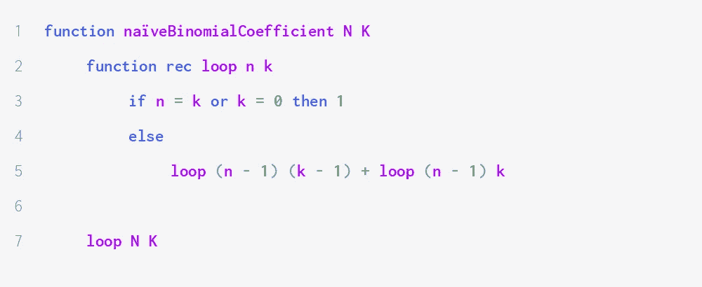
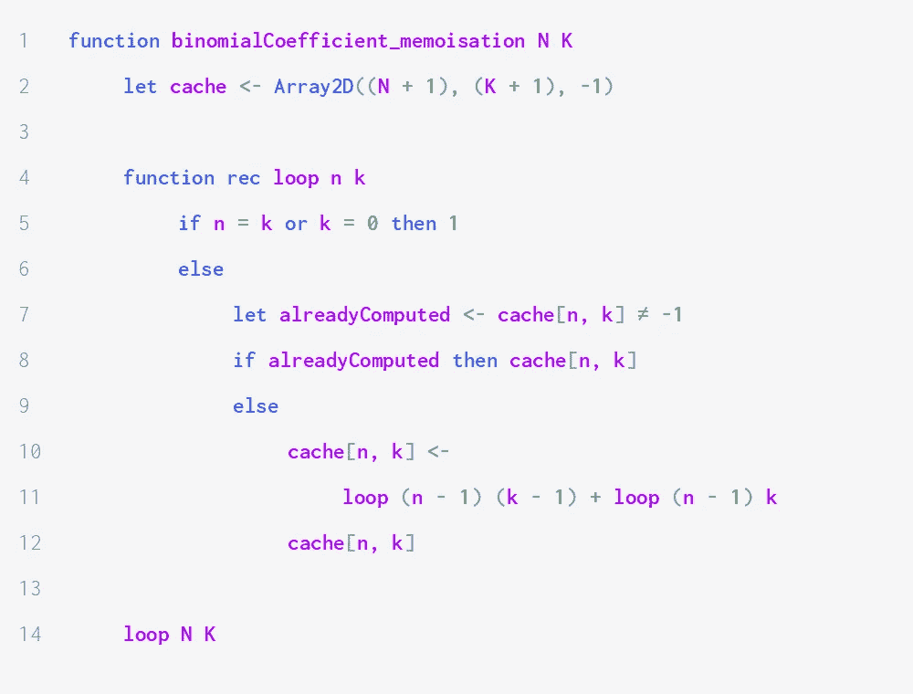
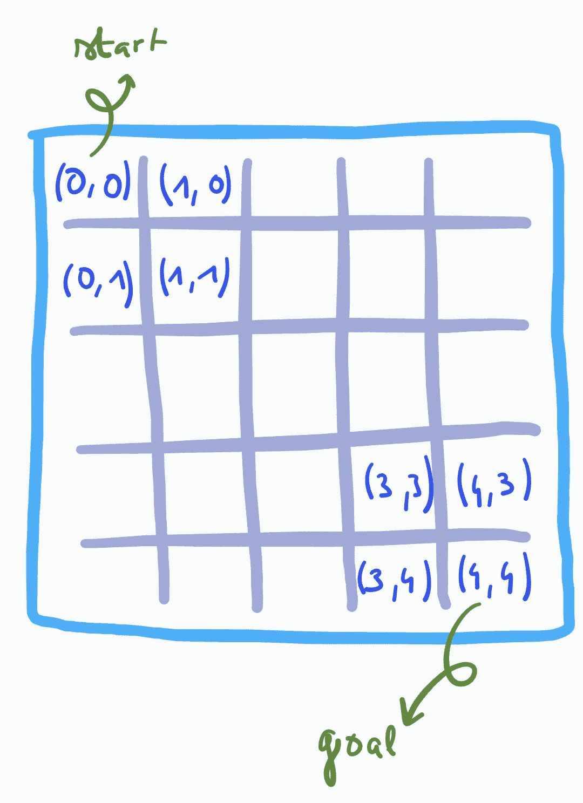
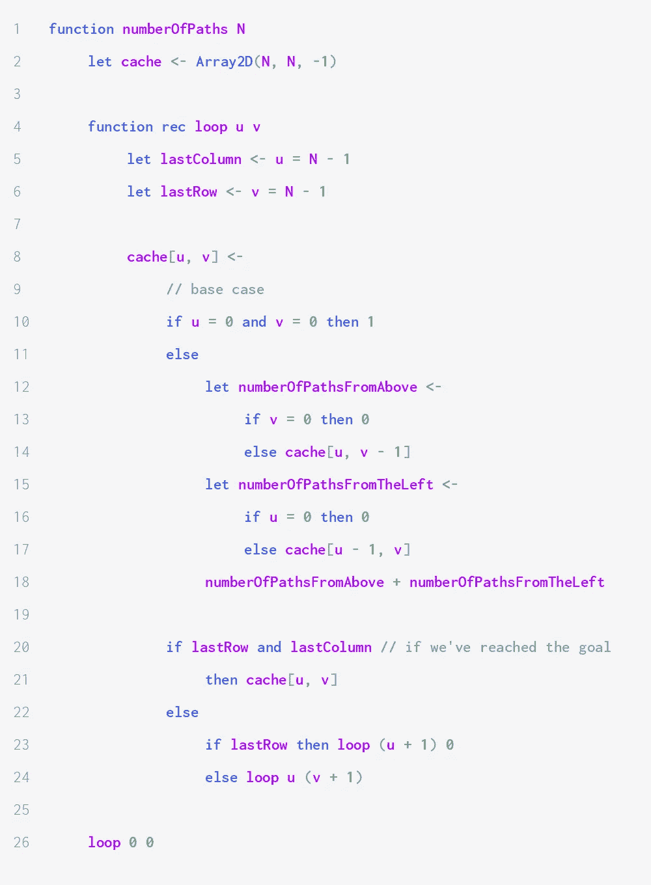
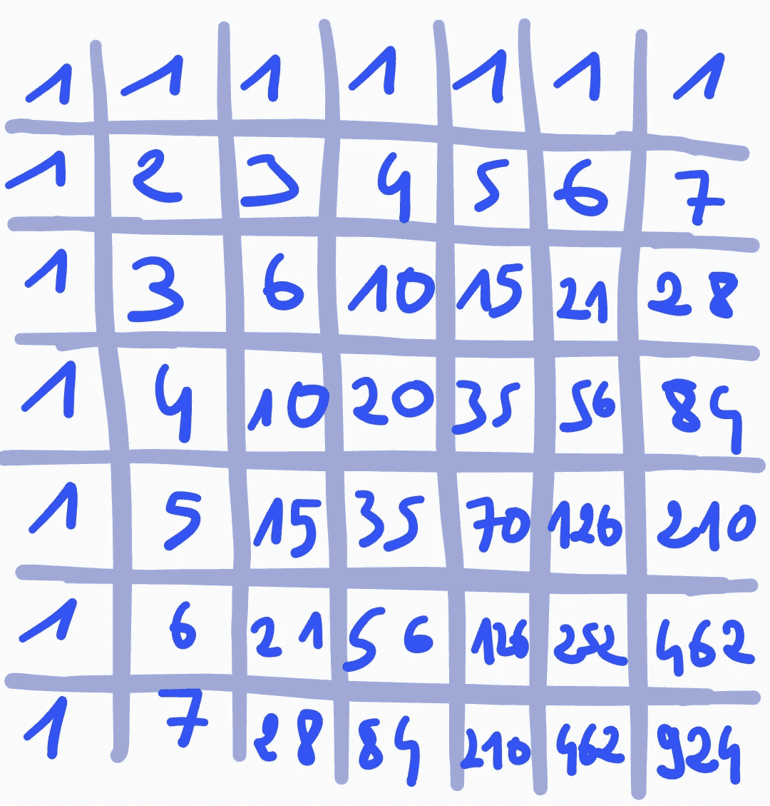

# 动态编程导论

> 原文：<https://medium.com/geekculture/the-art-of-dynamic-programming-pt-1-introduction-5d2ce0a6da24?source=collection_archive---------28----------------------->

## 学习如何运用动态编程的九个基本算法

动态规划是一种基本的竞争规划技术。它包括用内存换取时间，以避免重复计算。这可以显著提高性能，有时会将指数时间算法转变为线性算法。

这是系列文章的第一部分。第一篇用三个基本问题说明了动态编程的基础，第二篇探索了三个更高级的算法，另外三篇文章将解决更复杂的问题。以下是我们将涉及的所有算法的列表:

1.  计算第*n*-第三摩擦数**(第一部分)**
2.  高效二项式系数计算器**(上)**
3.  计算网格中的路径【T6(第一部分)】
4.  切杆问题**(第二部分)**
5.  寻找增长最长的子序列**(第二部分)**
6.  计算变更**(第二部分)**
7.  背包问题**(第三部分)**
8.  寻找最长公共子序列**(第四部分)**
9.  序列比对问题**(第五部分)**

我试图使它尽可能与语言无关，我们将研究的所有算法都用伪代码实现。

我们开始吧！

# 什么是动态编程？

与通过对子问题做出局部最优决策来产生全局解的贪婪算法(不一定产生最优结果)不同，动态规划通过考虑所有可能的可能性来寻找最优解，试图最小化计算次数。这是在存储过去计算结果的缓存的帮助下实现的。

所有的优化问题不能用动态规划来解决:它们需要一个**最优子结构**。这意味着问题的解决方案可以从子问题的解决方案中推导出来。没有最优子结构的问题的一个例子是寻找图上最长简单路径的长度，即不多次访问同一个顶点的最长路径。

因此，动态规划适用于具有最佳子结构的**问题，其中**初始问题被分解成重叠的子问题**(否则，简单的分治法就足够了，因为不需要存储过去的计算)。动态规划算法总能找到最优解。**

动态编程依赖于我们将在本文中探讨的两个主要技术:*制表*和*记忆*。

# 列表和记忆:介绍和例子

## 制表，或自下而上的方法

顾名思义，使用自底向上方法的算法首先进行基础计算，然后将缓存构建到目标值。例如，假设我们想要计算某个自然数 *n* 的 tribonacci 序列的第 *n* 项。tribonacci 序列定义如下:

> trib(0)= 0；trib(1)= 1；Trib(2) = 1
> 
> 对于每个自然数 n，Trib(n+3)= Trib(n)+Trib(n+1)+Trib(n+2)。

下面是一个简单的解决方案，它直接实现了定义，没有经过优化:



Naïve algorithm to recursively calculate the n-th term of the Tribonacci sequence.

下面的递归树说明了调用`tribonacci 6`的执行。



我们看到大多数值都被计算了几次，这使得我们的代码与有用的计算次数相比非常慢。其实函数`tribonacci`具有指数复杂度:运行时复杂度由 t(*n*)= 3t(*n*-1)+θ(1)给出，所以通项为 t(n)= θ(3^*n*)。

这就是制表的用武之地。这是我们的 Tribonacci 计算器的新版本，它使用制表:



Dynamic programming algorithm to calculate the N-th term of the tribonacci sequence.

我们不是递归地计算 Trib( *N* -1)、Trib( *N* -2)和 Trib( *N* -3)来计算 T( *N* )，而是简单地使用缓存数组在常数时间内检索它们。因此，一次递归调用就足够了。由于非递归开销需要常数时间，`tabulationTribonacci`在θ(N)时间内运行，占用θ(N)空间。

## 记忆，或自上而下的方法

记忆和制表非常相似，因为它们都利用相同的记忆计算的思想来避免再次执行它们。不同之处在于计算值的顺序。使用内存化来计算序列 *S* 的第 N 项的算法从从 S( *N* )到 S(1)填充缓存开始。

这种方法有用的一个例子是计算二项式系数。我们用公式 Bin(N，K) = Bin(N - 1，K - 1) + Bin(N - 1，K)归纳定义它。有两种基本情况:对于所有自然数 *u* ，Bin( *u* ，0) = 1，Bin( *u* ， *u* ) = 1。

下面是上述定义的直接转录:



Naïve algorithm to calculate the binomial coefficient of a pair of numbers.

循环运行 T( *n* ， *k* ) = 2Bin( *n* ， *k* ) - 1 次。像以前一样，许多计算要执行多次，存储它们会使函数的效率大大提高。

我们可以使用自底向上的技术，创建一个( *n* * *k* )二维数组来存储所有数字对的二项式系数。这种方法的一个缺点是，它需要解决更多不必要的子问题:我们将为 *a* ≤ *n* 和 *b* ≤ *k* 计算 Bin( *a* ， *b* )。一个解决方案是开始计算 Bin( *n* ， *k* )并向下递归到一个基础用例。这种方法在下面实现。



Dynamic programming algorithm to calculate the binomial coefficient of a pair of numbers.

给这个算法的复杂度一个严格的界限将是相当复杂的，但是可以确定的是，计算的次数不能渐近地超过 min( Bin( *n* ， *k* )，( *n* + 1， *k* + 1))，因为它不能比天真的方法差，并且计算的值的数量受高速缓存的大小限制。例如，使用动态编程方法计算 Bin(12，5)需要 71 个步骤，而使用简单方法需要 1583 个步骤。

我们将在第三部分学习另一个问题，当解决背包问题时，自顶向下的方法比自底向上的方法更好。

既然我们已经看到了用于创建动态编程算法的基本技术，我们将继续讨论一些可以使用动态编程解决的具体问题。

# 计算网格中的路径

让我们从一个简单而有趣的问题开始。

## 问题陈述

设 *N* 为正整数。我们考虑一个 *N* × *N* 网格。网格的每一个方块都用一个与其坐标对应的元组( *u* ， *v* )来表示，其中 *u* 为水平分量， *v* 为垂直分量。左上角在坐标(0，0)，右下角在( *N* - 1， *N* - 1)。我们可以在网格上向下或向右移动，一次一个方格:如果 x(1)，…，x(n)是一条路径，那么对于每个索引 *k* ≤ *n* — 1，如果 x( *k* ) = ( *u* ， *v* )，那么 x( *k* + 1)要么是( *u* + 1



Illustration of the grid when N = 5.

我们的目标是计算从左上角到右下角的不同路径的数量。

## 为什么我们要使用动态编程来解决这个问题？

首先，**这个问题可以递归求解**。我们知道只有一种方法可以到达左上角(0，0)，因为它是我们的起点:我们已经找到了一个基本案例。那么有两种方法可以到达 square ( *u* 、*v*)≦(0，0):要么从( *u -* 1、 *v* )要么从( *u* 、 *v* - 1)(然后我们需要考虑 *u* = 0 或 *v* = 0 的病理情况)。所以到( *u* ， *v* )的路数是到( *u* - 1， *v* )的路数和到( *u* ， *v -* 1)的路数之和。

一个简单的解决方案是采用自顶向下的方法，我们首先计算到达( *N* - 1， *N* - 1)的路径数，然后计算到达( *N* - 1， *N* - 2)的路径数和到达( *N* - 2， *N* - 1)的路径数。但是( *N* - 1、 *N* - 2)和( *N* - 2、 *N* - 1)都可以通过( *N* - 2、 *N* - 2)访问，因此要计算两次:**子问题与**重叠。因此，即使我们只有 *N* × *N* 个不同的值要计算，这种天真的方法也会花费非多项式时间。

## 编写解决方案

我们将使用之前找到的递归关系，我们可以实现这个问题的动态规划解决方案。下面的代码使用一个二维数组来存储网格中每个方格的不同路径的数量。



Dynamic programming algorithm to calculate the number of paths from the top-left corner to the bottom-right corner of an N*N grid.

该算法在二次时间内运行(θ(*N*)相对于网格边的长度)。它从网格的顶部到底部，从左到右，以便在计算到( *u* - 1， *v* )和到( *u* ， *v* - 1)的路径数之前，不会尝试计算到 square ( *u* ， *v* )的路径数。这是一件需要注意的重要事情:当实现制表时，你需要确保数值是按照正确的顺序计算的，也就是说，你不要试图根据你还没有计算的结果进行计算。

病理病例由第 13 行和第 16 行中的子例程处理。当坐标的两个分量(比如说 *u* )中的一个为零时，我们将来自( *u* - 1， *v* )的路径数设置为 0，因为我们无法从网格之外进入正方形。

第 23 行和第 24 行管理递归调用:如果当前方块是其列的最后一个，即在最后一行(`lastRow`为真)，我们移动到下一列，从第 0 行开始。否则，我们停留在同一列，并将行索引增加 1。

对于 *n* = 7，我们得到以下缓存:



Number of paths from the top-left corner to all squares of a 7*7 grid.

这表明从(0，0)到(7，7)有 924 条不同的路径。

## 自己做

我鼓励你用真正的编程语言实现我们给出的算法。为了帮助您检查您的实现是否正确，我创建了一个存储库，其中包含一些问题的测试案例。以下是链接:

[](https://github.com/zak-al/DP-tests) [## zak-al/DP 测试

### 在 GitHub 上创建一个帐户，为 zak-al/DP-tests 的开发做出贡献。

github.com](https://github.com/zak-al/DP-tests) 

文件`paths-in-a-grid.txt`的格式如下:

```
n
f n
<blank line>
```

其中`n`是网格的大小(n*n 网格)，而`f n`是到右下角的路径数。

文件`maximum-path-in-a-grid-positive.txt`和`maximum-path-in-a-grid-pos-neg.txt`包含下面第一个练习的测试。它们具有以下格式:

```
n
l11 l12 ... l1n
.
.
.
ln1 ln2 ... lnn
f n
<blank line>
```

`n`是网格的大小，后面的`n`行对应网格的每一行(用`n`空格分隔的整数)`f n`是解。第一个文件中的整数介于 1 和 45 之间，第二个文件中的整数介于-45 和 45 之间。

## 练习

下面是我们看到的算法的变体和可能的改进:

1.  考虑一个充满正数的正方形网格。我们定义一条路径的代价*x*(1)…*x*(*k*)为路径中每个方块存储的数字之和。使用类似于我们计算网格中路径的方法，计算从左上角到右下角的路径的最大成本。改进您的解决方案，使其适用于任意数字(正数、负数或零)。
2.  你能改进上述问题的解决方案，明确计算出成本最大的路径吗？这不会使运行时间复杂度和空间复杂度的渐近界限变得更糟。
    *提示:维护一个额外的数组，该数组记录网格中每个方块的最大路径是从上方还是从左侧到达该方块。这将使您能够从最后一个方块回溯到第一个方块，从而构建一条最佳路径。*
3.  我们将( *u* ， *v* )和( *w* ， *x* )之间的曼哈顿距离定义为|*u*-*w*|+|*v*-*x*|。假设你不能移动到一个正方形( *u* ， *v* )，如果它到左下角的曼哈顿距离(在坐标(0， *N* )小于或等于 *N* - 2(其中网格的大小为 *N* × *N* )。从左上角到右下角有多少条路径？ *要回答这个问题，我们需要计算缓存数组的多少个元素？*

你可以在这里阅读第二部分:

[](/@alouizakarie/the-art-of-dynamic-programming-pt-2-classic-algorithms-3086fd47f03c) [## 动态编程的艺术。2):经典算法

### 你需要知道和理解的三个经典动态编程算法

medium.com](/@alouizakarie/the-art-of-dynamic-programming-pt-2-classic-algorithms-3086fd47f03c) 

我使用用 Python 编写的开源库生成了伪代码图像。你可以在那里找到代码:[https://github.com/zak-al/Psi](https://github.com/zak-al/Psi)