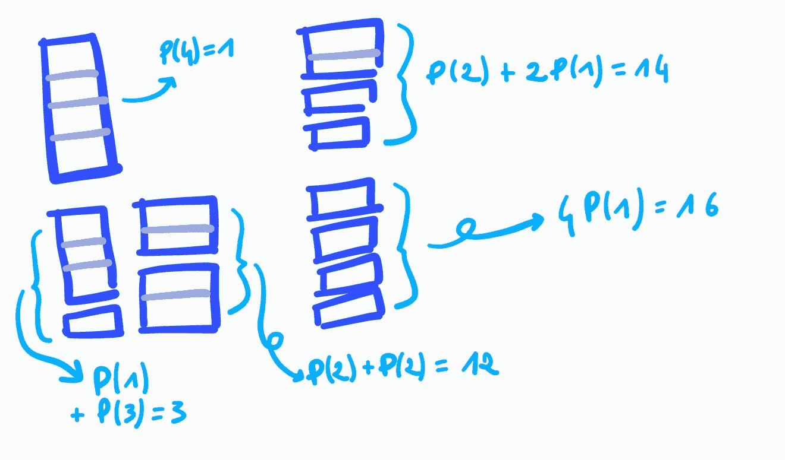
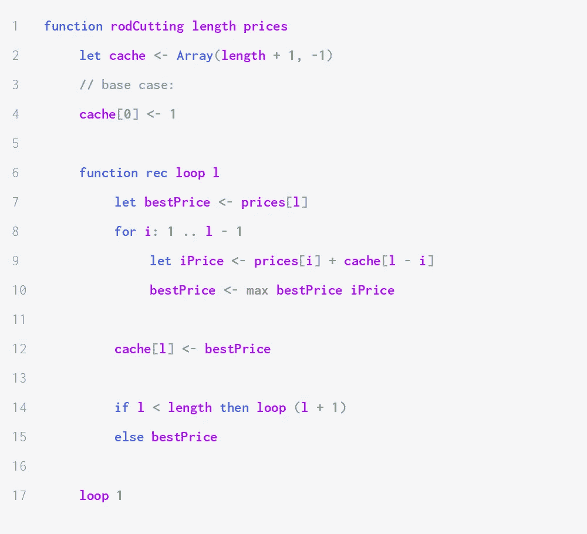
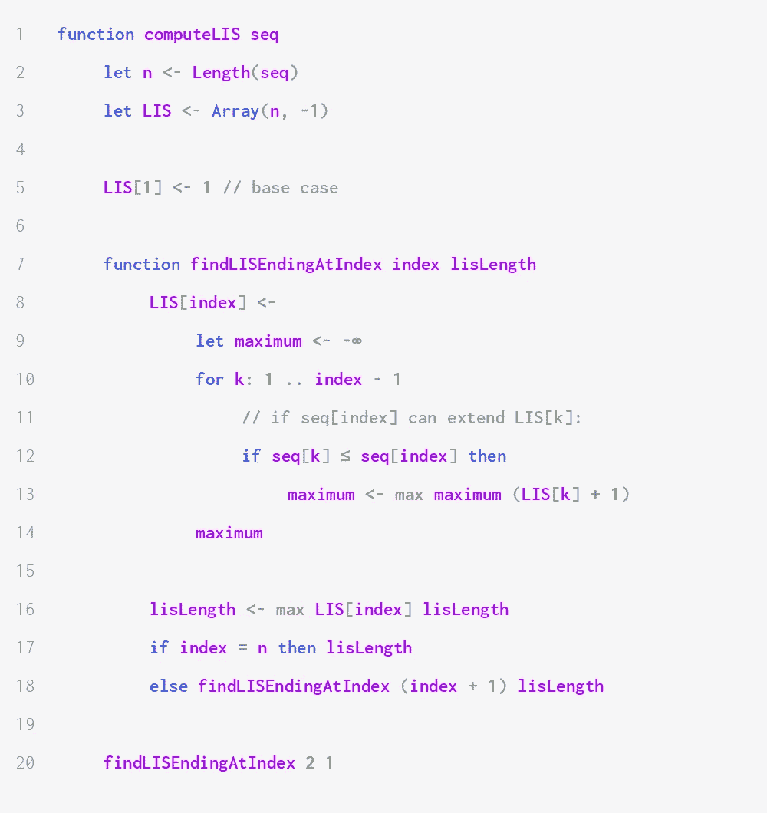
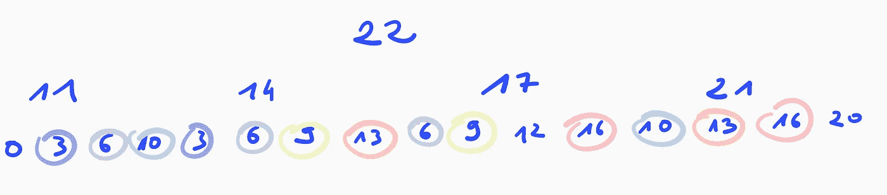
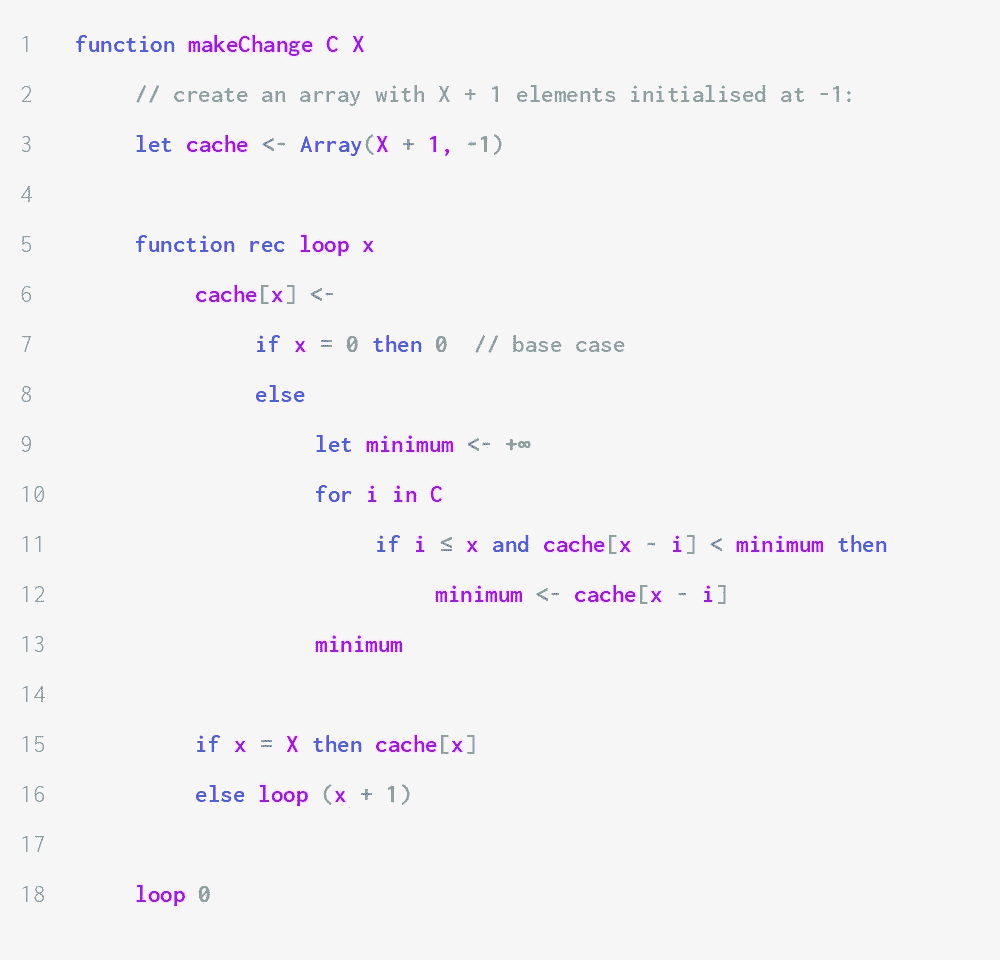

# 动态编程的艺术。2):经典算法

> 原文：<https://medium.com/geekculture/the-art-of-dynamic-programming-pt-2-classic-algorithms-3086fd47f03c?source=collection_archive---------33----------------------->

## 你需要知道和理解的三个经典动态编程算法

这是关于动态编程基础的文章的第二部分。在第一部分中，我们定义了动态规划并研究了三个简单的例子。这篇文章关注三个更高级的问题:切杆问题、计算最长增长子序列和找零问题。

第 1 部分可以在这里找到:

 [## 动态编程的艺术。1):简介

### 学习如何运用动态编程的九个基本算法

medium.com](/@alouizakarie/the-art-of-dynamic-programming-pt-1-introduction-5d2ce0a6da24) 

# 杆切割问题

## 问题陈述

假设我们有一根长度为ℓ(其中ℓ是正整数)的杆，它由基数ℓ.的有限集表示我们可以任意多次地将它切割成具有正整数长度的子棒(由子集表示)，每次切割都不会产生任何成本。然后，我们将根据其长度*米*以价格 P( *米*)出售每一根副杆。我们只知道价格是非负数:并不假设价格图是单调或同质的。**我们的目标是计算出我们可以出售一根杆的隔板的最高价格。**

比如假设 *P* 对于 1 到 4 之间的所有整数定义为 P(1) = 4，P(2) = 6，P(3) = 2，P(4) = 1。长度为 4 的杆可以分割如下:

Price of every possible way of cutting a rod of length 4.

最好的价格是 16。

## 为什么我们应该使用动态编程来解决这个问题？

让我们想一个解决这个问题的递归方法。

如果杆的长度为 1，那么我们就什么都不用做:最优切割是唯一的，价格为 P(1)的{1}。因此，我们设置 Opt(1) = P(1):它是尺寸为 1 的杆的最优价格(即最高价格)。

如果棒的长度ℓ ≥ 2，那么有两种可能性:保持棒原样(用 P(ℓ价格的切割{ℓ}))或将其分成两个子棒。假设我们把它分成两个子棒，一个大小为 k*k*一个大小为ℓ - *k* 对于某个整数 k，使得 1 ≤ *k* ≤ ℓ - 1。我们将保留一个(大小为 *k* 的那个)并将另一个拆分成所需数量的子子杆，以便获得最佳分区。换句话说，我们计算**opt(ℓ)= max { p(k)+opt(ℓ-k)| 1≤k≤ℓ-1 }⋃p(ℓ)**。

## 编写解决方案

下面的动态规划解决方案维护一个一维数组，该数组包含长度为 *k* 的最佳棒，对于每个整数 *k* 使得 1 ≤ *k* ≤ `length`。

Dynamic programming algorithm to calculate the optimal price at which we can sell a rod of a given length.

该算法在θ(ℓ)时间内运行，因为该函数被称为ℓ时间，并且内循环在θ(*k*)时间内运行，对于 1 和ℓ.之间的所有 *k*

# 最长增长子序列

## 问题陈述

我们考虑长度为 *N* ≠ 0 的有限序列 *S* (可以用数组或列表表示)。我们将 S 的*索引定义为 *S* 中所有元素的索引集——我们将在本节假设它是 0 和 *N —* 1 之间所有整数的集合。 *S* 的子序列是 *S* 的索引的子集。如果 **( *i* ，*j*∈*s’*∧*I*≤*j)*⟹*s*[*I*]≤*s**的一个子序列*s’*被称为递增在本节的其余部分，LIS( *k* )表示某个序列的最长递增子序列的长度，它在索引 *k* 处结束。****

我们的目标是计算一个序列 *S* 的最长增长子序列，也就是基数最大的那个。

## 为什么我们要使用动态编程来解决这个问题？

我们首先需要证明这个问题可以递归地解决。如果 *N* = 1，那么只有一个索引，以及两个可能的子序列:空集和索引本身。两者都在增加(对于空集，定义中蕴涵的左边总是假的，因此蕴涵总是真的；对于基数为 1 的集合，对于任意一对 *i* ， *j* 的单元素，我们有 *i* = *j* ，因此*S*[*I*]= S[*j*]，因此*S*[*I*≤*S 因此，长度为 1 的序列的最长递增子序列是 1:我们写 LIS(0) = 1。*

归纳公式更加复杂。让我们考虑一个长度为 *N* ≥ 2 的序列 *S* 。包含 *N* — 1 的 *S* 的最长递增子序列或者是{ *N* — 1}本身，如果 *S* [ *N* — 1】是 *S* 的最小元素，或者是结束于索引 i ≤ *N* — 2 且其最大元素小于或等于【T88 因此，**LIS(*N*—1)= max { LIS(*k*)+1 |*k*∈[0.. *N* — 2】，*s*[*k*]≤*s*[*n*—1】}⋃{ 1 }**。

一旦我们知道了对于每一个索引*k*S 结束于索引 *k* 的最长递增子序列的长度，我们只需要找到最大值，它对应于 S 的最长递增子序列，比如说 *S* = (1，4，2，3，5)。为了计算 LIS(4)，我们需要计算 LIS(0)、LIS(1)、LIS(2)和 LIS(3)，因为索引 0、1、2 和 3 处的值都小于 S[4]。计算 LIS(0)没有成本，因为它是一个基础案例。计算 LIS(1)需要计算 LIS(0)，因为 S[0] ≤ S[1]。计算 LIS(2)需要计算 LIS(0)。计算 LIS(3)需要再次计算 LIS(0)和 LIS(2)，这又需要再次计算 LIS(0):**子问题重叠**。

使用我们导出的递归关系，我们可以得到下面的自底向上实现。

Dynamic programming algorithm to calculate the length of the longest increasing subsequence of a given sequence.

除了维护缓存，我们还使用了一个累加器变量`lisLength`，它包含了整个序列中最长的递增子序列的长度。当我们找到结束于索引`index`的最长递增子序列的长度时，我们检查它是否比`lisLength`长，如果需要的话就更新它。

该函数的结构类似于杆切割问题的解决方案，并且它也在二次时间内运行。空间复杂度是线性的，因为我们维护了一个由 N 个元素组成的一维数组。

如果我们想要得到一个显式的最长递增子序列，我们可以维护一个变量`last`，它指示最长递增子序列的最后一个元素的索引，以及第二个数组，比如说`previous`，如果结束于索引`i`的最长递增子序列的长度为 1，那么它包含索引`i`处的值`-1`，否则包含结束于索引`i`的最长递增子序列的前一个元素的索引。

例如，如果我们考虑序列(*1；3;2;6;5;4;9* )那么`previous`就会是(-1；0;0;1;1;1;3)和`last`将是 6。因此，最长的递增子序列包含索引`6`。`previous[6] = 3`，所以它也包含 3。`previous[3] = 1`，所以它也包含 1。这是最后一个元素，因为`previous[1] = -1`。

该实现被作为一个练习。运行时间和空间复杂度不应该比我们在本节给出的版本差。

# 计算变化

## 问题陈述

这是我们在第 2 部分中讨论的最后一个算法。找零问题的目标是从由 *n* (不同的)元素组成的集合 *C* 中计算出最少数量的硬币，其总和达到一定的数量 *x* 。我们可以随心所欲地多次选择同一个硬币。例如，如果 *C* = {1，5，10，8，2}且 *x* = 10，则可能的子集包括(1，1，1，1，1，1，1，1，1)，(8，2)，(8，1，1)和(10)。问题的解是 1，也就是{10}的基数。

## **为什么我们要使用动态编程来解决这个问题？**

像往常一样，我们首先找到一个递归关系，它给出了问题的解，作为更小的子问题的解的函数。基本情况非常清楚:如果 *x* = 0，那么我们不需要花费任何硬币(这被称为空集和惯例:空集上的和是 0)。所以最优解是 Opt(0) = 0。

如果 *x*

原来在最优解中，我们只需要加一个硬币。这意味着**Opt(*x*)= min { Opt(*x*—*k*)+1 | k in*C*}**。

这不是显而易见的:为什么不能有一个更好的解决方案，我们增加两个硬币，或者用一个硬币换一些大于 2 的硬币呢？

我将向您展示如何在特殊情况下证明这个陈述，当 *a* = 2:

> **证明大纲:**
> 
> 假设最优解实际上是 Opt(x—*I*—*j*)+2，对于某些硬币 *i* 和 *j* 。这暗示了 Opt(*x*—*I*—*j*)+2<min { Opt(*x*—*I*)+1，Opt(*x*—*j*)+1 }(注意严格的不等式:我们不会介意两边是否相等)。
> 
> 让*u*:= Opt(*x*—*I*—*j*)。这是一个问题的解决方案，其中硬币必须加起来达到*x*—*I*—*j*。因此，存在一个 *u* 硬币的集合，总计为*x*—*I*—*j*。我们可以在这个系列中加入硬币。这给出了一组 *u* + 1 枚硬币，这是对硬币必须加起来达到 *x* — *i* 的问题的解决方案。因此，*u*+1≥Opt(*x*—*I*)，因为硬币不能少于最优解中的硬币。代入 *u* ，得到 Opt(*x*—*I*—*j*)+1≥Opt(*x*—*I*)。所以 Opt(*x*—*I*—*j*)+2≥Opt(*x*—*I*)+1。同样的论点，我们加上 coin *i* 而不是 coin *j* ，说明 Opt(*x*—*I*—*j*)+2≥Opt(*x*—*j*)+1。这就产生了矛盾。

概括只是一个练习。

我们现在有一个递推关系，表明这个问题有最优子结构。不难找到一个输入，它将导致计算重叠子问题的结果。例如，对于硬币 **{1，5，8，11}** 和 *x* = 22，循环树的顶部将如下所示:

First three levels of the recurrence tree of a naïve recursive approach. Circles have the same colour when they correspond to identical sub-problems.

较小的优化将允许我们删除一些重复的计算，但是使用相同递归关系的非动态编程方法最终仍然会非常低效，因为当输入变得非常大时，子问题会重叠。

使用自底向上的动态编程方法，我们可以得到以下实现:

Dynamic programming algorithm to calculate change.

# 练习

1.  **(棒)**【来自 CLRS】如果切一根棒产生一个不变成本 *κ* 怎么办，即卖分区 *A* 给你 A 的每个元素的价格之和，减去κ卡( *A* )？写一个动态规划算法，找出你出售一个长度为ℓ.的杆的一部分可以赚多少钱它必须具有 O( *N* )的时间复杂度和 O( *N* )的空间复杂度。
2.  **(Rods)** 修改杆切割问题的自底向上解决方案，不仅计算最优价格，而且*打印一个价格最优的分区*。约束:你的解决方案必须在 O( *N* )时间内运行，并且具有 O( *N* )的空间复杂度。
    ***解决方案概述:*** *给定一根长度为ℓ的杆，我们的算法找到将杆切割成两部分的最佳方式。这两个部分中的一个可以进一步分割，但另一个肯定会在杆的最佳分割中。因此，您可以使用一个数组，该数组将每个长度ℓ映射到最佳分区中一个杆的长度 I。想办法处理这个数组获得最终解。*
3.  **(最长递增子序列)**类似的问题还有最大子阵列问题。考虑一个由 N 个数字组成的数组。子数组是原始数组的连续部分。 *A* 的最大子数组是子数组 *B* ，使得 *B* 的所有元素的总和最大化。*求算法，求* A *相对于数组*长度的线性时间内的最大子数组。