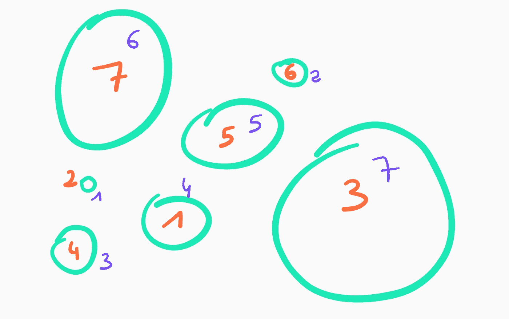
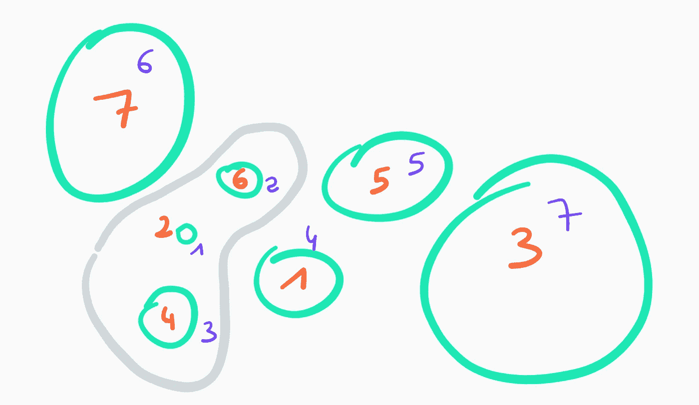
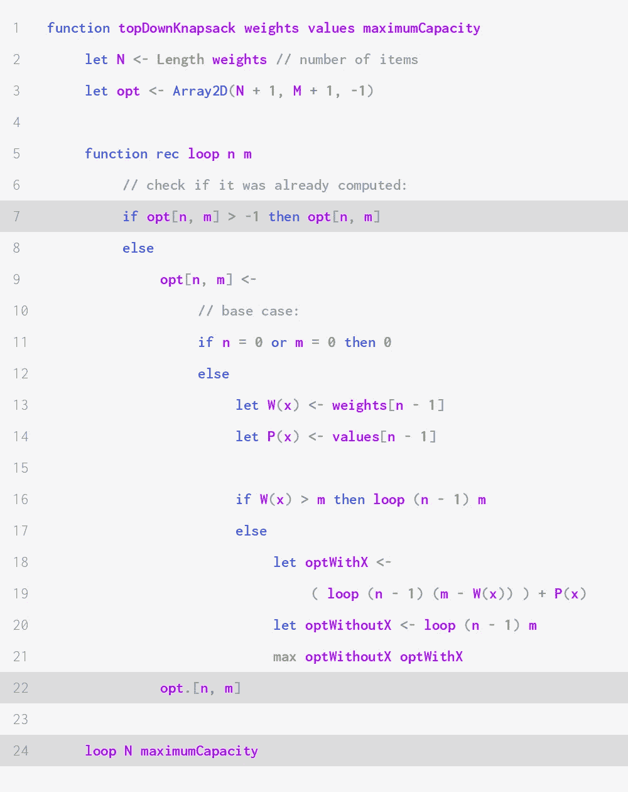
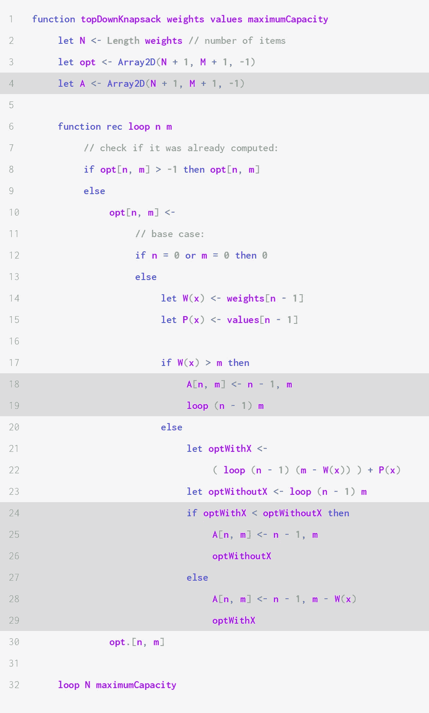
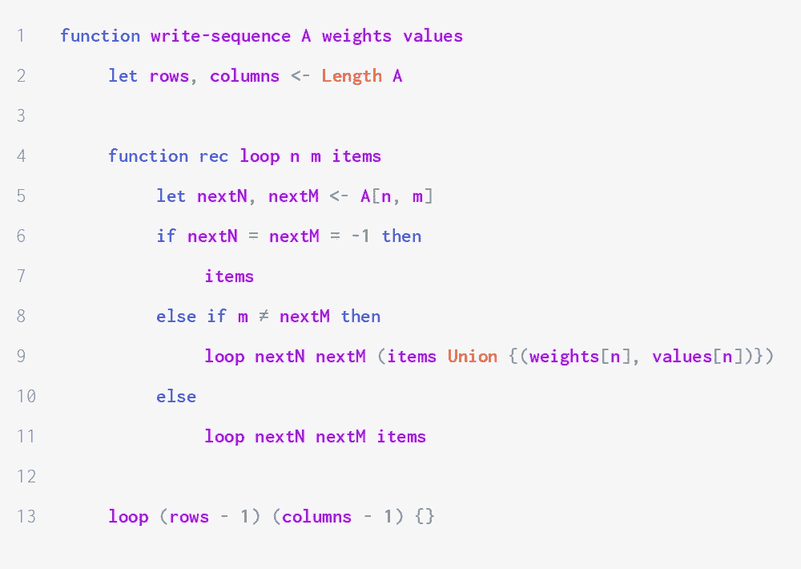

# 如何求解整体背包问题

> 原文：<https://medium.com/geekculture/the-art-of-dynamic-programming-pt-3-the-knapsack-problem-25133c6bf51e?source=collection_archive---------21----------------------->


Photo credit: Kelsen Fernandes on Unsplash

# 问题陈述

假设你有一个容量为 *M* 的背包和一组由 *N* 个物品 *i* 组成的 *I* 物品，物品的重量为 W( *i* )，价值为 V( *i* )。权重由非负整数表示。值由任意非负数表示。

我们想要选择一组 *X* 的物品，这样 *X* 的所有成员的值的总和 V( *X* )最大化，并且重量的总和不超过背包的容量。

下图显示了一个示例，其中所有物品的重量以紫色表示，价值以橙色表示。



通过蛮力，我们可以算出当总重量不能超过 6 时，最好的可能解决方案是 12。它是通过以下项目子集获得的:



# 为什么是动态编程？

正如我们在前两部分看到的，动态规划可以解决具有最优子结构的问题，并且在子问题重叠时非常有用(否则，简单的分治法就足够了)。

## 最优子结构

让我们看看如何从更小的子问题的解决方案中构建问题的解决方案。这将使我们能够建立一个递归关系，我们将使用它来编写我们的算法。

假设所有项目的集合 *I* 是有序的(并且是可索引的)。设 Opt( *n* ， *m* )表示原问题的一个简化实例的最优解的值之和，最大容量 *m* 和由 *I* 的前 *n* 个元素组成的一组项。背包问题的这个实例将被表示为 Knap( *n* ， *m* )。

首先，对于所有的 *n* 和 *m* ，我们有 Opt(n，0) = Opt(0，m) = 0:在这两种情况下，我们不能存储任何项目，所以它们的值加起来是 0。

如果 *n* 和 *m* 为正，设 *S* 为求解 Knap( *n* ， *m* )的最优集合，即前 n 项的子集使得 V( *S* ) = Opt( *n* ， *m* )。

让我们考虑第 n 项。我们就叫它 *x* 。如果 *x* 是*而不是 *S* 中的*那么 *S* 仍然是 Knap( *n* -1， *m* )的一个解。其实是最优的。因此， **Opt( *n* -1， *m* ) = Opt( *n* ， *m* )** 。

> **证明:**
> 
> 假设 S 没有最优解 Knap(n-1，m)。这意味着 V(S) < Opt(n-1, m). Plugging V(S) = Opt(n, m), we get **Opt(n，m) < Opt(n-1，m)** 。但如果某个集合 *U* 求解 Knap(n-1，m)(最优与否)，那么它也求解 Knap(n，m)(我们没有义务使用第 n 项)，因此 **Opt(n-1，m) ≤ Opt(n，m)** 。
> 
> 这就给出了一个矛盾:S 一定是 Knap(n-1，m)的最优解。

如果相反， *x* 确实属于 *S* 那么 S∖{ *x* }就是 Knap( *n* -1， *m* -W( *x* ))的一个解。我们会证明这个解是最优的。显示 **Opt( *n* -1，*m*-W(*x*)+V(*x*)= Opt(*n*， *m* )** 。

> **证明:**
> 
> Let S' := S∖ *{x}* 。那么 V( *S'* ) = Opt( *n* ， *m* ) - V( *x* )。假设 *S'* 不是最优的，即 V(*S '*)<Opt(*n*-1， *m* -W( *x* ))。然后 V(S') + V(x) < Opt(n-1，m-W(x)) + V(x)，即 **Opt(n，m) < Opt(n-1，m-W(x)) + V(x)** 。
> 
> 如果我们取一个最优解 Knap( *n* -1， *m* -W( *x* ))的集合，并给它加上 *x* ，那么我们将得到一个集合 *Y* ，它求解 Knap( *n 【T67， *m* )并满足 V( *Y* )因此，V( *Y* ) ≤ Opt( *n* ， *m* )，即 **Opt( *n* -1，*m*-W(*x*)+V(*x【T94)≤Opt(*n*，*m*****
> 
> 这两个结论用粗体字表示相互矛盾。因此，S '一定是最优的。

我们可以将所有这些片段放在一起，建立最终的递归关系:

*   如果 W( *x* ) > m 那么 *x* 肯定不在求解 Knap(n，m)的集合中。**因此，Opt(n，m) = Opt(n-1，m)** 。
*   否则，最优解可能与 Knap(n-1，m)相同，或者可以通过将 *x* 添加到最优求解 Knap(n，m-W(x))的集合来构造。因此， **Opt(n，m) = max {Opt(n-1，m}，Opt(n-1，m-W(x)) + V(x)}** 。

## 重叠子问题

如果我们天真地实现了递归关系，许多计算最终会被执行多次。如果该函数每次被调用时都执行两次递归调用—一次计算 Opt( *n* -1， *m* )，另一次计算 Opt( *n* -1， *m* -W( *x* ))，那么复杂度将是指数级的，超过了 *NM* 必要计算的总和。

# 编写解决方案

既然我们有了一个递归关系，写一个解就很简单了。它需要三个参数:两个数组，`weights`和`values`，以及最大容量。第 *i* 项的重量和值由`weights[i]`和`value[i]`给出。

缓存`opt`是一个大小为 *N* × *M* 的二维数组，其中 *N* 是项数 *M* 是最大容量。我们将以自下而上的方式填充它。


第 8 到 19 行中的例程是递归的直接实现。第 21 到 23 行管理递归调用。第一个条件检查我们是否已经计算了最终结果，在这种情况下，我们返回最优解。否则，我们要么计算 Opt(n+1，m)如果它有意义(如果 n + 1 ≤ N)，要么移动到下面的值 *m* ，从 *n* = 0 开始。

我们的解决方案的非递归开销需要恒定的时间。所以这个解需要θ(*NM*)的时间和空间。

## 稀疏矩阵和自顶向下方法

我们可以注意到有些计算是不必要的。如果项目的权重依次为 4、8 和 15，并且最大容量为 15，那么参数 *m* 可以限制为值 15、7、11 和 3，而不是 1 到 15 之间的所有整数。这些值对应于容量残差: *M* 是残差，对于所有残差 *r* ，对于所有权重*w*:*r*–*w*是残差。

这意味着缓存矩阵是稀疏的:大多数值是不相关的。当遇到稀疏矩阵时，我们通常希望考虑自顶向下的方法，而不是自底向上的方法。这有助于避免执行大量不必要的计算。

考虑到这一点，我们可以使用 memoisation 重写我们的算法。



算法的结构本质上是一样的。三个突出显示的行对应于特定于 memoisation 的元素:我们检查该值是否是先前计算的(第 7 行)，我们返回该值而不是进行尾部递归调用(第 22 行)，并且对递归函数的原始调用传递最终参数，而不是初始值(第 24 行)。

# 构建解决方案

在大多数应用程序中，我们感兴趣的是找到一组最优项目的例子，而不仅仅是知道它们的值是多少。与其他动态规划问题一样，我们可以维护第二个矩阵，它记住我们在每一步做出的决定，而不会恶化原始算法的渐近空间和时间复杂性。

我们实现如下:



当我们从 Knap( *n* -1， *m'* )的解构造 Knap( *n* ， *m* )的解时，用 *m'* = *m* 或 *m* - W( *x* )将 *n* -1 和 *m* 存储在 *A* 中由于我们在从容量较小的子问题的解决方案中构建解决方案时准确地选择了一个项目，因此使用以下函数，我们知道最佳解决方案中有哪些项目:



# 轮到你了！

如果您想用真正的编程语言实现解决方案，我已经为您创建了一个文本文件来测试您的代码:

[](https://github.com/zak-al/DP-tests/blob/main/integral-knapsack.txt) [## 主 zak-al/DP-tests 上的 DP-tests/integral-backpack . txt

### 80 120 135 103 197 92 50 110 107 134 115 154 42 15 131 7 122 173 176 151 50 79 184 125 38 182 126 81 151 165 54 149 112…

github.com](https://github.com/zak-al/DP-tests/blob/main/integral-knapsack.txt) 

它具有以下格式:

```
n: positive integer
weights: n space-separated positive integers
values: n space-separated positive integers
maximum capacity: positive integer
solution: positive integer
<blank line
```

# 提高空间复杂度

如果我们只对知道背包可以携带的最优值感兴趣，我们可以改进我们的解决方案，使它占用 O( *M* )空间，而不是 O( *MN* )。

我们注意到，我们为解决 Knap( *n* ， *m* )而执行的唯一递归调用回顾了我们考虑前 n-1 项的问题实例。因此，将所有子问题的解存储在一个 *N* * *M* 矩阵中是没有用的:一个 2* *M* 矩阵就足够了。