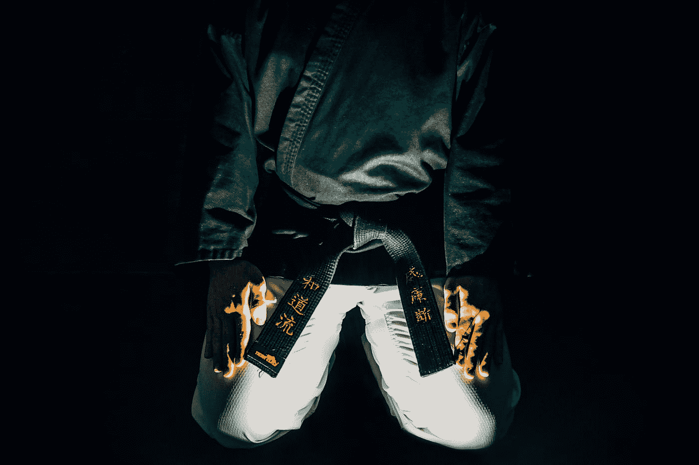

# 价值投资的艺术

> 原文：<https://medium.com/geekculture/the-art-of-value-investing-6fb6f9e649ee?source=collection_archive---------11----------------------->

## 是的，我说的是“艺术”

Photo by [Leslie Jones](https://unsplash.com/@les_elizabethj?utm_source=medium&utm_medium=referral) on [Unsplash](https://unsplash.com?utm_source=medium&utm_medium=referral)

价值投资，像学术之外的任何东西一样，是科学和艺术的结合。没有客观的研究，价值投资的心理学部分就不会有效。在这篇文章中，我将试图揭示价值投资的另一种艺术形式，并揭示为什么它与科学关系不大。