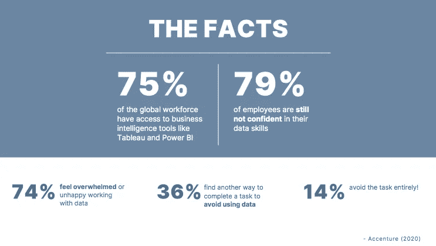
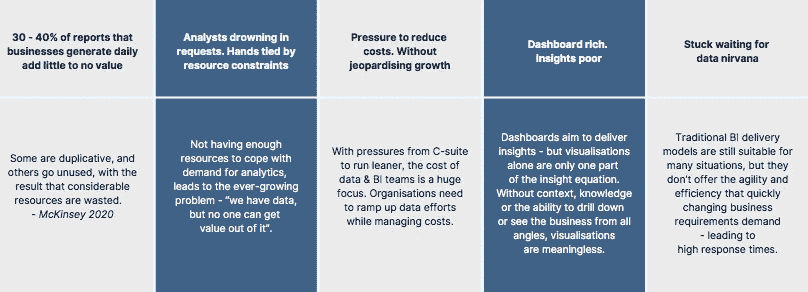

# 现在要打破的坏习惯:数据和分析领导者

> 原文：<https://medium.com/geekculture/the-bad-habits-to-break-now-data-analytics-leaders-9240fbf91e54?source=collection_archive---------29----------------------->

这是专业人士希望你停止做的事情。

The Bad Habits To Break Now: Data & Analytics Managers

W 无论你是回到办公室还是仍然在家工作，有一件事是肯定的:我们从来没有像现在这样依赖于获取新闻(这里的新闻指的是事实性的见解)。虽然你的公司可能有 Zoom 和团队在工作，但完全有可能是[多年的数字化转型](https://www.hyperanna.com/post/when-is-the-right-time-to-talk-about-bi-self-service-tools?utm_campaign=blog-reshare&utm_source=medium&utm_medium=bad-habits-to-break-now&utm_content=blog-when-is-the-right-time-to-talk-about-BI)带来了问题。无论是高级管理人员期待数据涅槃，业务团队忘记校对简报(或文档需求)，还是数据团队用代码回复，这都是专业人士希望你停止做的事情。

# 目录:

*   **问题 1——没有 CDO(或者没有养！)**
*   **问题 2 -没有将数据战略与业务战略联系起来**
*   **问题 3——不重视数据素养**
*   **问题 4——迷惑所有人**
*   **问题 5 -使用仪表盘(而不是答案)进行响应**

# **问题 1 —没有首席数据官(或没有首席数据官！)**

事实—**CDO 这个角色是高管层中离职率最高的角色之一。**

令人担忧的是——在麻省理工学院斯隆管理学院 2020 年的一项研究中——不到 30%的高管报告称，CDO 的角色是成功的，并在他们的组织中得到很好的确立。典型的例子:几家大银行正处于 CDO 角色的**第四或第五现任** **中，其他银行已经停下来重新思考这个角色，这凸显了 CDO 面临的挑战。因此，首席数据官这一角色的长期前景仍不明朗。**

虽然有人指出，像亚马逊和谷歌这样的数据驱动型公司传统上并没有任命 CDO，因为数据已经深深植根于他们的 DNA 中— **大多数公司都不像亚马逊或谷歌。**

> 解决方案 1 —首席数据官(或类似职位)的设立代表了对数据对组织重要性的认可。

组织、管理和提供数据价值是区分抓住时机的公司和迷失方向的公司的主要因素之一，尤其是在现在和未来的数字经济中。因此，**公司必须确保首席数据官拥有必要的工具和支持来实现他或她的数据愿景。只有到那时，企业才能合法地宣称，他们已经赢得了被称为数据驱动的权利。**

# **问题 2——没有将数据战略与业务战略联系起来**

事实— **大多数数据策略与商业策略无关。**

万事达卡 CDO·乔安·斯通尼尔建议，对于要成为数据驱动的公司，“公司的数据战略必须遵循商业战略。”类似地，高级分析公司 AI H M Group 的全球负责人 Arti Zeighami 分享说，他不挑选人工智能用例，而是解决他的同事面临的业务挑战。

由于每个组织都是不同的，体现了自己的业务目标和文化，公司必须致力于反映相关用例、数据供应链以及推动特定业务成果的数据消费模式的数据战略。

> **解决方案 2——制定并执行反映您的业务战略和愿景的数据战略。**

# **问题 3—没有优先考虑数据读写能力**

事实— **员工缺乏数据驱动的愿望。**

虽然数字技能对避免欺骗和在社会中发挥作用很重要，但当大多数人倾向于[避免量化方法甚至害怕它们](https://openaccess.city.ac.uk/id/eprint/18351/8/)时，这是一个挑战(Slootmaeckers 等人，Politics，2014)。事实上，根据埃森哲(2020 年)，**的调查，全球只有 21%的员工对自己的数据素养技能充满信心，即他们阅读、理解、质疑和处理数据的能力**。

那么，我们如何帮助员工获得数字和统计技能呢？

> **解决方案 3——采用** [**自助式商业智能**](https://www.hyperanna.com/resources/bi-challenge-hyper-anna-vs-power-bi?utm_campaign=website &utm_source=medium&utm_medium=bad-habits-to-break-now&utm_content=video-challenge-power-bi-vs-hyper-anna) **，即真正为实时自助式数据消费而设计的业务友好型工具，为您组织内所有级别的数据领导创造引人注目的职业道路。**

在 2020 年麻省理工学院斯隆回顾报告中，中国银行的戈德堡描述了“创造职业道路以使企业接受数据的需求。”这需要在与数据相关的所有功能之间建立系统能力，包括战略、治理、架构、分析和消费。 [Goldberg 指出](https://sloanreview.mit.edu/article/why-chief-data-officers-must-assume-leadership-for-data-success/)通过持续执行，一个组织将会“将数据视为商业资产”

CVS Health 的 CDO 鲍勃·达林(Bob Darin)观察到，跨企业协调是 CDO 面临的最大挑战之一，并指出他的角色“需要大量的**变革管理——这是工作的最大部分**”- [麻省理工学院斯隆管理学院(2020 年)](https://sloanreview.mit.edu/article/why-chief-data-officers-must-assume-leadership-for-data-success/)

# **问题 4——迷惑大家**

事实— **每个人都不知道数据的背景、复杂性和价值。**

根据[麻省理工学院斯隆报告(2020)](https://sloanreview.mit.edu/article/why-chief-data-officers-must-assume-leadership-for-data-success/) 的说法，数据带来的价值在于它的好处在整个组织中被清楚地表达和理解。由于管理数据的复杂性以及未能以跨越业务和技术界限的清晰方式传达业务价值，许多数据计划未能成功。对于数据领导者来说，沟通是关键:用商业术语说话，避免技术术语。沟通是建立对您的数据的信任的关键，以确保业务和客户的认同、可信度和发展势头。

许多数据计划失败了，因为业务团队对数据失去了信心。可能导致这种不信任的因素包括不完整、不准确或被误解的表述，或者缺乏共同的理解和定义。美国运通的作物观察到，“CDO 角色的未来是关于实现对数据的信任和推动创新。CDO 必须培养对数据的信任。”

> **解决方案 4 —** 坚持不懈地在组织上下沟通数据的背景、复杂性和价值。

# **问题 5 —用仪表盘(而不是答案)回应**

事实——**人需要答案，** [**不是仪表盘**](https://scribblr42.medium.com/the-future-of-dashboards-is-dashboardless-6f746ea7d850) **。**

您希望推动数据采用。但许多人不知道如何使用数据，即使他们知道，也很难访问。构建仪表板在理论上听起来很棒。但是如果你想快速迭代，那就太糟糕了。以下是事实。

[Future of dashboards is dashboardless](https://scribblr42.medium.com/the-future-of-dashboards-is-dashboardless-6f746ea7d850) — Crediting Ravi Mistry for call for more answers, more Just-In-Time analytics to help people get insights when they need it.

最重要的是:

*   **企业每天生成的报告中有 30-40%几乎没有价值** ‍:有些是重复的，有些则没有使用，结果浪费了大量资源。— [麦肯锡 2020 年](https://www.mckinsey.com/business-functions/mckinsey-digital/our-insights/reducing-data-costs-without-jeopardizing-growth)
*   **仪表盘丰富。洞察力差:**仪表板旨在提供洞察力——但可视化本身只是洞察力等式的一部分。如果没有背景、知识或从各个角度深入研究或观察业务的能力，观想是没有意义的。
*   **停滞等待数据涅槃:**传统的 BI 交付模式仍然适用于许多情况，但它们无法提供快速变化的业务需求所需的敏捷性和效率，从而导致响应时间过长。
*   淹没在请求中的分析师。受到资源限制的束缚:没有足够的资源来应对分析需求，导致了日益严重的问题——“我们有数据，但没有人能从中获得价值”。
*   **降低成本的压力。在不危及增长的情况下:**随着来自首席管理人员的精简压力，数据成本&成为商业智能团队关注的焦点。组织需要在管理成本的同时加大数据工作。

Key Problems with Business Intelligence Today (2021)

> 解决方案 5—一流公司不会等到五年数字化转型完成后才考虑简化 [**数据消耗**](https://www.mckinsey.com/business-functions/mckinsey-digital/our-insights/reducing-data-costs-without-jeopardizing-growth) 。相反，他们从一开始就以[自助](https://www.hyperanna.com/resources/bi-challenge-hyper-anna-vs-power-bi?utm_campaign=website &utm_source=medium&utm_medium=bad-habits-to-break-now&utm_content=video-challenge-power-bi-vs-hyper-anna)的方式向员工提供他们的商业智能能力。只有到那时，他们才能加速推动增长的解决方案。 [Hyper Anna](https://www.hyperanna.com/product/future-of-work-with-hyper-anna?utm_campaign=website &utm_source=medium&utm_medium=bad-habits-to-break-now&utm_content=ha-page-future-of-work) 让企业中没有数据科学学位的人也能获得数据洞察力。

# **结论**

数据和分析领导者需要配备适当的支持，以便他们能够执行公司的业务战略和数据愿景。除非工具、流程和领导力结合起来解决员工的真正需求和动机，否则成为数据驱动型企业仍将是一项挑战。

# 想多读一点吗？

我们这本 100 页的书是自动分析指南。超过 100 页的数据和业务团队的最新研究，细分为一口大小的数据，为忙碌的人带来智能。

[**在此下载免费指南→**](https://www.hyperanna.com/resources/automated-analytics-the-guide?utm_campaign=guide-download&utm_source=medium&utm_medium=bad-habits-to-break-now&utm_content=ha-guide-automated-analytics)

Download The Ultimate Guide To Automated Analytics — over 100 pages of the latest research for data and business teams (2021)

**_ _ _ _ _ _ _ _ _ _ _ _ _ _ _ _ _ _ _ _ _ _ _ _ _ _ _ _ _ _**

**关于**[**HYPER ANNA**](https://www.hyperanna.com/?utm_campaign=website &utm_source=medium&utm_medium=bad-habits-to-break-now&utm_content=ha-homepage)**—**世界排名第一的自动化分析平台，被微软、IAG、新加坡电信和西太平洋银行等全球公司使用。[https://www.hyperanna.com/](https://www.hyperanna.com/?utm_campaign=website &utm_source=medium&utm_medium=bad-habits-to-break-now&utm_content=ha-homepage)