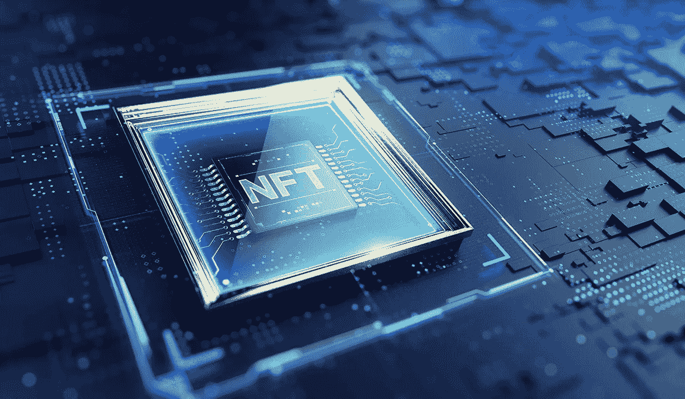

# NFT 市场发展的基础

> 原文：<https://medium.com/geekculture/the-basics-of-nft-marketplace-development-409d822cedb4?source=collection_archive---------15----------------------->

在接下来的几年里，你会更多地听到 NFT 这个词。它代表“不可替换的令牌”。从技术上讲，它允许唯一地识别和关联数字世界中某些资产的所有权。这个词最近引起了极大的兴趣，以至于它被选为 2021 年柯林斯字典年度词汇。那么，什么是 NFT 市场，为什么值得创建一个？在这篇文章中，我们涵盖了 NFT 市场发展的基本原则。

NFT 是一种数字资产，通常是独一无二的或稀有的，并且具有可以识别它的一次性代码。NFT 自 2014 年左右就已经存在，但随着加密货币和数字化的兴起，近年来作为买卖数字资产的一种手段，NFT 变得越来越受欢迎。自然，NFT 市场越来越受欢迎。

本质上，它们是数字收藏家的物品。据福布斯报道，自 2017 年以来，NFT 交易的资产价值约为 1.23 亿美元，2020 年达到 3.4 亿美元。据预测，到 2030 年，这个市场的 T2 CAGR 将增长 39.6%。

不可替代的令牌基于区块链技术，它们代表从艺术品到播放列表/音轨和文章，到游戏中的对象或资产(如数字房屋)的数字资产。

那么，为什么它们变得如此受欢迎呢？好吧，虽然任何人都可以在线访问这些数字作品，但 NFT 所做的是通过区块链网络，以一种完全不可改变且不会出错的方式建立和跟踪所有权。举例来说，当任何人都可以下载作品时，为什么这对艺术收藏家来说很重要呢？嗯，正如[福布斯所说](https://www.forbes.com/uk/advisor/investing/nft-non-fungible-token/)，拥有一件作品的“数字吹嘘权”几乎和拥有这件作品本身一样重要。

但是，为了进行非金融交易，需要一个专门的 NFT 市场。因此，对于寻求创建 NFT 市场的创新企业来说，未来是光明的。NFT 市场是一个数字平台，允许所有者购买、出售(通常以固定利率)存储、展示和创造(在某些情况下)NFT 代币。他们是虚拟世界的奇迹。由于 NFT 市场开发需要特定的技术技能和专业知识，为了确保您平台构建的成功，寻求区块链软件开发公司的帮助可能是有益的。

> ***“NFT 市场允许数字收藏者购买、出售和创造他们自己的代币，这些代币代表独特的、有形的和无形的物品的所有权”。——*******。****

# *为什么需要 NFT 市场？*

*无论是数字货币还是传统货币，NFT 和货币之间的主要区别在于，它们都有一个特定的值，而不是一个统一的比率，后者是基于令牌的个体特征。这意味着它们不能互相交换，对等交换。*

*这些不可替代的代币也不能通过集中或分散的加密交易所进行买卖，因此交易非交易凭证的唯一方式是使用在线 NFT 市场。这意味着 NFT 市场开发对 NFT 市场开发公司来说将变得越来越有利可图。*

# *NFT 市场的好处*

*因为 NFT 市场是建立在区块链技术之上的，它们产生相同的好处，包括:*

*   ***透明度** —区块链的实时性和不可改变性意味着在 NFT 市场进行的交易完全可见，并且不可能被篡改。*
*   ***去中心化** —您可以在网络中的不同节点之间复制和分发所有数据。而且，每次添加新数据块时，网络都会更新，每个对等点都可以查看信息*
*   ***安全**——区块链为 NFT 市场配备了内置的安全功能、加密技术和共识算法，以防范在线欺诈、违规或其他网络威胁。*

**

# *NFT 市场发展过程解释*

*首先要知道的是，一般来说，利基 NFT 市场比一般市场更受欢迎，比如专注于数字艺术的 NFT 平台。*

*NFT 市场开发供应商可以帮助公司创建市场应用程序，允许 NFT 的用户使用一个简单的界面高效地执行他们需要的任务。当考虑您的 NFT 平台的特性时，在您的需求列表中包括以下内容是值得的:*

*   *店面*
*   *仪表盘*
*   *NFT 铸币厂*
*   *列表和收藏创建*
*   *列出状态和令牌详细信息*
*   *NFT 滤波器*
*   *高级搜索功能*
*   *出价购买功能*
*   *钱包整合*
*   *评级和评论*

*一旦你确定了你的定位，你可以利用你选择的 NFT 市场发展公司的专业知识来帮助你实现你的项目。该合作伙伴将能够帮助您进行 NFT 平台的端到端开发，通常包括以下步骤:*

1.  ***选择你的区块链** —以太坊、币安智能链、Solana、Cardano 和 Polygon 是最常用的。*
2.  ***定义项目 UX 设计** —简化和优化您的 UX 是构建成功的 NFT 市场平台的关键。在 NFT 市场开发公司的帮助下，你可以创建一个直观、简单、易用的用户界面。*
3.  ***前端开发** —一家久经考验的 NFT 市场开发公司可以帮助您为您的 NFT 平台设计框架，保证卓越的功能和易于被您的用户采用。*
4.  ***实施智能合同**—NFT 市场中的每一项运营任务都是通过智能合同完成的。它们触发了在 NFT 平台上发生的所有过程。一家 NFT 市场开发公司将帮助你创建和实现这些智能合同，让球滚动起来。*
5.  ***设置存储** —与特定令牌相关的所有 NFTs 元数据通常存储在区块链之外，因为在区块链存储数据成本高昂。解决方案之一是将元数据存储在星际文件系统(IPFS)中，这是一种对等网络，用于在分布式文件系统中整理和共享数据。*
6.  ***集成** —这是开发前端和后端接口以与部署在区块链网络上的智能合同业务逻辑进行交互的过程。*
7.  ***测试** —测试是 NFT 市场开发中至关重要的一步，允许开发人员在部署之前识别并消除任何错误。*
8.  ***部署** —经过几轮彻底的测试后，您的 NFT 市场平台已经准备好部署到生产中了。*

*以上描述了在区块链软件开发专家团队的帮助下，从零开始建立 NFT 市场的基本过程。但你也可以创建一个白色标签的 NFT 市场，它基本上是 NFT 市场的克隆，以后可以根据你的需要进行定制。*

# *NFTs 的业务用例是什么？*

*毫无疑问，现在有很多关于 NFTs 的炒作，但它不仅仅是一时的时尚。因此，NFT 市场的发展将在虚拟世界中发挥比现在更大的作用。除了艺术和游戏中的商品交易之外，NFT 还有一些很有前景的商业用途，这也是促使企业考虑拓展 NFT 市场发展的原因。这里只是其中的一小部分。*

## *赌博*

*博彩业是巨大的。截至 2021 年，该市场的价值为 1800 亿美元，预计到 2025 年将达到惊人的 2569.7 亿美元。游戏中迅速扩展的一个领域是数字商品的交易，在像广受欢迎的 Axie Infinity 这样的游戏中，这是一个 NFT 平台和战斗游戏，玩家可以收集和交易称为 Axie 的小数字生物。目前 Axie Infinity 的交易价格为 63.89 美元，24 小时交易量为 600，737，442 美元。擅长游戏的玩家可能会收集、繁殖和交易他们的角色，然后把游戏藏在“银行”里。*

*有趣的是，由于与数字艺术品相比，游戏的开发生命周期更长，这种吸收仍然没有达到顶峰。这意味着对于 NFT 平台开发者来说，现在可能是一个非常有利可图的时机。*

## *DeFi NFTs*

*DeFi 代表基于区块链网络的去中心化金融。在加密世界时代，NFT 可以用作偿还金融债务的抵押品。*

*所以，想象一下你花了一大笔钱购买游戏内资产或数字艺术品。这可以用来偿还债务，一旦债务还清，就可以还给你，有点像数字当铺。而且，从贷方的角度来看，如果你拖欠贷款也没有风险，因为有了智能合约，如果你不能偿还债务，NFT 会自动转移给他们。*

## *时尚*

*2021 年初，虚拟时尚品牌 RTFKT 以超过 12.5 万美元的价格出售了一款数字夹克。然后，去年 10 月，杜嘉班纳以 600 万美元的价格出售了一套 NFT 服装，由 Red DAO 和其他人购买，Red DAO 是一个投资数字时尚的分散化秘密社区组织。*

*越来越多的小型创新的 NFT 第一时尚品牌正在设计数字服装，有时与实体服装一起出售给精通密码的消费者。这种虚拟时装可以通过虚拟和增强现实技术穿着，甚至已经在伦敦时装周上亮相。而且，既然高级时装是最终的收藏家物品，那么它进入 NFT 的领域也就说得通了；数字收藏品。*

## *活动票务*

*一个更有趣的用例是将 NFT 应用于票务，这样用户可以与场馆进行交互，以点对点的方式购买门票，而不需要中间人。区块链在这里被用作第三方平台，以促进交易和 NFT——验证门票是否授权给特定的人。所有权证明存储在区块链上，由 NFT 的独特属性保护，不能被更改、删除或用另一个令牌替代。*

*媒体和娱乐行业也可以使用 NFTs 来复制特权卡的功能，提供奖励，以忠诚度积分和其他客户优惠来激励他们的观众。NFT 跟踪所有交易的历史，因此该场所将看到用户参加了哪些活动，并可以为此人提供量身定制的产品，提高参与度并推动更多销售。*

## *NFT 社区平台*

*但是，许多人会说，如果你没有地方展示它们，那么购买和拥有 NFT 时装、价值数百万美元的数字艺术品或音乐作品又有什么意义呢？这就是 NFT 平台或社区的用武之地。很有可能，很快，我们将看到 NFT 平台如雨后春笋般涌现，这些平台被设计成一个吸引人的环境，NFT 买家可以在其中聚集，虚拟地展示他们的数字资产，与志同道合的收藏家会面，谈论他们的共同兴趣。*

*[有些已经存在](https://www.techtimes.com/articles/264822/20210831/10-non-fungible-token-platforms-that-are-building-communities.htm)，但据预测，这种趋势将会增长，并导致越来越多的沉浸式 NFT 平台环境的发展，这些环境是为在虚拟世界中与其他人工作、协作和社交而构建的。*

# *摘要*

*随着世界变得越来越在线，NFT 市场的发展将会蓬勃发展。如果你正在寻找建立自己的 NFT 平台，你会想要考虑上述功能，范围出你的利基，并选择正确的软件公司来帮助你与 NFT 市场的发展和提供你的愿景。*

*如果您对如何开始 NFT 实施之旅有任何疑问，我们很乐意回答。[这里联系我们](https://eleks.com/contact-us/?utm_source=medium_data_driven_investor&utm_medium=refferal&utm_campaign=Republ-nft_blog)。*

*【https://eleks.com】原载于 2022 年 3 月 2 日**。***