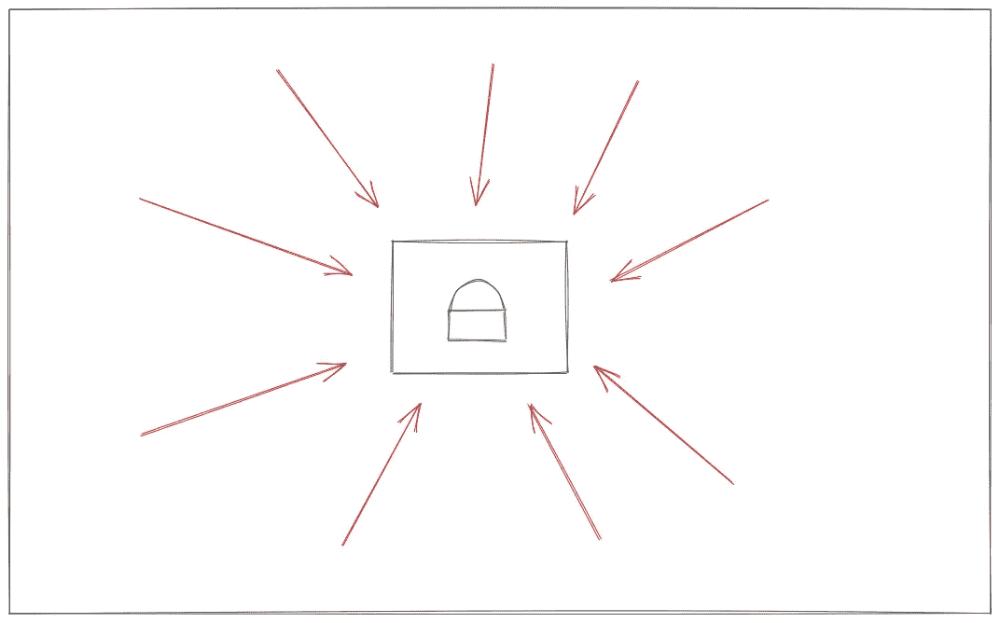

# 威胁建模的基础

> 原文：<https://medium.com/geekculture/the-basics-of-threat-modeling-8c9fffc2fe89?source=collection_archive---------5----------------------->

## 识别设计中的威胁

作为一名应用程序安全工程师，我花了大量时间对世界上一些最好的工程师创建的新服务或功能进行设计文档审查，这涉及到大量的威胁建模。识别对系统或流程的威胁是创建安全可靠的服务的第一步。在这篇博文中，我想…