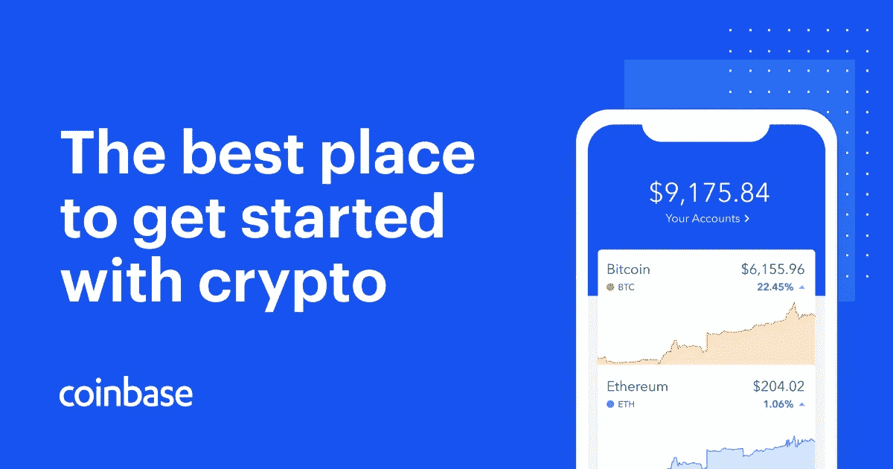
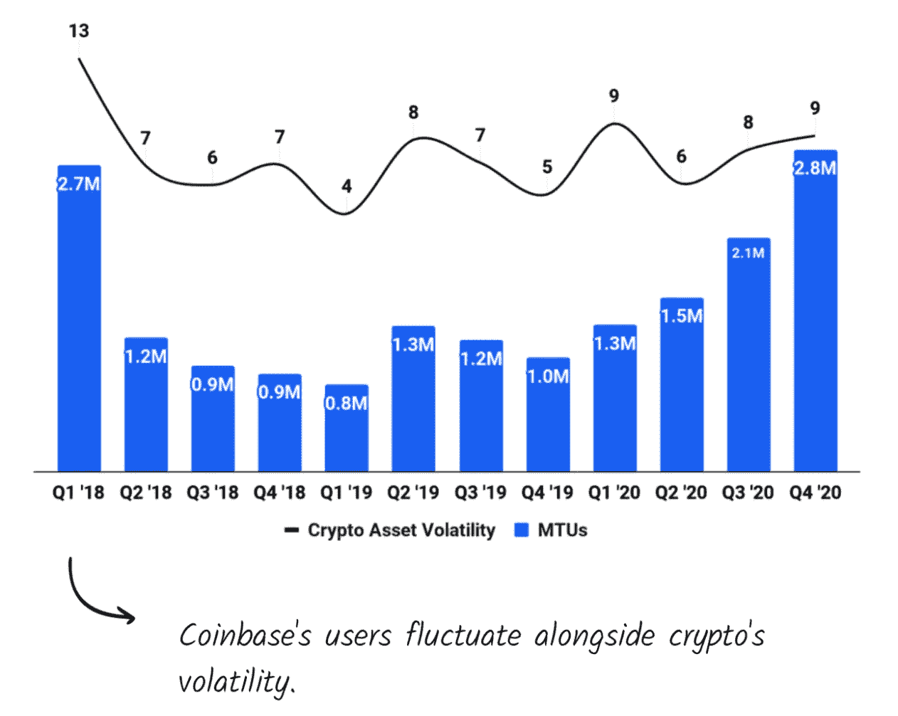
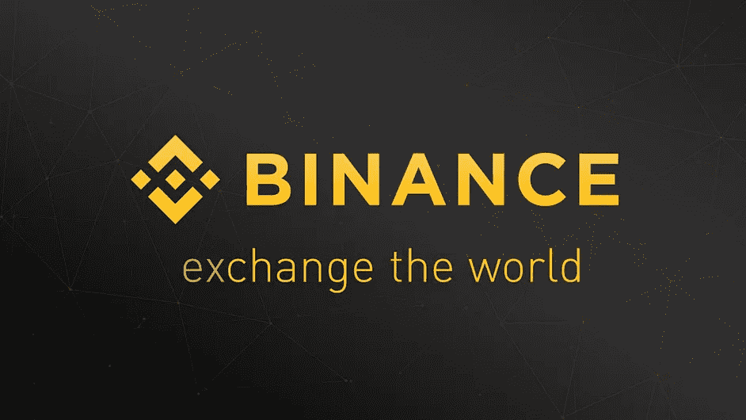
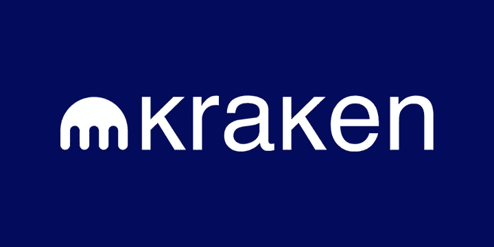
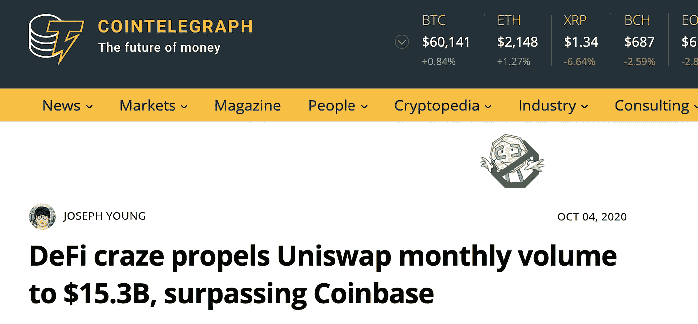
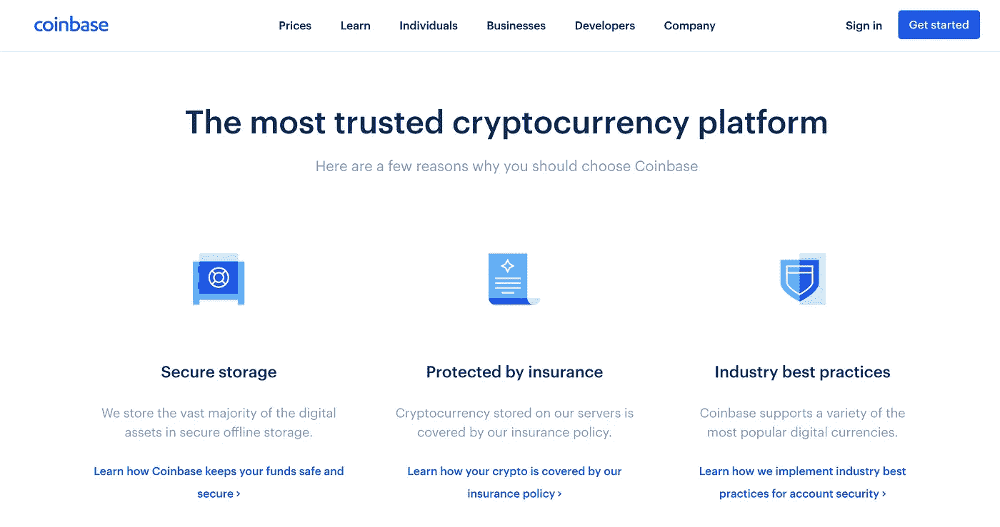

# 比特币基地的熊市

> 原文：<https://medium.com/geekculture/the-bear-case-for-coinbase-63f5448e4eb1?source=collection_archive---------8----------------------->

## 用现实主义的镜头打破比特币基地的宣传

总部位于美国的加密货币交易所比特币基地将于 4 月 14 日在纳斯达克交易所公开亮相，股票代码为＄COIN——作为加密领域第一家也是最知名的上市公司，引起了人们的极大兴趣。

许多加密爱好者认为这是该行业的分水岭时刻——这是传统金融世界已经接受加密为合法技术的信号。

上周早些时候，比特币基地在公开上市前公布了 Q1 2021 的数据:

*   3350 亿美元的交易量
*   总收入约为 18 亿美元
*   净收入约为 7.3 亿至 8 亿美元

这些指标都大大超过了比特币基地 2020 年全年的数字——该公司在 1930 亿美元的销量上实现了 12 亿美元的收入和 3.32 亿美元的利润。

因此，比特币基地不仅在以荒谬的速度增长，他们还在设法盈利的同时做到了这一点。

比特币基地的批评者认为其预计超过 1000 亿美元的估值是又一个肆意投机的例子——脱离了公司的内在价值。

不管你对 crypto 的看法如何，许多人都会带着浓厚的兴趣和期待观看本周三的行情。

为了纪念比特币基地(和密码行业)的首次公开亮相，我将为交易所写一篇熊市案例和牛市案例。

# 熊市案例 1:基于历史牛市的泡沫估值

假设 1000 亿美元的硬币首次亮相时市值为 1000 亿美元。

以 2020 年 12 亿美元的年收入，比特币基地的市盈率将达到 83 倍——至少可以说，这是一项非常没有吸引力的投资。

如果我们考虑到 2021 年 72 亿美元的年化收入(是 Q1 2021 年的 4 倍——这不是最好的假设，但请相信我)，比特币基地的市盈率远高于 14 倍。

尽管很难做出这种假设，但鉴于 Q1 2021 是一场与 2017 年秋冬相媲美的加密牛市——在其历史性的和有充分记录的崩溃之前。

比特币基地的 S-1 表示，其业务很大程度上取决于散户投资者的持续兴趣——众所周知，散户投资者在牛市中比熊市中参与更多。

> “鉴于加密货币行业的价格周期，我们的财务状况可能会出现波动。”— Brian Armstrong，比特币基地首席执行官

Source: Coinbase S-1

加密货币投资研究公司 new constructions[对比特币基地非常悲观，称其估值应该比预计的上市价格低 80%。](https://twitter.com/NewConstructs/status/1380654428659781635?s=20)

在一份研究报告中，New Constructs 指出，为了从贴现现金流的角度证明其估值的合理性，比特币基地将需要在未来近十年拥有 [50%的 CAGR。作为参考，纳斯达克最大的 10 年 CAGR 仅为 21%。](https://www.coindesk.com/coinbase-valued-between-18b-230b-analysts)

> 比特币基地“几乎没有机会达到未来的利润预期，这种预期已经被纳入其 1000 亿美元的高得离谱的预期估值中。”—新构造

# 熊市#2A:来自 CEXes 的激烈竞争

CEX 是“集中式交易所”的速记加密术语，意思是一个私人公司的交易所，它保管用户的资金，以便买卖加密公司，如比特币基地、币安、双子座等。

2020 年，比特币基地 T2 85%的收入来自交易费，其中绝大部分来自散户投资者。

该公司每笔交易的回报率约为 57 个基点，但散户投资者支付的回报率远高于机构客户，每笔交易的回报率约为 1.42%。

相比之下，币安和北海巨妖等竞争对手的报价在 10-25 个基点之间。

众所周知，比特币基地是业内最昂贵的加密交易所之一。

他们能够对他们的服务收取丰厚的费用，但他们投资了一个伟大的 UX 和一个可靠的安全和信任品牌。

然而，这些都是护城河，很容易被竞争对手挖走——同时仍然提供比比特币基地更低的费用。

就像 Robinhood 如何通过免佣金交易进入经纪领域，促使 TD Ameritrade 和 Fidelity 等忠实客户效仿一样，加密交易所可以提供零或接近零的交易费作为市场份额——从比特币基地窃取用户。

> “加密市场非常年轻，我们预计会有更多的公司来争夺比特币基地今天享有的利润。随着加密货币市场的成熟，我们预计比特币基地的交易利润率将急剧下降。”—新构造

# 熊市#2B:来自 TradFi 的竞争

TradFi 是“传统金融”的另一种加密简写，即寻求发行自己的加密产品的传统机构，例如 PayPal 和 Visa。

如果比特币基地在业内最大的价值主张是一个值得信赖的品牌，他们将不得不向主流投资者证明他们的服务，而不是像 PayPal 和 Robinhood 这样的成熟金融品牌，最终甚至是像 Chase 这样的消费银行。

此外，像富达和贸易站这样的传统经纪公司正在积极寻求为他们的客户提供加密货币服务。

对于那些对简单的一站式投资体验感兴趣的用户，他们可能会选择留在他们的股票经纪人那里，而不是在比特币基地开户。

> 如果传统券商开始提供交易加密货币的能力，他们肯定会削减不成熟的加密货币市场中不自然的(高费用)。“—新构造

从机构投资方面来看，比特币基地正面临来自 FalconX、T2、Genesis 和 T4 等公司的激烈竞争。

资产管理巨头 Stone Ridge 成立了 NYDIG，让 MassMutual 等机构客户接触比特币。该公司希望 EOY 的 AUM 能有 250 亿美元。

# 熊市案例#2C:来自 DEX 的竞争

DEX 是“分散交易所”的缩写，这些交易所不是私人公司，而是开源代码，允许以无信任、无许可的方式进行点对点资产交换。

DEXes 的例子有 [Uniswap](http://uniswap.org/) 、 [Sushiswap](https://sushi.com/) 、 [Bakeryswap](https://www.bakeryswap.org/#/home) 和 [Pancakeswap](https://pancakeswap.finance/pools) (是的我知道，都是食物或者动物的名字 lol)。

鉴于加密货币是建立在开放、不可信和去中心化的 Web3 原则基础上的，DEXes 已经吸引了加密本地投资者的热切关注——所谓的 DeFi degens。

DEX 的支持者声称，这种点对点交易协议将使比特币基地这样的 CEXes 去中介化——因为交易者不再需要与中间人和可信赖的交易对手打交道。

指数变得如此受欢迎，以至于 Uniswap 的月交易量一度超过了比特币基地的 T21。

在 2020 年 9 月的" [DeFi Summer](https://www.financemagnates.com/cryptocurrency/news/defi-summer-is-over-as-token-prices-drop-get-ready-for-defi-fall-literally/) 高峰期，DEX volumes 与 CEXes 相比，份额接近 20%(目前位于 [~7%](https://www.theblockcrypto.com/data/decentralized-finance/dex-non-custodial/dex-to-cex-spot-trade-volume) )。

Source: CoinTelegraph

最令人惊讶的部分？

Uniswap 只有 20 名全职员工，而比特币基地有 1200 多名员工，这显示了该协议的高运营杠杆作用。

# 熊市案例 3:潜在黑客

再说一次，鉴于比特币基地的品牌是建立在信任的基础上的，这种信任很容易被一次大规模的破坏性黑客攻击摧毁。

加密行业以其黑客行为而闻名，特别是在交易所方面，这可以追溯到 2014 年臭名昭著的 [Mt Gox](https://en.wikipedia.org/wiki/Mt._Gox) 黑客行为，导致价值近 5 亿美元的比特币被盗，Mt Gox 宣布破产。

最近，lender [Cred](https://coinmarketcap.com/headlines/news/hacked-crypto-lending-platform-cred-suspends-deposits-and-withdrawals-while-cooperating-with-authorities/) 和 social token community[Roll](https://techcrunch.com/2021/03/16/5-7m-stolen-in-roll-crypto-heist-after-hot-wallet-hacked/)也遭到了黑客攻击。

因此，即使是比特币基地也有可能遭到黑客攻击，这是合情合理的。

Source: Coinbase.com

一如既往，如果你有任何问题或想详细讨论这些话题，请在 LinkedIn 或 Twitter 上给我发消息。我喜欢和人们谈论加密和广泛的生活:)