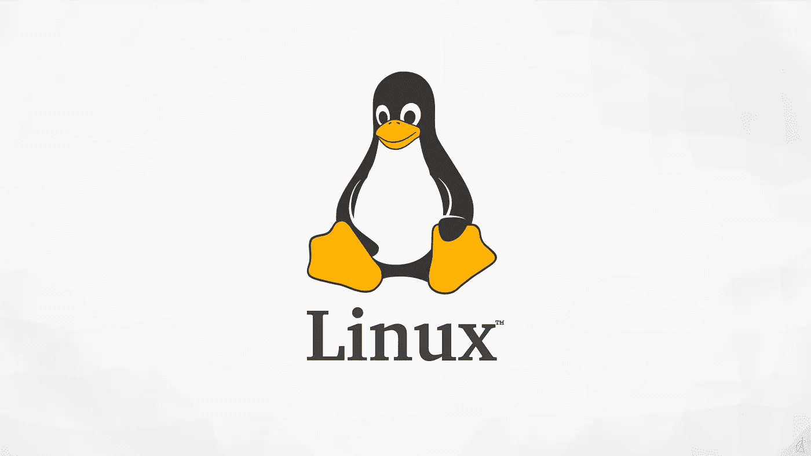
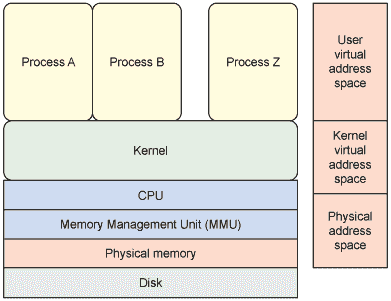
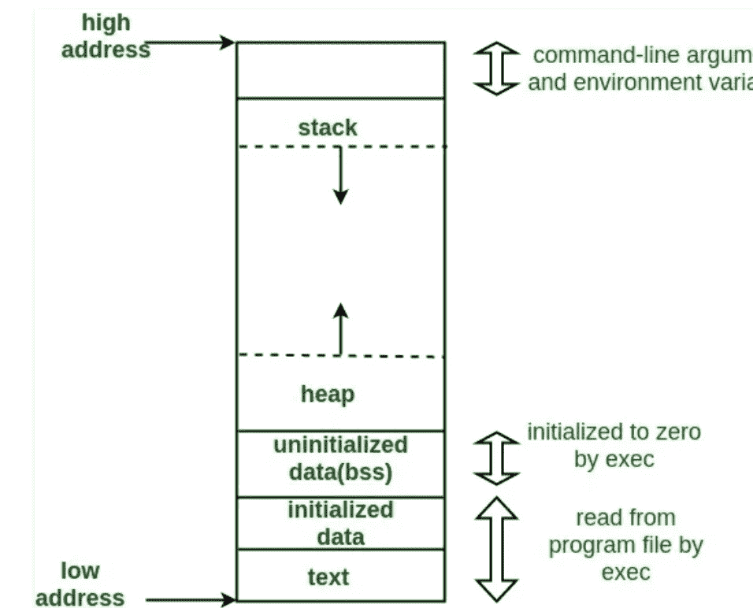
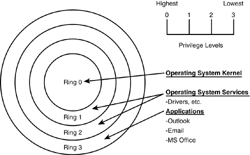

# Linux 内核初学者指南

> 原文：<https://medium.com/geekculture/the-beginners-guide-to-the-linux-kernel-29743b1a2daf?source=collection_archive---------3----------------------->

## 5 分钟学会 Linux



Wallpaper from getwallpapers.com

为了开发一个设备驱动程序，你需要了解 Linux。初学者可能很难理解什么是 Linux。有一种普遍的误解，认为 Linux 是一种操作系统。然而，事实远非如此。

这是 Linux 内核的初学者指南。

## 什么是 Linux？

许多人将 Linux 混淆为计算机的操作系统。Linux 实际上是操作系统的内核。GNU 是命令行工具。从技术上讲，每个包含 Linux 的操作系统发行版都是唯一的，因为操作系统的名称是 GNU/Linux/每个已安装的软件包或 GNU+Linux+每个已安装的软件包。但是，大多数人都把发行版的名字缩写成像 Debian 或者 Manjaro。

## 内核是做什么的？



Figure 1 from quora.com

内核是位于软件和内部/外部硬件之间的一层，并在这些层之间执行通信。如果这一层不存在，就会发生灾难。把它想象成一个没有排队的快餐连锁店。所有的订单都会随机进来，也会随机出去。因此，创建了一个队列来系统地管理所有呼叫，以确保您的系统有序运行。



Figure 2 from medium.com

内核还控制进程的内存管理。在经典计算机中，有两种类型的内存。这些内存被称为**堆栈**和**堆**。当你分配一个变量时，系统调用将自动与内核通信，在堆栈上分配变量。然而，堆栈空间有限，因此必须在堆上分配大的项。根据编程语言的不同，您可能需要手动调用堆的分配。其他语言会动态地这样做。然而，重要的是内核将总是执行内存分配。

内核还控制进程管理。每一个在后台持续运行的程序都是一个进程。当一个程序派生另一个程序时，它将与内核通信来分配另一个进程。



Figure 3 from asmed.com

内核还管理操作系统的安全性。这可以防止恶意应用程序访问未经授权的硬件和系统软件。

总的来说，内核有 4 个任务:

1.  **内存管理**:跟踪分配给进程的内存
2.  **进程管理**:确定 CPU 上的进程
3.  **设备驱动**:充当外部硬件和软件之间的中间件
4.  **系统调用和安全**:防止环路升级

## 如何定制和编译一个内核？

与 Windows 内核不同，Linux 内核是开源的。这意味着公司和大学将直接在内核上工作，而不是创建模块化驱动程序。因此，与其去网站安装像 Windows plebs 这样的驱动程序。您可以直接进入内核并启用内核中的特性。

每个 Linux 操作系统可能都有自己下载、定制、编译和安装 Linux 内核的方式。以下是执行这些操作的步骤。

从您的操作系统的软件包管理器中安装以下 Debian 软件包。

*   fakeroot
*   饭桶
*   构建-基本
*   ncurses-dev
*   xz-utils
*   libssl-dev
*   公元前
*   弯曲
*   自由发展
*   野牛

```
# Download Kernel
wget [https://git.kernel.org/torvalds/t/linux-[version].tar.gz](https://git.kernel.org/torvalds/t/linux-[version].tar.gz)# Extract the source
tar xvzf linux-[version].tar.gz# Configure the kernel
make menuconfig
```

为什么您会对配置内核感兴趣？

大多数 Linux 发行版内核都是通用的。这意味着他们将支持尽可能多的硬件配置。内核将使用更多的 RAM 和 CPU 时钟周期来支持您可能不使用的功能。不仅如此，它还会增加攻击面矢量。攻击表面矢量是黑客可以用来利用系统的表面面积。表面积越大，你就越有可能被攻击。因此，为了解决这些问题，内核工程师着眼于为他们正在运行的设备优化内核。

```
# Install any modules you've enabled
make modules_installed# Install the kernel
sudo make install# Enable the kernel for boot
sudo update-initramfs -c -k [kernel_version]
sudo update-grub
```

总之，请确保您知道如何在您的操作系统上下载、配置、编译和安装内核。

**如何在内核上工作？**

任何人都可以为 Linux 内核做出贡献。是的，甚至你也可以为内核做贡献。通常，大多数人会为他们的设备添加驱动程序可比性。

只要按照这个指南来创建一个开源的 Linux 内核。

[](https://opensource.com/article/18/8/first-linux-kernel-patch) [## 提交第一个 Linux 内核补丁的清单

### 最大的——也是发展最快的——开源项目之一，Linux 内核，由大约 53，600 个文件和……

opensource.com](https://opensource.com/article/18/8/first-linux-kernel-patch) 

## 如何创建内核模块？

一些公司不顾一切地保持他们代码的私有性，除非他们的代码被混淆，否则他们不会为内核开发。我说的是英伟达。为了取悦科技公司并保持 Linux 作为主要的服务器内核，Linux 的创造者增加了模块特性，允许人们创建非自由驱动程序。

下面是创建 Linux 内核模块的指南。

[](https://blog.sourcerer.io/writing-a-simple-linux-kernel-module-d9dc3762c234) [## 编写一个简单的 Linux 内核模块

### 抢夺金戒指-0

blog . sourcer . io](https://blog.sourcerer.io/writing-a-simple-linux-kernel-module-d9dc3762c234) 

## Windows 会采用 Linux 内核吗？

[](https://www.overclock3d.net/news/software/microsoft_plans_to_ship_the_linux_kernel_with_windows_to_woo_mac_developers/1) [## 微软计划将 Linux 内核与 Windows 一起发布，以吸引 Mac 开发者

### 微软计划将 Linux 内核与 Windows 一起发布，以吸引 Mac 开发者。近年来，微软已开始…

www.overclock3d.net](https://www.overclock3d.net/news/software/microsoft_plans_to_ship_the_linux_kernel_with_windows_to_woo_mac_developers/1) 

我们可能会看到 Windows 运行 Linux 内核的未来。质子兼容层已经成功地将 Windows 内核调用转换为针对旧应用程序的 Linux 内核调用。质子开发团队正在增加对新应用程序的支持。

[](https://www.protondb.com/) [## ProtonDB |使用 Proton 和 Steam Play 的 Linux 游戏报告

### 在 Linux 上玩 Windows 游戏的质子和蒸汽玩游戏报告

www.protondb.com](https://www.protondb.com/) 

留下你认为这是好事还是坏事的评论。此外，留下评论，说明指南的哪些部分可以改进。在你不理解的地方留下私人笔记。

IT 和工程领域是快速发展的领域。跟不上意味着你将被落在后面。跟上的最好方法是保持最新的新闻和教育内容。[订阅免费电子邮件列表，将您的职业生涯提升 10 倍。](/subscribe/@dretechtips)

**加入我们吧，因为 50 多位想要快速提升职业生涯和知识基础的人已经注册了。**

**相关内容:**

*   [如何在 Linux/BSD 中实现任务自动化？](/geekculture/how-to-automate-tasks-in-linux-bsd-91d0b0560f5)
*   [Unix 文件系统讲解](/geekculture/unix-file-system-explained-9d3554de9d46)
*   [如何在 Linux OS 上重置 root 密码？](/@drechang/how-to-reset-the-root-password-on-any-linux-os-7b2075eed7dc)