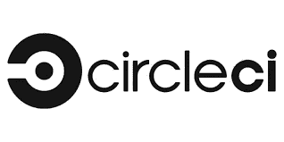
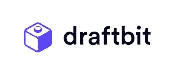

# 2022 年移动应用开发者最佳 CI/CD 工具

> 原文：<https://medium.com/geekculture/the-best-ci-cd-tools-for-mobile-app-developers-in-2022-21e58ae80763?source=collection_archive---------10----------------------->

在敏捷和 DevOps 文化中，持续集成和持续交付(CI/CD)是移动应用开发项目中的一个至关重要的过程。持续集成是至少每天集成代码并运行自动化测试以确保代码没有错误的过程。持续交付可自动构建、测试和发布应用，以确保应用可随时交付给客户。

为了构建移动应用的 CI/CD 管道，市场上有许多 CI/CD 工具，它们具有支持 iOS 和 Android 移动应用管道的不同功能。这些工具各有利弊，团队在选择合适的工具时需要考虑这些因素。

本文将讨论 2021 年移动应用开发者的一些最佳 CI/CD 工具。我们将讨论它们的关键特性，对创建管道、测试和集成的支持。最后，我们将了解每种工具的定价计划。

# 詹金斯

[Jenkins](https://www.jenkins.io/) 是一个基于 Java 的开源 CI/CD 服务器。在不同的操作系统如 Windows、macOS 和 Linux 上安装、设置和升级 Jenkins 很容易。其简单易用的界面使开发人员能够轻松配置环境以及创建和执行构建和部署作业。使用 Jenkins 主从架构，您可以将构建作业分布在许多节点上，以提高执行速度。

Jenkins 拥有数百个社区支持的插件，支持跨平台的移动 add 开发。Android 开发人员可以使用 Android Emulator 插件来构建应用程序，并在不同的设备上进行测试。Google Play Publisher 插件有助于建立一个 CD 管道，将应用程序发布到 PlayStore。此外，Jenkins 还提供了 XCode 插件来为不同的 iOS 设备自动构建和部署 iOS 应用程序。

# 定价:

自由的

# 竹子

[Bamboo](https://www.atlassian.com/software/bamboo) 是另一个很棒的 CI/CD 工具，可以让你创建连续的交付管道，自动化软件应用发布管理。可以自动部署到 Google Play、App Store 等移动应用服务器。使用 Bamboo，您可以并行运行多个测试，并为更关键的部署分配构建代理。

竹子也可以自动触发建造。您可以将 bamboo 配置为每当对存储库进行更改时自动触发构建作业和集成测试。它支持与 Git、SVN、Mercurial 和 S3 库的集成。Bamboo 的另一个有用的特性是它的预环境许可，允许开发者和 QE 将代码部署到他们的环境中。

# 定价:

竹子定价靠的是代理商而不是用户。例如:

一个远程代理的费用是 1200 美元，用于无限的工作

100 名远程代理花费 23，280 美元来完成无限的工作

2000 个远程代理(最大值)的无限作业成本为 187，380 美元

# 团队城市

[TeamCity](https://www.jetbrains.com/teamcity/) 是 JetBrains 的 CI/CD 工具，运行在 Java 环境中，用于自动化 Andriod 和 iOS 应用程序开发构建和部署。它支持各种编程语言和 ide，包括。NET、node.js、Python 和 Visual Studio IDE。在 Windows 和 Linux 服务器上都很容易安装 TeamCity。它支持来自 GitLab 和 Bitbucket 的代码集成。

这款用户友好的持续集成服务器支持在不同环境下并行运行多个构建。此外，您可以通过重用父项目中的设置和配置来配置 TeamCity 的子项目。TeamCity 的另一个直观特性是它运行历史构建和查看测试历史报告的能力。TeamCity 还与云集成，允许您横向扩展构建代理 AWS、EC2、MS Azure、VMware Sphere，并拥有 Kubernetes 集群。TeamCity 还提供灵活的用户角色分配，支持用户分类和不同的身份验证方法以及用户操作记录。

# 定价:

*   团队城市云— 14 天免费试用，然后每月 45 美元
*   团队城市云——免费，甚至用于商业用途
*   TeamCity Enterprise —每年 1，999 美元，享受 50%的续订折扣

# 切尔莱西

[CircleCI](https://circleci.com/) 是一个为网络和移动应用建立 CI/CD 管道的伟大工具，也是移动优先公司的普遍选择。它提供了多个 XCode 版本和预装技术，如家酿、浪子和 iOS CI/CD 工作流的节点。对于 Android 应用，它提供预装技术 Android SDK，谷歌云，和 Ruby for 浪子。

它还提供了一个 Android 机器映像，用于测试和配置具有执行和部署工作流的 Android 和 ios 应用。CircleCI 集成了 GitHub、GitHub Enterprise 和 Bitbucket。它还允许您并行运行构建作业，并在容器或虚拟机中运行它们。

# 定价:

*   免费版本支持每月每分钟 6000 次构建
*   性能-每月 15 美元，每分钟不限构建次数
*   规模—定制定价

# 好朋友

与其他 CI/CD 工具不同， [Buddy](https://bit.ly/2NJz4mx) 使用 100 多个内置动作作为流水线步骤。这个智能 CI/CD 工具让开发人员可以更快地执行管道，因为管道只构建、测试和部署代码更改。Buddy 支持 Github、Github Enterprise、GitLab、AWS、Bitbucket 等集成，开发者也可以使用集成进行监控和分析。

最近，Buddy 启用了为 iOS 应用程序创建交付管道，让您可以不断地构建它们并将其部署到应用程序商店。它将使用 XCode、React Native、Cordova、浪子和 Flutter SDK 在 Mac VM 上运行构建。您还可以使用 Android 应用程序的预构建操作轻松地为其创建管道。

# 定价:

*   每月 120 条免费管道
*   大约每月 75 美元，无限管道
*   超 200 美元每月无限管道
*   内部用户每月 35 美元。

# GitLab CI

GitLab CI 是另一个广泛使用的 CI/CD 工具，支持为 Andriod 和 iOS 应用开发构建管道，比其他选项更便宜。它拥有管理软件开发生命周期每一步所需的所有工具。使用 GitLab CI/CD，您可以通过每个提交或合并请求自动触发构建作业、单元测试和部署。

您可以使用虚拟机和 Docker 容器来构建您的作业。GitLab 容器注册表为存储 Docker 图像提供了一个安全的注册表。Gitlab 的一个有用之处是，它为许多特性提供了 API，支持更复杂的集成。

# 定价:

每个价格计划都是针对每个用户和每个月的。除了以下计划，您还可以以每 1000 分钟 10 美元的价格获得 CI/CD 分钟，以每 10GB 60 美元的价格获得存储。

*   免费版本
*   高级-19 美元
*   终极版-99 美元

# 特拉维斯·CI

[Travis CI](https://travis-ci.org/) 是另一个 CI/CD 工具，用于自动化持续的 web 和移动应用构建、测试和部署。它是一个跨平台的工具，带有许多编程语言的库，包括 Node JS、JavaScript、PHP、Java、Perl 和 Go。与许多 CI/CD 工具一样，Travis CI 自动识别来自 GitHub 和 Bitbucket 存储库的新代码提交，并执行构建和测试。它将在合并之前检查每个拉请求，以确保代码没有错误。当构建通过时，它将自动执行部署。

Travis CI 易于设置，支持连接多个云服务，并与 HipChat、Slack 和 email 集成。还提供了几个数据库和消息队列。

# 定价

*   免费版— 1000 积分，无限独立用户
*   一个兼职计划——每月 69 美元的可调积分和无限的独立用户
*   终极版——249 美元——每月 69 美元的可调整信用额度和无限独立用户

# 旗语

[Semaphore](https://semaphoreci.com/) 为原生或跨平台移动项目提供更快的 CI/CD，包括 Android、React Native 和 Flutter 项目。它允许更快地部署到 Google Play、iTunes 和更多具有代码签名功能的应用程序。有了 Semaphore，你可以在一个平台上运行网络和移动应用。这种托管服务可以根据执行情况自动调整规模，允许您付费使用。此外，您可以在任何 Docker 映像中运行 CI/CD 管道，包括您预先构建的映像。

Semaphore 的另一个很酷的特性是它内置的管道模板和可视化工作流构建器，您可以从中构建可视化工作流并对其进行微调。Semaphore 使用并行性和智能依赖追踪技术支持更快的流水线执行。

# 定价

*   免费版-允许一次构建一个作业。
*   启动——每月 0 美元起。自动扩展管道的 14 天免费试用。现收现付，每月 0 美元起
*   企业云-定制定价

# Draftbit

[Draftbit](https://draftbit.com/) 是一个为 iOS 和 Android 创建和部署原生移动应用的平台。它是一个基于浏览器的可视化开发工具，具有许多可视化设计特性。您可以从头开始设计任何移动应用程序，并使用其 UI 组件构建您的组件。此外，它使您能够连接外部数据库并集成第三方平台。

虽然 Draftbit 不是传统的 CI/CD 工具，但它包含许多开发人员级的解决方案，使其成为 CI/CD 堆栈的一部分。例如，Draftbit 有一个 push to GitHub 特性，您可以从 Draftbit builder 界面将 Draftbit 代码直接添加到 GitHub 存储库中。另一个是它的预览功能，你可以在创建应用程序后预览它。

Draftbit 还支持通过点击“导出应用”直接从 Draftbit 导出代码，这将导出源代码。最后，其共享应用程序功能允许您通过唯一的 URL 与其他人共享您的 Draftbit 应用程序。

# 定价

*   入门——每月 19 美元，14 天免费试用
*   专业——每月 99 美元
*   企业—定制价格，具有许多高级功能

# 结论

移动应用 CI/CD 工具使开发人员和测试人员能够轻松开发、测试和部署应用。上面描述的 CI/CD 工具有几个有用的功能，包括每当开发人员将代码合并到存储库中时自动触发构建作业。一些工具是软件即服务工具，支持构建和部署应用到云。许多工具支持不同的编程语言、微服务平台和第三方集成，包括业界领先的代码库，如 GitLab 和 BitBucket。因此，当您选择正确的 CI/CD 工具时，请确保了解您的移动应用程序的架构和要求。