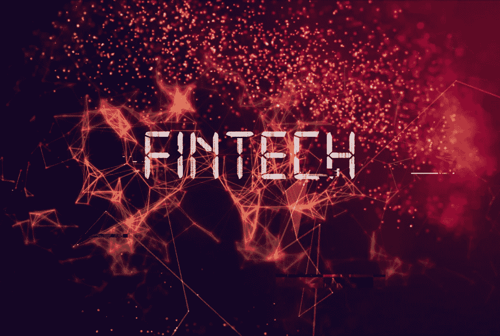

# 2022 年最佳 FinTech 开发技术栈

> 原文：<https://medium.com/geekculture/the-best-fintech-development-technology-stack-in-2022-ff404955930a?source=collection_archive---------12----------------------->

环球新闻网指出，到 2025 年，金融科技市场将达到 3050 亿美元。与此同时，[消费者对全球货币转账和支付的接受率为 75%](https://www.statista.com/topics/2404/fintech/#topicHeader__wrapper) 。

金融科技的崛起无疑要求我们仔细审视是什么让这一切成为可能。在金融数字化的过程中，技术是一个主要的驱动力，有人会说是唯一的驱动力。[金融科技应用开发](https://topdigital.agency/7-reasons-fintech-is-becoming-the-need-of-the-hour/)专注于创造数字解决方案，让人们能够轻松获得金融服务。

因此，典型的金融科技应用需要能够满足每个项目复杂需求的技术组合。技术栈的例子包括编程语言、框架、数据库系统、容器、版本控制以及开发应用程序所涉及的所有其他技术组件的组合。

本文将重点介绍简化 [FinTech 应用开发](https://www.botreetechnologies.com/blog/fintech-app-ideas-for-startups/)的关键技术。我们将主要关注编程语言、框架和数据库系统，因为它们构成了技术堆栈中最重要的部分。

> *阅读更多:* [*如何使用 Python 进行 FinTech 应用*](https://www.botreetechnologies.com/blog/python-for-fintech-applications/)

# 金融科技产品的最佳技术组合

几家公司使用类似的技术，但只有少数公司拥有相同的技术栈用于[金融科技应用开发解决方案](https://www.botreetechnologies.com/fintech-app-development)。每个项目都有不同的需求，因此，技术栈也会不同。

近来，一些技术因其多功能性、多样化和特性而在金融科技中变得流行。我们将重点介绍一些金融科技应用开发公司及其客户常用的技术。

**编程语言**

编程语言是金融科技应用取得技术成功的关键驱动力。金融科技产品很复杂——它们需要可扩展性和安全性。以下是在金融科技领域非常流行的顶级编程语言

1.  **Python**

*   Python 是最流行的编程语言。它是一种可扩展的动态语言，为金融科技应用开发者提供了数百种用例。它在交易管理、定价、风险管理、投资等方面都很有用。
*   Python 与数据科学无缝协作，它有像 NumPy、SciPy、Pyalgotrade、Pyrisk、Pynance、Pyfolio 和其他几个库。这些库使开发者能够将数据科学和人工智能集成到 FinTech 解决方案中。

**2。Java**

*   作为最古老、使用最广泛的编程语言之一，Java 为最优秀的金融科技应用开发者提供了卓越的开发能力。Java 虚拟机可以轻松创建可扩展的跨平台金融科技产品。
*   在金融科技产品的安全性方面，Java 提供了最高级别的数据保护。它有强大的安全管理器和运行时约束。它提供聊天机器人开发、欺诈检测、交易和投资以及移动钱包方面的安全解决方案。

**3。红宝石**

*   过去，公司会雇佣除了 Ruby 之外不精通其他语言的金融科技开发人员。简单、动态和交互式的编程语言为金融科技公司提供了简化的开发。它在创建资产管理解决方案、电子钱包、数字支付应用程序和金融仪表板方面非常有用。
*   提供金融科技应用开发服务的公司有一个 Ruby(和 Ruby on Rails)开发团队。最大的优势是简单，这加快了金融科技产品的开发过程。

**框架**

虽然编程语言对于编写代码很重要，但是框架提供了创建应用程序的结构和环境。无论是 web 还是 FinTech 移动应用开发，框架都是任何应用的构建块。以下是金融科技解决方案中最受欢迎的三个框架

1.  **Ruby on Rails**

*   也被称为“启动技术”，Ruby on Rails 是快速 MVP 开发框架的选择。框架，加上最好的[软件开发公司](https://www.botreetechnologies.com/)的协助，减少了 25%到 40%的开发时间。
*   随着金融科技领域的竞争日益激烈，公司需要一种能够为他们提供最佳速度、灵活性和可扩展性的技术。Ruby on Rails 拥有这三个优点。它为比特币基地和 Chime 等应用提供支持。

**2。姜戈**

*   Django 由 Python 支持，是金融科技应用开发服务的主要框架。该框架为开发复杂的金融科技解决方案提供了令人惊叹的界面和能力。最大的免佣金股票交易应用之一 Robinhood 在其技术栈中使用 Django。
*   Django 提供了 Django REST API、Sentry 等包来简化应用程序开发过程。该框架还提供了数值计算、分析和科学计算的能力，以将人工智能和人工智能集成到金融科技应用中。

**3。弹簧**

*   基于 Java 的框架为创建金融科技应用提供了惊人的特性。它通过提供现成的组件简化了复杂的项目需求。Spring 提供了一个强大的认证和授权机制——这是金融科技产品的一个关键需求。
*   Spring 项目围绕 Java 生态系统积极发展。该框架提供可扩展的应用开发，确保金融科技公司保持领先地位。Spring 接收定期更新，使其成为金融科技发展的趋势框架。

**数据库**

数据库的选择对于 FinTech 解决方案至关重要。虽然安全性是评估数据库的一个关键因素，但公司也需要高性能。以下是最受金融科技应用欢迎的三大数据库

1.  数据库提供对查询的快速响应。这是金融科技应用中使用最多的数据库。它具有惊人的分析能力，并支持多种编程语言。许多主要的金融科技公司都使用 PostgreSQL，包括 Robinhood、Revoult、N26 等等。它提供数据屏蔽和透明的数据加密，以更好地保护金融科技应用程序中的机密信息。
2.  **MySQL** 公司使用的另一个流行数据库是 MySQL。这是一个高性能的数据库，提供跨平台的功能。由于其复杂的算法，该数据库是高度安全的。它有一个结构化的格式，简化了金融科技应用的数据存储。MySQL 为公司提供严格的数据安全措施。
3.  **MongoDB** 要创建一个高度可伸缩的应用，MongoDB 是主要组件。它速度很快，并提供惊人的查询响应。由于其无模式的特性，它消除了对模式的需求。该数据库派生出基于文档的数据模型，并以二进制 JSON 等形式存储数据。它提供更快的数据库访问，标志着自己是金融科技产品的合适数据库。

> *阅读更多:*[*2022 年全球金融科技 7 大趋势*](https://www.botreetechnologies.com/blog/fintech-trends/)

# 包扎

虽然有数百种技术适合金融科技应用，但有些技术比其他技术更适合。但是，使用什么技术取决于项目需求。上述技术是全球公司最常用的一些技术，这就是为什么我们理解讨论它们的必要性。

金融科技应用程序开发的技术实现需要专家，BoTree Technologies 是一家领先的[企业软件开发公司](https://www.botreetechnologies.com/software-development-company)，在金融科技行业已经有 10 多年的经验，拥有服务于 200 多家客户的专家。

[**今天联系我们**](https://www.botreetechnologies.com/contact) **为您的下一个 FinTech 项目进行免费咨询。**

*原载于 2022 年 5 月 24 日*[*https://www.botreetechnologies.com*](https://www.botreetechnologies.com/blog/best-fintech-development-technology-stack/)*。*