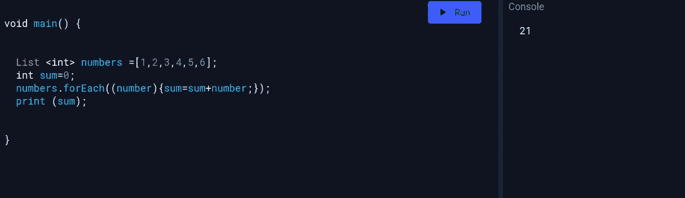
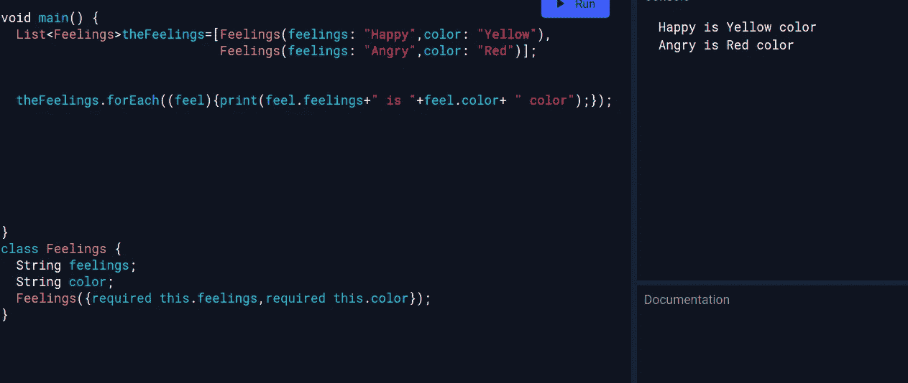
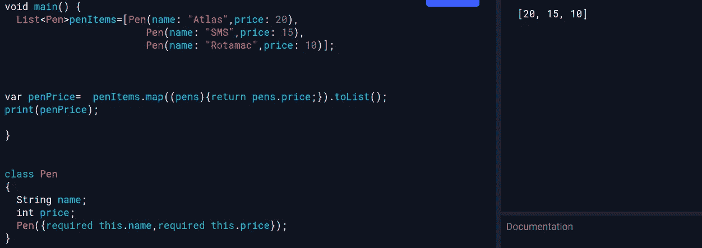
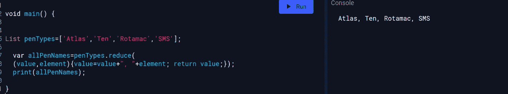
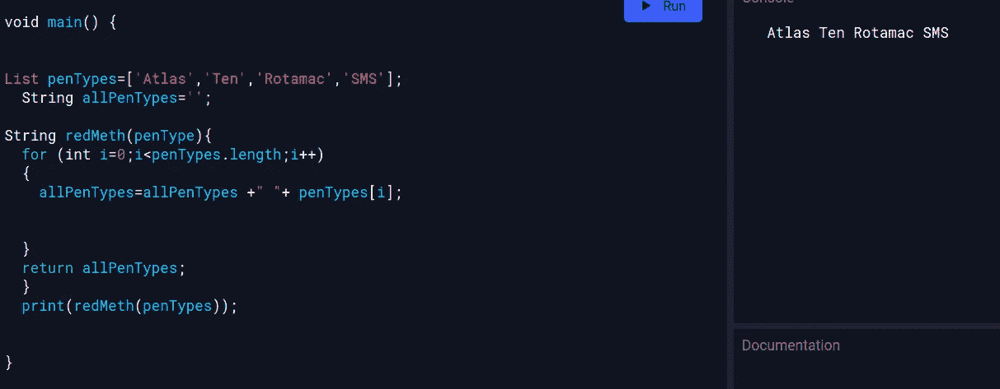
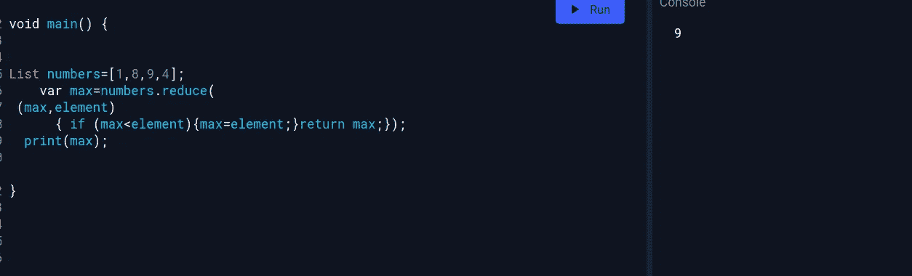
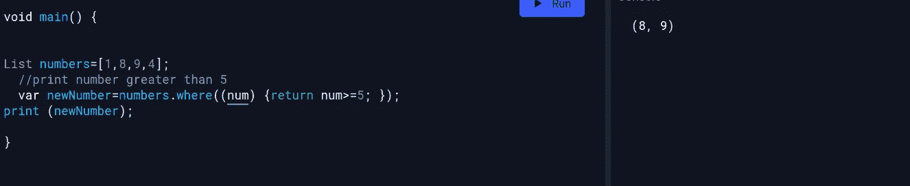
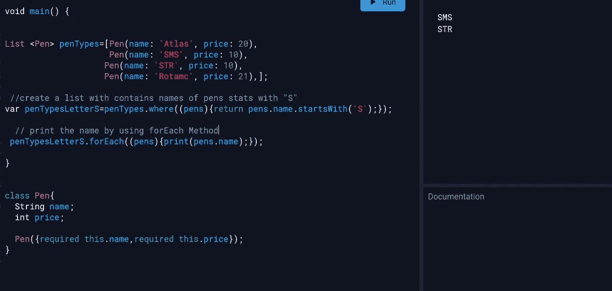
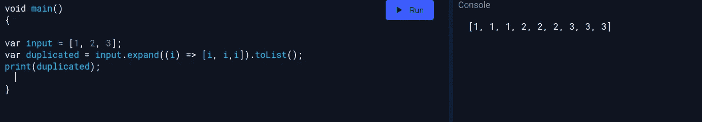
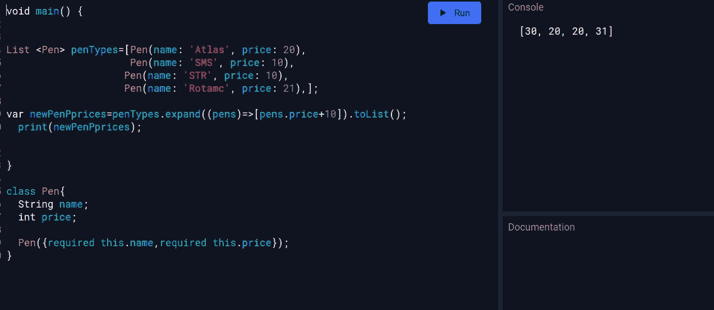

# 颤振和飞镖中的最佳列表处理方法

> 原文：<https://medium.com/geekculture/the-best-list-handling-methods-in-flutter-and-dart-c45b1116bb82?source=collection_archive---------13----------------------->

我们可以在一个列表中使用多种方法，但是我们将看看如何使用一个列表来达到我们想要的效果，以及有效使用列表的常用方法。

# forEach 方法

在调用这个函数的时候，我们应该传递一个匿名的 void 函数作为参数(这样它就不返回值了)。

让我们看一些例子。

如您所见，当我们调用 foreach 方法时，它会在每次迭代中应用括号内的函数。

另一个例子

这里我们创建了我们想要的“感觉”模型，如果你开始学习 flutter，你会创建很多模型。哈哈哈…..好的，在这一节中，我们写了一个模型，它接受感觉的名称和颜色，在我们的 main 方法中，我们创建了一个列表。然后，我们将数据作为我们创建的模型的数据类型

我还强调，我们只能在 foreach 方法中添加一个 void 函数。这意味着你不能从函数中返回任何东西。

# 地图方法

此方法返回映射元素的表示形式。调用 map 函数后，基本上要传递括号内的匿名函数。

这个函数基本上告诉我们每次迭代可以做什么转换，我们可以在这个函数中返回任何东西，所以在 fluter 中，我们可以返回我们的方面拥有的小部件。在调用 map 函数的最后，我们必须使用. toList *将这些映射转换为一个列表，这是在 Dart 中调用 map 函数时必不可少的。

考虑下面的例子:

我已经制作了一个笔类型的列表，我需要从列表中分离或映射价格，以便制作一个新的价格列表。

# 还原方法

通过使用给定函数迭代组合集合的元素，将集合缩减为单个值。这个方法从迭代器中的第一个元素开始，然后按照迭代顺序将它与剩余的元素组合起来，

在这种情况下，我们向匿名函数传递两个参数:一个是“值”，另一个是“元素”。单个变量值的集合是参数值。元素表示当前的迭代，我们可以用它执行任何函数，最后返回值(参数值)

好了，让我们更深入地了解 reduced 方法发生了什么

这也是 reduced 函数内部将要发生的相同代码。这是 reduce 方法的非正式表示

这是另一个如何使用简化函数的例子，你可以在这里了解更多。

# where 方法

这类似于过滤方法。

返回满足我们要求的元素列表。

我们编写了一个匿名函数来返回 bool 值；该函数将检查列表中的所有元素，以查看特定条件是否存在，如果存在，它将返回这些元素。

让我们看一个真实世界的例子。

# 扩展方法

使用 iterable 展开每个元素。我们应该通过在匿名函数中对该元素进行任何操作来返回一个列表；在这里，我们返回一个列表，这样您可以返回更多的元素，这样我们就可以扩展元素。

> ***感谢阅读本文！！！希望你会喜欢。
> 如果你有任何问题，请在下面留言或通过推特问我***