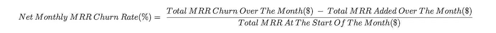
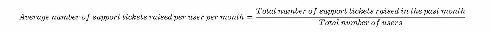

# 推动 B2B SaaS 产品管理卓越的最佳指标和 KPI

> 原文：<https://medium.com/geekculture/the-best-metrics-kpis-to-drive-excellence-in-b2b-saas-product-management-53b8c6e9c54a?source=collection_archive---------0----------------------->

产品经理的工作很简单。确保你的客户了解你的产品，使用你的产品，并继续为你的产品付费。

但是要做到这一点，你需要交付你的客户需要并想要购买的软件。那么你如何评估你的产品在入职时的表现呢？你如何发现你的产品在吸引用户方面有多有效？或者你如何发现你可以改善你的产品，以减少流失？

这就是指标和 KPI 的用武之地。

大多数 SaaS 公司收集大量数据，但很少有人知道在做出数据驱动的决策时，哪些指标是关键的。

本文旨在使您能够简单地:

a)确定好的度量标准的质量

b)建立一个框架来有效跟踪您的指标，并

c)使用我们现成的指标和 KPI 框架来推动您的 B2B SaaS 产品的卓越表现。

# 目录

*   良好的 B2B SaaS 产品管理指标和 KPI 的质量
*   管理 KPI 和指标的框架
*   现成的指标和 KPI 推动 B2B SaaS 产品管理的卓越发展
*   产品参与度
*   流失率(%)
*   每个用户每月的平均关键操作数(变化百分比)
*   平均用户每月会话持续时间(%变化)
*   每个用户每月的平均登录次数(变化百分比)
*   DAU / MAU (%)
*   产品满意度
*   净推介值(NPS)
*   客户努力得分(CES)
*   每个用户每月提出的平均支持票证数量(变化百分比)
*   结论和概述

# 良好的 B2B SaaS 产品管理指标和 KPI 的质量

一般来说，一个好的度量标准有 4 个品质需要注意。

1.  它们应该是比较性的

具有可比性的指标使你更容易将自己的相对绩效与同行业的同行进行比较。例如，众所周知，平均 B2B SaaS 转换率在 5% — 10% 之间，因此，如果你的转换率为 4%，这将是一个很好的指标，表明你应该回顾一下你的转换之旅。

此外，比较还意味着能够针对不同的用户群或不同的时间段使用相同的指标。继续我们的例子，你可以比较付费广告和有机广告获得的用户的 B2B SaaS 转换率，或者财政年度的第 1 周和第 13 周。

1.  它们应该是可以理解的

衡量标准只有在能够推动变革时才会有所作为。产品经理推动组织内部变革的能力依赖于影响他人的能力。

想象一下，坐在办公桌前，登录您的分析仪表板，看到一个新的指标，需要您花 5 分钟来解读。这将是一个很好的衡量标准的例子，你也许应该停止担心。

问问你自己:如果你花了*5 分钟去理解它，首席执行官或你组织中的其他关键影响者需要多长时间去理解？根据指标，简单性赢得了比赛。*

1.  它们应该是比率或速率的形式

如果你的产品有 5000 个用户，你应该高兴得跳起来吗？

答案当然取决于背景。你需要考虑的一些事情包括你的用户数量是每个月都在增长还是在下降？此外，该公司用了多长时间达到 5，000 名用户？

显然，你更愿意成为一个拥有 5000 名用户和 400% [MRR](https://www.prodcamp.com/glossary/monthly-recurring-revenue) 增长率的 SaaS，而不是一个拥有 5000 名用户但增长率为 10%的。

比率和比率形式的指标有能力提供视角，并向产品经理展示他们所做的改变是否在正确的方向上推动产品，以及他们是否做得足够快。

1.  它们应该是可操作的

如果你注意到你的一个 KPI 下降了，你能很容易地确定一些你可能采取的行动来改善它吗？如果是这样，就把它当作一个可操作的指标。

示例:

*   客户终身价值(LTV)在过去 12 个月下降了 30%

本质上，LTV 是对每个客户平均带来多少总收入的计算。因此，如果价格下跌，很可能意味着客户流失增加或价格变化。

考虑到这一点，作为产品经理，您可以采取以下措施:

*   与最近顾客交谈，了解是否有共同之处导致他们离开
*   当用户试图取消订阅时，提供保留服务
*   查看您的产品定价和计划的最新变化

# B2B SaaS 产品经理用于管理 KPI 和指标的框架

有如此多的指标供您使用，登录您的分析仪表板，看到屏幕上的数字盯着您，您会感到不知所措。

然而，通过使用您将在下面看到的简单练习，您可以开始对您的 KPI 进行分类，并以一种易于理解您的 SaaS 产品性能的方式对您的指标进行排序。

## 了解基于结果的 KPI 与影响者指标

KPI 和指标之间有一个微妙但重要的区别。

指标是您收集的任何类型的度量。

然而，KPI(关键绩效指标)是一种与实现组织的核心业务目标直接相关的特定类型的度量。B2B SaaS 的一个例子可能是 MRR(美元)或流失率(%)。

虽然 KPI 是基于结果的，但度量标准在向您展示改进您的总体目标的过程和进展方面非常有用。通过理解这一概念，您可以通过将基于结果的 KPI 与影响者指标联系起来，在混乱的仪表板中创建一些秩序。

事情是这样的…

1.  你决定你想要发现什么

例如:“总的来说，客户对我们的产品满意吗？”

1.  您设置了主要的基于结果的 KPI

例如:NPS(净推介值)

1.  您将它与您认为可能直接影响您的 KPI 的所有影响者指标联系起来

例如:

*   每个用户提出的平均支持票证数(变化百分比)
*   支持团队的平均首次响应时间(变化百分比)
*   报告的软件错误数量(变化百分比)

合理的假设是，如果软件错误更多，支持响应时间更长，每个用户平均开出更多的支持罚单，NPS 就会降低。

然而，使用这个框架来处理 KPI 和指标的真正力量在于，您可以将一切都视为假设。

场景 1:如果你的主要 KPI 在改善，但你的影响者指标没有改善，那么这要么表明数据中存在时滞，要么表明你没有衡量对你的客户更重要且影响你的 KPI 的某些东西。

在上面的例子中；如果每个用户的平均支持票数量在上升，bug 在增加，支持在变慢，但 NPS 仍在改进，那么可能还有其他因素对客户有更大的影响。如果是这样，你能计算出它可能是什么，并在未来开始测量它吗？‍

场景 2:如果你的假设似乎成立，你可以开始跟踪这些数字，看看每个影响者指标对你的 KPI 有多重要。

基于结果的 KPI NPS ↑(从 5 到 6 增加 20%)

*影响者指标*每个用户获得的平均支持票数量↓ (-1%)

*影响者指标*支持团队的平均首次响应时间↓ (-10%)

*影响者指标*报告的软件缺陷数量↓ (-1%)

如果这些结果在一段合理的时间内相互关联，您可以开始考虑客户是否更关心收到支持票证的快速响应，而不是处理更多的软件错误，因为数据显示响应时间快 10%会导致 NPS 不成比例地上升。

此外，您可以通过对数据进行分段来进一步调查。例如，你可以只查看你最有价值的账户的 NPS，而不是查看所有用户的 NPS，看看是否一切都是正确的。

在下一节中，我们将为您提供现成的 KPI 框架，B2B SaaS 公司可以进行试验。

# 现成的指标和 KPI 推动 B2B SaaS 产品管理的卓越发展

为了让你的生活更容易，我们已经创建了一些现成的框架，可以在大多数 B2B SaaS 公司中实施。

请记住，这些是我们的建议，但没有什么可以阻止您使用自己的指标并以自己的方式进行试验——只是要确保选择的指标具有可比性(通常是变化百分比、比率或比率)、可理解且可操作。

*   产品参与度
*   产品满意度

# 衡量产品参与度的最佳 B2B SaaS KPI 和指标

你的客户越喜欢你的产品，他们流失的可能性就越小。因此，产品参与可以作为防止客户流失的重要预警系统，并最终减少 [MRR](https://www.prodcamp.com/glossary/monthly-recurring-revenue) 。

由于不同的软件以不同的方式工作，衡量产品参与度在 B2B SaaS 公司中会有很大的不同。

作为一个经验法则，试着想想用户在使用你的软件时应该采取的最有价值或最基本的步骤。例如，如果不连接日历，使用 Calendly 就没有任何价值。或者同样，ProdCamp 的用户有必要着手创建一个路线图！
考虑到这一点，下面是一个总体框架，但你可以根据自己的需要进行修改。

基于结果的 KPI 流失率(%) ↓

*影响者指标*每个用户每月关键行动的平均数量(变化百分比)ⅳ

*影响者指标*平均用户每月会话持续时间(变化百分比)ⅳ

*影响者指标*每个用户每月的平均登录次数(变化百分比)ⅳ

*影响者指标*DAU/MAU(%)ⅳ

## 流失率(%)

这是什么？

在 B2B SaaS 中，“客户流失”既可以用在用户*的上下文中，也可以用在*收入的上下文中——两者都很有用。

客户流失率(%)是用户在一段时间内离开的百分比(通常按月或按年计算)。

总 MRR 流失率(%)是在给定时间段内由于用户离开或降级而损失的收入百分比(通常按月或按年计算)。

净 MRR 流失率(%)是在给定时间段内由于用户离开或降级而损失的收入的相对百分比。

*总 MRR 流失率(%)* 和*净 MRR 流失率(%)* 之间的区别在于*净*测量也包括在此期间增加的 MRR(例如，通过新用户注册或用户升级)。因此，MRR 净流失率(%)有可能为负。

你如何衡量它？

客户流失率(%) =流失客户总数/客户总数

每月 MRR 总流失率(%) =当月 MRR 总流失率($) /月初 MRR 总流失率($)

每月净 MRR 流失率(%) =当月总 MRR 流失率($)减去当月总 MRR 流失率($) /月初总 MRR 流失率($)

流失率的计算可能相对复杂。因此，我们建议使用软件来确保计算正确。对于*客户流失率(%)* ，你可以使用像[振幅](http://www.amplitude.com/)这样的产品分析软件，但是对于 *MRR 流失率(%)* 你将需要同样链接到你的计费或会计系统的软件。如果你使用 [Stripe](https://support.stripe.com/questions/calculating-churn-rate-in-billing) 来收款，它会为你做这件事，否则，像 [ProfitWell](http://www.profitwell.com/) 这样的软件可以提供一整套收入留存指标。

为什么测量很重要？

虽然大多数公司专注于添加新标识，B2B SaaS 公司的头号杀手据说是流失。毕竟，往一个满是洞的桶里加入更多的水是没有意义的。

你的用户越积极地参与你的产品并从中看到价值，他们离开的可能性就越小。这就是为什么流失率与产品参与度有着内在的联系，也是为什么产品管理对流失率的影响如此之大。

你应该如何使用这个 KPI？

举个例子，据说[年 B2B SaaS 流失率在 5-7%左右](https://sixteenventures.com/saas-churn-rate)是可以接受的。请记住，就像一个经济体中总有一个自然的失业水平一样，总会有一个客户流失水平，因为你不可能永远留住所有的客户。

如果你的年流失率(用户或收入)明显高于 5–7%，那么它可能表明你的产品未能解决所有用户的问题，你可能需要做一些客户研究来了解原因。

在 21 世纪 20 年代，客户流失的现实变得更加复杂。随着进入门槛降低，产品之间的差异减少，更多的 SaaS 公司出现，价格竞争加剧，流失率趋势高于 2010 年代的调查结果。

因此，就产品管理而言，客户流失率的方向也非常重要。如果你的流失率一直呈下降趋势，很可能你的产品在市场上正在改善，你的用户成功率正在上升——这意味着你做对了！

## 每个用户每月的平均关键操作数

这是什么？

对于每个 SaaS 公司来说，‍This 是一个很有价值但又非常不同的指标，这取决于你对“关键行动”的定义。

一个关键动作本质上是用户在你的软件中所做的事情，这表明他们正在获得显著的价值。

例如，对于项目管理工具 [Trello](http://www.trello.com/) 来说，一个关键动作可以是每次用户添加一张卡或者创建一个新的板。或者对于像 [Crunchbase](http://www.crunchbase.com/) 这样的市场研究 SaaS 来说，一个关键的行动可能是用户每次进行搜索。

你如何衡量它？

每个用户每月的平均关键操作数=所有用户每月采取的关键操作总数/用户总数

一旦你有了原始数据，你就应该追踪一段时间内的百分比变化。

如果跟踪关键动作看起来很复杂，你可以使用[振幅](https://amplitude.com/)来完成。或者，如果每个关键动作都可以用一个事件或特定的页面访问来表示，Google Analytics 仍然是一个可行的替代方法。

为什么测量很重要？

‍For:一些公司认为，相比于用户在产品上花费的时间，每个用户每月的平均关键行为次数更能体现用户从产品中获得的价值。

您应该如何使用这一指标？

在 B2B SaaS，人们常说用户越快到达“啊哈！时刻，他们就越有可能皈依。

通过监控用户采取的关键行动，你可以看到你对产品所做的改变是否会让用户更快地发现重要的价值，并随着时间的推移对你的产品更加忠诚。

## 平均用户每月会话持续时间

这是什么？

‍The 用户每月使用软件的平均时间。

为什么测量很重要？也有一些例外，但大多数 SaaS B2B 公司都会同意，客户使用软件的时间越长，他们从软件中获得的价值就越多，他们对产品的参与度也就越高。

你如何衡量它？

作为一个公式，您将所有用户每月使用您的软件的总时间除以用户总数。

平均用户月会话持续时间=所有用户的总月会话持续时间(分钟)/用户总数

如果你的 SaaS 是基于网络的，这些数据通常可以通过谷歌分析获得。

一旦你有了原始数据，你就应该跟踪给定时间段内的百分比变化。如果您的 SaaS 计费周期不是每月一次，您可以调整时间段来适应。

您应该如何使用这一指标？

‍If:你注意到你的平均用户月会话持续时间莫名其妙地减少了，不久之后你可能会看到用户流失的增加。

作为一名产品经理，你可以利用这一时间滞后优势，采取行动，试图在你预期之前阻止客户流失，例如与客户交谈，分析关键功能的使用情况，以及提高保留率。

顺便说一句，如果你的软件围绕着使事情更快或更有效，你可能希望为产品参与选择一个不同的基于结果的 KPI。例如，如果小企业用户在记账上花费过多的时间，像 Xero 这样的会计软件可能会认为这是一种负面影响。

‍

## 每个用户每月的平均登录次数

这是什么？

‍The 在整个用户群中，一个月内用户登录到您的软件的平均总次数。

你如何衡量它？

每个用户每月的平均登录次数=所有用户每月的登录总数/用户总数

‍

您可能有内部系统日志，或者如果您的 SaaS 是基于 web 的，这些数字通常可以在支持软件(如 Intercom)中找到。

或者，代替登录，你可能希望通过谷歌分析跟踪会话的数量。

一旦你有了原始数据，你就应该追踪一段时间内的百分比变化。

为什么测量很重要？

‍Every 时间用户登录，他们显示出使用该软件的意图。因此，一个健康参与度的 B2B SaaS 应该看到用户频繁登录他们的账户。虽然登录并不一定显示价值，但它确实表明你在你的客户心中。

您应该如何使用这一指标？

‍If:每个用户每月的平均登录次数有了显著的、持续的和意想不到的增长，这可能表明你最近对产品所做的任何改变都受到了欢迎。另一方面，显著下降通常是客户流失增加的前奏。

## DAU / MAU (%)

这是什么？

‍DAU/MAU 是日活跃用户(DAU)占月活跃用户(MAU)的百分比。这个想法是，通过将它们组合成一个比率，你可以测量粘性。

你如何衡量它？

Sticknss =日活跃用户(DAU) /月活跃用户(MAU)

最棘手的部分是定义“活跃用户”对你的软件意味着什么，因为大多数公司对它的统计略有不同。就像在考虑产品参与度时一样，您可以根据活跃用户是否花了一定时间使用软件、是否登录或是否采取了特定的关键行动来确定他们。

像[振幅](http://amplitude.com/)这样的软件应该可以为你显示这个。

为什么测量很重要？

在 B2B SaaS 社区中有一场关于使用 DAU/MAU 的价值的激烈辩论，因为它比其他指标更不可操作，它可以根据您对“活跃用户”的定义进行操作，并且它并不总是与流失相关联。林肯·墨菲等评论家写道，追踪活跃用户是一种虚荣的衡量标准，然而许多公司仍然觉得这样做很有用。

您应该如何使用这一指标？

虽然你可以在网上找到平均 DAU/毛额为 10-20%的 B2B SaaS 的基准，但由于这一指标背后的大量争论，跟踪 DAU/毛额随时间的百分比变化被认为比将原始数据与其他公司进行基准比较更有价值。‍

# 衡量产品满意度的最佳 B2B SaaS KPI 和指标

对于以产品为导向的企业，客户满意度与产品满意度密切相关。如果您的软件设计良好，易于使用，提供持续的重要价值，并按预期运行，客户通常会感到满意。
考虑到这一点，下面是一个衡量 B2B SaaS 公司产品满意度的通用框架，但你可以根据自己的需要进行修改。

‍

基于结果的 KPI 净推广分数(NPS)ⅳ

*影响者指标*客户努力得分(CES)ⅳ

*影响者指标*每个用户每月获得的平均支持票数量↓

‍

## 净推介值(NPS)

这是什么？

‍Net 推介值是了解客户满意度和忠诚度的最广泛使用的指标之一。

你如何衡量它？

客户得到一份 NPS 调查，其中有一个简单的问题，问*“你向朋友或同事推荐[公司]的可能性有多大？”。*

然后，他们被要求提供 0-10 分的评分，10 分表示他们最有可能推荐该产品，0 分表示最不可能推荐。

然后，客户响应被分为以下几类:

‍

评分系统:

0–6—批评者

*对你的产品不满意的客户，他们有很高的流失风险。*

7–8—被动

*客户通常对您的产品感到满意，但觉得它缺少一些使其完美的元素。*

9–10 名促销员

*喜欢你的产品并乐意让其他人加入的客户。*

计算你的 NPS 的最重要的部分是理解你不仅仅是平均所有用户反应的分数。相反，你应该从推广者的百分比中减去反对者的百分比，得到一个介于-100 和 100 之间的 NPS 分数。

如果你有原始的 NPS 数据，最简单的方法就是使用 ret eleven 的 NPS 分数计算器。或者，如果你正在寻找一种解决方案来自动收集和计算你的 NPS 分数，那么请阅读[ret eleven 的 NPS 软件指南](https://www.retently.com/blog/choose-nps-software/)来帮助你决定选择谁。

为什么测量很重要？

NPS 不仅是业内同行中最容易比较的基准之一，也是客户如何评价你的公司和产品的一个很好的总体指标。

你应该如何使用这个 KPI？

与所有指标一样，你可以用它来把握客户对你的产品发展方向的感受，即随着时间的推移，客户的印象是变得更好还是更差？

但与其他指标相比，NPS 比较也可以对你的整体表现进行排名。据[欣喜的](https://delighted.com/nps-benchmarks)称，软件公司的平均 NPS 分数是 41，尽管像 Adobe 这样的公司宣称他们的 NPS 是 60，这之间有很大的差异。

根据 Zendesk 的高级产品经理 Ramin Shokrizadeh 的说法， NPS 在划分到不同的群组时也有助于分析。对于基于网络的产品，我主要关注净推介值(NPS)及其随时间的变化趋势，按客户细分和角色类型细分。

‍

## 客户努力得分(CES)

这是什么？

‍Customer 努力分数(CES)是一个衡量指标，用于确定客户执行特定操作需要付出多少努力。

以下是在 B2B SaaS 产品管理环境中应用的一些例子:

*   对你来说升级你的计划有多容易？
*   对你来说，制作你的第一张特雷罗卡片有多容易？(特雷罗)
*   你开具第一张发票有多容易？(条纹)

你如何衡量它？

与测量 NPS 非常相似，CES 是作为一个单独的问题给出的，可以根据客户采取的行动进行修改，但通常采用以下格式:

*“对你来说……有多容易”*

然后被调查者被要求给他们的回答打分——通常选项从“非常容易”到“非常难”。然而，与 NPS 不同的是，CES 分数是通过平均回答计算出来的。

有许多软件解决方案可以设置 CES 调查并为您进行测量，其中包括 [Wootric](http://www.wootric.com/) 和[retentive](http://www.retently.com/)。

为什么测量很重要？

CES 对于衡量产品特定部分的满意度很有用，而 NPS 则关注客户的整体印象。

这一点很重要，因为顾客可能会对你产品的某个特性有正面的体验，但对另一个特性却远没有那么正面。因此，CES 提供了一种理想的方法来识别和解决产品的问题领域，从而提高产品的整体满意度。

您应该如何使用这一指标？

CES 调查最好部署在客户采取关键行动的所有产品领域。

通过分析结果和比较软件不同领域的相对分数，你可以了解产品的哪些部分最需要关注，以及什么对客户的整体产品满意度有最大的影响。

‍

## 每个用户每月提出的平均支持票数量

这是什么？

‍The 平均每个用户获得的支持票数量可以衡量您的产品在提供客户所需的关键功能方面的效率。

注意:如果您不使用支持票证，您可以改为跟踪聊天对话。

你如何衡量它？

要测量它，你应该首先确保你的支持系统支持*标签*。像[对讲机](http://www.intercom.com/)和 [ZenDesk](http://www.zendesk.com/) 这样的流行解决方案可以处理这个问题。

虽然您可以衡量每个用户提出的支持票证的总体平均数量，但在产品管理的上下文中，仅包括与产品问题相关的票证可能更有用。通过使用标签，这应该很容易做到。

每个用户每月提出的平均支持票证数=过去一个月提出的支持票证总数/用户总数

以上是通用公式，但要查看与产品相关的满意度，只包括过去一个月中标记的支持票证的总数。

一旦你有了原始数据，你就可以追踪百分比的变化来衡量产品满意度是如何变化的。

此指标的一个缺点是，如果您的支持软件不能自动为您测量数据，则可能需要您手动收集数据。

‍

为什么测量很重要？

当客户需要帮助或对你的产品不满意时，由支持团队来处理。查看每个用户每月的平均支持票数量是弥合客户支持和产品管理之间差距的一个好方法(当然，使用 [ProdCamp](https://www.prodcamp.com/blog/the-best-metrics-and-kpis-to-drive-excellence-in-b2b-saas-product-management?utm_source=medium&utm_medium=referral&utm_campaign=blog&utm_content=preconclusion_link) 也是如此！).

您应该如何使用这一指标？

没有官方的基准可以遵循，但是通过跟踪随时间变化的百分比，您通常可以了解客户对您产品的最新变化的接受程度，以及他们发现该软件使用起来有多容易。

衡量这一指标的一大优势是，如果您注意到波动，就很容易理解发生了什么，因为您可以阅读一些带标签的支持票证，以了解客户在谈论什么。

# 结论和总结

## 总而言之:

*   最好的指标是可比较的、可理解的、可操作的，并且是比率或比率的形式。
*   指标是您收集的任何类型的度量，而 KPI(关键绩效指标)是与核心业务目标特别相关的主要指标。
*   在每个 KPI 背后，您可以分配一系列影响者指标，即可以影响整体 KPI 结果的单个指标。
*   简化管理指标的一个好方法是建立一个管理它们的框架。要做到这一点，首先要选择产品管理流程的一个核心领域，如产品入职，然后将主要的基于结果的 KPI 与一些影响者指标结合起来。