# 最好的 iPhone 还在后面。

> 原文：<https://medium.com/geekculture/the-best-of-iphone-is-yet-to-come-8925799732e4?source=collection_archive---------16----------------------->

苹果设计团队的下一步是什么？

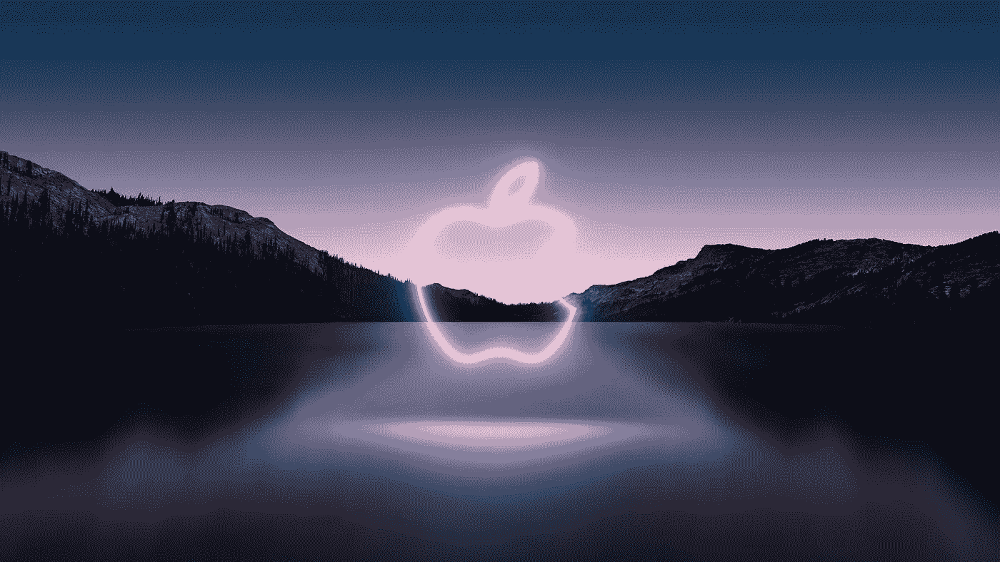

iPhone 13 和 iPad mini 已经到来，随着这两个产品的到来，苹果将继续其新的工业设计方向。

我之前谈过苹果公司的设计语言以及他们对未来产品的规划，我觉得现在是时候从中吸取教训了，因为产品开始获得新的外观。

iPad Pro 在 2018 年开始了这种新的工业设计语言，随后是 2020 年的 iPhone 12 和 iPad Air 以及今年早些时候的 iMac。但是最后剩下的产品，MacBooks 和 iPad mini 今年加入了它们，完成了外观，并摆脱了苹果使用了 7 年多的圆形曲线和设计。

**iPhone 13**

iPhone 13 和 13 Pro 型号至少可以说有点平淡无奇，电池略有增加，标准摄像头和 SoC 有所改进，凹槽更小。

我没有留下深刻的印象，并发现专业型号最终获得 120hz 显示屏是今年更新的唯一积极因素，相机升级和新功能听起来不错，但实际上大多数人不会使用它们超过一次，然后就忘记了它们。

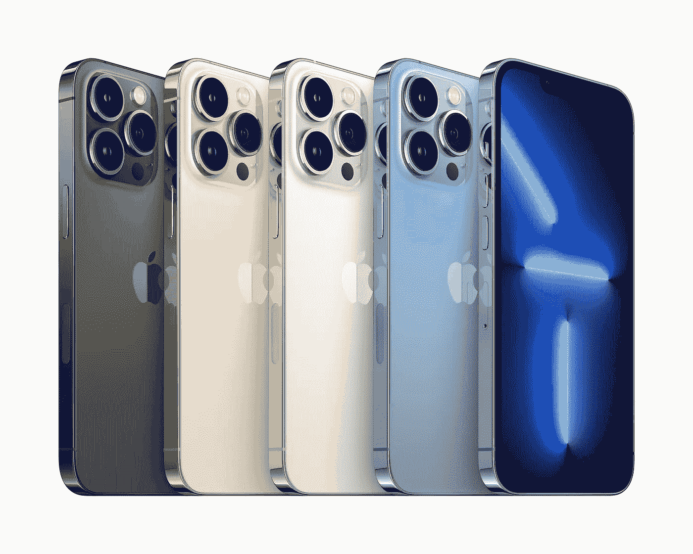

**iPhone 13 Pro**

iPhone 13 型号的颜色比 13 Pro 的选择好得多，午夜和星光是太空灰和银色的漂亮扭曲，而塞拉利昂蓝和所谓的更深的石墨出现在 13 Pro 上。

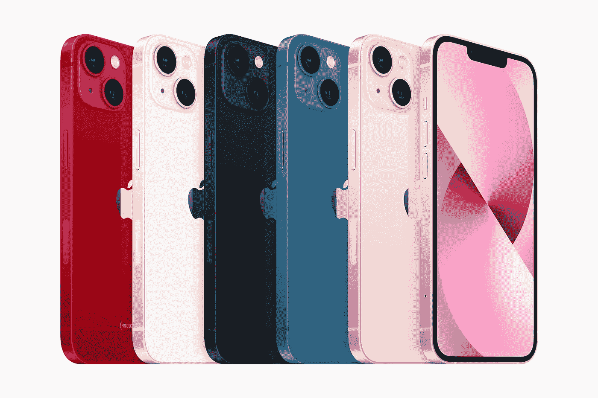

**iPhone 13**

对我来说，这是 iPhone XS 升级年的重演，当时它是一个没有任何规格的升级，除非你有一个非常旧的 iPhone，同样的情况也出现在 iPhone 11 Pro，iPhone 12 或 12 Pro 上，没有任何值得升级的东西。

当然，它们会一如既往地畅销，但我认为会有更多人购买现在更便宜的 iPhone 12 型号，因为 pro 上更小的凹槽或 120hz 的显示屏对普通消费者来说不是很畅销的功能。

13 系列保持了与 iPhone 12 相同的外形，只是相机凸起尺寸略有增加，它仍然是一个很好的平面设计，有了小边框，你真的会觉得显示器在你手中是边对边的。

预计今年不会有重大的设计变化，但下面会有更多关于下一步的内容。

**iPad mini**

新款 iPad mini 基本上抢尽了 9 月发布会的风头，它采用了可爱的新工业设计，与更大的 iPad Air 相匹配，包括更小的统一边框和电源按钮上的触控 ID。

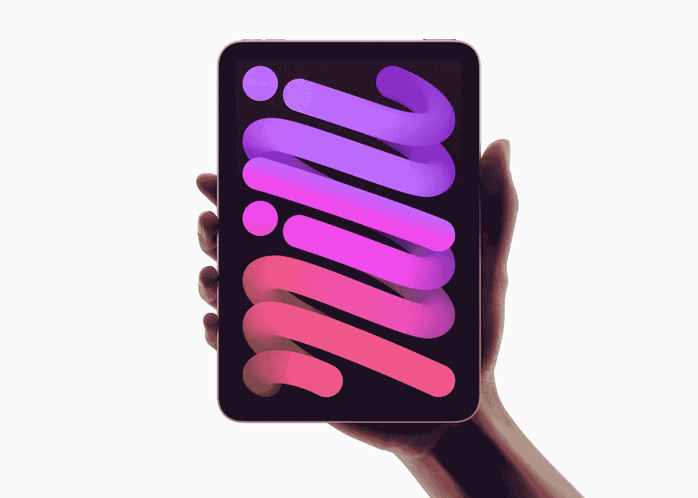

**iPad mini**

我也喜欢苹果手表系列 7、iPhone 13 和一些配件上的新星光色，这是对银色的新诠释，它有金色的色调。

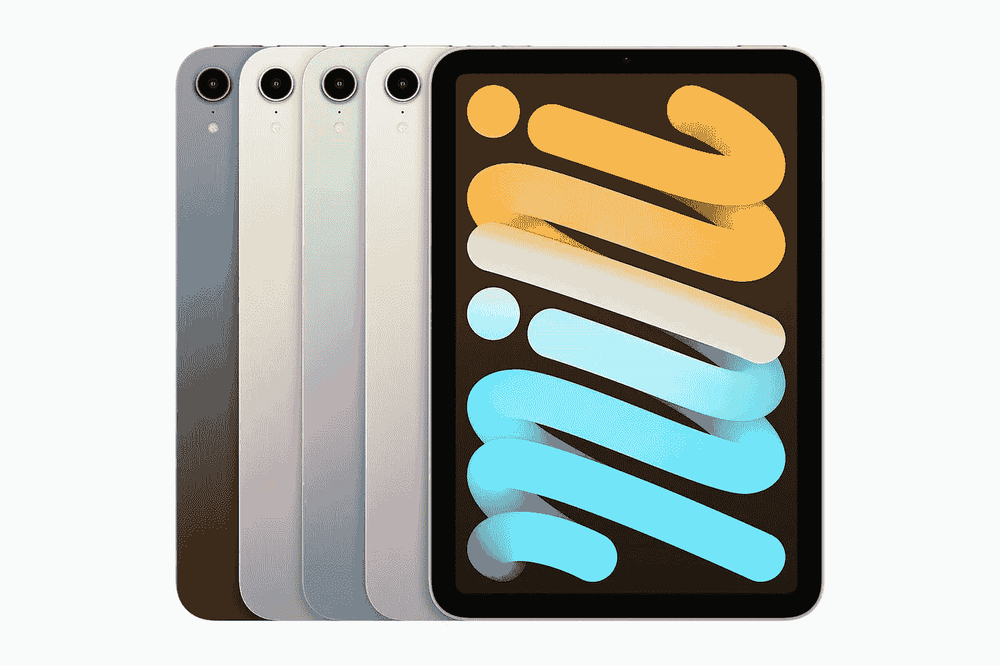

**iPad mini**

至于基本款 329 美元的 iPad，我怀疑它会在很长一段时间内加入新设计，否则它会侵蚀 iPad Air 的销售，但它主要是针对教育买家或第一次使用 iPad 的用户。

**Macbook Pro**

所以这一款实际上还没有发布，但一切都指向 10 月或 11 月**发布，我期待更扁平的设计和没有曲线的盖子，更薄的边框，迷你 LED 显示屏，14 英寸和 16 英寸型号，看不到触摸条，许多端口回归！**

许多报道都在传言 2021 年的重新设计，iMac 终于在今年早些时候通过 iPad Pro/Pro XDR 显示器设计进行了彻底的改革。

**The 2021 iMac with new design.**

这些新的 Macbooks 将配备新的 M1X 或 M2 芯片，这取决于他们如何称呼它，已经是 M1 的一个野兽，这些肯定会再次粉碎竞争。

MacBook 的设计有点困难，因为它的两侧已经有了一个非常平坦的设计，苹果可能会将盖子做得更厚，以减少背面和底部的曲线，并改进了 1080p 摄像头。

我们还可以获得午夜和星光型号，以取代太空灰和银色，我认为绿色和蓝色等更亮的颜色将被保留到下一款 MacBook Air。

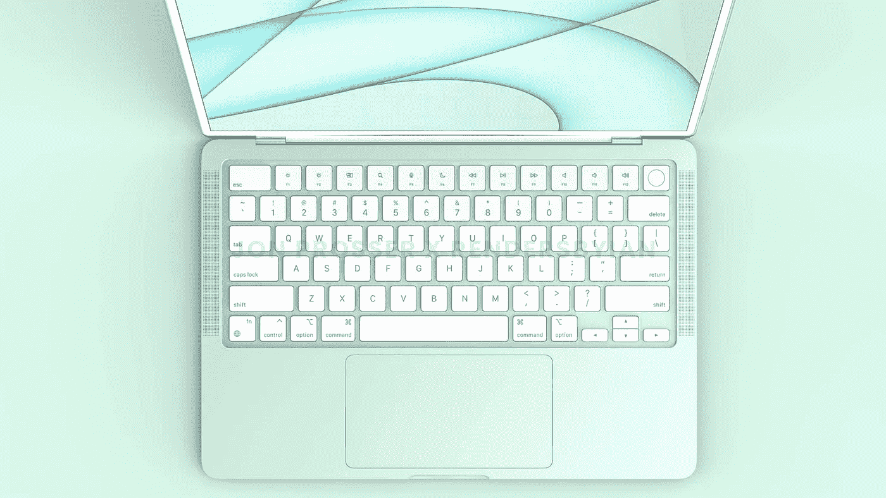

**MacBook Air 2022 render** by [FPT](https://www.frontpagetech.com/2021/05/10/exclusive-new-m2-macbook-air-coming-with-redesign-colors/)

因此，MacBook Air 也应该进行大修，但这可能会留到明年春天，因为它采用了更薄的平边设计和多种颜色，就像新的 iPad mini 和 iPhone 13 一样。

**Apple Watch 系列 7**

平边设计的最后一次坚持，整年都有传言说平边将会出现在手表上，然后苹果扔了一个曲线球，用更大的边对边显示屏使它变得更圆。

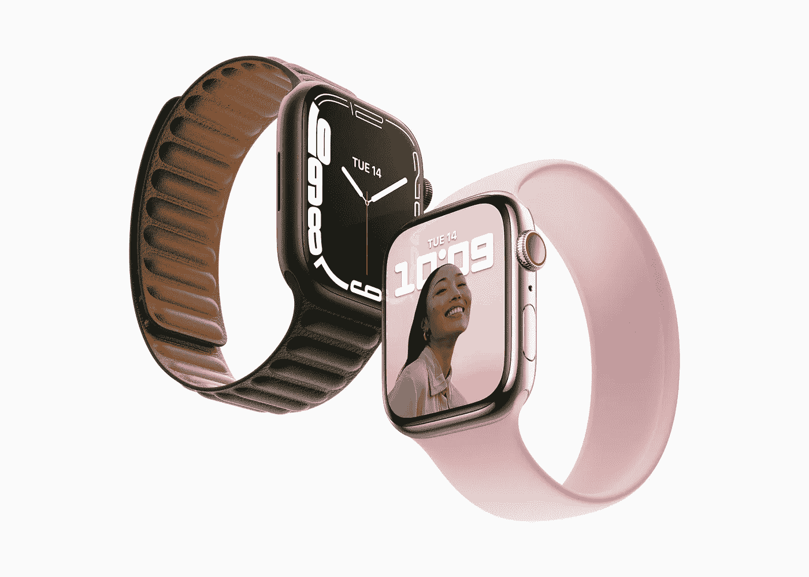

**Apple Watch Series 7**

虽然我很失望，但这实际上对这种类型的产品是有意义的，与锋利的边框相比，它可以更好地抵抗碎片和划痕。

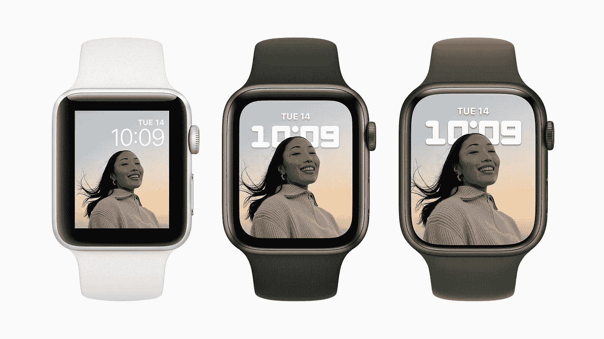

**Apple Watch Series 3, SE and 7 compared.**

苹果手表的下一步是什么？看到苹果采用更加圆润的设计，意味着他们必须相信手表是一种必须保持弯曲才能舒适的产品，我对此很满意，如果它有一个奇妙的无边框设计，戴在手腕上感觉很好，它就不必是平的边缘。

既然其他东西在设计上已经非常统一，那么我们该何去何从呢？嗯，我们对苹果的颜色选择有一个想法，星光和午夜基本上取代了经典的银色和太空灰，并且 [9to5Mac 在这方面有一篇很好的对比文章](https://9to5mac.com/2021/09/16/how-apples-new-starlight-and-midnight-colors-compare-to-the-classic-silver-and-space-gray/)。

我们只能推测和依靠其余的泄漏，但一些理论开始走到一起。

我相信苹果将建立在当前的设计语言上，并随着时间的推移调整东西，但仍然保持现代复古的设计语言，这给我们带来了乔恩·普罗瑟最近最大的苹果泄漏，现在我知道他可能在他的泄漏中有一些失误，但他今年基本上是正确的，最近向我们展示了一些基于他从一个来源看到的据称是 iPhone 14 Pro Max 模型的渲染图。

**那些 iPhone 14 Pro 泄露**

这些不知从哪里冒出来的，但它让我们看到了 2022 年**可能的** iPhone Pro 型号，可以肯定的是，这些设计提前一年多就锁定了，所以这可能是最终的设计。

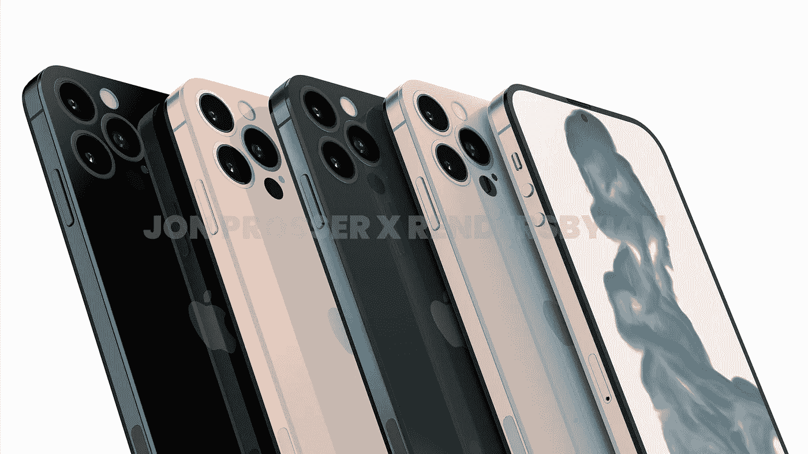

**iPhone 14 Pro render |** Images by [FPT](https://www.frontpagetech.com/2021/09/08/exclusive-a-closer-first-look-at-iphone-14/)

一种新的更新的工业设计，用钛代替不锈钢，明显的 iPhone 4 影响给你一种怀旧的熟悉感，它比 iPhone 13 厚，背面有一个近平齐的摄像头，谢天谢地没有凹口，但在显示屏下有一个打孔摄像头，可能有 touch ID 和 face ID。

这看起来太好了，令人难以置信，但它可能是多年来设计最好的 iPhone，如果这是真的，那么我肯定它将是一个重大的打击，它也让我们看到了苹果下一步的愿景。

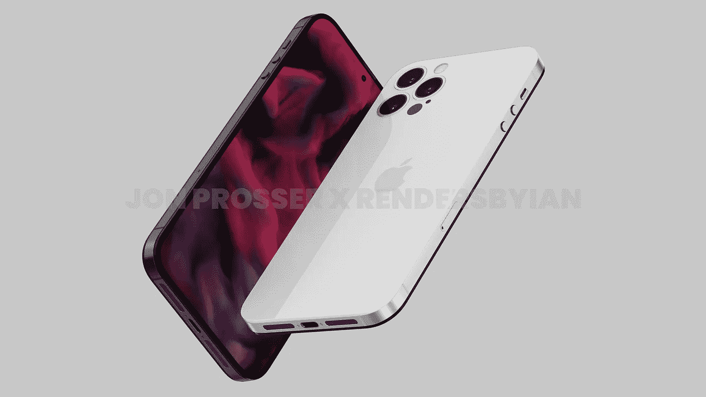

**iPhone 14 Pro render |** Images by [FPT](https://www.frontpagetech.com/2021/09/08/exclusive-a-closer-first-look-at-iphone-14/)

边框就像一条围绕两侧的条纹，前后面板暴露在外，形成双色外观，另一种可能的金属或塑料保护玻璃边缘，前面有一个统一的边框，与 iPhone 13 的厚度相匹配，但没有凹口，现在被打孔相机和 Face ID 传感器取代，移到了显示屏下方。

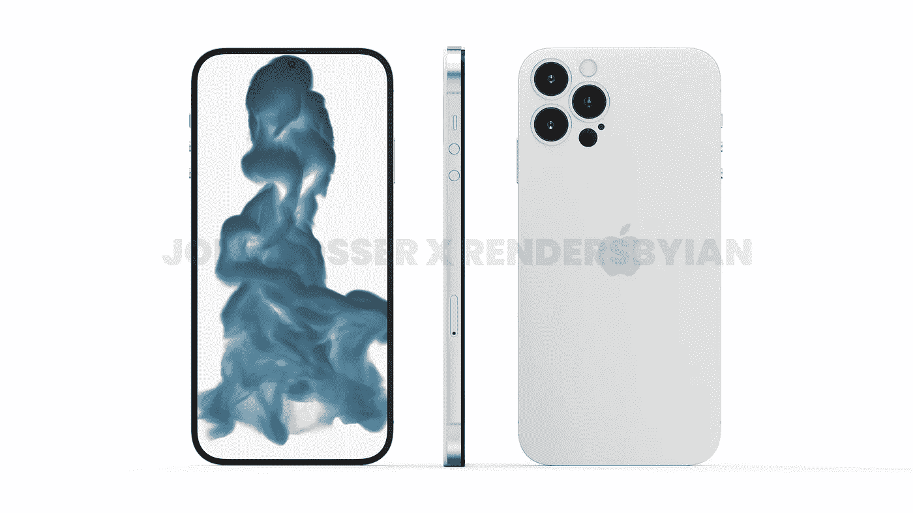

**iPhone 14 Pro render |** Images by [FPT](https://www.frontpagetech.com/2021/09/08/exclusive-a-closer-first-look-at-iphone-14/)

我知道凹口现在是标志性的，当看到显示屏时，每个人都知道它是苹果手机，但它真的开始看起来过时了，花了 5 年时间才缩小到 iPhone 13。Android 设备已经使用打孔相机多年了，在我看来，它看起来更干净，更现代，也更少打扰。今年，关于 iPhone 上的凹口消失的讨论已经谈了很多，有传言说它将在 2022 年的型号上出现，所以它确实为普罗瑟的这些泄露提供了更多的支持。

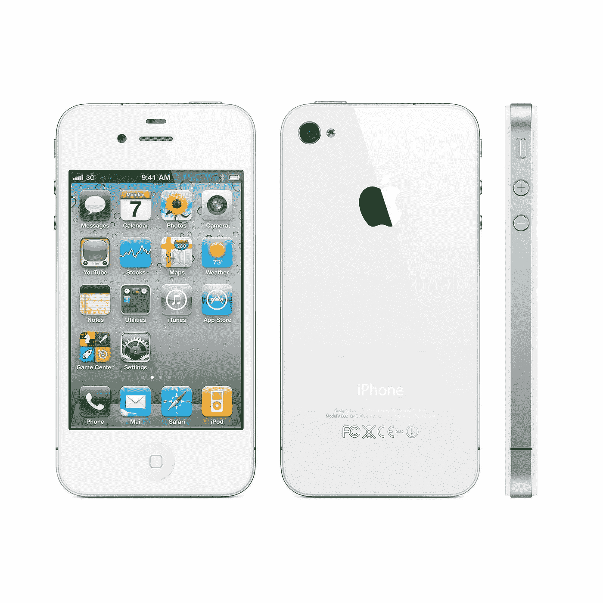

**The iPhone 14 takes inspiration from the iPhone 4.**

然而，背面可能是最令人惊讶的，接近齐平意味着更厚的**设备，没有主要的摄像头凸起，希望有更大的电池。就我个人而言，我认为其中一些渲染使设备看起来非常纤薄，实际上，相比之下，带外壳的 iPhone 13 将是更现实的尺寸。**

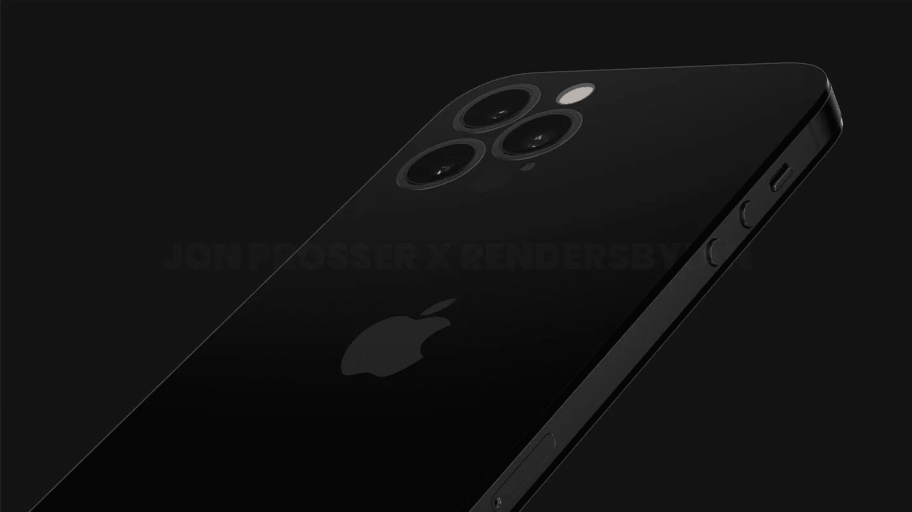

**iPhone 14 Pro render |** Images by [FPT](https://www.frontpagetech.com/2021/09/08/exclusive-a-closer-first-look-at-iphone-14/)

我绝对喜欢这种设计，但我也喜欢 iPhone 4/4S 的设计，这显然是一种暗示，这是我们第一次看到苹果设计的下一个阶段，很高兴看到他们仍然希望与生态系统的其他部分保持统一的外观。

**iPhone 14** **和期望**

如果这是专业版，那么标准版的 iPhone 14 会怎么样呢？

我相信它将保持 iPhone 13 的设计，而 pro 型号则转向新的更新工业设计，但保持相同的基本设计，如平边。

这意味着 iPhone 14 也将保持新的更小的凹槽，但它可能会增加一些东西，如激光雷达传感器，电源按钮上的 touch ID，可能还有 90-120hz 的显示屏，但我们仍然需要几个月才能获得可靠的信息。

我们可能会和 iPhone mini 说再见，因为 iPhone 12 mini 的低销量扼杀了它在 iPhone 13 系列中的发展，苹果显然只是在使用 iPhone 13 mini 的剩余物，相反，我们应该期待在 2022 年出现一款新的更大的 6.7 英寸显示屏的非专业 iPhone。

这意味着我们可能会有两部 6.1 英寸和两部 6.7 英寸的 iphone，这两种尺寸都有标准版和专业版。

这对苹果来说也很划算，他们已经有了 iPhone 13 和 13 Pro Max 部件，基本上可以重复使用，而 14 Pro 型号则采用了新设计。

我相信这是苹果回归到在 pro 机型上拥有比更便宜的设备更独特的优质设计，就像他们在 iPhone XR 和 iPhone XS 或同时发布的 iPhone 11 和 iPhone 11 Pro 上所做的那样。

iPhone 12 和 12 Pro 在设计上是相同的，除了 Pro 型号上的长焦镜头，iPhone 13 型号也是如此，所以在 iPhone 之间创造更大的功能和设计差距对他们来说也是有意义的。

**iPad Pro 2022**

iPad Pro 在 2018 年开始了这种全新的工业设计语言，此后几乎没有改变，但 2022 年将是一个像 iPhone 14 Pro 一样的新设计的好时机，但由于尺寸和重量，这有点棘手，苹果可能不会使用玻璃背面，但我们可能会看到类似的双色框架和齐平的摄像头。

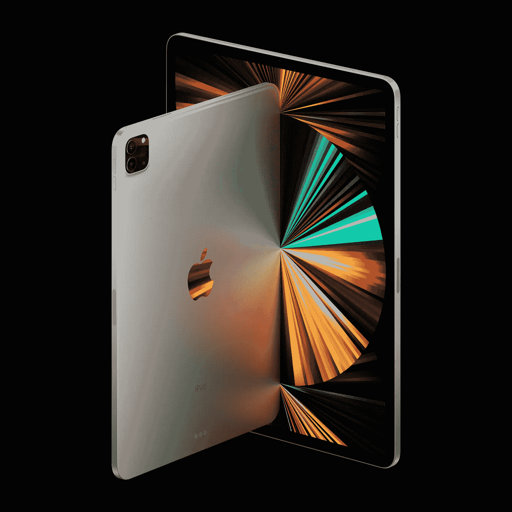

**iPad Pro 2021 models.**

我还预计现在 Face ID 传感器更小，甚至可能是传闻已久的有机发光二极管显示器，所以边框会稍微薄一些。

今年，苹果产品的 pro 型号将获得自己独特的高级工业设计，以在 pro 和 iPhone 14 和 iPad Air 等更便宜的标准设备之间建立明显的区别。

**我喜欢苹果的设计方向，在感觉他们在 iPhone、iPads 和 MAC 上停滞不前这么多年后，这真的是一种独特的风格，在其他地方看不到，他们的许多产品都带有 iPhone 4 和 iPhone 5 的怀旧风格。**

**随着我们进入 2022 年，我们肯定会在冬季和春季看到更多泄露，希望他们继续推动这些设计，给我们最好的用户体验和设计。**