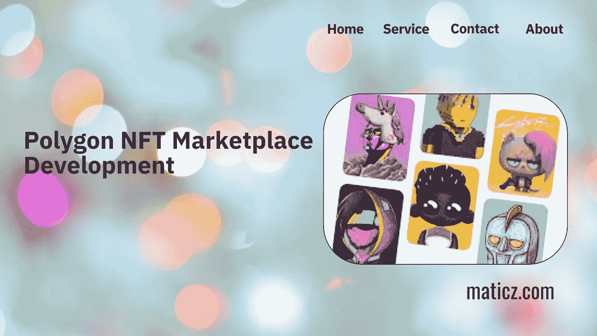

# 最佳多边形区块链为基础的 NFT 市场发展

> 原文：<https://medium.com/geekculture/the-best-polygon-blockchain-based-nft-marketplace-development-5b94f55c6350?source=collection_archive---------11----------------------->

数字化在我们的日常生活中不再是一个巨大的距离，因为它是从区块链这样一种充满活力的技术方式发展而来的。这项技术兴起的主要原因是加密技术的蓬勃发展。其中之一是 NFT，代表不可替代的令牌。NFT 有一个物理资产，它可以用唯一的 id 值来表示，并且它集成了一个加密钱包来存储您的 NFTs。大多数艺术家已经在区块链形式的非物质文化遗产方面有了转变。

一般来说，用户可以购买、出售、铸造和投标他们的数字资产，在你进入 NFT 世界之前，你必须了解一些关于区块链技术及其工作原理的知识？因为这些是了解 NFT 的基本标准。如今，NFT 在各种区块链网络中发展，如以太坊、币安智能链、索拉纳、卡多诺和多边形是区块链的主导网络。大多数非功能性食物都是在这些区块链网络中生产的。密码专家表示，从 2017 年到 2021 年，NFT 的贸易额已超过 3600 万英镑。

# 多边形概述

Polygon 也称为 Matic，它为以太坊区块链提供了第二层扩展解决方案，有助于在兼容以太坊的区块链网络中轻松构建和连接，而没有任何障碍。它们中的大多数通常在以太坊区块链使用，它在该网络上产生了更多的流量，因此 polygon 熟练地为区块链行业工作，通过其节点分布和智能合同层提供高级别的安全性。不仅如此，这样的功能使得它在提供低交易费用和极快的交易速度方面大有作为。

# 你为什么会选择多边形 NFT 市场？

在年轻人的思维感知中创造非功能性数码产品的大规模参与热潮，因为任何人都可以轻松地创造、销售和铸造这些数字产品。

*   多边形网络提供了最佳的用户体验，没有连接分散网络的任何障碍。
*   它提供了独特的可伸缩性、灵活性和互操作性，与其他区块链解决方案不同。
*   一般来说，它充分利用以太网的优势
*   与传统的区块链网络相比，Polygon NFT 市场的天然气费用更低，同时没有任何安全问题的损失。
*   它还提高了交易速度，从而大大降低了交易费用

这些是选择多边形 NFT 市场发展的主要原因

# 多边形 NFT 平台的额外收益

# 兼容性

Matic 允许连接多个区块链，它充分利用了以太坊的巨大功能，减少了 ETH 的一些限制。

# 可量测性

这个 Matic 网络在处理多个 NFT 交易时表现良好，没有任何障碍。

# 安全性

利益相关机制共识的证明是在一个分散的平台上解决问题。即使在多个跨链平台上，它也能提供高速的交易。

# 模块性

Matic 网络是高度可定制的、可扩展的，并且在将来的任何时候都可以升级。它降低了因不同程度的依赖和独立而导致系统崩溃的风险。

# 互用性

它允许多边形链与其他多边形链通信，也可以与以太坊通信

# 在多边形上生成 NFT

NFT 铸造是将数字资产转化为多边形区块链的过程。这些 NFT 资产可以通过一份智能合同来铸造，该合同对其所有权进行收费，并控制非功能性交易的可复制性。这个造币平台可以加速非正规金融机构的扩张，并使它们产生更多的利润

# 智能合同集成

智能合同是一个简单的预编程条件，上传到区块链网络。当条件满足时，它会自动执行该平台，允许人们在没有任何时间延迟或中间环节的情况下进行交易。在 NFT 市场，平台运行在买卖双方达成的智能合约上。一旦买方完成卖方的要求，智能合同将检查自己，如果任何脆弱的活动已经完成，它会自动拒绝该进程。

# 最后的想法

NFT 是创造者的未来，也是年轻企业家创业的未来。加密技术已经在全球范围内飞速发展，NFT 也是如此，根据加密爱好者的预测，它将会以 10 倍的速度迅猛发展。最近的调查显示，每周售出 15，000 至 50，000 个 NFT，不仅如此，大多数 NFT 项目都是在 polygon Network 上创建的。从 [Polygon NFT 市场发展](https://maticz.com/polygon-nft-marketplace-development)开始你的商业生涯，在世界范围内发展你的业务。