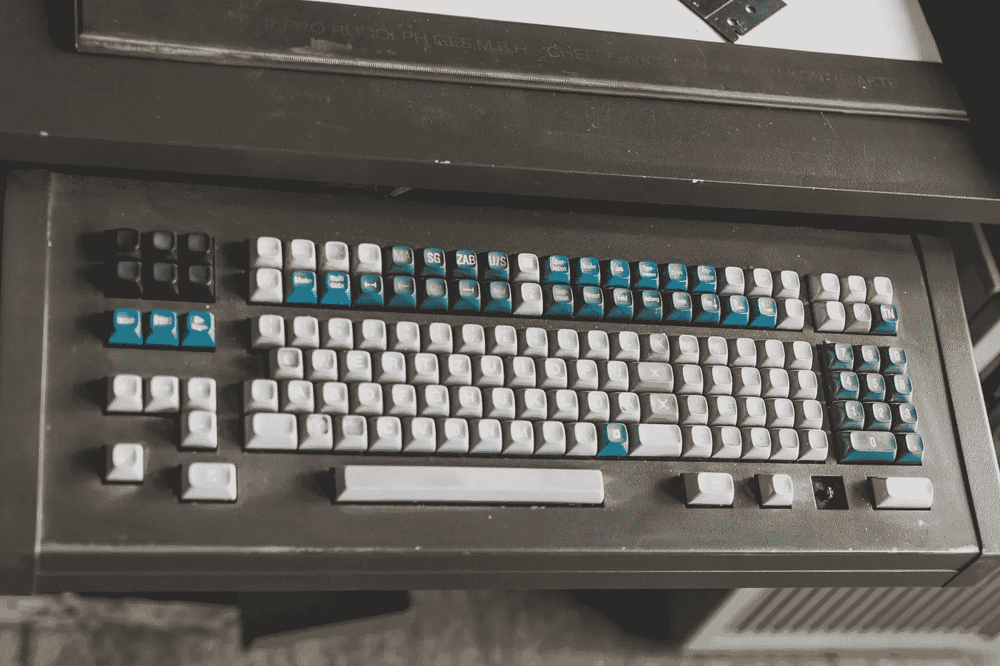

# 最佳复古 Vim 主题

> 原文：<https://medium.com/geekculture/the-best-retro-vim-themes-15cbe4680e2b?source=collection_archive---------7----------------------->

Photo by [4motions Werbeagentur](https://unsplash.com/@4motions?utm_source=unsplash&utm_medium=referral&utm_content=creditCopyText) on [Unsplash](https://unsplash.com/s/photos/computer?utm_source=unsplash&utm_medium=referral&utm_content=creditCopyText)

*维姆万岁！*

Vim 似乎已经存在了很长时间，而且似乎只会随着年龄的增长而变得更好。如果你还没有加入 Vim 的行列，那么有很多理由可以解释为什么转换是一个好主意。我以前在 [*中讨论过为什么你应该使用 Vim*](https://betterprogramming.pub/3%C2%BD-reasons-why-you-should-be-using-vim-8202360afa3)*的 3 个理由，所以如果这是你的第一次竞技，一定要试一试 Vim。*