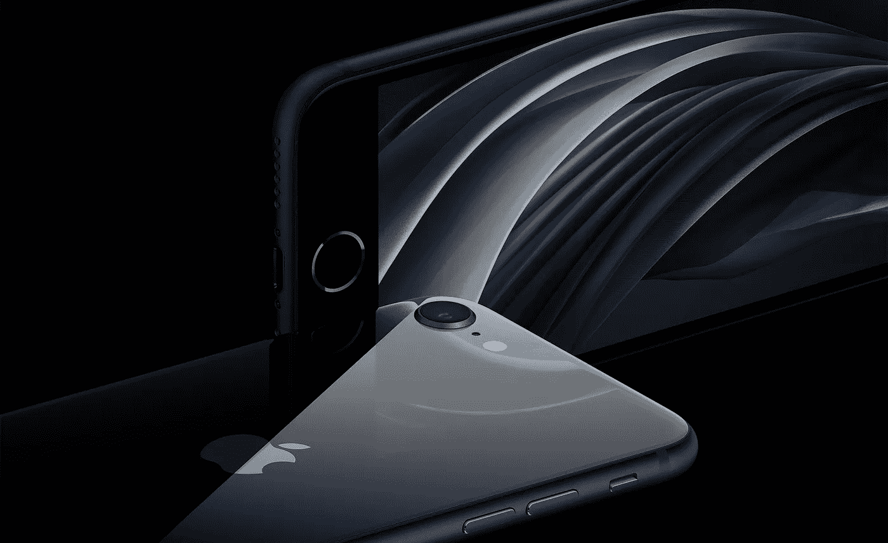
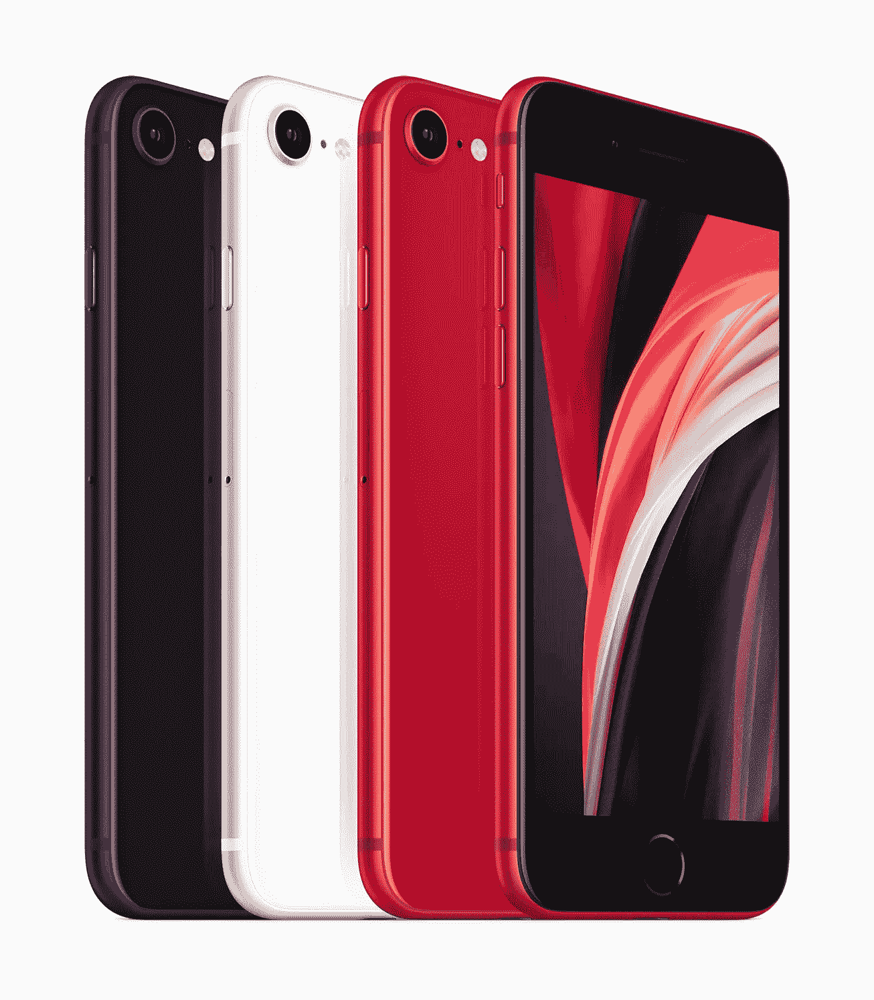
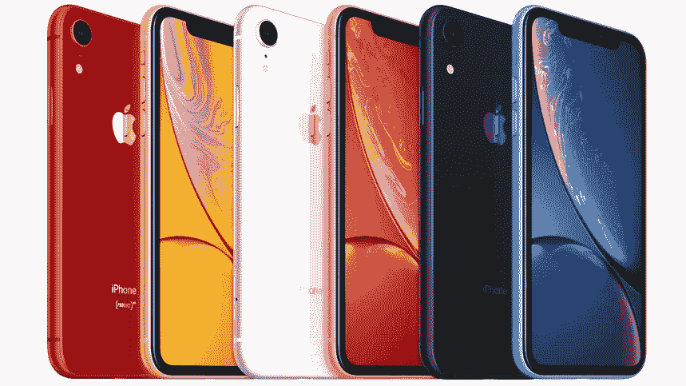
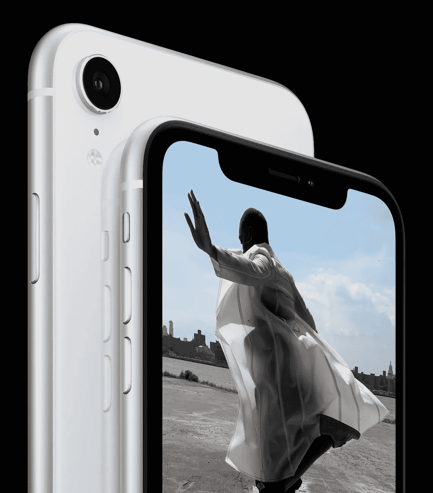

# 最超值的 iPhone 就在眼前，至少我们是这么认为的。

> 原文：<https://medium.com/geekculture/the-best-value-iphone-is-nearly-here-or-so-we-thought-fee7d3f4df78?source=collection_archive---------20----------------------->

iPhone SE 迎接 5G 的时间差不多了。

**iPhone SE 2020 — The 2022 version will look identical.**

这是新的一年，这意味着是时候开始期待苹果、三星、谷歌和微软的新玩具了。

首先是苹果，据传将在 3 月/4 月举行春季活动，并发布下一代 iPhone SE！然而，我们有一些好消息和一些坏消息。

好消息是，我们应该期待 5G 和 2020 年型号的相同设计中的一些规格凸起，这当然是与 2014 年的 iPhone 6 相同的设计，除了玻璃背面和希望相同的价格 399/ 379 美元。

**Expect the current iPhone SE colours on the 2022 model.**

最近的报道认为，这款设备将被命名为 **iPhone SE+5G** 这是一个拗口的名字，但从苹果公司来说并不是没有听说过。

现在有点坏消息，强烈的泄漏和报告表明，我们应该期待在 2023 年完成重新设计，以便它实际上使用 2018 年 iPhone XR 作为设计。这是苹果在低端市场上迈出的一大步，太长时间以来，我们一直看到低端 iPhones 上使用的 2014 年的旧设计，而类似价位的 Android 设备已经配备了有机发光二极管边到边显示屏和 5G。

**iPhone XR — The 2023 iPhone SE is rumoured to look identical to this.**

那么，这让买家怎么办？2022 年，5G、4.7 英寸 LED 显示屏、touch ID 和同样熟悉的小设计的 iPhone SE 非常有价值**或**5G、6.1 英寸边对边显示屏、face ID、卓越的现代设计的 iPhone SE，但将在 2023 年发布，设备更大，价格可能会上涨。

就我个人而言，我会再等一年，只是因为我现在无法忍受挡板，觉得过时的设计非常令人恼火，但你们中的一些人可能没有时间，需要尽快购买新设备。也许你需要给某人买个礼物，或者你现在的手机快不行了，但不管怎样，你都会得到一个强大的设备，它将与市场上的任何非苹果手机相媲美，这要归功于 A15 芯片，这是目前最强大的移动 SoC，据传将与 iPhone SE+5G 一起推出。

**Touch ID will be replaced with Face ID and a larger display in 2023.**

我们应该期待今年机型的一些其他规格是 iPhone 12 机型上相同的单个 12mp 宽相机镜头，Wi-Fi 6，带 eSIM 的双 SIM 卡，可能更快的无线充电和更大的电池以应对 5G 的消耗。我不认为我们会看到任何其他变化，如新的颜色，因为这将是明年更大的设备保存。

**Rumoured iPhone SE 2023 with larger 6.1" display.**

我思考的另一件事是，报道没有提到 iPhone SE 2022 是否会有 MagSafe，以利用现在到处出现的 MagSafe 配件，这不是很重要，但它是我每天使用的一个很好的功能，一旦你习惯了它，它会很方便。

我毫不怀疑 iPhone SE 将再次成为苹果和**的大卖家，如果我们明年得到传闻中的重新设计，那么在可预见的未来，iPhone SE 将继续是他们最有价值的设备，也是那些不想花 1000 美元买新手机的人的最佳选择。**

*所有图片均来自苹果。*