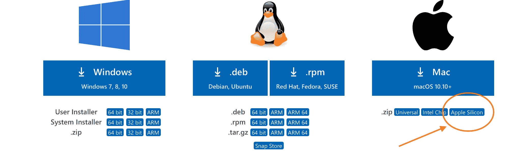

# 为 Python 开发设置 M1 Mac 的最佳方式

> 原文：<https://medium.com/geekculture/the-best-way-to-setup-your-m1-mac-for-python-development-fb5dffd08fd?source=collection_archive---------2----------------------->


所以你给自己买了一台全新的苹果电脑。也许是 MacBook Pro，Mac mini，或者是一款新的彩色 IMAC。或者，也许你和我一样，喜欢生活中的小东西，所以选择了无风扇的 MacBook Air。无论哪种方式，今天我们都将回顾并解释如何获得你最喜欢的语言设置… **Python** ！

## 我们需要的工具

要让一个全功能的 Python 工作站运行起来，我们需要一些工具。在开始使用每种工具之前，让我们先列出它们:

1.  iTerm2
2.  自制软件(软件包管理器)
3.  小型锻造厂
4.  诗意
5.  Visual Studio 代码

好了，现在我们有了清单，让我们开始吧！这里的顺序很重要，所以请随意遵循。

## iTerm2

我们的第一个工具是终端模拟器应用程序。从技术上讲，我们可以使用默认的 MacOS 终端应用程序，但是我更喜欢 iTerm 的定制选项和一般美感。下载安装 iTerm2 就像访问他们的[网站](https://iterm2.com/index.html)，点击**下载**那么简单。

> * *注意:我们将在 iTerm2 中运行剩余的终端命令。*

现在我们有了终端应用程序，我们可以打开它并安装更多优秀的软件！😁

## 公司自产自用

打开你的新终端(iTerm2)，我们将安装[家酿](https://brew.sh)，我们的软件包管理器。安装它就像运行以下命令一样简单:

```
/bin/bash -c "$(curl -fsSL https://raw.githubusercontent.com/Homebrew/install/HEAD/install.sh)"
```

在我们的终点站。通过安装家酿，我们现在可以安装更多基于软件包的软件。

此时，你可能想让你的终端在视觉上更吸引人。我个人推荐使用 [oh-my-zsh](https://ohmyz.sh) (我使用默认的 robby-russet 主题) [Hack Nerd 字体](https://github.com/ryanoasis/nerd-fonts/tree/master/patched-fonts/Hack/Regular)，以及 [Dracula](https://draculatheme.com/iterm) 终端主题。今天我不会在这里详细介绍如何安装这些工具，但也许将来我会这样做。

## 诗意

我们列表中的下一个是诗歌，Python 特有的包管理器。安装非常简单:

```
curl -sSL https://raw.githubusercontent.com/python-poetry/poetry/master/get-poetry.py | python -
```

诗歌允许我们安装、创建和发布我们喜欢的 Python 包。有关如何使用诗歌以及为什么应该使用它而不是 pip 的更多信息，请单击[此处](https://nanthony007.medium.com/stop-using-pip-use-poetry-instead-db7164f4fc72)。

## 小型锻造厂

快好了，我保证！

我们名单上的下一个是[小型锻造](https://github.com/conda-forge/miniforge)。这是康达-福吉的一个分支，是康达本身的一个分支。Miniforge 实际上是 miniconda，除了它已经为 ARM 架构预构建了许多常见包的二进制文件，包括 numpy、pandas 和 scipy。你可以下载并安装 miniforge，但我更喜欢使用家酿(我们安装它是有原因的):

```
brew install miniforge
```

我使用 Miniforge 来管理我的 Python 版本，然后使用诗歌作为我的包管理器。poem 不能在 M1 上安装 numpy，因为该架构没有稳定的版本。当这样的错误发生时，我会求助于康达环境。miniforge 最棒的部分是它有**和 conda/mini-conda 完全一样的用法**，所以大多数数据科学家(那些使用 numpy/pandas/scipy 最多的)无论如何都会有宾至如归的感觉！

## Visual Studio 代码

我们列表中的最后一项是 VS 代码。这个程序对 ***所有与*** Python 相关的东西都有用。从构建网站，到 REST-API，到软件包，到数据科学和 Jupyter 笔记本，VS Code 都支持你。可以从[微软的网站](https://code.visualstudio.com/#alt-downloads)安装。确保单击 ARM 版本:



Install Apple Silicon version of VS Code

> 我更喜欢[知情者版](https://code.visualstudio.com/insiders/)因为新的笔记本 UI 简直太神奇了！

你可以用很多方式定制 VS 代码，这完全取决于你。让它成为你自己的，并优化它以最适合你的工作流程和需求。

就是这样！你已经准备好开始学习你最喜欢的语言了！祝所有了不起的皮托尼斯塔们好运！🐍